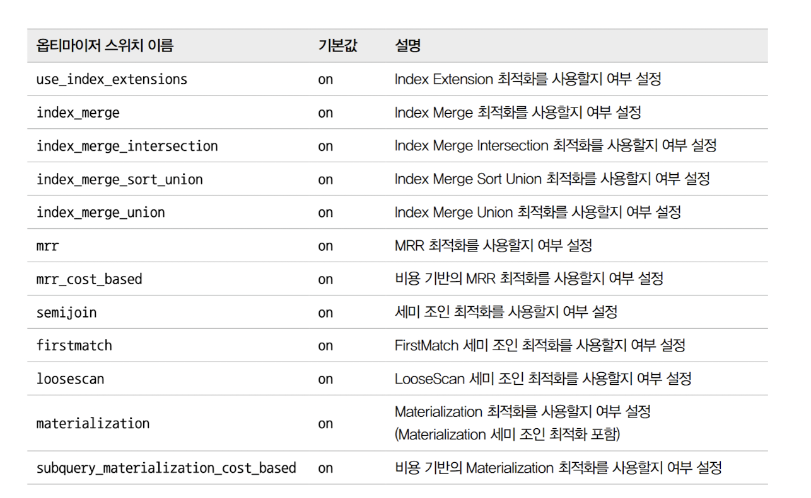

# 9. 옵티마이저와 힌트
- 여행 시 인터넷이 책 등을 참고하여 최소한의 비용이 드는 방법을 찾는 것 처럼
- 쿼리를 최적으로 실행하기 위해 각 테이블의 데이터가 어떤 분포로 저장되어 있는지 통계정보 참조
- DBMS에서는 옵티마이저가 이 기능을 담당


## 9.1. 개요

### 9.1.1. 쿼리 실행 절차
1. SQL 문장 쪼개기 (파스 트리)
   - 사용자로부터 요청된 SQL 문장을 잘개 쪼개서 MySQL 서버가 이해할 수 있는 수준으로 분리 한다.
2. 실행 계획 생성 (최적화 및 실행 계획 수립)
   - 파스 트리를 확인하면서 어떤 테이블부터 읽고 어떤 인덱스를 이용해 테이블을 읽을지 선택한다.
     - 연산의 단순화, 테이블에 조인이 있는 경우 읽는 순서 결정, 인덱스 통계 정보를 이용해 사용할 인덱스 결정, 임시 테이블을 사용해야하는지 확인
3. 스토리지 엔진에서 데이터 가져오기
   - 두번째 단계에서 결정된 테이블의 읽기 순서나 선택된 인덱스를 이용해 스토리지 엔진에서 데이터를 가져온다.

### 9.1.2. 옵티마이저의 종류
- 비용 기반 최적화 (현재 대부분의 DBMS)
  - Cost Based Optimizer(CBO)
- 규칙 기반 최적화 (올드)
  - Rule Based Optimizer(RBO)

## 9.2. 기본 데이터 처리

### 9.2.1. 풀 테이블 스캔과 풀 인덱스 스캔

- 풀 테이블 스캔이 선택되는 경우 
  - 1. 테이블의 레코드 건수가 너무 작아서 인덱스를 통해 읽는 것보다 풀 테이블 스캔이 더 빠른 경우 (테이블이 1개 페이지에 저장장
  - 2. Where 절이나 On 절에 인덱스를 이용할 수 있는 조건이 없는 경우
  - 3. 인덱스 레인지 스캔을 할 수 있더라도 조건에 일치하는 레코드가 너무 많은 경우 (인덱스 손익 분기점)

- 풀 테이블 스캔 시 백그라운드 프로세스에 의해 리드 어헤드(Read ahead) 작업이 시작됨
  - 리드 어헤드: 어떤 영역의 데이터가 앞으로 필요해지리라는 것을 예측해서 요청 전에 미리 디스크에서 읽어 InnoDB 버퍼풀에 로드함
  - innodb_read_ahead_threshold 시스템 변수에 설정된 개수만큼의 연속된 페이지가 읽히면 리드 어헤드 동작

### 9.2.2. 병렬 처리

- 테이블 전체 건수를 가져오는 경우만 병렬 처리 가능
```sql 
mysql> SET SESSION innodb_parallel_read_threads=1;
```

### 9.2.3. Order by 처리 (Using filesort)

#### 9.2.3.1. 소트 버퍼
- 소프 버퍼: MySQL이 정렬을 수행하기 위해 사용하는 메모리 공간 (공유 자원이 아니고 각 커넥션 별로 메모리가 할당된다.)
- 임계 값을 넘어가면 성능에 별 영향이 없거나 오히려 성능이 떨어진다.

#### 9.2.3.2. 정렬 알고리즘
- 싱글 패스: 레코드 전체를 가져와서 정렬하는 방식
- 투 패스: 정렬 키와 레코드의 Row ID만 가져와서 정렬 후 Row ID로 데이터를 읽어오는 방식

1. <sort_key, rowid>: 정렬 키와 레코드의 로우 아이디(Row ID)만 가져와서 정렬하는 방식
2. <sort_key, additional_fields>: 정렬 키와 레코드 전체를 가져와서 정렬하는 방식으로, 레코드의 칼럼들은 고정 사이즈로 메모리 저장
3. <sort_key, packed_additional_fields>: 정렬 키와 레코드 전체를 가져와서 정렬하는 방식으로, 레코드의 칼럼 들은 가변 사이즈로 메모리 저장

- 1: 투 패스
- 2, 3: 싱글 패스

##### 9.2.3.2.1. 싱글 패스 정렬 방식
- 싱글 패스가 합리적으로 보인다, 하지만 소트 버퍼 공간을 많이 차지 한다.
- 일반적으로는 싱글 패스 방식을 사용해서 정렬 전에 정렬 키와, 레코드를 모두 소트 버퍼로 가져온다.


##### 9.2.3.2.2. 투 패스 정렬 방식
- 정렬 대상 레코드의 크기, 건수가 많을 때 효율적
- 투 패스 정렬 방식은 언제 사용할까?
  - 레코드의 크기가 max_length_for_sort_data 시스템 변수에 설정된 값보다 클 때
  - BLOB이나 TEXT 타입의 컬럼이 SELECT 대상에 포함될 때


#### 9.2.3.3. 정렬 처리 방법

1. 인덱스를 사용한 정렬
2. 조인에서 드라이빙 테이블만 정렬: 실행계획에서 Using filesort 확인 가능
3. 조인에서 조인 결과를 임시 테이블로 저장후 정렬: 실행계획에서 Using temporary; Using filesort 확인 가능

##### 9.2.3.3.1. 인덱스를 이용한 정렬
- 정렬하지 않아도 되기에 베스트 이다.
- Order by 절의 순서대로 생성된 인덱스가 있어야 한다.
- Where 절이 있다면 Order by와 같은 인덱스를 사용해야 한다.
- 여러 테이블이 조인되는 경우 Nested-loop 방식의 조인에서만 가능하다.
```sql
mysql> SELECT * 
 FROM employees e, salaries s 
 WHERE s.emp_no=e.emp_no
 AND e.emp_no BETWEEN 100002 AND 100020 
 ORDER BY e.emp_no;
```

##### 9.2.3.3.2 조인의 드라이빙 테이블만 정렬
- 드라이빙 테이블을 먼저 정렬하고 드리븐 테이블의 값들을 조인한다.
- 조건
  - Order by 조건 컬럼이 드라이빙 테이블에 있는 컬럼이여야 한다.
```sql
mysql> SELECT * 
 FROM employees e, salaries s 
 WHERE s.emp_no=e.emp_no
 AND e.emp_no BETWEEN 100002 AND 100010
 ORDER BY e.last_name;
```

%20%ED%85%8C%EC%9D%B4%EB%B8%94%EB%A7%8C%20%EC%A0%95%EB%A0%AC%20%EC%8B%A4%ED%96%89.png)

##### 9.2.3.3.3. 임시 테이블을 이용한 정렬

- Order by 절의 컬럼이 드라이빙 테이블이 아닌 드리븐 테이블에 있는 경우 (아래의 경우 salaries)
  - 실행계획: Using Where; Using temporary; Using filesort

```sql
mysql> SELECT * 
 FROM employees e, salaries s
 WHERE s.emp_no=e.emp_no 
 AND e.emp_no BETWEEN 100002 AND 100010 
 ORDER BY s.salary;
```

##### 9.2.3.3.4. 정렬 처리 방법의 성능 비교

- 웹 서비스의 경우 Order by + Limit을 거의 필수로 사용한다. 
- 하지만 Order by, Group by 작업이 발생하는 경우 Where조건을 만족하는 레코드를 Limit 건수만큼만 가져와서 처리할 수 없다. 
  - 정렬 또는 그루핑 후 결과를 클라이언트에게 전달해야한다.


###### 9.2.3.3.4.1. 스트리밍 방식
- 서버 쪽에서 처리할 데이터가 얼마인지에 관계 없이 조건에 일치하는 레코드가 검색 될 때 마다 클라이언트로 보냄
- 이 방식으로 쿼리를 처리하면 클라이언트는 쿼리 요청 후 곧바로 원했던 첫 번째 레코드를 받음
- 마지막 레코드는 언제 받을지 알 수 없지만, 그다지 중요하지 않은 경우에 사용
- 예시: 페이지 네이션

###### 9.2.3.3.4.2. 버퍼링 방식 
- 모든 데이터를 읽어서 정렬 또는 Group by 후 보내야 하는 경우
- 모든 레코드를 확인하는 동안 클라이언트는 기다려야 한다.

기타
- JDBC를 사용하는 경우 JDBC 라이브러리에서 버퍼링이 일어난다.
- 버퍼링을 하게 서버와의 통신 횟수가 적어지고 데이터를 모아서 처리할 수 있기 때문에 Troughput(처리량)이 증가할 수 있다.
- 하지만 응답시간(Latency)이 증가한다.
- 처리량 vs 응답시간 트레이드오프

#### 9.2.3.4. 정렬 관련 상태 변수

```plain
mysql> SHOW STATU` LIKE 'Sort%';
+-------------------+--------+
| Variable_name | Value |
| Sort_merge_passes | 13 |
| Sort_range | 0 |
| Sort_rows | 300024 |
| Sort_scan | 1 |
+-------------------+--------+
```
- Sort_merge_passes: 멀티 머지 횟수
- Sort_range: 인덱스 레인지 스캔을 통한 정렬 작업
- Sort_rows: 지금까지 정렬한 전체 레코드 건수
- Sort_scan: 풀 테이블 스캔을 통해 검색된 결과에 대한 정렬 작업


### 9.2.4. Group by 처리
- 스트리밍 처리를 막는다.

#### 9.2.4.1. 인덱스 스캔을 이용하는 Group by (타이트 인덱스 스캔)
- 인덱스를 이용해서 Group by 가능할 때
- Using temporary, Using filesort가 생략됨

#### 9.2.4.2. 루스 인덱스 스캔을 이용하는 Group by


- 루즈(Loose) 인덱스 스캔 방식은 인덱스의 레코드를 건너뛰면서 필요한 부부만 읽어서 가져오는 것
  - Using indexfor group-by

```sql
mysql> EXPLAIN
 SELECT emp_no
 FROM salaries
 WHERE from_date='1985-03-01'
 GROUP BY emp_no;

-- salaries 테이블의 인덱스는 (emp_no, from_date)로
```

#### 9.2.4.3. 임시 테이블을 사용하는 Group by

- GROUP BY의 기준 칼럼이 드라이빙 테이블에 있든 드리븐 테이블에 있든 관계없이 인덱스를 전혀 사용하 지 못할 때는 이 방식으로 처리

```sql
mysql> EXPLAIN
 SELECT e.last_name, AVG(s.salary) 
 FROM employees e, salaries s
 WHERE s.emp_no=e.emp_no
 GROUP BY e.last_name;
```

- MySQL 8.0에서는 GROUP BY가 필요한 경우 내부적으로 GROUP BY 절의 칼럼들로 구성된 유니크 인덱스를 가진 임시 테이블을 만들어서 중복 제거와 집합 함수 연산 진행

### 9.2.5. Distinct 처리

- 집합 함수와 같이 DISTINCT가 사용되는 쿼리의 실행 계획에서 DISTINCT 처리가 인덱스를 사용하지 못할 때는 항상 임시 테이블이 필요
- 아래 2개 쿼리의 결과는 동일 (괄호는 MySQL 내부적으로 제거된다)

```sql
mysql> SELECT DISTINCT first_name, last_name FROM employees;
mysql> SELECT DISTINCT(first_name), last_name FROM employees;
```

#### 9.2.5.1. Select distinct

- DISTINCT는 SELECT하는 레코드(튜플)를 유니크하게  SELECT하는 것이지, 특정 칼럼만 유니크하게 조회하는 것이 아니다

#### 9.2.5.2. 집합 합수와 함께 사용된 Distinct

```sql
mysql> SELECT COUNT(DISTINCT s.salary), 
 COUNT(DISTINCT e.last_name) 
 FROM employees e, salaries s
 WHERE e.emp_no=s.emp_no
 AND e.emp_no BETWEEN 100001 AND 10010
```

- 아래 3개 쿼리의 차이
```sql
-- 1. (first_name, last_name) 으로 unique한 레코드 모두 반환
mysql> SELECT DISTINCT first_name, last_name 
 FROM employees
 WHERE emp_no BETWEEN 10001 AND 10200;
 
-- 2. first_name의 unique 개수, last_name의 unique 개수 반환
mysql> SELECT COUNT(DISTINCT first_name), COUNT(DISTINCT last_name) 
 FROM employees
 WHERE emp_no BETWEEN 10001 AND 10200;
 
-- 3. (first_name, last_name) 으로 unique한 레코드 개수 반환
mysql> SELECT COUNT(DISTINCT first_name, last_name) 
 FROM employees
 WHERE emp_no BETWEEN 10001 AND 10200
```

### 9.2.6. 내부 임시 테이블 활용
- MySQL 8.0 부터 바뀐부분이 많음
- 임시 테이블이 메모리를 사용할 경우: Memory 엔진 -> TempTable 엔진
- 임시 테이블이 디스크를 사용할 경우: MyISAM -> InnoDB or MMAP

#### 9.2.6.1. 메모리 임시 테이블과 디스크 임시 테이블

- 메모리의 TempTable의 용량이 1GB를 넘으면 MMAP 파일 또는 InnoDB 테이블로 전환함
  - temptable_use_mmap 시스템 변수: 기본 ON
  - MMAP 파일로 전환하는 것이 오버헤드가 적음

#### 9.2.6.2. 임시 테이블이 필요한 쿼리

```
1. ORDER BY와 GROUP BY에 명시된 칼럼이 다른 쿼리
2. ORDER BY나 GROUP BY에 명시된 칼럼이 조인의 순서상 첫 번째 테이블이 아닌 쿼리
3. DISTINCT와 ORDER BY가 동시에 쿼리에 존재하는 경우 또는 DISTINCT가 인덱스로 처리되지 못하는 쿼리
4. UNION이나 UNION DISTINCT가 사용된 쿼리(select_type 칼럼이 UNION RESULT인 경우)
5. 쿼리의 실행 계획에서 select_type이 DERIVED인 쿼리
```

- 1 ~ 4번 쿼리 패턴은 유니크 인덱스를 가지는 내부 임시 테이블이 생성된다.
- 5번은 유니크 인덱스가 없는 임시 테이블이 생성 된다.
- 일반적으로 유니크 인덱스가 있는 내부 임시 테이블은 처리가 매우 느리다.
- 
#### 9.2.6.3. 임시 테이블이 디스크에 생성되는 경우 

- 내부 임시테이블은 기본적으로 메모리에 생성되지만 아래와 같은 경우에는 디스크에 생성된다 (그리고 당연히 느리다).

```
1. UNION이나 UNION ALL에서 SELECT되는 칼럼 중에서 길이가 512바이트 이상인 크기의 칼럼이 있는 경우
2. GROUP BY나 DISTINCT 칼럼에서 512바이트 이상인 크기의 칼럼이 있는 경우
3. 메모리 임시 테이블의 크기가 (MEMORY 스토리지 엔진에서) tmp_table_size 또는 max_heap_table_size 시스템 변수보다 크거나 (TempTable 스토리지 엔진에서) temptable_max_ram 시스템 변수 값보다 큰 경우
```

#### 9.2.6.4. 임시 테이블 관련 상태 변수
- 아래 명령어로 확인 가능하다.

```sql
mysql> SELECT first_name, last_name 
 FROM employees
 GROUP BY first_name, last_name;

mysql> SHOW SESSION STATUS LIKE 'Created_tmp%'; 
+-------------------------+--------+ 
| Variable name | Value | 
+-------------------------+--------+ 
| Created_tmp_disk_tables | 1 | 
| Created_tmp_tables | 1 | 
```

## 9.3. 고급 최적화

- 옵티마이저가 실행 계획을 수립할 때 `통계 정보`와 `옵티마이저 옵션`을 결합해서 최적의 실행 계획을 수립한다.

### 9.3.1.  옵티마이저 스위치 옵션
- optimizer_switch 시스템 변수를 이용해서 제어


```sql
-- // MySQL 서버 전체적으로 옵티마이저 스위치 설정
mysql> SET GLOBAL optimizer_switch='index_merge=on,index_merge_union=on,...';
-- // 현재 커넥션의 옵티마이저 스위치만 설정
mysql> SET SESSION optimizer_switch='index_merge=on,index_merge_union=on,...';

-- 현재 쿼리에만 지정
mysql> SELECT /*+ SET_VAR(optimizer_switch='condition_fanout_filter=off') */ 
 ... 
 FROM ...
```

#### 9.3.1.1. MRR(Multi-Range Read)과 배치 키 액세스(mrr & batched_key_access)
- Multi-Range Read
- 조인 대상 레코드을 읽어 조인 버퍼에 버퍼링 후 모아서 한번에 요청 한다.
- MRR을 응용해서 실행되는 조인 방식을 BKA (Batched Key Access) 조인이라고 하는데 기본적으로 비활성화 되어있다. 

#### 9.3.1.2. 블록 네스티드 루프 조인(block_nested_loop)


- Nested Loop 조인
	- 네스티드 루프 조인(Nested Loop Join)은 조인의 연결 조건이 되는 칼럼에 모두 인덱스가 있는 경우 사용되는 조인 방식이다
	- 어떤 방식으로도 드리븐 테이블의 풀 테이블 스캔이나 인덱스 풀 스캔을 피할 수 없다면 옵티마이저는 드라이빙 테이블에서 읽은 레코드를 메모리에 캐시한 후 드리븐 테이블과 이 메모리 캐시를 조인하는 형태로 처리한다

```sql
mysql> EXPLAIN 
 SELECT *
 FROM employees e
 INNER JOIN salaries s ON s.emp_no=e.emp_no
 AND s.from_date<=NOW()
 AND s.to_date>=NOW()
 WHERE e.first_name='Amor';
+----+-------------+-------+------+--------------+------+-------------+
| id | select_type | table | type | key | rows | Extra |
+----+-------------+-------+------+--------------+------+-------------+
| 1 | SIMPLE | e | ref | ix_firstname | 1 | NULL |
| 1 | SIMPLE | s | ref | PRIMARY | 10 | Using where |
+----+-------------+-------+------+--------------+------+-------------+
```

- Block Nested Loop 조인
	- 드라이빙 테이블의 데이터를 메모리에 캐시 한 후 드리븐 테이블과 조인한다
	- 메모리 캐시 장소: 조인 버퍼 (join_buffer_size: 시스템 변수로 설정)
``` sql
mysql> SELECT *
 FROM dept_emp de, employees e
 WHERE de.from_date>'1995-01-01' AND e.emp_no<109004;
 
+----+-------------+-------+-------+-------------+---------------------------------------+
| id | select_type | table | type | key | Extra |
+----+-------------+-------+-------+-------------+---------------------------------------+
| 1 | SIMPLE | de | range | ix_fromdate | Using index condition |
| 1 | SIMPLE | e | range | PRIMARY | Using join buffer (block nested loop) |

```

실행 과정

```plain
1. dept_emp 테이블의 ix_fromdate 인덱스를 이용해(from_date>'1995-01-01') 조건을 만족하는 레코드를 검색한다. 
2. 조인에 필요한 나머지 칼럼을 모두 dept_emp 테이블로부터 읽어서 조인 버퍼에 저장한다.
3. employees 테이블의 프라이머리 키를 이용해 (emp_no<109004) 조건을 만족하는 레코드를 검색한다.
4. 3번에서 검색된 결과(employees)에 2번의 캐시된 조인 버퍼의 레코드(dept_emp)를 결합해서 반환한다
```
- 일반적으로 조인이 수행된 후 가져오는 결과는 드라이빙 테이블의 순서에 의해 결정되지만, 조인 버퍼가 사용되는 조인에서는 결과의 정렬 순서가 흐트러질 수 있다.
- MySQL 8.0.18 버전부터는 해시 조인 알고리즘이 도입됐으며, MySQL 8.0.20 버전부터는 `블록 네스티드 루프 조인`은 더이상 사용되지 않고 `해시 조인 알고리즘`이 대체되어 사용된다.
	- 인덱스가 없는 데이터들을 메모리 공간에 올리고 조인을 위한 해시 맵을 만들어 조인


#### 9.3.1.3 인덱스 컨디션 푸쉬다운(index_condition_pushdown)

```sql
 SELECT * FROM employees WHERE last_name='Acton' AND first_name LIKE '%sal
```


```sql
+----+-------------+-----------+------+-----------------------+---------+-------------+
| id | select_type | table | type | key | key_len | Extra |
+----+-------------+-----------+------+-----------------------+---------+-------------+
| 1 | SIMPLE | employees | ref | ix_lastname_firstname | 66 | Using where |
+----+-------------+-----------+------+-----------------------+---------+-------------+
```


```sql
+----+-------------+-----------+------+-----------------------+---------+-----------------------+
| id | select_type | table | type | key | key_len | Extra |
+----+-------------+-----------+------+-----------------------+---------+-----------------------+
| 1 | SIMPLE | employees | ref | ix_lastname_firstname | 66 | Using index condition |
+----+-------------+-----------+------+-----------------------+---------+-----------------------+
```


- index_condition_pushdown과 이름이 비슷한 engine_condition_pushdown 옵티마이저 스위치는 내부 작동 방식은 거의 흡사하지만 engine_condition_pushdown은 NDB(MySQL Cluster)에서만 사용 가능한 옵션
- MySQL Cluster는 이 책의 범위가 아니므로 engine_condition_pushdown에 대한 설명은 생략


#### 9.3.1.4. 인덱스 확장(use_index_extensions)
- 세컨더리 인덱스(PK 가 아닌 인덱스)에 자동으로 추가된 프라이머리 키를 활용하는 옵션
```sql
mysql> CREATE TABLE dept_emp (
 emp_no INT NOT NULL,
 dept_no CHAR(4) NOT NULL,
 from_date DATE NOT NULL,
 to_date DATE NOT NULL,
 PRIMARY KEY (dept_no,emp_no),
 KEY ix_fromdate (from_date)
 ) ENGINE=InnoDB;


-- ix_fromdate 인덱스는 (from_date, dept_no, emp_no) 조합으로 인덱스를 생성한 것과 흡사
```


예시 1: from_date: 3 bytes, dept_no: 16 bytes 2개 컬럼을 사용했기에 key_len = 19
```sql
mysql> EXPLAIN SELECT COUNT(*) FROM dept_emp WHERE from_date='1987-07-25' AND dept_no='d001';
+----+-------------+----------+------+-------------+---------+-------------+
| id | select_type | table | type | key | key_len | ref |
+----+-------------+----------+------+-------------+---------+-------------+
| 1 | SIMPLE | dept_emp | ref | ix_fromdate | 19 | const,const |
+----+-------------+----------+------+-------------+---------+-------------+
```


예시 2: fro_date: 3 bytes 만 사용했기에 key_len = 3
```sql
mysql> EXPLAIN SELECT COUNT(*) FROM dept_emp WHERE from_date='1987-07-25';
+----+-------------+----------+------+-------------+---------+-------+
| id | select_type | table | type | key | key_len | ref |
+----+-------------+----------+------+-------------+---------+-------+
| 1 | SIMPLE | dept_emp | ref | ix_fromdate | 3 | const |
+----+-------------+----------+------+-------------+---------+-------+
```

예시 3: 정렬 생략 가능
```sql
mysql> EXPLAIN SELECT * FROM dept_emp WHERE from_date='1987-07-25' ORDER BY dept_no;
+----+-------------+----------+------+-------------+---------+-------+
| id | select_type | table | type | key | key_len | Extra |
+----+-------------+----------+------+-------------+---------+-------+
| 1 | SIMPLE | dept_emp | ref | ix_fromdate | 3 | NULL |
+----+-------------+----------+------+-------------+---------+-------+
```


#### 9.3.1.5. 인덱스 머지(index_merge)

#### 9.3.1.6.인덱스 머지 - 교집합(index_merge_intersection)

여러 개의 인덱스를 각각 검색해서 그 결과의 교집합만 반환
- first_name 칼럼의 조건과 emp_no 칼럼의 조건 중 하나라도 충분히 효율적으로 쿼리를 처리할 수 있었
다면 옵티마이저는 2개의 인덱스를 모두 사용하는 실행 계획을 사용하지 않았을 것

```sql
mysql> EXPLAIN SELECT *
 FROM employees
 WHERE first_name='Georgi' AND emp_no BETWEEN 10000 AND 20000;

+-------------+----------------------+---------+----------------------------------------------------+
| type | key | key_len | Extra |
+-------------+----------------------+---------+----------------------------------------------------+
| index_merge | ix_firstname,PRIMARY | 62,4 | Using intersect(ix_firstname,PRIMARY); Using where |
+-------------+----------------------+---------+----------------------------------------------------+
```


```sql 
mysql> SELECT COUNT(*) FROM employees WHERE first_name='Georgi';
+----------+
| COUNT(*) |
+----------+
| 253      |
+----------+
mysql> SELECT COUNT(*) FROM employees WHERE emp_no BETWEEN 10000 AND 20000;
+----------+
| COUNT(*) |
+----------+
| 10000    |
+----------+

mysql> SELECT COUNT(*) FROM employees
 WHERE first_name='Georgi' AND emp_no BETWEEN 10000 AND 20000;
+----------+
| count(*) |
+----------+
| 14 |
+----------+

1. 253개를 읽어 필터링 후 14개 반환
2. 10000개를 읽어 필터링 후 14개 반환

```


- 비활성화 후 PK가 포함된 ix_firstname 세컨더리 인덱스 사용
```sql
-- // MySQL 서버 전체적으로 index_merge_intersection 최적화 비활성화
mysql> SET GLOBAL optimizer_switch='index_merge_intersection=off';
-- // 현재 커넥션에 대해 index_merge_intersection 최적화 비활성화
mysql> SET SESSION optimizer_switch='index_merge_intersection=off';
-- // 현재 쿼리에서만 index_merge_intersection 최적화 비활성화
mysql> EXPLAIN 
 SELECT /*+ SET_VAR(optimizer_switch='index_merge_intersection=off') */ * 
 FROM employees 
 WHERE first_name='Georgi' AND emp_no BETWEEN 10000 AND 20000;
-- ix_firstname: first_name
-- ix_firstname: (first_name, emp_no)
+----+-------------+-----------+-------+--------------+---------+-----------------------+
| id | select_type | table | type | key | key_len | Extra |
+----+-------------+-----------+-------+--------------+---------+-----------------------+
| 1 | SIMPLE | employees | range | ix_firstname | 62 | Using index condition |
+----+-------------+-----------+-------+--------------+---------+-----------------------+```

슬로우 쿼리 로그 예시
- 확인 후  최종 반환한 rows가 중요한 지표인지 슬로우로그의 컬럼으로 있습니다.

|Rows_sent (반환한 rows)|Rows_examined (확인한 rows)|
|---|---|
|0|0|
|1|17986|
|7015|90019|
|1|0|
|25|3482|
|1|6792|

#### 9.3.1.7. 인덱스 머지 - 합집합(index_merge_union)

```sql
mysql> SELECT * 
 FROM employees 
 WHERE first_name='Matt' OR hire_date='1987-03-31';

+-------------+--------------------------+---------+---------------------------------------+
| type | key | key_len | Extra |
+-------------+--------------------------+---------+---------------------------------------+
| index_merge | ix_firstname,ix_hiredate | 58,3 | Using union(ix_firstname,ix_hiredate);|
+-------------+--------------------------+---------+---------------------------------------+
```


```sql
-- 아래 2개 결과를 중복을 제거해서 합침 Union all
mysql> SELECT * FROM employees WHERE first_name='Matt';
mysql> SELECT * FROM employees WHERE hire_date='1987-03-31';
```

각각의 데이터셋이 이미 정렬이 되어있다.
- 1번
- 2번


#### 9.3.1.8. 인덱스 머지 – 정렬 후 합집합(index_merge_sort_union)

- 인덱스 머지 작업 중에 정렬이 필요할 경우 Sort Union 알고리즘 사용

```sql
mysql> EXPLAIN
 SELECT * FROM employees 
 WHERE first_name='Matt'
 OR hire_date BETWEEN '1987-03-01' AND '1987-03-31'


-- 1. mysql> SELECT * FROM employees WHERE first_name='Matt';
-- 2. mysql> SELECT * FROM employees WHERE hire_date BETWEEN '1987-03-01' AND '1987-03-31';

-- 1번 결과집합은 PK순으로 정렬되어 있다. 하지만 2번 결과 집합은 PK순으로 정렬되어있다는 보장이 없다.
-- 따라서 정렬 후 중복제거하는 로직을 태운다.

+-------------+--------------------------+---------+---------------------------------------------+
| type | key | key_len | Extra |
+-------------+--------------------------+---------+---------------------------------------------+
| index_merge | ix_firstname,ix_hiredate | 58,3 | Using sort_union(ix_firstname,ix_hiredate); |
+-------------+--------------------------+---------+---------------------------------------------+
```


#### 9.3.1.9. 세미 조인(semijoin)

- 세미 조인: **다른 테이블과 실제 조인을 수행하지는 않고, 단지 다른 테이블에서 조건에 일치하는 레코드가 있는지 없는지만 체크하는 형태**의 쿼리
```sql
mysql> SELECT *
 FROM employees e
 WHERE e.emp_no IN
 (SELECT de.emp_no FROM dept_emp de WHERE de.from_date='1995-01-01');


+----+-------------+-------+------+-------------+--------+
| id | select_type | table | type | key | rows |
+----+-------------+-------+------+-------------+--------+
| 1 | PRIMARY | e | ALL | NULL | 300363 |
| 2 | SUBQUERY | de | ref | ix_fromdate | 57 |
+----+-------------+-------+------+-------------+--------+

-- employees을 한건 한건 풀스캔하면서 30만 건 넘게 읽어 처리한다.
-- 서브 쿼리 where절 from_Date='1995-01-01'에 만족하는 57건만 읽으면 될걸.. 

```

- 세미 조인 최적화: "= (subquery)" 형태와 "IN (subquery)"
```
■ 세미 조인 최적화
■ IN-to-EXISTS 최적화
■ MATERIALIZATION 최적화
```
- 안티 세미 조인의 최적화:  "<> (subquery)" 형태와 "NOT IN (subquery)" 
```
■ IN-to-EXISTS 최적화
■ MATERIALIZATION 최적화
```

다음 챕터들
- Table Pull-out
- Duplicate Weed-out
- First Match
- Loose Scan
- Materialization


#### 9.3.1.10. 테이블 풀 아웃(Table Pull-out)

- Table pullout 최적화는 세미 조인의 서브쿼리에 사용된 테이블을 아우터 쿼리로 끄집어낸 후에 쿼리
를 조인 쿼리로 재작성하는 형태의 최적화

```sql
mysql> EXPLAIN
 SELECT * FROM employees e
 WHERE e.emp_no IN (SELECT de.emp_no FROM dept_emp de WHERE de.dept_no='d009');
```

Pull-out
```sql
mysql> SHOW WARNINGS \G
*************************** 1. row ***************************
 Level: Note
 Code: 1003
Message: /* select#1 */ SELECT employees.e.emp_no AS emp_no,
 employees.e.birth_date AS birth_date,
 employees.e.first_name AS first_name,
 employees.e.last_name AS last_name,
 employees.e.gender AS gender,
 employees.e.hire_date AS hire_date
 FROM employees.dept_emp de
 JOIN employees.employees e
 WHERE ((employees.e.emp_no = employees.de.emp_no)
```

####  9.3.1.11. 퍼스트 매치(firstmatch)

첫번째로 일치하는 레코드만 반환한다.

```sql
mysql> EXPLAIN SELECT *
 FROM employees e WHERE e.first_name='Matt'
 AND e.emp_no IN (
 SELECT t.emp_no FROM titles t
 WHERE t.from_date BETWEEN '1995-01-01' AND '1995-01-30'
```

실행 계획
```sql
+----+-------+------+--------------+------+-----------------------------------------+
| id | table | type | key | rows | Extra |
+----+-------+------+--------------+------+-----------------------------------------+
| 1 | e | ref | ix_firstname | 233 | NULL |
| 1 | t | ref | PRIMARY | 1 | Using where; Using index; FirstMatch(e) |
+----+-------+------+--------------+------+-----------------------------------------+
```


- 왼쪽:  employees 테이블에서 first_name 칼럼의 값이 ‘Matt’인 사원의 정보를 ix_firstname 인덱스를 이용해 레인지 스캔
- 일치하는 첫 번째 레코드를 찾았기 때문에 243075번 사원에 대해서는 더 이상 titles 테이블을 검색하지 않고 즉시 사원 번호가 243075인 레코드를 최종 결과로 반환
주의점: semijon, firstmatch 2개 옵션이 모두 optimizer_swtich에 활성화 되어 있어야 사용할 수 있습니다.  `optimizer_switch="semijoin=on;firstmatch=on"` 
#### 9.3.1.12. 루스 스캔(loosescan)


쿼리
- dept_emp 테이블: 33만건
- departments 테이블: 9건
```sql
 SELECT * FROM departments d WHERE d.dept_no IN (
 SELECT de.dept_no FROM dept_emp de );
 ```


- 서브쿼리의 테이블인 dept_emp가 드라이빙 테이블 (왼쪽)
- 프라이머리 키 (dept_no, emp_no) 를 사용해서 dept_no로 스킵하며 departments 정보를 가져옴

아래 처럼 쿼리 변환은 어떨까?
```sql

select * from
(select distinct dept_no from dept_emp) as dept_emp


```


루스스캔 특징: LooseScan 최적화는 **루스 인덱스 스캔으로 서브쿼리 테이블을 읽고**, 그다음으로 아우터 테이블을 드리븐으로 사용해서 조인을 수행한다. 


#### 9.3.1.13. 구체화(Materialization)
- Materialization 최적화는 세미 조인에 사용된 서브쿼리를 통째로 구체화해서 쿼리를 최적
- 이 쿼리는 FirstMatch 최적화를 사용하면 employees 테이블에 대한 조건이 서브쿼리 이외에는 아무것도 없기 때문에 employees 테이블을 풀 스캔해야 할 것이다. 그래서 이런 형태의 세미 조인에서는 FirstMatch 최적화가 성능 향상에 별로 도움이 되지 않는다

```sql
-- 구체화 최적화를 사용하는 경우
mysql> EXPLAIN
 SELECT *
 FROM employees e
 WHERE e.emp_no IN
 (SELECT de.emp_no FROM dept_emp de
 WHERE de.from_date='1995-01-01')

-- 실행 계획
+----+--------------+-------------+--------+-------------+--------------------+
| id | select_type | table | type | key | ref |
+----+--------------+-------------+--------+-------------+--------------------+
| 1 | SIMPLE | <subquery2> | ALL | NULL | NULL |
| 1 | SIMPLE | e | eq_ref | PRIMARY | <subquery2>.emp_no |
| 2 | MATERIALIZED | de | ref | ix_fromdate | const |
+----+--------------+-------------+--------+-------------+--------------------+

-- 퍼스트 매치 최적화를 사용하는 경우
-- employees 테이블에 Where 조건이 있다.
mysql> EXPLAIN 
.SELECT *
 FROM employees e WHERE e.first_name='Matt'
 AND e.emp_no IN (
 SELECT t.emp_no FROM titles t
 WHERE t.from_date BETWEEN '1995-01-01' AND '1995-01-30'
 );

-- 실행 계획

+----+-------+------+--------------+------+-----------------------------------------+
| id | table | type | key | rows | Extra |
+----+-------+------+--------------+------+-----------------------------------------+
| 1 | e | ref | ix_firstname | 233 | NULL |
| 1 | t | ref | PRIMARY | 1 | Using where; Using index; FirstMatch(e) |
+----+-------+------+--------------+------+-----------------------------------------+

```
- ID 2번 Temp 테이블의 생성 (서브쿼리 구체화)
- 기본으로 On 되어 있다. 

#### 9.3.1.14. 중복 제거(Duplicated Weed-out)


- 세미 조인 서브쿼리를 일반적인 INNER JOIN 쿼리로 바꿔서 실행하고 마지막에 중복된 레코드를 제거하는 방법으로 처리되는 최적화 알고리즘
```sql
mysql> EXPLAIN
 SELECT * FROM employees e
 WHERE e.emp_no IN (SELECT s.emp_no FROM salaries s WHERE s.salary>150000);
```
- salaries 테이블의 프라이머리 키(emp_no + from_date)
- salary가 150000 이상인 레코드를 salaries 테이블에서 조회하면 그 결과에는 중복된 emp_no가 존재할 수 있음


``` 
1. salaries 테이블의 ix_salary 인덱스를 스캔해서 salary가 150000보다 큰 사원을 검색해employees 테이블 조인을 실행
2. 조인된 결과를 임시 테이블에 저장
3. 임시 테이블에 저장된 결과에서 emp_no 기준으로 중복 제거
4. 중복을 제거하고 남은 레코드를 최종적으로 반환
```

실행계획
```sql
+----+-------------+-------+--------+-----------+-------------------------------------------+
| id | select_type | table | type | key | Extra |
+----+-------------+-------+--------+-----------+-------------------------------------------+
| 1 | SIMPLE | s | range | ix_salary | Using where; Using index; Start temporary |
| 1 | SIMPLE | e | eq_ref | PRIMARY | End temporary |
+----+-------------+-------+--------+-----------+-------------------------------------------+
```


#### 9.3.1.15. 컨디션 팬아웃(condition_fanout_filter)
- 조인시 테이블의 순서는 쿼리 성능에 매우 큰 영향을 미친다.
- A 테이블: 10000건
- B 테이블: 10건
- 위와 같은 상황에서 A 테이블을 드라이빙 테이블로 결정하면 B 테이블을 1만 번 읽어야 한다.
	- MySQL 옵티마이저는 여러 테이블이 조인되는 경우 가능하다면 일치하는 레코드 건수가 적은 순서대로 조인을 실행

```sql
mysql> EXPLAIN
 SELECT *
 FROM employees e
 INNER JOIN salaries s ON s.emp_no=e.emp_no
 WHERE e.first_name='Matt'
 AND e.hire_date BETWEEN '1985-11-21' AND '1986-11-21';
+----+-------+------+--------------+------+----------+-------------+
| id | table | type | key | rows | filtered | Extra |
+----+-------+------+--------------+------+----------+-------------+
| 1 | e | ref | ix_firstname | 233 | 100.00 | Using where |
| 1 | s | ref | PRIMARY | 10 | 100.00 | NULL |
+----+-------+------+--------------+------+----------+-------------+

1. ix_firstname으로 233건의 레코드를 검색
2. filtered 100.00 233건 모두 hire_date 조건을 만족할 것으로 예측
3. employees 테이블의 레코드 1건당 salaries 테이블 10건이 일치할 것으로 예측


mysql> SET optimizer_switch='condition_fanout_filter=on';
mysql> EXPLAIN
 SELECT *
 FROM employees e
 INNER JOIN salaries s ON s.emp_no=e.emp_no
 WHERE e.first_name='Matt'
 AND e.hire_date BETWEEN '1985-11-21' AND '1986-11-21';
+----+-------+------+--------------+------+----------+-------------+
| id | table | type | key | rows | filtered | Extra |
+----+-------+------+--------------+------+----------+-------------+
| 1 | e | ref | ix_firstname | 233 | 23.20 | Using where |
| 1 | s | ref | PRIMARY | 10 | 100.00 | NULL |
+----+-------+------+--------------+------+----------+-------------+

- filtered: 23.2, 233건 중 23.2%만 hire_date 조건을 만족할 것으로 예측

```

1. WHERE 조건절에 사용된 칼럼에 대해 인덱스가 있는 경우
2. WHERE 조건절에 사용된 칼럼에 대해 히스토그램이 존재하는 경우

실행 계획을 수립할 때 테이블이나 인덱스의 통계 정보만 사용하는 것이 아니라 다음의 순서대로 사용 가능한 방식을 선택
```plain
1. 레인지 옵티마이저(Range optimizer)를 이용한 예측
2. 히스토그램을 이용한 예측
3. 인덱스 통계를 이용한 예측
4. 추측에 기반한 예측(Guesstimates3)
```

컨디션 팬아웃 장점
- c**ondition_fanout_filter 최적화 기능을 활성화하면 MySQL 옵티마이저는 더 정교한 계산을 거쳐서 실
행 계획을 수립**

컨디션 팬아웃 단점
- 쿼리의 실행 계획 수립에 더 많은 시간과 컴퓨팅 자원을 사용
- 쿼리가 간단하고 MySQL 8.0 이전 버전에서도 쿼리 실행 계획이 잘못된 선택을 한 적이 별로 없다면, 
condition_fanout_filter 최적화는 성능 향상에 크게 도움이 되지 않을 수 있음

- 서버가 처리하는 쿼리의 빈도가 매우 높다면 실행 계획 수립에 추가되는 오버헤드가 더 크게 보일 수 있으므로 가능하면 업그레이드를 실행하기 전에 성능 테스트를 진행


#### 9.3.1.16. 파생 테이블 머지(derived_merge)

- 파생 테이블(Derived Table): From 절에 사용된 서브쿼리

```sql
mysql> EXPLAIN 
 SELECT * FROM 
 (SELECT * FROM employees WHERE first_name='Matt') derived_table
 WHERE derived_table.hire_date='1986-04-03';
+----+-------------+------------+------+--------------+
| id | select_type | table | type | key |
+----+-------------+------------+------+--------------+
| 1 | PRIMARY | <derived2> | ref | <auto_key0> |
| 2 | DERIVED | employees | ref | ix_firstname |
+----+-------------+------------+------+--------------+

mysql> EXPLAIN 
 SELECT * FROM employees
 WHERE first_name='Matt' and hire_date='1986-04-03';


파생 테이블로 만들어지는 서브쿼리를 외부 쿼리와 병합해서 서브쿼리 부분 제거
- employee 테이블에는 어짜피 hire_date 컬럼이 있음.
- index_merge (ix_hirdedate, ix_firstname으로 각각 데이터를 가져와 합친다)
- 교집합, 합집합
+----+-------------+-----------+-------------+--------------------------+
| id | select_type | table | type | key |
+----+-------------+-----------+-------------+--------------------------+
| 1 | SIMPLE | employees | index_merge | ix_hiredate,ix_firstname |
+----+-------------+-----------+-------------+--------------------------+

```

- MySQL 서버는 내부적으로 임시 테이블을 생성하고 first_name='Matt'인 레코 드를 employees 테이블에서 읽어서 임시 테이블로 INSERT
- 서브쿼리는 외부 쿼리로 수동으로 병합해서 작성하는 것이  쿼리의 성능 향상에 도움
```sql
mysql> EXPLAIN 
 SELECT * FROM employees
 WHERE first_name='Matt' and hire_date='1986-04-03';
```


#### 9.3.1.17. 인비저블 인덱스 (use_invisible_indexes)
- 인덱스를 삭제하지 않고 사용 못하게 하기
```sql
-- // 옵티마이저가 ix_hiredate 인덱스를 사용하지 못하게 변경
mysql> ALTER TABLE employees ALTER INDEX ix_hiredate INVISIBLE;

-- // 옵티마이저가 ix_hiredate 인덱스를 사용할 수 있게 변경
mysql> ALTER TABLE employees ALTER INDEX ix_hiredate VISIBLE;
```

#### 9.3.1.18. 스킵 스캔(skip_scan)

`인덱스의 핵심은 값이 정렬`돼 있다는 것이며, 이로 인해 인덱스를 `구성하는 컬럼`의 순서가 매우 중요하
다. 
예를 들어, (**A, B, C)** 칼럼으로 구성된 인덱스가 있을 때 
- Where 절: A,B = A,B 까지 인덱스 사용 가능
	- 100개 가 나왔고 여기서 10개를 사용 = 10 / 100 = 10%
- Where 절: A = A 까지만 인덱스 사용 가능
	- 1000개를 레인지스캔해서 여기서 10개만 필터링해서 가져옴 (filterd: 10/1000 = 1%)
- Where 절: B, C = 인덱스 사용 불가 (인덱스 선두 컬럼이 없음)

인덱스 스킵 스캔은 제한적이긴 하지만 인덱스의 **이런 제약 사항을 뛰어넘을 수 있는 최적화 기법**


```sql
mysql> ALTER TABLE employees 
 ADD INDEX ix_gender_birthdate (gender, birth_date)

-- // ix_gender_birthdate 인덱스를 사용하지 못하는 쿼리
mysql> SELECT * FROM employees WHERE birth_date>='1965-02-01';

-- // ix_gender_birthdate 인덱스를 사용할 수 있는 쿼리
mysql> SELECT * FROM employees WHERE gender='M' AND birth_date>='1965-02-01';
```

- **인덱스 선두 컬럼**에 **유니크한 값이 많은 경우 인덱스 스킵 스캔 최적화가** 비효율적
- 따라서 인덱스의 **선두 컬럼이** **소수의 유니크한 값을 가질**  때만 인덱스 스킵 스캔 최적화를 사용

## 9.4. 쿼리 힌트