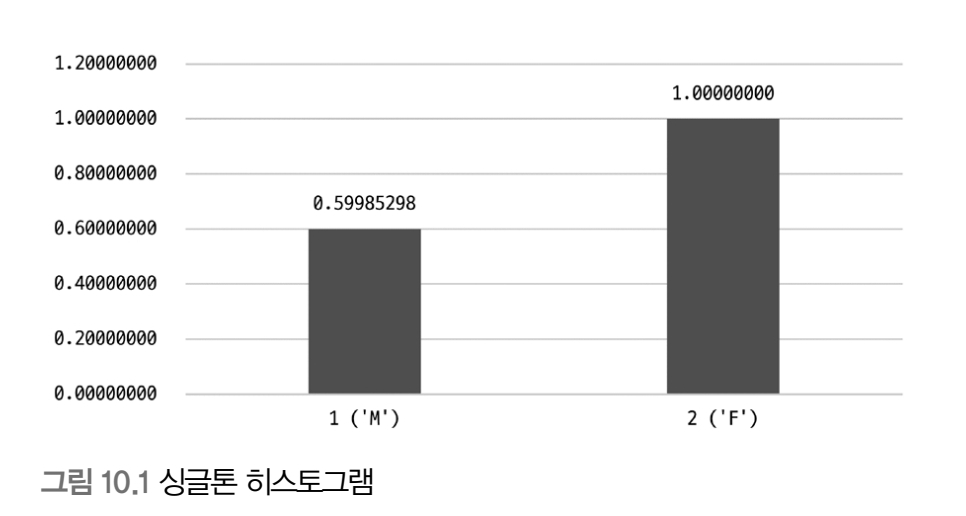
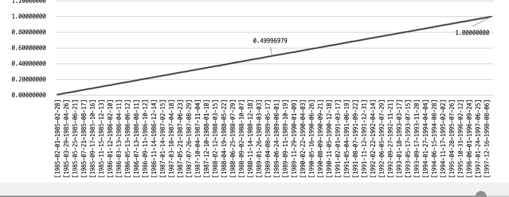

# 10.1 통계 정보

- 8.0부터 인덱스되지 않은 컬럼들에 대해서도 데이터 분포도를 수집해서 저장하는 히스토그램 정보가 도입

## 10.1.1 테이블 및 인덱스 통계 정보

- 비용 기반 최적화에서 가장 중요한 것은 통계 정보
- 1억 건의 레코드가 저장된 테이블의 통계 정보가 갱신되지 않아서 레코드가 10건 미만인 것처럼 돼 있다면 옵티마이저는 인덱스 레인지 스캔이 아니라 풀 테이블 스캔을 할 것임


### 10.1.1.1 MySQL 서버의 통계 정보

- 5.6버전부터 InnoDB 스토리지 엔진을 사용하는 테이블에 대한 통계 정보를 영구적으로(Persistent) 관리할 수 있게 개선됐음
- 5.5까지는 메모리에만 관리되고 `SHOW INDEX` 명령으로만 테이블의 인덱스 컬럼의 분포도를 볼 수 있었다
- 메모리에 관리된다는 것은 **서버가 재시작되면 모조리 사라진다는 뜻**임
- 5.6부터 통계 정보를 innodb_index_stats, innodb_table_stats 테이블로 관리할 수 있게 개선됨

```mysql
SHOW TABLES LIKE '%_stats';
```

- 테이블 생성 시 STATS_PERSISTENT를 0으로 하면 5.5 이전 방식대로 관리
- 1로 하면 테이블에 저장
- default로 하면 innodb_stats_persistent 시스템 변수 값 따라감
- 해당 변수는 default가 1(ON)임
- 아래와 같은 이벤트 발생 시 자동으로 통계 정보가 갱신됨
  - 테이블이 새로 오픈되는 경우
  - 레코드가 대량으로 변경되는 경우(1/16 이상 update, insert, delete)
  - analyze table 명령 실행 시
  - show table status, show index from이 실행되는 경우
  - InnoDB 모니터가 활성화 되는 경우
  - innodb_stats_on_metadata 시스템 설정이 ON인 상태에서 SHOW TABLE STATUS 명령이 실행되는 경우


- 이처럼 통계 정보 자동 수집도 `STATS_AUTO_RECALC` 옵션으로 조절 가능함
  - 1: 5.5 이전 방식대로 자동 수집
  - 0: ANALYZE TABLE 명령 실행할 때만 수집
  - DEFAULT: 별도로 이 옵션을 설정하지 않은 것과 동일. innodb_stats_auto_recalc 변수 값으로 결정함

- 몇 개의 InnoDB 테이블 블록을 샘플링할지 결정하는 옵션인 innodb_stats_sample_pages가 있음
  - 5.6부터 없어짐 대신 innodb_stats_transient_sample_pages와 innodb_stats_persistent_sample_pages 시스템 변수 2개로 분리 됐음
  - innodb_stats_transient_sample_pages 기본값 8. 8개 페이지만 임의로 샘플링해서 분석한다는 뜻
  - innodb_stats_persistent_sample_pages
    - default 20이고 ANALYZE TABLE 명령 실행 시 20개 페이지를 샘플링하고 영구적인 테이블에 저장한다는 뜻

## 10.1.2 히스토그램

- 5.7까지의 통계 정보는 단순히 인덱스된 컬럼의 유니크한 값의 개수 정도만 가지고 있었어서 실행 계획을 수립하기엔 많이 부족했음
- 8.0부터 컬럼의 데이터 분포도를 참조할 수 있는 히스토그램 정보를 활용할 수 있게 됐음

### 10.1.2.1 히스토그램 정보 수집 및 삭제

MySQL 8.0 버전에서는 두 종류의 히스토그램 타입이 지원됨
  - Singleton(싱글톤): 컬럼값 개별로 레코드 건수를 관리하는 히스토그램으로, Value-Based 히스토그램 또는 도수 분포라고 불림
  - Equi-Height(높이 균형): 컬럼값의 범위를 균등한 개수로 구분해서 관리하는 히스토그램으로 Height-Balanced 히스토그램이라고도 불림




- 히스토그램은 누적으로 표시되기 때문에 F(1) - M(0.5998)을 해야 F의 값이 나온다
- 높이 균형 히스토그램도 누적으로 표시되기 때문에 그래프 기울기가 일정한 것으로 보아 각 범위가 비슷한 레코드 건수를 가진다는 것을 알 수 있다

### 10.1.2.2 히스토그램의 용도

- 히스토그램 도입 이전에 테이블과 인덱스에 대한 통계 정보는 존재 했음
- 하지만 테이블의 전체 레코드 건수와 인덱스된 컬럼이 가지는 유니크한 값의 개수 정도였음
- 그래서 테이블 레코드 1천건, 특정 컬럼의 유니크한 값이 100이라면 동등 비교 검색 시 대략 10개의 레코드가 일치할 것이라고 예측함

```mysql
SELECT * FROM order WHERE user_id = 'matt.lee';
```

- **하지만 데이터는 항상 균등 분포도를 가지지 않음**
- 이런 단점을 보완하기 위해서 히스토그램이 도입됨
- 히스토그램이 있으면 특정 범위의 데이터가 많고 적음을 식별할 수 있음

### 10.1.2.3 히스토그램과 인덱스

- 히스토그램과 인덱스는 완전히 다른 객체
- 인덱스는 부족한 통계 정보를 수집하기 위해 사용된다는 측면에서 어느 정도 공통점을 가짐
- 옵티마이저는 실제 인덱스의 B-Tree를 샘플링해서 살펴봄
- 인덱스 다이브(Index Dive)라고 표현

```mysql
SELECT *
FROM employees
WHERE first_name='Tonny'
  AND birth_date BETWEEN '1954-01-01' AND '1955-01-01'
```

- 옵티마이저는 풀 스캔을 할지 first_name 컬럼의 인덱스를 이용할지 고민할 것임
- first_name 컬럼에 히스토그램이 수집돼 있다면 인덱스 다이브를 통해 직접 수집한 정보를 활용함
- 하지만 인덱스 다이브는 어느 정도의 비용이 필요함
- 인덱스 다이브를 실행하기보다는 히스토그램을 활용하는 최적화 기능도 조만간 추가되지 않을까


## 10.1.3 코스트 모델(Cost Model)

쿼리를 처리하기 위해 아래 작업을 필요로 함

- 디스크로부터 데이터 페이지 읽기
- 메모리(InnoDB 버퍼풀)로부터 데이터 페이지 읽기
- 인덱스 키 비교
- 레코드 평가
- 메모리 임시 테이블 작업
- 디스크 임시 테이블 작업

전체 쿼리 비용을 계산하는 데 필요한 단위 작업들의 비용을 코스트 모델이라고 함

MySQL 5.7부터 서버의 소스 코드에 상수화돼 있던 각 단위 작업의 비용을 DBMS 관리자가 조정할 수 있게 개선됨

- 하지만 5.7때는 인덱스되지 않은 컬럼의 히스토그램이나 메모리에 상주 중인 페이지 비율 등 비용 계산과 연관된 부분의 정보가 부족
- 8.0으로 올라가면서 비율이 관리되고 실행 계획 수립에 사용되기 시작함

- server_cost: 인덱스를 찾고 레코드를 비교하고 임시 테이블 처리에 대한 비용 관리
- engine_cost: 레코드를 가진 데이터 페이지를 가져오는 데 필요한 비용 관리

