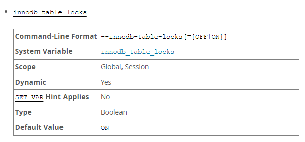
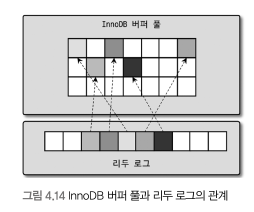

> InnoDB는 MySQL에서 사용할 수 있는 스토리지 엔진 중 거의 유일하게 레코드 기반의 잠금을 제공한다.  
> 이 때문에 높은 동시성 처리가 가능하고 안정적이며 성능이 뛰어나다.


# Primary key에 의한 클러스터링
- InnoDB의 모든 테이블은 기본적으로 Primary Key를 기준으로 클러스터링 되어 저장된다.
  - PK 값의 순서대로 디스크에 저장된다는 뜻
- 모든 Secondary Index는 레코드의 주소 대신 PK의 값을 논리적 주소로 사용
- PK가 클러스터링 Index이기 때문에 PK를 이용한 Range scan은 상당히 빨리 처리될 수 있다.
  - 쿼리 실행 계획에서 PK는 기본적으로 다른 보조 인덱스에 비해 비중이 높게 설정된다.
- MyISAM에서는 클러스터링 키를 지원하지 않는다.
  - 그래서 MyISAM 테이블에서는 PK와 Secondary Index는 구조적으로 차이가 없다

# 외래 키 지원
외래 키에 대한 지원은 InnoDB 스토리지 엔진 레벨에서 지원하는 기능으로 MyISAM이나 
MEMORY 테이블에서는 사용할 수 없다.
- InnoDB에서 외래 키는 부모 테이블과 자식 테이블 모두 해당 컬럼에 인덱스 생성이 필요
- 변경 시에는 반드시 부모 테이블이나 자식 테이블에 데이터가 있는지 체크하는 작업이 필요
- 즉, 잠금이 여러 테이블로 전파되고 그로 인해 데드락이 발생할 때가 많으므로 개발할 때도 외래 키의 존재에 주의 하는 것이 좋다.
```sql
-- 외래 키 체크 일시 해제
-- global, session 모두 설정 가능한데, 생략하면 현재 세션만 설정 변경함
SET foregin_key_checks=OFF;
```
외래 키 체크를 일시 해제하게 되면, 외래 키 관계의 부모 테이블에 대한 작업(ON DELETE CASCADE와 ON CASCADE 옵션)도 무시하게 됨

# MVCC
> MVCC, Multi Version Concurrency Control

- 레코드 레벨의 트랜잭션을 지원하는 DBMS가 제공하는 기능
- 잠금을 사용하지 않는 일관된 읽기를 제공하는 것이 목적
- InnoDB는 언두 로그(Undo Log)를 이용해 이 기능을 구현

MVCC의 MV 즉, Multi Version은 **하나의 레코드에 대해 여러 개의 버전이 동시에 관리된다는 의미**

## READ_COMMITTED의 데이터 변경
```sql
CREATE TABLE member (
  m_id INT NOT NULL,
  m_name VARCHAR(20) NOT NULL,
  m_area VARCHAR(100) NOT NULL,
  PRIMARY KEY (m_id),
  INDEX ix_area (m_area)
);

INSERT INTO member (m_id, m_name, m_area) VALUES (12, '홍길동', '서울');
COMMIT;
```


INSERT가 실행되면 위와 같은 상태로 변경된다.
즉, INSERT가 실행되면 INSERT 된 row는 InnoDB 버퍼 풀에 등록된다.


```sql
UPDATE member SET m_area='경기' WHERE m_id=12;
```
그리고 UPDATE문이 실행되면 위와 같은 상태로 바뀐다.
UPDATE가 실행되면 **커밋 실행 여부와 관계없이** InnoDB의 버퍼 풀은 새로운 값인 '경기'로 업데이트된다.
그리고 언두 로그엔 바뀌기 이전 값이 기록되는데, PK와 변경된 필드의 데이터만 기록된다.

만약, COMMIT이나 ROLLBACK이 되지 않은 상태에서 다른 사용자가 다음 같은 쿼리로 작업 중인 레코드를 조회하면 어디에 있는 데이터를 조회할까?
```sql
SELECT * FROM MEMBER m_id=12;
```
정답은, MySQL 서버의 시스템 변수 transaction_isolation에 설정된 격리 수준에 따라 다르다.
### READ_UNCOMMITED인 경우
> "커밋되기 전이어도 값을 읽겠다!!"

InnoDB 버퍼 풀이 현재 가지고 있는 변경된 데이터를 읽어서 반환

### READ_COMMITED, REPEATABLE_READ, SERIALIZABLE
> "커밋된 후의 데이터만 읽겠다!!"

아직 커밋되기 전이므로 **언두 영역의 데이터 반환**

**이러한 과정을 DBMS에서는 MVCC라고 표현한다.**

만약, 여기서 롤백을 해버리면 언두 로그는 다시 버퍼 풀로 가고, 언두 로그는 삭제된다.
그리고 언두 영역의 백업 데이터가 항상 바로 삭제되는 것은 아니다.
이 **언두 영역을 필요로 하는 트랜잭션이 더는 없을 때 삭제**된다.

# 잠금 없는 일관된 읽기
> Non-Locking Consistent Read

MVCC와 관련된 내용인데,
InnoDB 스토리지 엔진은 MVCC 기술을 이용해 **잠금을 걸지 않고 읽기 작업을 수행**한다.
격리 수준이 `SERIALIZABLE`이 아닌 `READ_UNCOMMITTED`나 `READ_COMMITED`, `REPEATABLE_READ` 수준인 경우 INSERT와 연결되지 않은 SELECT는 다른 트랜잭션의 변경 작업과 관계없이 항상 잠금을 대기하지 않고 바로 실행된다.

다시 기억해야 할 점은, InnoDB에서는 **변경되기 전의 데이터를 읽기 위해 언두 로그를 사용한다**는 점이다.

|격리 수준|결과|읽는 위치|
|---|:---:|:---:|
|READ_UNCOMMITTED|경기|버퍼 풀|
|READ_COMMITED|서울|언두 로그|
|REPEATABLE_READ|서울|언두 로그|

간혹 오랜 시간 활성 상태인 트랜잭션으로 서버가 느려지는 문제가 발생하는데,
일관된 읽기를 위해 언두 로그를 삭제하지 못하고 계속 유지해야 하기 때문에 발생한다.
따라서, 트랜잭션 시작 후 가능한 빨리 롤백이나 커밋으로 트랜잭션을 완료하는게 좋다.

# 자동 데드락 감지
- InnoDB 스토리지 엔진은 내부적으로 잠금이 교착 상태에 빠지지 않았는지 체크하기 위해 잠금 대기 목록(Wait-for List)을 그래프 형태로 관리한다.
- 데드락 감지 스레드를 갖고 있다.
- 데드락 감지 스레드가 주기적으로 잠금 대기 그래프를 검사해 교착 상태에 빠진 트랜잭션들을 찾아 그중 하나를 강제종료 한다.
- 이때 어떤 트랜잭션을 먼저 종료할 것인지를 판단하는 기준은 **트랜잭션의 언두 로그 양**이다.
- **<u>언두로그를 더 적게 가진 트랜잭션이 일반적으로 롤백의 대상</u>**이 된다.
  - 롤백을 해도 언두 처리를 해야 할 내용이 적다는 뜻
  - 트랜잭션 강제 롤백으로 인한 서버의 부하도 덜 유발한다는 뜻

## 불확실한 데드락 감지
InnoDB 스토리지 엔진은 상위 레이어인 MySQL 엔진에서 관리되는 테이블 잠금(LOCK TABLES 명령으로 잠긴 테이블)은 볼 수가 없어 데드락 감지가 불확실 할 수 있다.
- innodb_table_locks 시스템 변수를 활성화
  - InnoDB 스토리지 엔진 내부의 레코드 잠금 감지 가능
  - 테이블 레벨의 잠금까지 감지 가능

"특별한 이유가 없다면 `innodb_table_locks` 시스템 변수를 활성화하자"


> 출처: https://dev.mysql.com/doc/refman/8.0/en/innodb-parameters.html#sysvar_innodb_table_locks

옵션을 보면 MySQL 8.0 기준으로 default 값이 ON 인 것을 볼 수 있고, 별다른 설정을 안해놨다면 켜져있다.

## 부담 돼 너의 잠금
일반적인 서비스에서 데드락을 찾아내는 작업은 크게 부담되지 않는다.
하지만 **동시 처리 스레드가 매우 많아지거나 각 트랜잭션이 가진 잠금의 개수가 많아지면 데드락 감지 스레드가 느려진다**.

- 데드락 스레드는 잠금 목록을 검사해야 하기 때문에 **잠금 상태가 변경되지 않도록 잠금 목록이 저장된 리스트(잠금 테이블)에 새로운 잠금을 걸고** 데드락 스레드를 찾게 된다.
  - 즉, 락 체크를 위한 락을 건다는 뜻
  - 이로 인해 데드락 감지 스레드는 더 많은 CPU 자원을 소모할 수도 있다.

### 부담을 해결해보자

해결을 위해 MySQL 서버는 `innodb_deadlock_detect` 시스템 변수를 제공한다.

- `innodb_deadlock_detect`를 OFF로 설정하면 데드락 감지 스레드는 더 이상 작동하지 않는다.
- InnoDB 스토리지 엔진 내부에서 2개 이상의 트랜잭션이 상대방이 가진 잠금을 요구하는 상황(데드락)이 발생해도 누군가 중재를 하지 않기 때문에 무한 대기한다.
- 하지만 `innodb_lock_wait_timeout` 시스템 변수를 활성화하면 동일 상황에서 일정 시간이 지나면 자동으로 요청이 실패하고 에러 메세지를 반환한다.
  - 이는 초 단위로 설정할 수 있다.
  - 정해진 시간 동안 획득하지 못하면 쿼리는 실패하고 에러를 반환한다.
  - default는 50초이며, `innodb_deadlock_detect`를 OFF하고 <u>**50초보다 낮은 시간으로 변경해 사용할 것을 권장**</u>한다.

## TMI. 구글의 대처

구글엔 PK 기반의 조회 및 변경이 아주 높은 빈도로 실행되는 서비스가 많았는데,

매우 많은 트랜잭션을 동시에 실행하므로 데드락 감지 스레드가 상당히 성능을 저하시킨다는 것을 알았다.

MySQL 서버의 소스코드를 변경해 데드락 감지 스레드를 ON/OFF 할 수 있게 했다.

이 기능의 필요성을 인지하고 **오라클에 이 기능을 요청해 MySQL 서버에 추가**된 것이다.

만약 PK 또는 세컨더리 인덱스를 기반으로 매우 높은 동시성 처리를 요구하는 서비스가 있다면 `innodb_deadlock_detect`를 비활성화해서 성능 비교를 해보는 것도 새로운 기회가 될 것이다.


# 자동화된 장애 복구

MySQL 서버와 무관하게 디스크나 서버 하드웨어 이슈로 **InnoDB 스토리지 엔진이 자동으로 복구를 못하는 경우, MySQL 서버는 종료**된다.

이 때는 MySQL 서버의 설정 파일에 `innodb_force_recovery` 시스템 변수를 설정해 MySQL 서버를 시작해야 한다.

이 설정값은 InnoDB 스토리지 엔진이 데이터 파일이나 로그 파일의 손상 여부 검사 과정을 선별적으로 진행할 수 있게 한다.

- InnoDB 로그 파일이 손상됐다면 6으로 설정하고 MySQL 서버를 가동
- InnoDB 테이블의 데이터 파일이 손상됐다면 1로 설정하고 MySQL 서버를 기동
- 어떤 부분이 문제인지 알 수 없다면 `innodb_force_recovery` 설정값을 1부터 6까지 변경하면서 MySQL을 재시작
  - `innodb_force_recovery`를 1로 설정 후 MySQL 재시작
  - 재시작되지 않으면 2로 설정해 재시작
- `innodb_force_recovery` 값이 커질수록 심각한 상황이라 데이터 손실 가능성이 커지고 복구 가능성은 적어짐

- MySQL 서버가 가동되고 InnoDB 테이블이 인식된다면?

  1. `mysqldump`를 이용해 데이터를 가능한만큼 백업

  2. 해당 데이터로 MySQL 서버의 DB와 테이블을 다시 생성하는 것이 좋음

## 각 숫자 값으로 복구되는 장애 상황

> `innodb_force_recovery`가 0이 아닌 복구 모두에서는 SELECT 이외의 INSERT UPDATE DELETE는 수행할 수 없다.

| innodb_force_recovery | 이름                       | 효과                                                         | 상황                                                         |
| :-------------------: | -------------------------- | ------------------------------------------------------------ | ------------------------------------------------------------ |
|           1           | SRV_FORCE_IGNORE_CORRUPT   | 데이터 파일에서 손상된 페이지를 무시하고 시작                | `Database page corruption on disk or a failed` 메시지 출력될 때 대부분 이 경우에 해당 |
|           2           | SRV_FORCE_NO_BACKGROUND    | 백그라운드 메인 스레드를 시작하지 않음                       | 메인 스레드가 언두 데이터를 삭제하는 과정에서 장애가 발생하는 경우 |
|           3           | SRV_FORCE_NO_TRX_UNDO      | 장애 발생 시 **커밋되지 않고 종료된 트랜잭션을 그대로 두는 옵션**인데 쉽게 말해 언두 로그를 사용하지 않는 것임 | 트랜잭션 롤백이 복구를 방해하는 경우                         |
|           4           | SRV_FORCE_NO_IBUF_MERGE    | MySQL 서버에서 인덱스 버퍼 병합을 비활성화                   | Mysql 서버 재시작 시 인서트 버퍼의 손상을 감지하는 경우      |
|           5           | SRV_FORCE_NO_UNDO_LOG_SCAN | 언두 로그를 모두 **<u>무시</u>**<br />서버가 종료되던 시점에 커밋되지 않았던 작업도 모두 커밋된 것처럼 처리됨(롤백한단 말이고 실제로는 잘못된 데이터가 남는다는 뜻) | 백업 작업 시 사용된다고 함                                   |
|           6           | SRV_FORCE_NO_LOG_REDO      | 리두 로그를 모두 무시<br />마지막 체크포인트 시점의 데이터만 남음 | 1.특정 테이블 스페이스의 복구가 불가능한 경우, 복구를 시도하지 않고 나머지 데이터베이스를 복구하는 데 사용<br />2.데이터베이스 복구를 수동으로 진행하거나, 데이터 손실을 감수하고 빠르게 서비스를 재개하려는 경우 |


# InnoDB 버퍼 풀

> InnoDB 스토리지 엔진에서 가장 핵심적인 부분

- 디스크의 데이터 파일이나 인덱스 정보를 **<u>메모리에 캐시해두는 공간</u>**
- 쓰기 작업을 지연시켜 일괄 처리할 수 있게 해주는 버퍼 역할도 같이 함
- 일반적인 애플리케이션에서는 INSERT, UPDATE, DELETE 처럼 데이터를 변경하는 쿼리는 데이터 파일의 이곳저곳에 위치한 레코드를 변경하기 때문에 랜덤한 디스크 io를 발생함.
- 하지만 버퍼풀이 이러한 변경된 데이터를 모아서 처리하면 랜덤 디스크 io를 줄일 수 있음

## 버퍼 풀의 크기 설정

OS와 각 Client Thread가 사용할 메모리를 충분히 고려하여 설계해야 한다.

> 레코드 버퍼: 각 클라이언트 세션에서 테이블의 레코드를 읽고 쓸 때 버퍼로 사용되는 공간

MySQL 서버 내에서 메모리를 필요로 하는 부분은 크게 없지만, 아주 독특한 경우 `레코드 버퍼`가 상당한 메모리를 사용하기도 한다.

커넥션이 많고 사용하는 테이블도 많다면 `레코드 버퍼` 용도로 사용되는 메모리 공간이 꽤 많이 필요해질 수도 있다.

<u>MySQL 서버가 사용하는 레코드 버퍼 공간은 별도로 설정할 수 없다.</u>

전체 커넥션 개수와 각 커넥션에서 읽고 쓰는 테이블의 개수에 따라 결정된다.

또한, 이 버퍼 공간은 <u>동적으로 해제</u>되기도 하므로 **정확히 필요한 메모리 공간의 크기를 계산할 수가 없다.**

⛔ MySQL **<u>5.7버전부터 InnoDB 버퍼 풀의 크기를 동적으로 조절할 수 있게 개선</u>**되었다.

- 버퍼 풀의 크기를 작은 값으로 설정해 점진적으로 증가 시키는 방법이 최적
- 서버 메모리가 8GB 미만인 경우
  - 50% 정도만 InnoDB 버퍼 풀로 설정
- 8GB 이상인 경우
  - 전체 메모리의 50%로 시작해서 점차 조금씩 올리기
- 50GB 이상인 경우
  - 15GB에서 30GB 정도를 제외하고 나머지 InnoDB 버퍼 풀로 할당


### 버퍼 풀의 크기 변경

- `innodb_buffer_pool_size` 시스템 변수로 크기 설정 가능
- **<u>버퍼 풀의 크기 변경은 크리티컬한 변경</u>**
- 가능하면 MySQL 서버가 한가한 시점을 골라서 진행하는 것이 좋음
- 버퍼 풀 크기를 키우는 작업은 시스템 영향도가 상대적으로 적으나, 줄이는 작업은 매우 크므로 주의해야함
- **<u>128MB 청크 단위로 쪼개어 관리</u>**된다

### 버퍼 풀의 Lock

- 버퍼 풀 전체를 관리하는 잠금(세마포어)으로 인해 내부 잠금 경합을 많이 유발해왔음
- 이런 경합을 줄이기 위해 버퍼 풀을 여러 개로 쪼개어 관리할 수 있게 개선되었음
- 즉, 세마포어 자체도 경합이 분산되는 효과를 내게 됨
- `innodb_buffer_pool_instances` 시스템 변수를 이용해 버퍼 풀을 여러개로 분리해서 관리 가능
- 각 버퍼 풀을 **버퍼 풀 인스턴스**라고 표현
  - default는 8개로 초기화되지만, 버퍼 풀 전체 메모리가 1GB 미만이면 인스턴스는 1개만 생성
- 버퍼 풀 할당 메모리 공간이 **40GB 이하라면 기본 값 8을 유지**하고 **크다면 버퍼 풀 인스턴스당 5GB 정도가 되게 인스턴스 개수를 설정**하는 것이 좋음

## 버퍼 풀의 구조

버퍼 풀이라는 거대한 메모리 공간을 **페이지 크기(`innodb_page_size`)의 조각으로 쪼개**어 InnoDB 스토리지 엔진이 데이터를 필요로 할 때 해당 **데이터 페이지를 읽어서 각 조각에 저장**

### 버퍼 풀 페이지 크기 관리

- LRU(Least Recently Used) 리스트와 플러시(Flush) 리스트, 프리(Free) 리스트라는 3개의 자료구조를 관리함

- Free List

  - 실제 사용자 데이터로 채워지지 않은 비어 있는 페이지들의 목록
  - 사용자의 쿼리가 새롭게 디스크의 데이터 페이지를 읽어와야 하는 경우 사용

- Flush List

  - 디스크로 동기화되지 않은 데이터를 가진 데이터 페이지(Dirty Page)의 변경 시점 기준의 페이지 목록을 관리
  - 디스크에서 읽은 상태 그대로 변경이 없으면 플러시 리스트에 관리되지 않음
  - **데이터 변경이 된 데이터 페이지는 플러시 리스트에 의해 관리**됨
  - 특정 시점이 되면 디스크로 기록되어야 함
  - 데이터 변경 시
    - 리두 로그에 기록
    - 버퍼 풀의 데이터 페이지에도 변경 내용 반영
  - **<u>그래서 리두 로그의 각 엔트리는 특정 데이터 페이지와 연결됨</u>**
  - 하지만, 리두 로그가 디스크로 기록됐다고 해서 데이터 페이지가 디스크로 기록됐다는 것을 항상 보장하지는 않음
    - InnoDB는 체크 포인트를 발생시켜 디스크의 리두 로그와 데이터 페이지의 상태를 동기화 함
    - 체크 포인트는 MySQL 서버가 시작될 때 InnoDB 리두 로그의 어느 부분부터 복구를 실행해야 할지 판단하는 기준점을 만드는 역할을 함

- LRU List

  - LRU와 MRU(Most Recently Used) 리스트가 결합된 형태

    

  - 위 사진에서 <u>Old 서브리스트 영역은 LRU</u>에 해당하고 <u>New 서브리스트 영역은 MRU</u> 정도로 이해하면 된다.

  - LRU 리스트를 관리하는 목적은 **<u>디스크로부터 한 번 읽어온 페이지를 최대한 오랫동안 InnoDB 버퍼풀의 메모리에 유지해서 디스크 읽기를 최소화</u>** 하는 것

### InnoDB 스토리지 엔진에서 데이터를 찾는 과정

1. 필요한 레코드가 저장된 데이터 페이지가 버퍼 풀에 있는지 검사
   - InnoDB 어댑티브 해시 인덱스를 이용해 페이지 검색
   - 해당 테이블의 인덱스(B-Tree)를 이용해 버퍼 풀에서 페이지를 검색
   - 버퍼 풀에 이미 데이터 페이지가 있었다면 해당 페이지의 포인터를 MRU 방향으로 승급
2. 디스크에서 필요한 데이터 페이지를 버퍼 풀에 적재하고, 적재된 페이지에 대한 포인터를 LRU 헤더 부분에 추가
3. 버퍼 풀의 LRU 헤더 부분에 적재된 데이터 페이지가 실제로 읽히면 MRU 헤더 부분으로 이동
   - Read Ahead와 같이 대량 읽기의 경우 디스크의 데이터 페이지가 버퍼 풀로 적재는 되지만 실제 쿼리에서 사용되지는 않을 수도 있으며, 이런 경우엔 MRU로 이동되지 않음
4. 버퍼 풀에 상주하는 데이터 페이지는 사용자 쿼리가 얼마나 최근에 접근했었는지에 따라 나이(Age)가 부여되며, 버퍼 풀에 상주하는 동안 쿼리에서 오랫동안 사용되지 않으면 데이터 페이지가 쿼리에 의해 사용되면 나이가 초기화되어 다시 젊어지고 MRU의 헤더 부분으로 옮겨진다.
5. 필요한 데이터가 자주 접근됐다면 해당 페이지의 인덱스 키를 어댑티브 해시 인덱스에 추가

### 결론

- 처음 한 번 읽힌 데이터 페이지가 이후 자주 사용되면, MRU 영역에 계속 살아남는다
- 거의 사용되지 않으면 새롭게 읽히는 데이터에 의해 LRU 끝으로 밀려나 버퍼 풀에서 제거 될 것이다.

## 버퍼 풀과 리두 로그

이 둘은 매우 밀접한 관계를 맺고 잇다.

InnoDB의 버퍼 풀은 서버의 메모리가 허용하는 만큼 크게 설정하면 할수록 쿼리의 성능이 빨라진다.

버퍼 풀은 서버 성능 향상을 위해 캐시와 쓰기 버퍼링이라는 두 가지 용도가 있다.

1. **메모리 공간만 늘리는 것은 데이터 캐시 기능만 향상**된다.
2. 쓰기 버퍼링 기능까지 향상 시키려면 이 관계를 이해해야 한다.



### 둘의 관계

- 클린 페이지: 디스크에서 읽은 상태 그대로
- 더티 페이지: INSERT, UPDATE, DELETE로 변경된 데이터를 가진 상태
  - 디스크와 버퍼 풀의 상태가 다르므로 언젠가 디스크로 기록돼야 함
  - 버퍼 풀에 무한정 머루를 수 없음

- InnoDB 스토리지 엔진에서 **리두 로그는 1개 이상의 고정 크기 파일을 연결해서 순환 고리처럼 사용**함
  - 데이터 변경이 계속 발생하면 리두 로그 파일에 기록됐던 로그 엔트리는 어느 순간 다시 새로운 로그 엔트리로 덮어 쓰임
  - 전체 리두 로그 파일에서 재사용 가능한 공간과 당장 재사용 불가능한 공간을 구분해서 관리해야 함
  - 재사용 불가능한 공간을 활성 리두 로그(Active Redo Log)라고 함 - *4.14 그림에서 화살표를 가진 엔트리에 해당*

- 리두 로그 파일의 공간은 계속 순환되어 재사용 되지만 매번 기록될 때마다 로그 포지션은 계속 증가된 값을 갖게 된다.
  - 이를 LSN(Log Sequence Number)라고 함
- InnoDB는 주기적으로 체크포인트 이벤트를 발생시켜 리두 로그와 버퍼 풀의 더티 페이지를 디스크로 동기화 함
- 이렇게 발생한 체크포인트 중 가장 최근 체크포인트 지점의 LSN이 활성 리두 로그 공간의 시작점이 됨
- 하지만 활성 리두 로그 공간의 마지막은 계속해서 증가하기 때문에 체크포인트와 무관함
- 가장 최근 체크포인트의 LSN과 마지막 리두 로그 엔트리의 LSN의 차이를 체크포인트 에이지(Checkpoint Age)라고 함

즉, **체크포인트 에이지는 활성 리두 로그 공간의 크기를 말함**

### 예제

1. InnoDB 버퍼 풀은 100GB이며 리두 로그 파일의 전체 크기는 100MB인 경우
   - 로그 파일 크기가 100MB밖에 안되므로 체크 포인트 에이지도 최대 100MB만 허용됨
   - 예를 들어, 평균 리두 로그 엔트리가 4KB였다면 25600개(100MB/4KB) 정도의 더티 페이지만 버퍼 풀에 보관할 수 있게 됨
   - <u>데이터 페이지가 16KB라고 가정하면 허용 가능한 전체 더티 페이지의 크기는 400MB 수준밖에 안되는 것임</u>
   - 즉, 버퍼 풀의 크기는 매우 크지만 실제 **쓰기 버퍼링을 위한 효과는 거의 못보는 상황**
2. InnoDB 버퍼 풀은 100MB이며 리두 로그 파일의 전체 크기는 100GB인 경우
   - 1번과 동일한 연산으로, 400GB 정도의 더티 페이지를 가짐
   - 하지만 버퍼 풀의 크기가 100MB 이므로 최대 허용 가능한 더티 페이지는 100MB 크기가 됨(물론 실제로 딱 100은 아니지만 편의상)

결론은 **둘 다 좋은 설정은 아님**

1번은 잘못된 설정이고, 2번은 리두 로그 공간이 무조건 큰 게 좋다면 왜 오라클에서 기본값으로 리두 로그 공간을 1~200GB로 설정하지 않았을까를 생각해보면 당연한 결과임

2번의 경우, 이론적으로 아무 문제가 없어 보여도, 실제 이 상태로 서비스를 운영하다 보면 급작스러운 디스크 쓰기가 발생할 가능성이 높음

버퍼 풀에 더티 페이지의 비율이 너무 높은 상태에서 갑작 기 버퍼 풀이 필요해지는 상황이 오면 InnoDB 스토리지 엔진은 **매우 많은 더티 페이지를 한 번에 기록해야 하는 상황이 옴**

### 결론

처음부터 리두 로그 파일의 크기를 적절히 선택하기 어렵다면, 버퍼 풀의 크기가 100GB 이하의 MySQL 서버에서는 리두 로그 파일의 전체 크기를 대략 5~10GB 수준으로 선택하고 필요할 때마다 조금씩 늘려가면서 최적값을 선택하는 것이 좋음!

> ⛔ 버퍼 풀의 크기가 100G라고 해서 리두 로그 공간이 100GB가 되어야 한다는 것은 아님
> 일반적으로 리두 로그는 변경분만 가지고 버퍼 풀은 데이터 페이지를 통째로 가지기 때문에 데이터 변경이 발생해도 리두 로그는 훨씬 작은 공간만 있으면 됨

## 버퍼 풀 플러시(Buffer Pool Flush)

5.6 버전까지는 InnoDB 스토리지 더티 페이지 플러시 기능이 부드럽게 처리되지 않았음

- 급작스럽게 디스크 기록이 폭증
- 사용자 쿼리 처리 성능에 악영향

MySQL 5.7을 거쳐 8.0으로 업그레이드 되면서 대부분 서비스에서는 더티 페이지를 디스크에 동기화하는 부분(더티 페이지 플러시)에서 예전과 같은 디스크 쓰기 폭증 현상은 발생하지 않았음


### 더티 페이지를 디스크 동기화 하는 법

InnoDB는 2개의 플러시 기능을 백그라운드로 실행한다.

1. 플러시 리스트 플러시
2. LRU 리스트 플러시

### 플러시 리스트 플러시

> 데이터 및 로그 페이지를 디스크에 기록하는 과정

리두 로그 공간의 재활용을 위해 주기적으로 오래된 리두 로그 엔트리가 사용하는 공간을 비워야 함

이때 **오래된 리두 로그 공간이 지워지려면 반드시 InnoDB 버퍼 풀의 더티 페이지가 먼저 디스크로 동기화 돼야 함**

이를 위해 주기적으로 플러시 리스트 플러시 함수를 호출해 오래전에 변경된 데이터 페이지 순서대로 동기화 하는 작업 수행

**"언제부터 얼마나 많은 더티 페이지를 한 번에 디스크로 기록하느냐"**가 악영향의 관건임

### LRU 리스트 플러시

> 변경된 데이터 페이지를 디스크에 기록하는 과정

InnoDB 스토리지 엔진은 LRU 리스트에서 사용 빈도가 낮은 데이터 페이지들을 제거해서,

새로운 페이지들을 읽어올 공간을 만들어야 하는데,

이를 위해 LRU 리스트 플러시 함수가 사용된다.

- `innodb_lru_scan_depth` 개수만큼 페이지 스캔
- 이때 스캔하면서 더티 페이지는 디스크에 동기화
- 클린 페이지는 즉시 Free List로 페이지를 옮김
- InnoDB 버퍼 풀 인스턴스별로 최대 innodb_lru_scan_depth 개수만큼 스캔함
- 실질적으로 instance * depth만큼 수행

## 버퍼 풀 상태 백업 및 복구

버퍼 풀은 쿼리 성능과 매우 밀접하다.

서버를 재시작하면 처리 성능이 평상시의 1/10도 안 되는 경우가 대부분이다.

미리 데이터를 적재 해두는 것을 Warming Up이라고 표현한다.

그래서, MySQL 5.5 버전에서는 점검을 위해 서버 재시작을 하는 경우 서비스 오픈 전 강제 웜업을 위해 주요 테이블과 인덱스에 대해 풀 스캔을 실행하고 서비스를 오픈했다.

MySQL 5.6 부터는 버퍼 풀 덤프 및 적재 기능이 도입됐다.

**`innodb_buffer_pool_dump_now` 시스템 변수를 이용해 현재 InnoDB 버퍼 풀의 상태를 백업할 수 있다.**

**서버 재시작 후 `innodb_buffer_pool_load_now` 시스템 변수를 이용해 백업된 버퍼 풀의 상태를 다시 복구할 수 있다.**

```mysql
SET GLOBAL innodb_buffer_pool_dump_now=ON;
SET GLOBAL innodb_buffer_pool_load_now=ON;
```

이 백업 데이터는 ib_buffer_pool이라는 이름의 파일로 생성되는데, 버퍼 풀이 아무리 커도 몇십 MB 이하인 것을 볼 수 있다.

이는 **<u>버퍼풀의 LRU 리스트에서 적재된 데이터 페이지의 메타 정보만 가져와서 저장하기 때문</u>**이다.

그래서, 백업은 매우 빠르지만, 복구 과정은 상당한 시간이 걸릴 수 있다.

**MySQL 서버가 셧다운 되기 직전에 버퍼 풀의 백업을 실행하고, MySQL 서버가 시작되면 자동으로 백업된 버퍼 풀의 상태를 복구할 수 있는 기능을 제공한다.**

### 버퍼 풀의 적재 내용 확인

버퍼 풀이 큰 경우 테이블 조회가 상당히 큰 부하를 일으켜 서비스 쿼리가 느려지는 문제가 있었다.

사실상 서비스 중인 버퍼 풀을 조회하는 것은 불가능했다.

8.0에서는 이러한 문제점을 해결하기 위해 information_schema db에 innodb_cached_indexes 테이블이 새로 추가됐다.

이 테이블을 이용하면 테이블 인덱스별로 데이터 페이지가 얼마나 InnoDB 버퍼 풀에 적재돼 있는지 확인할 수 있다.


---
# 여기까지의 궁금증
1. 클러스터링이란 뭘까?
2. 실무에서 JPA 외래 키를 이용한 연관관계 매핑 하는지?
   - 저는 외래 키를 사용했을 때 수정이나 삭제가 용이하지 않아 잘 사용하지 않는 편
3. DBMS란?
4. 체크포인트?
5. "언두 영역을 필요로 하는 트랜잭션이 더는 없을 때 삭제"
   - 즉, 해당 언두로그를 생성한 트랜잭션이 끝났을 때는 즉시 삭제된다는 말인가?
6. 각 격리 수준은 어떻게 다를까?
7. 동시 처리 스레드가 "매우 많아지거나"에서 매우 많아진다는 어떤 기준으로 판단할 수 있을까?
8. MySQL 서버가 한가한 시점을 골라서 버퍼 풀 크기 변경을 진행하라고 하는데, 어떤 변화가 생기길래 그런걸까?

---

# Double Write Buffer

InnoDB 스토리지 엔진의 **리두 로그는 리두 로그 공간의 낭비를 막기 위해 페이지의 변경된 내용만 기록**한다.

이로 인해 InnoDB의 스토리지 엔진에서 **더티 페이지를 디스크 파일로 플러시할 때 일부만 기록되는 문제가 발생하면 그 페이지의 내용은 복구할 수 없을 수 있다.**

이렇게 페이지 일부만 기록되는 현상을 파셜 페이지(Partial-page) 또는 톤 페이지(Torn-page)라고 하는데, 이런 현상은 **하드웨어의 오작동이나 시스템의 비정상 종료 등으로 발생**할 수 있다.

이러한 문제를 막기 위해 Double-Write 기법을 이용한다.


1. 'A' ~ 'E'까지의 더티 페이지를 디스크로 플러시한다고 가정

2. 스토리지 엔진은 실제 데이터 파일에 변경 내용을 기록하기 전에 'A' ~ 'E'까지의 더티 페이지를 우선 묶어서, 한 번의 디스크 쓰기로 시스템 테이블공간의  Double Write 버퍼에 기록

3. 각 더티 페이지를 파일의 적당한 위치에 하나씩 랜덤으로 쓰기 실행


버퍼 공간에 기록된 변경 내용은 실제 데이터 파일에 'A' ~ 'E' 더티 페이지가 정상적으로 기록되면 더이상 필요가 없어진다.

**DoubleWrite 버퍼의 내용은 실제 데이터 파일의 쓰기가 중간에 실패할 때만 원래의 목적으로 사용**된다.

만약, A, B는 정상 기록되고 C 기록 중 비정상 종료됐다고 가정해보자.

InnoDB 스토리지 엔진은 재시작될 때 항상 **DoubleWrite 버퍼의 내용과 데이터 파일의 페이지들을 모두 비교**해서 다른 내용을 담고 있는 페이지가 있으면 **DoubleWrite 버퍼의 내용을 데이터 파일의 페이지로 복사**한다.

> DoubleWrite 기능 사용 여부는 innodb_doublewrite 시스템 변수로 제어 가능


- HDD처럼 Platter가 회전하는 저장 시스템에서는 어차피 한 번의 순차 쓰기를 하는 것이기 때문에 부담되지 않음
- SSD 처럼 랜덤 IO나 순차IO 비용이 비슷한 저장 시스템에서는 상당히 부담스러움
- 하지만 데이터 무결성이 중요한 서비스는 DoubleWrite 활성화를 고려하는 것이 좋다
- 만약 DB 성능을 위해 리두 로그 동기화 설정을 1이 아닌 값으로 설정했다면 DoubleWrite도 비활성화 하는 것이 좋다.
- 리두 로그는 동기화하지 않으면서 DoubleWrite만 활성화한다는 것은 잘못된 선택이다.

# 언두 로그

- InnoDB는 트랜잭션과 격리 수준 보장을 위해 DML(INSERT, UPDATE, DELETE)로 변경되기 이전 버전의 데이터를 별도로 백업함

- 여기서 백업되는 데이터를 언두 로그라고 함

1. **트랜잭션 보장**

   트랜잭션이 롤백되면 트랜잭션 도중 <u>변경된 데이터를 변경 전 데이터로 복구</u>해야 하는데, 이때 <u>**언두 로그에 백업해둔 이전 버전의 데이터**를 이용해 복구</u>

2. **격리 수준 보장**

   특정 커넥션에서 데이터를 변경하는 도중에 <u>다른 커넥션에서 데이터를 조회</u>하면 트랜잭션 격리 수준에 맞게 변경중인 레코드를 읽지 않고 <u>언두 로그에 백업해둔 데이터를 읽어서 반환</u>하기도 함

언두 로그는 매우 중요한 역할을 담당하지만, **<u>관리 비용도 많이 필요</u>**하다.

## 언두 로그 모니터링

> 언두 로그의 데이터가 어떻게 저장되고 어떤 목적으로 사용되는지 살펴봄

언두 영역은 DML로 데이터를 변경했을 때 변경되기 전의 데이터(이전 데이터)를 보관하는 곳이다.

```mysql
UPDATE member SET name='강승현' WHERE member_id=1;
```

위 쿼리가 실행되면 커밋하지 않아도 실제 파일(데이터/인덱스 퍼버)은 '강승현'으로 변경된다.

그리고 변경되기 전의 값이 '홍길동' 이었다면, 언두 영역엔 '홍길동'이 백업되는 것이다.

여기서 커밋을 하게 되면, 현재 상태가 그대로 유지되고, **<u>롤백하면 언두 영역의 백업된 데이터를 다시 데이터 파일로 복구</u>**한다.

> 질문. UPDATE는 바로 데이터로 적용된다고 하는데 INSERT인 경우 데이터에 바로 적용되지 않는 것으로 알고 있는데 실제로 어떨까?

언두 로그의 데이터는 크게 두 가지 용도로 사용된다.

1. 트랜잭션의 롤백 대비용
2. 트랜잭션의 격리 수준을 유지하며 높은 동시성 제공


**<u>MySQL 5.5 이전 버전에서는 한 번 증가한 언두 로그 공간은 새로 구축하지 않는 한다시 줄어들지 않았다.</u>**

- 1억 건 레코드가 저장된 100GB 크기 테이블을 DELETE로 삭제한다고 가정
- 서버는 이 테이블에서 레코드를 한 건 삭제하고 언두 로그에 삭제되기 전 값을 저장
- 이렇게 1억 건의 레코드가 있는 테이블에서는 삭제되지만 언두 로그로 복사되어야 함
- 즉, 테이블 크기만큼 언두 로그 공간 사용량이 늘어나 결국 언두 로그 공간이 100GB가 되는 것


대용량 데이터를 처리하는 트랜잭션뿐 아니라 **<u>트랜잭션이 오랜 시간 실행될 때</u>**도 언두 로그의 양은 급격히 증가할 수 있음


- 위 그림에서 B, C 트랜잭션은 완료됐지만 A는 완료되지 않음
- B,C는 UPDATE DELETE를 실행했기에 변경 이전의 데이터를 언두 로그에 백업했을 것
- 하지만 먼저 시작된 A 트랜잭션이 아직 활성 상태이므로, B,C 완료 여부와 관계 없이 B,C 트랜잭션이 만들어낸 언두 로그는 삭제되지 않음

- 빈번하게 변경된 레코드를 조회하는 쿼리가 실행되면 InnoDB는 **언두 로그의 이력을 필요한 만큼 스캔해야만 필요한 레코드를 찾을 수 있기에**, 쿼리 성능이 떨어짐


이러한 문제점은 MySQL 5.7, 8.0으로 업그레이드 되면서 완전히 해결됐다.

MySQL 8.0에서는 언두 로그를 돌아가며 순차적으로 사용해, 디스크 공간을 줄이는 것도 가능하며 때로는 MySQL 서버가 필요한 시점에 사용 공간을 자동으로 줄여 주기도 한다.

> **하지만, 여전히 활성 상태의 트랜잭션이 장시간 유지되는 것은 성능상 좋지 않다.**

그래서 언두 로그가 얼마나 증가했는지는 항상 모니터링 하는 것이 좋다.

```mysql
-- 서버의 언두 로그 건수 확인
SHOW ENGINE INNODB STATUS \g

-- MySQL 8.0에서 사용 가능한 명령
SELECT count
FROM information_schema.innodb_metrics
WHERE SUBSYSTEM='transaction' AND NAME='trx_rseg_history_len'
```


> 참고

- MySQL 서버에서 **INSERT, UPDATE+DELETE 언두 로그는 별도로 관리**됨
- UPDATE DELETE 언두 로그는 **MVCC와 데이터 복구(롤백 포함)에 모두 사용**되지만
- INSERT 문장으로 인한 언두 로그는 **MVCC를 위해서는 사용되지 않고 롤백이나 데이터 복구만을 위해서 사용**된다.

---

# 여기까지 궁금증

- SSD는 랜덤 IO와 순차 IO 비용이 비슷한데 왜그럴까?