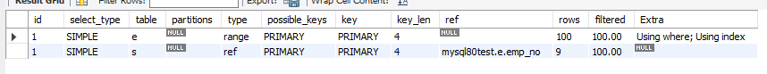
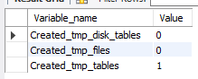

# 9.2 기본 데이터 처리

결과물은 동일해도 그 결과를 만들어 내는 과정은 천차만별이다.

## 9.2.1 풀 테이블 스캔과 풀 인덱스 스캔

MySQL 옵티마이저는 다음과 같은 조건에서 풀 테이블 스캔을 선택한다.

- 테이블 레코드 건수가 작아서 인덱스를 통해 읽는 것보다 풀테이블 스캔을 하는 편이 더 빠른 경우(일반적으로 테이블이 페이지 1개로 구성된 경우)
- WHERE 절이나 ON 절에 인덱스를 이용할 수 있는 적절한 조건이 없는 경우
- 인덱스 레인지 스캔을 사용할 수 있는 쿼리라고 하더라도 옵티마이저가 판단한 조건 일치 레코드 건수가 너무 많은 경우

InnoDB 스토리지 엔진은 특정 테이블의 연속된 데이터 페이지가 읽히면 백그라운드 스레드에 의해 리드 어헤드 작업이 자동으로 시작된다.

리드 어헤드란 어떤 영역의 데이터가 앞으로 필요해지리라는 것을 예츠갷서 요청이 오기 전에 미리 디스크에서 읽어 버퍼 풀에 가져다 두는 것을 의미한다.

즉, 풀 테이블 스캔이 실행되면 처음 몇 개의 데이터 페이지는 포그라운드 스레드가 페이지 읽기를 실행하지만 특정 시점부image.png터는 읽기 작업을 백그라운드 스레드로 넘긴다.

백그라운드 스레드가 읽기를 넘겨받는 시점부터 한 번에 4 또는 8개의 페이지를 읽으며 그 수를 증가시키고, 최대 64개의 데이터 페이지까지 읽어 버퍼 풀에 저장해 둔다.

포그라운드 스레드는 미리 버퍼 풀에 준비된 데이터를 가져다 사용하기만 하면 되므로 쿼리가 상당히 빨리 처리되는 것이다.

```mysql
SELECT count(*) FROM employees;
```

위 쿼리를 실행하면 풀 테이블 스캔을 할 것 같지만 실제 실행 계획은 풀 인덱스 스캔을 하게 될 가능성이 높다.  
모든 컬럼 정보가 필요 없기 때문에 인덱스의 컬럼만으로 훨씬 빠른 처리가 되기 때문이다.

```mysql
SELECT * FROM employees;
```

하지만 위와 같은 쿼리는 풀 인덱스 스캔을 활용하지 못하고 풀 테이블 스캔을 한다.


## 9.2.2 병렬 처리

`innodb_parallel_read_threads`라는 시스템 변수를 이용해 하나의 쿼리를 최대 몇 개의 스레드를 이용해서 처리할지 변경할 수 있다.

수를 점점 늘리면 쿼리 실행 시간이 줄어드는 것을 볼 수 있으나, CPU 코어 개수를 넘어가면 더 느려지는 경우도 발생한다.

### 9.2.3 ORDER BY 처리(Using filesort)

||장점|단점|
|---|---|---|
|인덱스 이용|INSERT UPDATE DELETE 실행될 때 이미 인덱스가 정렬돼 있어 순서대로 읽기만 하면 되므로 매우 빠름|부가적인 인덱스 추가/삭제 작업이 필요하므로 느림. 인덱스도 결국 저장되는 데이터니 추가 공간 필요함. 개수가 늘어날수록 버퍼 풀을 위한 메모리가 많이 필요함|
|Filesort 이용|레코드가 많지 않으면 메모리에서 Filesort가 처리되므로 충분히 빠름|정렬 작업이 쿼리 실행 시 처리되므로 레코드 대상 건수가 많아질수록 쿼리 응답 속도가 느림|

모든 정렬을 인덱스를 이용하도록 튜닝하기란 거의 불가능하다

- 정렬 기준이 너무 많아서 요건별로 모두 인덱스를 생성하는 것이 불가능한 경우
- GROUP BY의 결과 또는 DISTINCT 같은 처리의 결과를 정렬해야 하는 경우
- UNION의 결과와 같이 임시 테이블의 결과를 다시 정렬해야 하는 경우
- 랜덤하게 결과 레코드를 가져와야 하는 경우

인덱스를 수행하지 않고 별도 정렬 처리를 했는지 확인하려면 실행 계획의 Extra 컬럼에 Using filesort 메시지 표시로 알 수 있다.

### 9.2.3.1 소트 버퍼

정렬 수행을 위해 별도 메모리 공간을 할당받아 사용하는데, 이 메모리 공간을 소트 버퍼라고 한다.

정렬이 필요한 경우에만 할당되고 버퍼 크기는 정렬해야 할 레코드 크기에 따라 가변적으로 증가하지만 최대 공간은 `sort_buffer_size`라는 시스템 변수로 설정할 수 있다.

소트 버퍼를 위한 메모리 공간은 쿼리 실행이 완료되면 즉시 시스템으로 반납된다.

정렬해야 할 레코드의 건수가 소트 버퍼로 할당된 공간보다 크다면 어떻게될까?
MySQL은 정렬해야 할 레코드를 여러 조각으로 나눠 처리하는데 이 과정에서 임시 저장을 위해 디스크를 사용한다.

소트 버퍼에서 정렬 수행하고 임시로 디스크에 기록하고 레코드를 가져와 다시 정렬하고 반복적으로 디스크에 임시 저장한다.

이 병합 작업을 멀티 머지라고 표현한다.

정렬을 위해 할당하는 **소트 버퍼는 세션 메모리 영역에 해당**한다.
> 즉, 소트 버퍼는 **여러 클라이언트가 공유해서 사용할 수 있는 영역이 아니다.** 커넥션이 많을수록, 정렬 작업이 많을수록 소트 버퍼로 소비되는 공간이 커짐을 의미한다.

더 이상 메모리 여유 공간이 없을때 OS의 OOM-Killer가 메모리를 가장 많이 사용하는 프로세스를 강제 종료한다.
메모리를 가장 많이 사용하는 프로세스는 보통 MySQL 서버다.

### 9.2.3.2 정렬 알고리즘

- 싱글 패스: 레코드 전체를 소트 버퍼에 담기
  - sork_key, packed_additional_fields: 정렬 키와 레코드 전체를 가져와 정렬하는 방식, 레코드 컬럼은 가변 사이즈로 메모리 저장
  - sort_key, addtional_fields: 정렬키와 레코드 전체 가녀와 정렬하는 방식이고 각 컬럼은 고정 사이즈 메모리 저장
- 투 패스: 정렬 기준 컬럼만 소트 버퍼에 담기
  - sort_key, rowid


> 싱글패스 대신 투 패스 쓸 때

- 레코드 크기가 max length for sort data 보다 클 때
- blob, text 타입 컬럼이 select 대상에 포함될 때


### 9.2.3.3 정렬 처리 방법

- 인덱스 사용: 표기 X
- 조인에서 드라이빙 테이블만 정렬: Using filesort
- 조인에서 조인 결과를 임시 테이블로 저장 후 정렬: Using temporary; Using filesort

> 인덱스를 이용한 정렬

- order by 순서대로 생성된 인덱스 있어야 함
- order by에 명시된 컬럼이 제일 먼저 읽는 테이블에 속함
- where절에 첫 번째로 읽는 테이블 컬럼에 대한 조건이 있다면 그 조건과 order by는 같은 인덱스를 사용할 수 있어야 함
- 해시 인덱스나 전문 검색 인덱스는 인덱스 정렬 불가
- 여러 테이블 조인되는 경우엔 Nested loop 방식 조인에서만 사용 가능

> 조인의 드라이빙 테이블만 정렬

제대로 이해를 못했다..

```mysql
select * from employees e, salaries s
where s.emp_no = e.emp_no
and e.emp_no between 100002 and 100010
order by e.last_name;
```

> 임시 테이블을 이용한 정렬

- 2개 이상 테이블을 조인해 그 결과를 정렬해야 한다면 임시 테이블이 필요할 수 있다
  

```mysql
select * from employees e, salaries s
where s.emp_no = e.emp_no
and e.emp_no between 100002 and 100010
order by s.salary;
```

정렬이 수행되기 전에 salaries 테이블을 읽어야 해서 조인된 데이터를 가지고 정렬할 수밖에 없다.

> 스트리밍 방식

서버 쪽에서 처리할 데이터가 얼마인지에 관계없이 조건에 일치하는 레코드가 검색될때마다 바로바로 클라이언트로 전송해주는 방식

> 버퍼링 방식

order by, group by는 스트리밍 되는 것을 불가능하게 한다.
where 조건에 따라 모든 레코드를 가져오고 정렬하거나 그루핑해서 차례대로 보내야 하기 때문이다.

인덱스를 사용한 정렬 방식만 스트리밍 형태 처리이고 나머진 모두 버퍼링이다.

## 9.2.4 GROUP BY 처리

### 9.2.4.1 인덱스 스캔을 이용하는 GROUP BY(타이트 인덱스 스캔)

조인의 드라이빙 테이블에 속한 컬럼만 이용해 그루핑할 때 GROUP BY 컬럼으로 이미 인덱스가 있다면 그 인덱스를 차례대로 읽으면서 그루핑 작업을 수행하고 그 결과로 조인을 처리

### 9.2.4.2 루스 인덱스 스캔을 사용하는 GROUP BY

실행 계획의 Extra 컬럼에 `Using index for group-by`가 표시된다.

```mysql
EXPLAIN
  SELECT emp_no
  FROM salaries
  WHERE from_date='1985-03-01'
  GROUP BY emp_no;
```

이 테이블의 인덱스는 emp_no, from_date로 생성되어 있기에 WHRERE 조건은 인덱스 레인지 스캔 방식으론 이용할 수 없다.

하지만 인덱스 레인지 스캔을 이용했는데 GROUP BY 처리까지 인덱스를 사용했기 때문이다.

> 책 307p 실행 순서 참고

명시된 쿼리 패턴들이 어떻게 사용될지 얘기해보면 좋을 듯 하다.

루스 인덱스 스캔을 사용할 수 없는 경우는 아래와 같다.
MIN, MAX 이외 집합 함수(SUM...)가 사용된 경우

### 9.2.4.3 임시 테이블을 사용하는 GROUP BY

group by 기준 컬럼이 드라이빙 테이블이건 드리븐이건 관계없이 인덱스를 전혀 사용하지 못할 때 이 방식으로 사용된다.

```mysql
EXPLAIN
  SELECT e.last_name, AVG(s.salary)
  FROM employees e, salaries s
  WHERE s.emp_no=e.emp_no
  GROUP BY e.last_name;
```

위 쿼리는 Extra에 `Using temporary`가 표시된다.
임시 테이블이 사용된 것은 employees 테이블을 풀스캔하기 때문이 아니라 인덱스를 전혀 사용할 수 없는 GROUP BY이기 때문이다.

8.0버전 이전엔 group by가 사용된 쿼리는 그루핑되는 컬럼을 기준으로 묵시적 정렬까지 함께 수행했다. (**last_name 컬럼으로 정렬된 결과를 반환**)

8.0부터는 이 같은 묵시적 정렬은 더 이상 실행되지 않게 바뀌었다.

```mysql
CREATE TEMPORARY TABLE ... (
  last_name VARCHAR(16),
  salary INT,
  UNIQUE INDEX ux_lastname (last_name)
);
```

하지만 8이후에도 group by, order by가 함께 사용되면 명시적으로 정렬 작업을 수행한다.

using temporary와 함께 using filesort가 표시된다.

```mysql
EXLAIN
SELECT e.last_name, AVG(s.salary)
FROM employees e, salaries s
WHERE s.emp_no=e.emp_no
GROUP BY e.last_name
ORDER BY e.last_name;
```

## 9.2.5 DISTINCT 처리

집합 함수와 같이 DISTINCT가 사용되는 쿼리의 실행 계획에서 DISTINCT 처리가 인덱스를 사용하지 못할 때는 항상 임시 테이블이 필요하다.
하지만 실행 계획의 Extra 컬럼에는 `Using temporary` 메시지가 출력되지 않는다.

### 9.2.5.1 SELECT DISTINCT ...

단순히 SELECT 되는 레코드 중 유니크한 레코드만 가져오고자 하면 SELECT DISTINCT 형태 쿼리 문장을 사용한다.

```mysql
SELECT DISTINCT emp_no FROM salaries;
SELECT emp_no FROM salaries GROUP BY emp_no;
```

DISTINCT는 레코드를 유니크하게 SELECT 하는거지, 특정 컬럼만 유니크하게 조회하는 것이 아니다.

### 9.2.5.2 집합 함수와 함께 사용된 DISTINCT

COUNT, MIN, MAX 같은 집합 함수 내에서 DISTINCT 키워드가 사용될 수 있는데, 이 경우에는 일반적으로 SELECT DISTINCT와 다르게 해석된다.

집합 함수 내에서 사용된 DISTINCT는 그 집합 함수의 인자로 전달된 컬럼값이 유니크한 것들을 가져온다.

```mysql
EXPLAIN SELECT COUNT(DISTINCT s.salary)
FROM employees e, salaries s
WHERE e.emp_no = s.emp_no
AND e.emp_no BETWEEN 100001 AND 100100;
```



COUNT(DISTINCT s.salary)를 처리하기 위해 임시 테이블을 사용하지만, Using temporary를 표시하지 않고 있다.

```mysql
EXPLAIN SELECT COUNT(DISTINCT s.salary),
  COUNT(DISTINCT e.last_name)
FROM employees e, salaries s
WHERE e.emp_no = s.emp_no
AND e.emp_no BETWEEN 100001 AND 100100;
```

위 쿼리는 똑같이 임시 테이블을 사용하지만 표시가 안된다.

하지만 s.salary 컬럼의 값을 저장하는 임시 테이블, e.last_name 컬럼의 값을 저장하는 또 다른 임시 테이블이 필요해서 2개의 임시 테이블을 사용한다.

아래 3개 차이를 잘 기억해두자

```mysql
SELECT DISTINCT first_name, last_name
FROM employees
WHERE emp_no BETWEEN 10001 AND 10200;

SELECT COUNT(DISTINCT first_name), COUNT(DISTINCT last_name)
FROM employees
WHERE emp_no BETWEEN 10001 AND 10200;

SELECT COUNT(DISTINCT first_name, last_name)
FROM employees
WHERE emp_no BETWEEN 10001 AND 10200;
```

## 9.2.6 내부 임시 테이블 활용

여기서 설명하는 `임시 테이블`은 CREATE TEMPORARY TABLE 명령으로 만든 임시 테이블과는 다르다

MySQL이 내부적인 가공을 위해 생성하는 임시 테이블은 다른 세션이나 다른 쿼리에서는 볼 수 없고 사용하는 것도 불가능하다.

또한, 사용자 생성 임시 테이블과 달리 처리가 완료되면 자동 삭제된다.

> 언제 삭제될까? 백그라운드 스레드에 의해 삭제될까?  
> A. 참조하는 프로세스가 사라지면 그 즉시 제거한다고 함

### 9.2.6.1 메모리 임시 테이블과 디스크 임시 테이블

**8.0 이전엔 임시 테이블이 메모리를 사용할 땐 MEMORY 스토리지 엔진을 사용하고 디스크에 저장될 때는 MyISAM 스토리지 엔진을 이용한다.**
8.0 부터 메모리는 `TempTable`이라는 스토리지 엔진을 사용하고 디스크에 저장되는 임시 테이블은 InnoDB 스토리지 엔진을 사용하도록 개선됐다.

> 그 이유는?
> A. 가변 길이 타입 때문

기존 MEMORY 스토리지 엔진은 VARBINARY나 VARCHAR 같은 가변 길이 타입을 지원하지 못하기 때문에 임시 테이블이 메모리에 만들어지면 **가변 길이 타입의 경우 최대 길이만큼 메모리를 할당해서 사용했다.**

이는 메모리 낭비가 심해지는 문제를 갖고 있다.

> 디스크에선 어떻게 관리하길래?

그래서 이런 가변 길이를 지원하는 TempTable 스토리지 엔진이 도입 된 것이다.

또한, 트랜잭션 지원 가능한 InnoDB 스토리지 엔진으로 바뀌었다.

8.0부터 `internal_tmp_mem_storage_engine` 변수로 메모리용 임시 테이블을 MEMORY와 TempTable 중에서 선택할 수 있게 하고 있는데 기본값은 TempTable이다.

기본 메모리는 1GB다. 이보다 커지면 디스크로 기록하게 된다. 그리고 아래 두 가지 중 선택한다.

1. MMAP 파일로 디스크에 기록
2. InnoDB 테이블로 기록

MySQL 서버가 위 두가지를 결정하는 것은 temptable_use_mmap 시스템 변수로 결정한다.

기본 값은 ON이며 TempTable을 MMAP 파일로 전환한다.

> Default가 MMAP인 이유?
> A. InnoDB보다 오버헤드가 적어서

InnoDB 테이블로 전환하는 것보다 오버헤드가 적기 때문이다.

오버헤드가 적은 이유 GPT 답변
```
InnoDB는 디스크에 저장된 데이터에 대한 자체 버퍼링 시스템을 사용합니다. 이는 InnoDB 버퍼 풀을 통해 이루어지며, 이를 통해 데이터베이스 엔진이 디스크 I/O 작업을 최적화하고, 트랜잭션의 원자성과 일관성 등을 보장할 수 있습니다. 그러나 이러한 고급 기능들은 추가적인 오버헤드를 발생시킬 수 있습니다.

반면에 mmap은 운영체제의 가상 메모리 시스템을 사용하여 파일을 메모리에 직접 매핑합니다. 이는 디스크 파일과 메모리 간의 중간 버퍼링 레이어를 제거하므로, 일반적으로 더 빠른 데이터 액세스를 가능하게 합니다. 또한 mmap은 디스크 I/O를 운영체제에 위임하기 때문에, 운영체제의 페이지 캐싱 및 버퍼링 메커니즘을 이용할 수 있습니다.

그러나 이 두가지 방식 간에 어느 것이 더 좋은지는 사용하는 애플리케이션의 요구사항에 따라 달라집니다. mmap은 빠른 읽기를 가능하게 하지만, 디스크에 데이터를 안전하게 기록하는 것에 대한 제어를 데이터베이스가 소유하고 있지 않습니다. 따라서 트랜잭션의 안전성을 보장하는 등의 고급 데이터베이스 기능이 필요한 경우, InnoDB와 같은 버퍼링 기법을 사용하는 것이 더 적합할 수 있습니다.
```


하지만,  
**처음부터 디스크 테이블로 생성 되는 경우도 있다.**

### 9.2.6.2 임시 테이블이 필요한 쿼리

- ORDER BY와 GROUP BY에 명시된 컬럼이 다른 쿼리
- ORDER BY나 GROUP BY에 명시된 컬럼이 조인의 순서상 첫 번째 테이블이 아닌 쿼리
- DISTINCT와 ORDER BY가 동시에 쿼리에 존재하는 경우 또는 DISTINCT가 인데덱스로 처리되지 못하는 쿼리
- UNION이나 UNION DISTINCT가 사용된 쿼리(select_type 컬럼이 UNION RESULT인 경우)
- 쿼리의 실행 계획에서 select_type이 DERIVED인 쿼리

임시 테이블 사용은 Extra 컬럼에서 Using temporary를 확인하면 되는데,
마지막 3개 패턴은 표시되지 않는다.

첫 번째 ~ 네 번째 쿼리는 유니크 인덱스를 가지는 내부 임시 테이블이 만들어지고
마지막 쿼리는 유니크 인덱스가 없는 내부 임시 테이블이 생성된다.

유니크 인덱스가 있는 임시 테이블은 없는 테이블보다 처리 속도가 느리다

> 왜.. 느리지?

### 9.2.6.3 임시 테이블이 디스크에 생성되는 경우

- UNION이나 UNION ALL에서 SELECT 되는 컬럼 중에서 길이가 512바이트 이상인 크기의 컬럼이 있는 경우
- GROUP BY나 DISTINCT 컬럼에서 512 바이트 이상인 크기의 컬럼이 있는 경우
- 메모리 임시 테이블 크기가 시스템 변수에서 정한 변수 값보다 큰 경우

> 8.0.13 이후 BLOB이나 TEXT 컬럼도 메모리 임시 테이블을 사용할 수 있게 되었다고 함.
> 근데 MEMORY 스토리지 쓰면 여전히 디스크에 생성함

### 9.2.6.4 임시 테이블 관련 상태 변수

실행 계획에서 Using temporary가 표시되면 임시 테이블을 사용했다는 사실을 알 수 있다.

하지만 임시 테이블이 메모리에서 처리됐는지 디스크에서 처리됐는지는 알 수 없으며, 몇 개의 임시 테이블이 사용됐는지도 알 수 없다.

설령 문구가 표시됐다고 해도, 임시 테이블을 하나만 쓴 건지도 알 수 없다.

```mysql
flush status;

SELECT first_name, last_name
FROM employees
GROUP BY first_name, last_name;

SHOW SESSION STATUS LIKE 'Created_tmp%';
```



위와 같이 상태변수로 확인할 수 있다.

- created_tmp_tables: 임시 테이블 개수 누적, 메모리인지 디스크인지 구분 안함
- created_tmp_disk_tables: 디스크에 임시 테이블 개수 누적 카운트
- created_tmp_files: temp file 생성 누적 횟수
