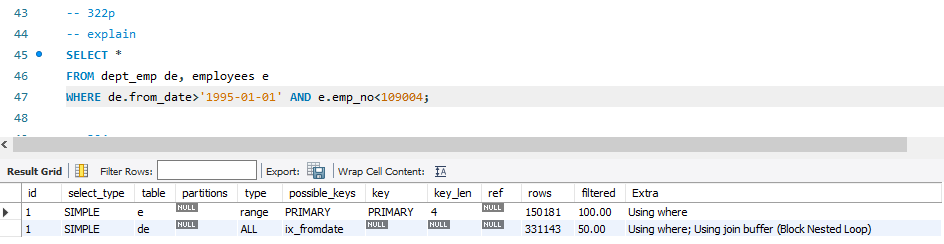

# 고급 최적화

## 9.3.1 옵티마이저 스위치 옵션

- 5.5부터 지원되기 시작

### 9.3.1.1 MRR과 배치 키 액세스

> Multi-Ragne Read => MRR

MySQL에서 여태껏 지원하던 조인 방식은 드라이빙 테이블의 레코드를 한 건 읽고 드리븐 테이블의 일치하는 레코드를 찾아 조인하는 것

**이를 `nested loop join`이라고 부름**

구조상 조인 처리는 MySQL 엔진이 처리하는데 실제 레코드를 검색하고 읽는 부분은 스토리지 엔진이 담당

**이때 드라이빙 테이블의 레코드 건별로 드리븐 테이블의 레코드를 찾으면 레코드를 찾고 읽는 스토리지 엔진에서는 아무런 최적화를 수행할 수가 없다.**

이를 보완하기 위해 조인 대상 테이블 중 하나로부터 레코드를 읽어 조인 버퍼에 버퍼링한다.

즉, 드라이빙 테이블의 레코드를 읽어 버퍼링하고 레코드가 가득 차면 스토리지 엔진으로 한 번에 요청한다.

이렇게 정렬된 순서로 접근해 디스크 데이터 페이지 읽기를 최소화 할 수 있다.

이를 MRR이라하고 MRR을 응용해 실행되는 조인 방식을 BKA(Batched Key Access) 조인이라고 한다.
근데, 기본적으로 BKA는 비활성화 되어있는데 BKA 조인을 사용할 때 부가적 정렬 작업이 필요해지면서 성능에 안좋은 영향을 미치기 때문.

### 9.3.1.2 Block Nested Loop

**조인의 연결 조건이 되는 컬럼에 모두 인덱스가 있는 경우 사용되는 조인 방식**

> Nested Loop 와 Block Nested Loop의 가장 큰 차이

- 조인 버퍼가 사용되는지 여부 (Explain에서 Using Join buffer가 뜸)
- 조인에서 드라이빙 테이블과 드리븐 테이블이 어떤 순서로 조인되느냐

결과가 교재와 다르다..

### 9.3.1.3 Index Condition Pushdown

5.6부터 이 기능이 도입되었다.

너무 비효율적인데 이제서야 개선됐다.

이것도 안된다..!

### 9.3.1.4 인덱스 확장

InnoDB를 사용하는 테이블에서 세컨더리 인덱스에 자동으로 추가된 프라이머리 키를 활용할 수 있게 할지를 결정하는 옵션이다.

별도 정렬 작업 없이 인덱스 순서대로 레코드를 읽기만 함으로써 order by를 만족했다는 결과

### 9.3.1.5 인덱스 머지

**하나의 테이블에 대해 2개 이상의 인덱스를 이용해 쿼리를 처리함**

이 계획은 세부적으로 3가지로 나뉜다.

- index_merge_intersection
- index_merge_sort_union
- index_merge_union

### 9.3.1.6 index_merge_intersection 인덱스 머지 교집합

Using intersect라고 표시된 것은 여러 개의 인덱스를 각각 검색해 그 결과의 교집합만 반환했다는 것이다.

만약 인덱스 머지로 처리되지 않았다면 다음 2가지 방식으로 처리해야 했을 것이다.

- first_name=Georgi 조건만 인덱스를 사용했다면 일치 레코드 253건을 검색한 후 다음 데이터 페이지에서 레코드를 찾고 emp_no 컬럼의 조건에 일치하는 레코드들만 반환하는 형태로 처리
- emp_no between 10000 and 20000 조건만 인덱스를 사용했다면 pk를 이용해 1만건을 읽어와서 first_name=georgi 조건에 일치하는 레코드만 반환하는 형태로 처리돼야 한다

실제 두 조건을 만족하는 레코드는 14건이다. 

ix_firstname 인덱스만 사용했다면 253번의 데이터 페이지를 읽기를 하지만 실제 그중에서 14번만 의미 있는 작업이다.

PRIMARY만 사용했다면 1만건을 읽어 9986건은 버리고 14건만 반환하는 작업이었을 것이다.

즉 위에서 나열한 2가지 방법 모두 비효율이 매우 큰 상황이기에 옵티마이저는 각 인덱스를 검색해 두 결과의 교집합만 찾아 반환한 것이다.

> 스터디질문: 그런데, ix_firstname이 세컨더리 인덱스로 작동하니까 range scan을 하는게 더 효율적이지 않을까?

### 9.3.1.7 index_merge_union 인덱스 머지 합집합

두 인덱스의 결과를 Union 알고리즘으로 병합했다는 것을 의미한다.

우선, 두 집합을 PK로 정렬해서 가져온다.
그리고 PK인 emp_no 컬럼의 값이 중복된 레코드를 제거한 결과를 보여주는데, 우선순위 큐를 이용해 값이 중복된 레코드들을 정렬 없이 걸러낼 수 있다.

### 9.3.1.8 index_merge_sort_union

Where 절을 기준으로 쿼리를 둘로 나누면 우선순위 큐를 이용하는 것이 불가능하다는 것을 알 수 있다.

그래서 두 집합의 결과에서 중복 제거를 위해 각 집합을 emp_no 컬럼으로 정렬한 다음 중복 제거를 수행한다.

### 9.3.1.9 세미조인

다른 테이블과 실제 조인을 수행하지는 않고 단지 다른 테이블에서 조건에 일치하는 레코드가 있는지 없는지만 체크하는 형태의 쿼리를 세미 조인이라고 한다.

5.7은 세미 조인 형태의 쿼리를 최적화하는 부분이 상당히 취약햇다.

세미 조인이 없으면 57건만 읽으면 될 것을 30만건을 넘게 읽어 처리한다.

### 9.3.1.10 테이블 풀-아웃(Table Pull-out)

세미 조인의 서브 쿼리에 사용된 테이블을 아우터 쿼리로 끄집어낸 후에 쿼리를 조인 쿼리로 재작성하는 형태의 최적화이다.

이는 서브쿼리 최적화가 도입되기 이전에 수동으로 쿼리를 튜닝하던 대표적인 방법이었다.

