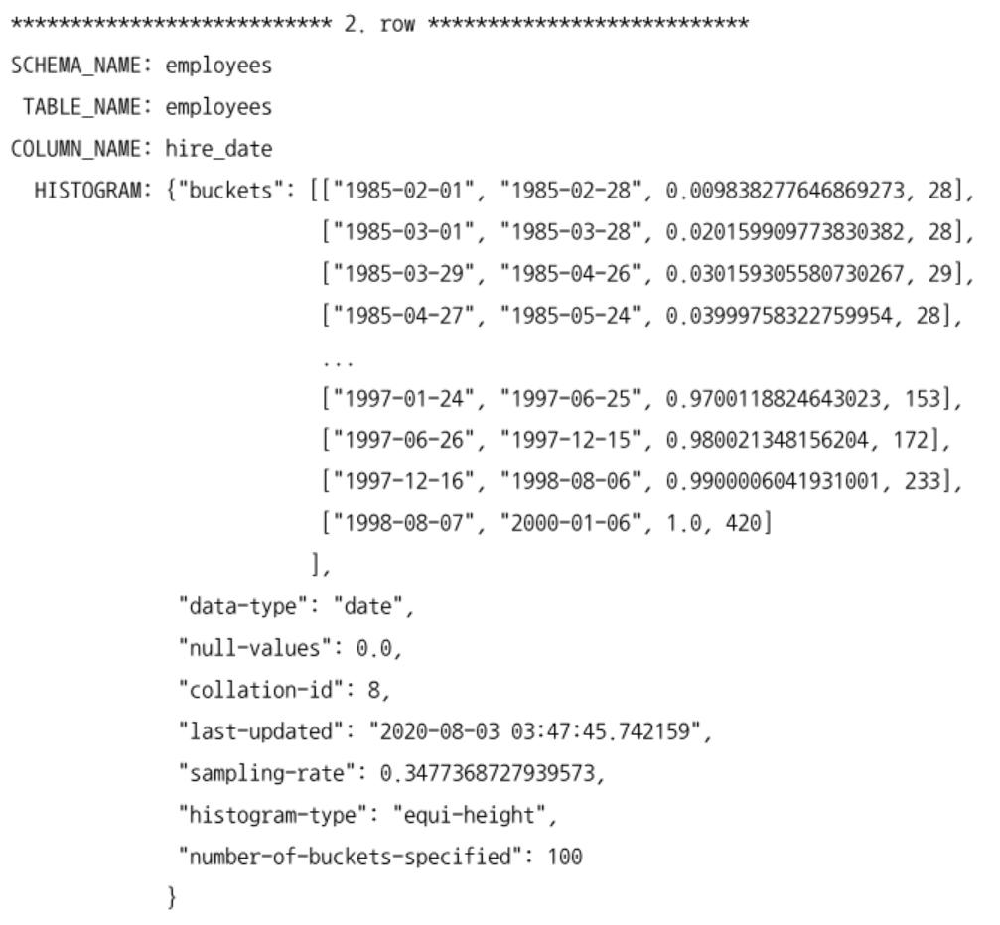

[10.1.1 테이블 및 인덱스 통계 정보](#1011-테이블-및-인덱스-통계-정보)
- [10.1.1.1 MySQL 서버의 통계 정보](#10111-mysql-서버의-통계-정보)

[10.1.2 히스토그램](#1012-히스토그램)
- [10.1.2.1 히스토그램 정보 수집 및 삭제](#10121-히스토그램-정보-수집-및-삭제)
- [10.1.2.2 히스토그램의 용도](#10122-히스토그램의-용도)
- [10.1.2.3 히스토그램과 인덱스](#10123-히스토그램과-인덱스)

[10.1.3 코스트 모델 (Cost Model)](#1013-코스트-모델-cost-model)

# 10.1.1 테이블 및 인덱스 통계 정보
- 통계 정보가 정확하지 않다면 전혀 다른 쿼리를 실행할 수 있다.
  - ex. 1억 건의 레코드가 저장된 테이블의 통계 정보가 갱신되지 않아서 10건 미만인걸로 되어있다면 옵티마이저는 풀 테이블 스캔을 사용할 수 있음

## 10.1.1.1 MySQL 서버의 통계 정보
- MySQL 5.5 버전까지는 각 테이블의 통계 정보가 메모리에만 관리되고, `SHOW INDEX` 명령으로만 테이블의 인덱스 컬럼의 분포도를 볼 수 있었다.
- MySQL 5.6 버전부터는 InnoDB 스토리지 엔진을 사용하는 테이블에 대한 통계 정보를 영구적으로 관리할 수 있게 개선되었다.
  - `innodb_index_stats` `innodb_table_stats` 테이블로 관리
  - MySQL 서버가 재시작돼도 기존의 통계 정보를 유지할 수 있게 되었다.
    
  - 테이블을 생성할 때 STATS_PERSISTENT 옵션을 설정해서 테이블 단위로 영구적인 통계 정보를 보관할지 결정
    ```sql
      CREATE TABLE tab_test (fd1 INT, fd2 VARCHAR(20), PRIMARY KEY(fd1))
      ENGINE=InnoDB
      STATS_PERSISTENT= { DEFAULT | 0 | 1 }
    ```
    - `STATS_PERSISTENT = 0`: MySQL 5.5버전 까지의 방식 사용
    - `STATS_PERSISTENT = 1`: 테이블의 통계 정보를 `innodb_index_stats` `innodb_table_stats` 테이블로 관리
    - `STATS_PERSISTENT = DEFAULT`: STATS_PERSISTENT = 0일 때와 동일

innodb_stats_persistent 시스템 설정 변수는 기본적으로 ON(1)로 설정되어 있다.
STATS_PERSISTENT 옵션 없이 테이블을 생성하면 영구적인 통계 정보를 사용하면서 `innodb_index_stats` `innodb_table_stats` 테이블에 통계 정보를 저장한다?
- 그렇다면 `innodb_stats_persistent` == `STATS_PERSISTENT` 라고 할 수는 없겠고
- `STATS_PERSISTENT = 1`이면 테이블로 통계 정보를 관리하지만 영구적인건 아니다?
- `innodb_stats_persistent = 1`이면 테이블로 통계 정보를 영구적으로 관리한다?

MySQL 5.5 버전까지는 테이블의 통계 정보가 메모리에만 저장되었고, MySQL 서버 재시작 시 초기화되었다.
아래 이벤트 발생 시 통계 정보가 자동으로 갱신되었다.
- 테이블이 새로 오픈되는 경우
- 테이블의 레코드가 대량으로 변경되는 경우 (테이블의 전체 레코드 중에서 1/16 정도의 UPDATE 또는 INSERT나 DELETE가 실행되는 경우)
- ANALYZE TABLE 명령이 실행되는 경우
- SHOW TABLE STATUS 명령이나 SHOW INDEX FROM 명령이 실행되는 경우
- InnoDB 모니터가 활성화되는 경우
- innodb_stats_on_metadata 시스템 설정이 ON인 상태에서 SHOW TABLE STATUS 명령이 실행되는 경우

-> 이렇게 자주 테이블의 통계 정보가 갱신되면 옵티마이저가 쿼리 실행을 갑자기 다른 방식으로 하게될 수도 있다.
- 영구적인 통계 정보가 도입되면서 의도하지 않은 통계 정보 변경을 막을 수 있게 되었다.
- `innodb_stats_audo_recalc` 시스템 설정 변수를 OFF로 변경하여 자동으로 갱신되는 것을 막을 수 있다.
- `STATS_AUTO_RECALC` 옵션을 이용해서 테이블 단위로 조정할 수도 있다.
  - `STATS_AUTO_RECALC = 1`: 테이블의 통계 정보를 MySQL 5.5 이전의 방식대로 자동 수집한다.
  - `STATS_AUTO_RECALC = 0`: 테이블의 통계 정보는 ANALYZE TABLE 명령을 실행할 때만 수집된다.
  - `STATS_AUTO_RECALC = DEFAULT`: STATS_AUTO_RECALC = 1일 때와 동일

MySQL 5.5버전에서는 테이블의 통계 정보를 수집할 때 몇 개의 InnoDB 테이블 블록을 샘플링할지 결정하는 옵션으로 `innodb_stats_sample_pages` 시스템 변수가 제공되었다.
- MySQL 5.6부터는 없어졌고, `innodb_stats_transient_sample_pages` `innodb_stats_persistent_sample_pages` 시스템 변수 2개로 분리되었다.
  - `innodb_stats_transient_sample_pages`: 자동으로 통계 정보 수집이 실행될 때 8개 페이지만 임의로 샘플링해서 분석하고 그 결과를 통계 정보로 활용함을 의미, 기본값은 8
  - `innodb_stats_persistent_sample_pages`: ANALYZE TABLE 명령이 실행되면 임의로 20개 페이지만 샘플링해서 분석하고 그 결과를 영구적인 통계 정보 테이블에 저장하고 활용함을 의미, 기본값은 20

- 영구적인 통계 정보를 사용한다면 MySQL 서버의 점검이나 사용량이 많지 않은시간을 이용해서 더 정확한 통계 정보를 수집할 수도 있다.
  - 많은 시간은 소요되겠지만 정확성에 의해 쿼리의 성능이 결정되기 때문에 가치가 있음
  - 더 정확한 통계 정보를 수집하려면 `innodb_stats_persistent_sample_pages` 시스템 변수를 높은 값으로 설정한다.
    - 값이 커질수록 많은 시간이 소요되므로 주의

# 10.1.2 히스토그램
## 10.1.2.1 히스토그램 정보 수집 및 삭제
- MySQL 8.0 버전에서 히스토그램 정보는 컬럼 단위로 관리된다.
  - 자동으로 수집되지 않고, `ANALYZE TABLE ... UPDATE HISTOGRAM` 명령을 실행해서 수동으로 수집 및 관리된다.
- 수집된 히스토그램 정보는 시스템 딕셔너리에 함께 저장되고, MySQL 서버가 시작될 때 히스토그램 정보를 `information_schema` 데이터베이스의 `column_statistics` 테이블로 로드한다.
```sql
  ANALYZE TABLE employees.employees
  UPDATE HISTOGRAM ON gender, hire_date;
```

```sql
  SELECT *
  FROM COLUMN_STATISTICS
  WHERE SCHEMA_NAME='employees'
    AND TABLE_NAME='employees'
```


MySQL 8.0 버전에서는 2종류의 히스토그램 타입이 지원된다.
- Singleton (싱글톤 히스토그램)
  
  - 비율이 누적된 값으로 표시된다.
  - 컬럼값 개별로 레코드 건수를 관리하는 히스토그램
  - Value-Based 히스토그램 or 도수 분포라고도 함
  - 컬럼이 가지는 값별로 버킷이 할당된다.
  - 각 버킷이 컬럼의 값과 발생 빈도비율, 2개 값을 가진다.
- Equi-Height (높이 균형 히스토그램)
  
  - 비율이 누적된 값으로 표시된다.
  - 비율이 같은 수준으로 나오도록 hire_date가 선택되었다.
  - 컬럼값의 범위를 균등한 갯수로 구분해서 관리하는 히스토그램
  - Height-Balanced 히스토그램이라고도 함
  - 갯수가 균등한 컬럼값의 범위별로 하나의 버킷이 할당된다.
  - 각 버킷이 범위 시작 값과 마지막 값, 발생 빈도율과 각 버킷에 포함된 유니크한 값의 갯수, 4개 값을 가진다.

생성된 히스토그램을 삭제할 수 있다.
```sql
  ANALYZE TABLE employees.employees
  DROP HISTOGRAM ON gender, hire_date;
```
- 테이블의 데이터를 참조하는 것이 아니고 딕셔너리의 내용만 삭제하기 때문에 다른 쿼리 처리의 성능에 영향을 주지 않고, 즉시 완료된다.
- 히스토그램이 삭제되면 쿼리의 실행 계획이 달라질 수 있어 주의해야 한다.
- 히스토그램을 삭제하지 않고, MySQL 옵티마이저가 사용을 못하게 할 수 있다.
  - `SET GLOBAL optimizer_switch='condition_fanout_filter=off';`
  - 특정 커넥션 or 쿼리에서만 히스토그램을 사용하지 않으려면
    ```sql
      -- 현재 커넥션에서 실행되는 쿼리만 사용하지 않음
      SET SESSION optimizer_switch='condition_fanout_filter=off';

      -- 현재 쿼리만 사용하지 않음
      SELECT /*+ SET_VAR(optimizer_switch='condition_filter=off') */ *
      FROM table;
    ```

## 10.1.2.2 히스토그램의 용도
- 실제 응용 프로그램의 데이터는 항상 균등한 분포도를 가지지 않는다.
  - MySQL 서버의 기존 통계 정보는 이런 부분을 고려하지 않았다.
  - 이러한 단점 보완을 위해 히스토그램 도입
- 특정 컬럼이 가지는 모든 값에 대한 분포도 정보를 가지지는 않지만 각 버킷별로 레코드의 건수와 유니크한 값의 갯수 정보를 가지기 때문에 훨씬 정확한 예측이 가능하다.

```sql
  EXPLAIN
  SELECT *
  FROM employees
  WHERE first_name='Zita'
    AND birth_date BETWEEN '1950-01-01' AND '1960-01-01';
```


```sql
  ANALYZE TABLE employees
  UPDATE histogram ON first_name, birth_date;

  EXPLAIN
  SELECT *
  FROM employees
  WHERE first_name='Zita'
    AND birth_date BETWEEN '1950-01-01' AND '1960-01-01';
```

- 히스토그램 정보가 없으면 옵티마이저는 데이터가 균등하게 분포되어 있을 것으로 예측한다.
- 히스토그램 정보가 있으면 특정 범위의 데이터가 많고 적음을 식별할 수 있다.
- 쿼리의 성능에 많은 영향을 미칠 수 있음
  

## 10.1.2.3 히스토그램과 인덱스
- MySQL 서버에서는 쿼리의 실행 계획을 수립할 때 사용 가능한 인덱스들로부터 조건절에 일치하는 레코드 건수를 대략 파악하고 실행 계획을 선택한다.
  - 이때 조건절에 일치하는 레코드 건수를 예측하기 위해 옵티마이저는 B-Tree를 샘플링해서 살펴본다.
  - 이 작업을 인덱스 다이브 (Index Dive)라고 한다.
- 인덱스 다이브 작업은 어느 정도의 비용이 필요하며, 때로는 (IN 절에 값이 많이 명시된 경우) 실행 계획 수립만으로도 상당한 인덱스 다이브를 실행하고 비용도 커진다.

# 10.1.3 코스트 모델 (Cost Model)
MySQL 서버가 쿼리를 처리하려면 다양한 작업을 필요로 한다.
- 디스크로부터 데이터 페이지 읽기
- 메모리 (InnoDB 버퍼 풀)로부터 데이터 페이지 읽기
- 인덱스 키 비교
- 레코드 평가
- 메모리 임시 테이블 작업
- 디스크 임시 테이블 작업

MySQL 서버는 사용자의 쿼리에 대해 작업이 얼마나 필요한지 예측하고 전체 작업 비용을 계산한 결과를 바탕으로 최적의 실행 계획을 갖는다.
- 전체 쿼리의 비용을 계산하는데 필요한 단위 작업들의 비용을 코스트 모델이라고 한다.
- MySQL 5.7 이전까지는 작업들의 비용을 MySQL 서버 소스 코드에 상수화해서 사용했다.
  - MySQL 서버가 사용하는 하드웨어에 따라 달라질 수 있으므로 비효율
- MySQL 5.7 부터 작업의 비용을 DBMS 관리자가 조정할 수 있게 개선되었다.
  - 인덱스되지 않은 컬럼의 데이터 분포나 메모리에 상주 중인 페이지의 비율 등 비용 계산과 연관된 부분의 정보가 부족했다.
- MySQL 8.0 버전부터는 컬럼의 데이터 분포를 위한 히스토그램과 각 인덱스별 메모리에 적재된 페이지 비율이 관리되고, 옵티마이저 실행 계획 수립에 사용되었다.

MySQL 8.0 서버의 코스트 모델은 2개 테이블에 저장되어 있는 설정값을 이용한다.
- `server_cost`: 인덱스를 찾고 레코드를 비교하고 임시 테이블 처리에 대한 비용 관리
- `engine_cost`: 레코드를 가진 데이터 페이지를 가져오는데 필요한 비용 관리
- 2개 모두 MySQL DB에 존재한다.
- 공통된 컬럼을 갖고 있다.
  - cost_name: 코스트 모델의 각 단위 작업
  - default_value: 각 단위 작업의 비용
  - cost_value: DBMS 관리자가 설정한 값
  - last_updated: 단위 작업의 비용이 변경된 시점
  - comment: 비용에 대한 추가 설명
- engine_cost 테이블의 추가 컬럼
  - engine_name: 비용이 적용된 스토리지 엔진
    - 스토리지 엔진별로 각 단위 작업의 비용을 설정할 수 있음
  - device_type: 디스크 타입

MySQL 서버에서 각 실행 계획의 계산된 비용 확인
```sql
  EXPLAIN FORMAT=TREE
    SELECT *
    FROM employees WHERE first_name='Matt'
```

```sql
  EXPLAIN FORMAT=JSON
    SELECT *
    FROM employees WHERE first_name='Matt'
```

- 코스트 모델에서 중요한 것은 각 단위 작업에 설정되는 비용 값이 커지면 어떤 실행 계획들이 고비용으로 바뀌고 어떤 실행 계획들이 저비용으로 바뀌는지 파악하는 것이다.
- 각 단위 작업의 비용이 변경될 때 예상할 수 있는 결과들
  - key_compare_cost 비용을 높이면 MySQL 서버 옵티마이저가 가능하면 정렬을 수행하지 않는 방향의 실행 계획을 선택할 가능성이 높아진다.
  - row_evaluate_cost 비용을 높이면 풀 스캔을 실행하는 쿼리들의 비용이 높아지고, MySQL 서버 옵티마이저는 가능하면 인덱스 레인지 스캔을 사용하는 실행 계획을 선택할 가능성이 높아진다.
  - disk_template_create_cost와 disk_template_row_cost 비용을 높이면 MySQL 옵티마이저는 디스크에 임시 테이블을 만들지 않는 방향의 실행 계획을 선택할 가능성이 높아진다.
  - memory_template_create_cost와 memory_template_row_cost 비용을 높이면 MySQL 옵티마이저는 메모리 임시 테이블을 만들지 않는 방향의 실행 계획을 선택할 가능성이 높아진다.
  - io_block_read_cost 비용이 높아지면 MySQL 옵티마이저는 가능하면 InnoDB 버퍼 풀에 데이터 페이지가 많이 적재되어 있는 인덱스를 사용하는 실행 계획을 선택할 가능성이 높아진다.
  - memory_block_read_cost 비용이 높아지면 MySQL 서버는 InnoDB 버퍼 풀에 적재된 데이터 페이지가 상대적으로 적다고 해도그 인덱스를 사용할 가능성이 높아진다.
