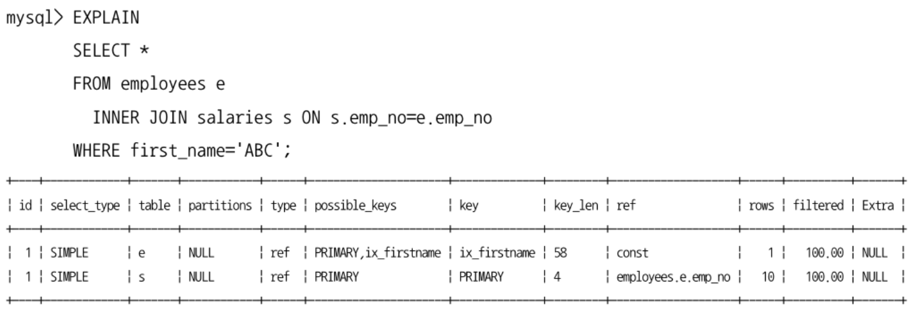
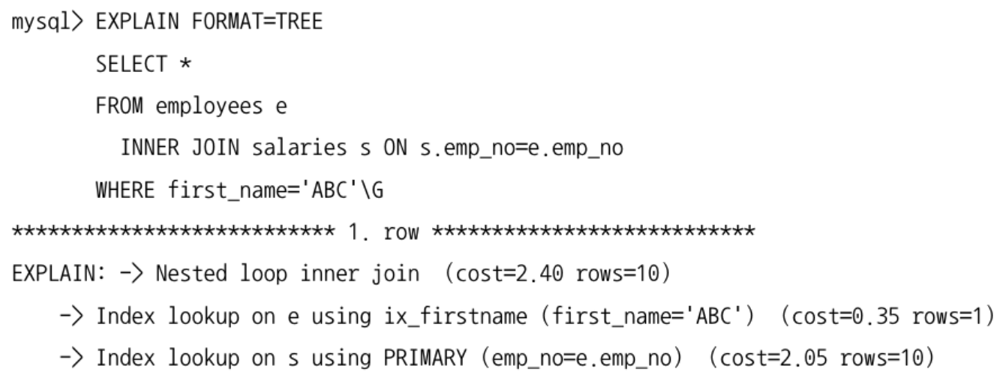
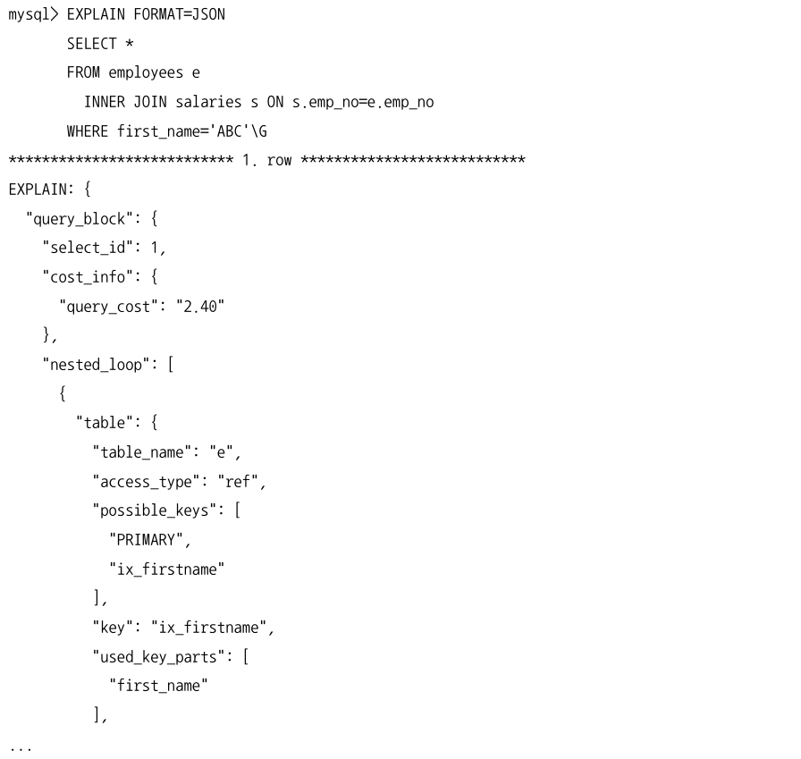
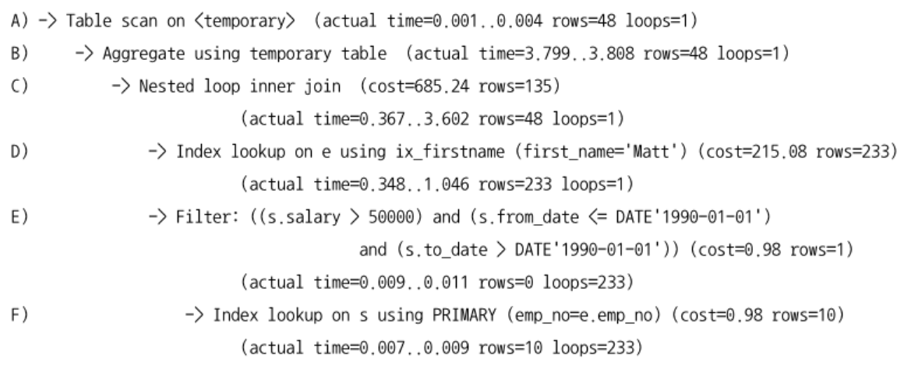

[10.2.1 실행 계획 출력 포맷](#1021-실행-계획-출력-포맷)

[10.2.2 쿼리의 실행 시간 확인](#1022-쿼리의-실행-시간-확인)

# 10.2.1 실행 계획 출력 포맷
- ~ MySQL 8.0
  - `EXPLAIN EXTENDED` or `EXPLAIN PARTITIONS` 명령이 구분되어 있었다.
- MySQL 8.0 ~
  - 모든 내용이 통합되어 보이도록 개선되어 `EXTENDED` `PARTITIONS` 옵션은 문법에서 제거
  - `FORMAT` 옵션을 사용해 실행 계획의 표시 방법을 `JSON` `TREE` `단순 테이블` 형태로 선택

## 테이블 포맷 표시


## TREE 포맷 표시


## JSON 포맷 표시


# 10.2.2 쿼리의 실행 시간 확인
- MySQL 8.0.18 부터는 쿼리의 실행 계획과 단계별 소요된 시간 정보를 확인할 수 있는 EXPLAIN ANALYZE 기능이 추가되었다.
  - SHOW PROFILE 명령으로도 확인이 가능하지만 단계별 소요 시간은 확인할 수 없다.
  - 결과가 항상 TREE 포맷으로 보여주기 때문에 FORMAT 옵션을 사용할 수 없다.

```sql
  EXPLAIN ANALYZE
    SELECT e.emp_no, avg(s.salary)
    FROM employees e
      INNER JOIN salaries s ON s.emp_no=e.emp_no
        AND s.salary>50000
        AND s.from_date<='1990-01-01'
        AND s.to_date>'1990-01-01'
    WHERE e.first_name='Matt'
    GROUP BY e.hire_date \G
```

- 들여쓰기가 같은 레벨에서는 상단에 위치한 라인이 먼저 실행
- 들여쓰기가 다른 레벨에서는 가장 안쪽에 위치한 라인이 먼저 실행

위 쿼리의 실행 순서
1. D) employees 테이블의 ix_firstname 인덱스를 통해 first_name='Matt'에 일치하는 레코드 검색
2. F) salaries 테이블의 PK를 통해 emp_no가 1번 결과의 emp_no와 일치한 레코드 검색
3. E) `s.salary>50000` and `s.from_date<='1990-01-01'` and `s.to_date>'1990-01-01'` 조건에 일치하는 레코드 검색
4. C) 1, 3 결과를 조인
5. B) 임시 테이블에 결과를 저장해서 GROUP BY 집계 실행
6. A) 임시 테이블의 결과를 읽어서 결과 반환

- 실행 시간이 아주 많이 걸리는 쿼리라면 EXPLAIN ANALYZE 명령을 사용하면 쿼리가 완료되어야 결과를 확인할 수 있다.
- 실행 계획이 아주 나쁜 경우라면 EXPLAIN 명령으로 먼저 실행 계획만 확인하고 튜닝한 후 EXPLAIN ANALYZE 명령을 실행하는 것이 좋다.
