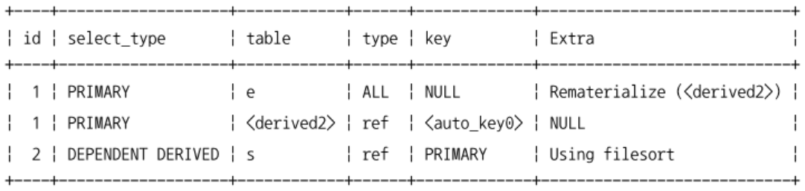

[10.3 실행 계획 분석](#103-실행-계획-분석)
- [10.3.1 id 컬럼](#1031-id-컬럼)
- [10.3.2 select_type 컬럼](#1032-select_type-컬럼)
- [10.3.3 table 컬럼](#1033-table-컬럼)
- [10.3.4 partitions 컬럼](#1034-partitions-컬럼)
- [10.3.5 type 컬럼](#1035-type-컬럼)
- [10.3.6 possible_keys 컬럼](#1036-possible_keys-컬럼)
- [10.3.7 key 컬럼](#1037-key-컬럼)
- [10.3.8 key_len 컬럼](#1038-key_len-컬럼)
- [10.3.9 ref 컬럼](#1039-ref-컬럼)
- [10.3.10 rows 컬럼](#10310-rows-컬럼)
- [10.3.11 filtered 컬럼](#10311-filtered-컬럼)
- [10.3.12 Extra 컬럼](#10312-extra-컬럼)

# 10.3 실행 계획 분석
- MySQL 8.0부터 실행 계획의 포맷을 `테이블` `JSON` `TREE` 형태로 선택할 수 있다.
- 실행 계획이 어떤 접근 방법을 사용해서 어떤 최적화를 수행하는지, 어떤 인덱스를 사용하는지 등을 이해하는 것이 중요하다.

## 10.3.1 id 컬럼
- 단위 SELECT 쿼리별로 부여되는 식별자 값
  - 하나의 SELECT 문장에 여러개의 테이블을 조인하면 테이블의 갯수만큼 실행 계획 레코드가 출력되지만 id 값은 같다.
    
  - 쿼리 문장이 여러개의 단위 SELECT 쿼리로 구성되어 있으면 다른 id 값을 부여한다.
    

## 10.3.2 select_type 컬럼
- 각 단위 SELECT 쿼리가 어떤 타입의 쿼리인지 표시되는 컬럼

### 10.3.2.1 SIMPLE
- UNION이나 서브쿼리를 사용하지 않는 단순한 SELECT
- 실행 계획에서 하나만 존재하고, 일반적으로 제일 바깥 SELECT 쿼리가 해당

### 10.3.2.2 PRIMARY
- UNION이나 서브쿼리를 가지는 SELECT 쿼리의 실행 계획에서 가장 바깥쪽에 있는 단위 쿼리는 PRIMARY로 표시된다.
- 실행 계획에서 하나만 존재하고, 제일 바깥쪽의 SELECT 쿼리가 해당

### 10.3.2.3 UNION
- UNION으로 결합하는 단위 SELECT 쿼리 중 첫 번째를 제외한 SELECT
  - 첫 번째 SELECT는 UNION되는 쿼리 결과들을 모아서 저장하는 임시 테이블 (DERIVED)으로 표시

### 10.3.2.4 DEPENDENT UNION
- UNION or UNION ALL로 집합을 결합하는 쿼리에서 표시
- DEPENDENT는 UNION or UNION ALL로 결합된 단위 쿼리가 외부 쿼리에 의해 영향을 받는 것을 의미
```sql
  EXPLAIN
    SELECT *
    FROM employees e1 WHERE e1.emp_no IN (
      SELECT e2.emp_no FROM employees e2 WHERE e2.first_name='Matt'
      UNION
      SELECT e3.emp_no FROM employees e3 WHERE e3.last_name='Matt'
    );
```
- 외부의 employees 테이블을 먼저 읽은 다음 서브쿼리를 실행한다.
  - 이때 employees 테이블의 컬럼 값이 서브쿼리에 영향을 준다.

### 10.3.2.5 UNION RESULT
- UNION 결과를 담아두는 테이블
- MySQL 8.0 이전에는 UNION UNION ALL 모두 임시 테이블로 생성했다.
- MySQL 8.0버전부터 UNION ALL은 임시 테이블을 사용하지 않도록 개선되었다.
  - UNION은 여전히 임시 테이블에 결과를 버퍼링한다.
- 실제 쿼리에서 단위 쿼리가 아니기 때문에 id가 부여되지 않는다.
```sql
  EXPLAIN
    SELECT emp_no FROM salaries WHERE salary>100000
    UNION DISTINCT
    SELECT emp_no FROM dept_emp WHERE from_date>'2001-01-01';
```

- table 컬럼의 `<union1,2>`는 id가 1, 2인 쿼리 결과를 union했다는 것을 의미한다.

### 10.3.2.6 SUBQUERY
- FROM절 이외에서 사용되는 서브쿼리만 해당
- FROM절에 사용된 서브쿼리는 DERIVED로 표시된다.

### 10.3.2.7 DEPENDENT SUBQUERY
- 서브쿼리가 바깥쪽 SELECT 쿼리에서 정의된 컬럼을 사용하는 경우 표시된다.
```sql
  EXPLAIN
    SELECT e.first_name,
      ( SELECT COUNT(*)
        FROM dept_emp de, dept_manager dm
        WHERE dm.dept_no=de.dept_no AND de.emp_no=e.emp_no ) AS cnt
    FROM employees e
    WHERE e.first_name='Matt';
```

- 외부 쿼리가 먼저 수행된 후 내부 쿼리가 실행돼야 하므로 일반 서브쿼리보다는 처리 속도가 느릴 때가 많다.

### 10.3.2.8 DERIVED
- 단위 SELECT 쿼리릐 실행 결과로 메모리나 디스크에 임시 테이블을 생성하는 것을 의미
- DERIVED일 때 생성되는 임시 테이블을 파생 테이블이라고도 한다.
- ~ MySQL 5.5
  - 서브쿼리가 FROM절에 사용되면 select_type은 항상 DERIVED이었다.
  - 임시 테이블에는 인덱스가 없으므로 다른 테이블과 조인할때 성능상 불리할 때가 많다.
- MySQL 5.6 ~
  - 옵티마이저 옵션에 따라 FROM절의 서브쿼리를 외부 쿼리와 통합하는 형태의 최적화가 수행되기도 한다.
  - 임시 테이블에도 인덱스를 추가해서 만들 수 있게 최적화되었다.
- MySQL 8.0 부터는 FROM절의 서브쿼리에 대한 최적화도 많이 개선되어 가능하다면 불필요한 서브쿼리는 조인으로 쿼리를 재작성해서 처리한다.
  - 옵티마이저가 처리할 수 있는 것은 한계가 있으므로 최적화된 쿼리를 작성하는 것은 중요하다.

### 10.3.2.9 DEPENDENT DERIVED
- MySQL 8.0 이전에는 FROM 절의 서브쿼리는 외부 컬럼을 사용할 수 없었다.
- MySQL 8.0 부터는 레터럴 조인 기능이 추가되어 FROM절의 서브쿼리에서도 외부 컬럼을 참조할 수 있게 되었다.
```sql
  SELECT *
  FROM employees e
  LEFT JOIN LATERAL
    ( SELECT *
      FROM salaries s
      WHERE s.emp_no=e.emp_no
      ORDER BY s.from_date DESC LIMIT 2 ) AS s2
    ON s2.emp_no=e.emp_no;
```

- LATERAL 키워드를 사용해야 하며, 사용하지 않고 외부 컬럼을 참조하면 오류가 발생한다.

### 10.3.2.10 UNCACHEABLE SUBQUERY
- 서브쿼리에 포함된 요소에 의해 캐시가 불가능한 쿼리
- 조건이 똑같은 서브쿼리가 실행될 때는 다시 실행하지 않고 이전의 실행 결과를 그대로 사용할 수 있도록 내부적인 캐시 공간에 담는다.
  - 쿼리 캐시나 파생 테이블과는 다른 기능


- SUBQUERY는 바깥쪽의 영향을 받지 않으므로 처음 한 번만 실행해서 그 결과를 캐시하고 필요할 때 캐시된 결과를 이용한다.
- DEPENDENT SUBQUERY는 의존하는 바깥쪽 쿼리의 컬럼의 값 단위로 캐시해두고 사용한다.

#### SUBQUERY vs UNCACHEABLE SUBQUERY
캐시를 사용할 수 있냐 없냐의 차이가 있다.
캐시를 사용 못하는 경우
- 사용자 변수가 서브쿼리에 사용된 경우
- NOT-DETERMINISTIC 속성의 스토어드 루틴이 서브쿼리 내에 사용된 경우
- UUID, RAND와 같이 결괏값이 호출할 때마다 달라지는 함수가 서브쿼리에 사용된 경우

### 10.3.2.11 UNCACHEABLE UNION
- union을 사용하는 쿼리의 요소에 의해 캐시가 불가능한 경우

### 10.3.2.12 MATERIALIZED
- FROM절이나 IN(subquery) 형태의 쿼리에 사용된 서브쿼리의 최적화를 위해 사용된다.
```sql
  EXPLAIN
    SELECT *
    FROM employees e
    WHERE e.emp_no IN ( SELECT emp_no FROM salaries WHERE salary BETWEEN 100 AND 1000 );
```

- MySQL 5.6 까지는 employees 테이블을 읽어서 레코드마다 서브쿼리가 실행되는 형태로 처리되었다.
- MySQL 5.7 부터는 서브쿼리의 내용을 임시 테이블로 구체화한 후 임시 테이블과 employees 테이블을 조인하는 형태로 최적화되어 처리된다.

## 10.3.3 table 컬럼
- 실행 계획은 테이블 기준으로 표시된다.
- 테이블의 이름에 별칭이 부여된 경우에는 별칭이 표시된다.
```sql
  EXPLAIN SELECT NOW();
  EXPLAIN SELECT NOW() FROM DUAL;
```

- 첫 번째 쿼리는 FROM절 자체가 없다.
- 두 번째 쿼리는 실제로는 없는 DUAL 테이블을 사용한다.
  - 오류를 발생시키지는 않고 테이블이 있는것처럼 작동한다.
  - MySQL 옵티마이저는 FROM DUAL 부분을 제거하고 첫 번째 쿼리와 동일하게 변형시켜서 처리한다.
- 둘다 table 컬럼에 NULL이 표시된다.


- `<>`가 사용된 이름은 임시 테이블을 의미한다.
  - `<>` 내에 표시되는 숫자는 SELECT 쿼리의 id 값을 가리킨다.
- id=2인 쿼리가 먼저 실행되어 결과가 파생 테이블로 저장되었고, 생성된 파생 테이블과 e 테이블이 조인되는 쿼리임을 알 수 있다.
- id=1인 쿼리 중 먼저 표시된 <derived2> 테이블이 드라이빙 테이블이 되고, e 테이블이 드리븐 테이블이 된다.

## 10.3.4 partitions 컬럼
- MySQL 5.7 까지는 옵티마이저가 사용하는 파티션들의 목록은 EXPLAIN PARTITION 명령으로 확인이 가능했다.
- MySQL 8.0 부터는 EXPLAIN 명령으로 파티션 관련 실행 계획까지 모두 확인할 수 있다.

```sql
  -- 파티션 테이블 생성
  CREATE TABLE employees_2 (
    emp_no int NOT NULL,
    birth_date DATE NOT NULL,
    first_name VARCHAR(14) NOT NULL,
    last_name VARCHAR(16) NOT NULL,
    gender ENUM('M', 'F') NOT NULL,
    hire_date DATE NOT NULL,
    PRIMARY KEY (emp_no, hire_date)
  ) PARTITION BY RANGE COLUMNS(hire_date)
  (PARTITION p1986_1990 VALUES LESS THAN ('1990-01-01'),
  PARTITION p1991_1995 VALUES LESS THAN ('1996-01-01'),
  PARTITION p1996_2000 VALUES LESS THAN ('2000-01-01'),
  PARTITION p2001_1995 VALUES LESS THAN ('2006-01-01'));

  INSERT INTO employees_2 SELECT * FROM employees;
```
```sql
  EXPLAIN
    SELECT *
    FROM employees_2
    WHERE hire_date BETWEEN '1999-11-15' AND '2000-01-15';
```

- 위 쿼리에서 조회할 데이터는 p1996_2000, p2001_2005 파티션에 저장되어 있음을 알 수 있다.
- 옵티마이저는 쿼리의 hire_date 컬럼 조건을 확인하고, 필요로 하는 파티션을 알아낸다.
  - 나머지 파티션에 대해서는 분석을 하지 않음
- 파티션이 여러 개인 테이블에서 불필요한 파티션을 빼고 쿼리를 수행하기 위해 접근할 테이블만 골라내는 과정을 `파티션 프루닝`이라고 한다.
- type 컬럼의 값이 ALL인 것은 풀 테이블 스캔으로 쿼리가 처리되었다는 것을 의미한다.
  - MySQL을 포함한 대부분의 RDBMS에서 지원하는 파티션은 물리적으로 개별 테이블처럼 별도의 저장 공간을 가지기 때문이다.
  - 따라서 조회 대상인 p1996_2000, p2001_2005 파티션에 대해서만 풀 스캔을 진행한다.

## 10.3.5 type 컬럼
- MySQL 서버가 각 테이블의 레코드를 어떤 방식으로 읽었는지를 나타낸다.
  - 레코드를 읽을 때 인덱스를 사용했는지, 풀 테이블 스캔을 사용했는지 등
  - 쿼리를 튜닝할 때 인덱스를 효율적으로 사용하는지 확인하는 것이 중요하므로 반드시 체크해야 할 정보
- 아래 소제목들은 일반적으로 성능이 빠른 순서
  - 실제로 데이터의 분포나 레코드의 건수에 따라 달라질 수는 있음

### 10.3.5.1 system
> 레코드가 1건 이하로 존재하는 테이블을 참조하는 형태의 접근방법

- MyISAM이나 MEMORY 테이블에서만 사용되는 접근 방법

### 10.3.5.2 const
> 테이블의 레코드 건수와 관계없이 쿼리가 PK나 유니크 키 컬럼을 이용하는 where 조건절을 갖고 있으며, 반드시 1건을 반환하는 쿼리의 처리 방식


- 유니크 인덱스 스캔이라고도 표현한다.
- 다중 컬럼으로 구성된 PK나 유니크 키 중에서 인덱스의 일부 컬럼만 조건으로 사용되는 경우 const 타입 접근 방법 사용이 불가능하다.
  - 실제 레코드가 1건만 저장되어 있더라도 MySQL 엔진이 이를 확신할 수 없기 때문
  - type 컬럼에 ref로 표시된다.
- MySQL 옵티마이저가 쿼리를 최적화하는 단계에서 먼저 실행해서 상수화한다.
  ```sql
    EXPLAIN
      SELECT COUNT(*)
      FROM employees e1
      WHERE first_name=(SELECT first_name FROM employees e2 WHERE emp_no=100001);
  ```
  

### 10.3.5.3 eq_ref
- 여러 테이블이 조인되는 쿼리의 실행 계획에서만 표시된다.
- 조인에서 처음 읽은 테이블의 컬럼 값을 다음 읽을 테이블의 PK나 유니크 키 컬럼의 검색 조건에 사용될 때 사용된다.
  - 두 번째 이후에 읽는 테이블의 type 컬럼에 eq_ref가 표시된다.
  - 두 번째 이후의 테이블을 유니크 키로 검색할 때 유니크 인덱스는 NOT NULL이어야 한다.
- 다중 컬럼으로 만들어진 PK나 유니크 인덱스라면 인덱스의 모든 컬럼이 비교 조건에 사용되어야 한다.
- 두 번째 이후에 읽는 테이블에서 반드시 1건만 존재한다는 보장이 있어야 사용할 수 있다.

```sql
  EXPLAIN
    SELECT *
    FROM dept_emp de, employees e
    WHERE e.emp_no=de.emp_no AND de.dept_no='d005';
```


### 10.3.5.4 ref
> 인덱스의 종류와 관계없이 동등(equal) 조건으로 검색될 때 사용된다.

- 조인의 순서와 관계없이 사용된다.
- PK나 유니크 키 등의 제약 조건이 없다.
- 반환되는 레코드가 반드시 1건이라는 보장이 없으므로 const, eq_ref보다 빠르지 않다.
- 동등 조건으로만 비교되므로 빠른 레코드 조회 방법
```sql
  EXPLAIN
    SELECT *
    FROM dept_emp
    WHERE dept_no='d005';
```

- PK의 일부만 where에 명시되었기 때문에 레코드가 1건이라는 보장이 없어서 const 대신 ref가 사용됨
- ref 컬럼의 const 값은 값 비교에 사용된 입력값이 상수라는 뜻 ('d005')

const, eq_req, ref 모두 where절에 동등 비교 연산자를 사용해야 한다.

### 10.3.5.5 fulltext
> MySQL 서버의 full-text search 인덱스를 사용해 레코드를 읽는 접근 방법

- 통계 정보가 관리되지 않으며, full-text search 인덱스를 사용하려면 전혀 다른 SQL 문법을 사용해야 한다.
- MySQL 서버에서 전문 검색 조건은 우선순위가 높다.
  - 인덱스의 접근 방법이 const나 eq_ref, ref가 아니면 전문 인덱스를 사용하는 조건을 선택해서 처리한다.
- `MATCH (...) AGAINST (...)` 구문을 사용해서 실행한다.
  - 이때 반드시 해당 테이블에 전문 검색용 인덱스가 준비되어 있어야 한다.
    ```sql
      CREATE TABLE employee_name (
        emp_no int NOT NULL,
        first_name varchar(14) NOT NULL,
        last_name varchar(16) NOT NULL,
        PRIMARY KEY(emp_no),
        FULLTEXT KEY fx_name (first_name, last_name) WITH PARSER ngram
      ) ENGINE=InnoDB;

      EXPLAIN
        SELECT *
        FROM employee_name
        WHERE emp_no=10001
          AND emp_no BETWEEN 10001 AND 10005
          AND MATCH(first_name, last_name) AGAINST('Facello' ON BOOLEAN MODE);
    ```
    
    - employee_name 테이블의 PK를 1건만 조회하는 const 타입의 조건
    - range 타입의 조건
    - fulltext 타입의 조건
    ```sql
      EXPLAIN
        SELECT *
        FROM employee_name
        WHERE emp_no BETWEEN 10001 AND 10005
          AND MATCH(first_name, last_name) AGAINST('Facello' ON BOOLEAN MODE);
    ```
    
    - const 타입의 조건을 제거하면 fulltext로 표시

### 10.3.5.6 ref_or_null
> ref 방식 또는 NULL 비교 (IS NULL) 접근 방법을 의미

```sql
  EXPLAIN
    SELECT * FROM titles
    WHERE to_date='1985-03-01' OR to_date IS NULL;
```

### 10.3.5.7 unique_subquery
> where 조건절에 사용될 수 있는 IN (subquery) 형태의 쿼리를 위한 접근 방법

- 서브쿼리에서 중복되지 않는 유니크한 값만 반환될 때 사용한다.

```sql
  EXPLAIN
    SELECT * FROM departments
    WHERE dept_no IN (SELECT dept_no FROM dept_emp WHERE emp_np=10001);
```

### 10.3.5.8 index_subquery
> 서브쿼리 결과의 중복된 값을 인덱스를 이용해서 제거할 수 있을 때 사용되는 접근 방법

- unique_subquery: IN (subquery) 형태의 조건에서 subquery의 반환 값에는 중복이 없으므로 별도의 중복 제거 작업이 필요하지 않다.
- index_subquery: IN (subquery) 형태의 조건에서 subquery의 반환 값에 중복된 값이 있을 수 있지만 인덱스를 이용해 중복된 값을 제거할 수 있다.

### 10.3.5.9 range
range: 인덱스를 하나의 값이 아닌 범위로 검색하는 경우
  - `<`, `>`, `IS NULL`, `BETWEEN`, `IN` `LIKE` 등의 연산자를 이용해 인덱스를 검색할 때 사용된다.
- MySQL 의 접근 방법 중에서 우선순위가 낮지만 모든 쿼리가 이 접근 방법만 사용해도 최적의 성능이 보장된다고 볼 수 있다.

```sql
  EXPLAIN
    SELECT * FROM employees WHERE emp_no BETWEEN 10002 AND 10004;
```


### 10.3.5.10 index_merge
> 2개 이상의 인덱스를 이용해 각각의 검색 결과를 만들어낸 후 그 결과를 병합해서 처리하는 방식

특징
- 여러 인덱스를 읽어야 하므로 일반적으로 range 접근 방법보다는 효율성이 떨어진다.
- 전문 검색 인덱스를 사용하는 쿼리에서는 index_merge가 적용되지 않는다.
- index_merge 접근 방법으로 처리된 결과는 항상 2개 이상의 집합이 되기 때문에 그 두 집합의 교집합이나 합집합 or 중복 제거와 같은 부가적인 작업이 더 필요하다.

```sql
  EXPLAIN
    SELECT * FROM employees
    WHERE emp_no BETWEEN 10001 AND 11000
      OR first_name='Smith';
```

- `emp_no` 조건은 PK를 이용해서 조회, `first_name` 조건은 ix_firstname 인덱스를 이용해 조회한 후 두 결과를 병합하는 형태로 처리한다.

### 10.3.5.11 index
> 인덱스를 처음부터 끝까지 읽는 인덱스 풀 스캔을 의미

- 효율적으로 인덱스의 필요한 부분만 읽는 것을 의미하는 것은 아님
- 인덱스는 일반적으로 데이터 파일 전체보다 크기가 작으므로 풀 테이블 스캔보다 빠르게 처리되며, 쿼리의 내용에 따라 정렬된 인덱스의 장점을 이용할 수 있으므로 효율적이라고 할 수 있다.
- 아래 조건 중 (1, 2)번 or (1, 3)번 조건을 만족해야 한다.
  - range나 const, ref 같은 접근 방법으로 인덱스를 사용하지 못하는 경우
  - 인덱스에 포함된 칼럼만으로 처리할 수 있는 쿼리인 경우 (데이터 파일을 읽지 않아도 되는 경우)
  - 인덱스를 이용해 정렬이나 그루핑 작업이 가능한 경우 (별도의 정렬 작업을 피할 수 있는 경우)

```sql
  EXPLAIN
    SELECT * FROM departments ORDER BY dept_name DESC LIMIT 10;
```

- 아무런 where 조건이 없으므로 range, const, ref 접근 방법은 사용할 수 없음
- 정렬하려는 컬럼은 인덱스가 있으므로 별도의 정렬을 피하기 위해 index 접근 방법 사용

### 10.3.5.12 ALL
> 풀 테이블 스캔을 의미하는 접근 방법

- 테이블을 처음부터 끝까지 전부 읽어서 불필요한 레코드를 제외하고 반환한다.
- 다른 방법으로 처리할 수 없을 때 마지막에 선택하는 가장 비효율적인 방법
- 쿼리를 튜닝한다는 것이 무조건 인덱스 풀 스캔이나 풀 테이블 스캔을 사용하지 못하게 하는 것은 아니다.

index나 ALL 접근 방법은 작업 범위를 제한하는 조건이 아니므로 빠른 응답을 사용자에게 보내야 하는 웹 서비스와 같은 온라인 트랜잭션 처리 환경에는 적합하지 않다.

## 10.3.6 possible_keys 컬럼
- 옵티마이저가 최적의 실행 계획을 만들기 위해 후보로 선정했던 접근 방법에서 사용되는 인덱스의 목록 (즉 사용될법했던 인덱스의 목록)
- 실행 계획 확인 시 특별한 경우를 제외하면 무시해도 된다.

## 10.3.7 key 컬럼
- 최종 선택된 실행 계획에서 사용하는 인덱스
- 쿼리 튜닝 시 key 컬럼에 의도했던 인덱스가 표시되는지 확인하는 것이 중요
  - PRIMARY: PK를 사용함
  - 이외의 값: 테이블이나 인덱스를 생성할 때 부여했던 고유 이름
- type컬럼이 index_merge가 아닌 경우에는 반드시 테이블 하나당 하나의 인덱스만 이용할 수 있다.
  - index_merge 사용 시 2개 이상의 인덱스가 사용되는데 `,`로 구분된다.
- 인덱스를 사용하지 못한다면 NULL로 표시된다.

## 10.3.8 key_len 컬럼
- 쿼리를 처리하기 위해 다중 컬럼으로 구성된 인덱스에서 몇 개의 컬럼까지 사용했는지 알려준다.
  - 정확하게는 인덱스의 각 레코드에서 몇 바이트까지 사용했는지 알려주는 값
  - 다중 컬럼 인덱스뿐 아니라 단일 컬럼으로 만들어진 인덱스도 같은 지표를 제공한다.

```sql
  EXPLAIN
    SELECT * FROM dept_emp WHERE dept_no='d005';
```

- dept_no 컬럼의 타입이 CHAR(4)
- utf8mb4 문자 하나가 차지하는 공간은 1 ~ 4바이트로 가변적
- MySQL 서버가 utf8mb4 문자를 위해 메모리 공간을 할당할 때는 4바이트로 계산
- key_len 값은 4 * 4 = 16바이트로 표시

```sql
  CREATE TABLE titles (
    emp_no int NOT NULL,
    title varchar(50) NOT NULL,
    from_date date NOT NULL,
    to_date date DEFAULT NULL,
    PRIMARY KEY(emp_no, from_date, title),
    KEY ix_todate(to_date)
  );

  EXPLAIN
    SELECT * FROM titles WHERE to_date<='1985-10-10';
```

- to_date의 date 타입은 3바이트를 사용하지만 key_len은 4바이트로 표시되어 있다.
- to_date 컬럼이 date 타입을 사용하면서 null이 저장될 수 있는 컬럼으로 정의되었기 때문
- NOT NULL로 정의되지 않은 컬럼은 NULL인지 확인을 위해 1바이트를 더 사용한다.

## 10.3.9 ref 컬럼
- 접근 방법이 ref일 때 참조 조건 (equal 비교 조건)이 어떤 값으로 제공되었는지 보여준다.
  - 상수값을 지정했다면 const, 다른 테이블의 컬럼값이면 그 테이블명과 컬럼명이 표시된다.
  - ref 값이 func일 경우 콜레이션 반환이나 값 자체의 연산을 거쳐서 참조되었다는 것을 의미한다.
  ```sql
    EXPLAIN
      SELECT *
      FROM employees e, dept_emp de
      WHERE e.emp_no=de.emp_no;
  ```
  
  - 조인 조건에 사용된 emp_no에 아무런 변환이나 가공을 하지 않음 -> ref 컬럼에 조인 대상 컬럼의 이름이 그대로 표시된다.

  ```sql
    EXPLAIN
      SELECT *
      FROM employees e, dept_emp de
      WHERE e.emp_no=(de.emp_no-1);
  ```
  
  - emp_no - 1로 값이 가공되었음 -> func으로 표시된다.

## 10.3.10 rows 컬럼
> 실행 계획의 효율성 판단을 위해 예측했던 레코드 건수를 보여준다.

- 각 스토리지 엔진별로 갖고 있는 통계 정보를 참조해 MySQL 옵티마이저가 산출해 낸 예상값이라서 정확하지는 않다.
- 반환하는 레코드가 아닌 쿼리 처리를 위해 읽어야 할 레코드를 의미

```sql
  EXPLAIN
    SELECT * FROM dept_emp WHERE from_date>='1985-01-01';
```

- 옵티마이저가 쿼리를 처리하기 위해 331143건의 레코드를 읽어야할 것으로 예측
- dept_emp 테이블의 전체 레코드가 331143건이므로 풀 테이블 스캔을 선택

```sql
  EXPLAIN
    SELECT * FROM dept_emp WHERE from_date>='2022-07-01';
```

- 옵티마이저가 292건의 레코드만 읽어도 되는것으로 예측

옵티마이저가 예측한 값은 대략의 값이며 틀릴 가능성이 높다.<br/>
대략의 수치는 어느정도 근접해야 하며, 그래야만 옵티마이저가 제대로 된 실행 계획을 수립할 수 있다.<br/>
가끔 컬럼의 값이 균등하게 분포되지 않은 경우 제대로 된 예측을 하지 못할 수 있음 -> MySQL 8.0부터 히스토그램 도입

## 10.3.11 filtered 컬럼
> 필터링되고 남은 레코드의 비율

- 옵티마이저는 각 테이블에서 일치하는 레코드 갯수를 정확히 파악할수록 효율적인 실행 계획 수립이 가능하다.
- 조인이 사용되는 경우 where절에서 인덱스를 사용할 수 있는 조건도 중요하지만 인덱스를 사용하지 못하는 조건에 일치하는 레코드 건수를 파악하는 것도 중요하다.

```sql
  EXPLAIN
    SELECT *
    FROM employees e, salaries s
    WHERE e.first_name='Matt'
      AND e.hire_date BETWEEN '1990-01-01' AND '1991-01-01'
      AND s.emp_no=e.emp_no
      AND s.from_date BETWEEN '1990-01-01' AND '1991-01-01'
      AND s.salary BETWEEN 50000 AND 60000;
```

- employees 테이블의 인덱스 조건에 일치하는 레코드는 233건
  - 이 중 16.03%만 인덱스를 사용하지 못하는 조건에 일치
  - 조인을 수행한 레코드 건수는 대략 37건 (233 * 16.03%)

```sql
  EXPLAIN
    SELECT /*+ JOIN_ORDER(s, e) */ *
    FROM employees e, salaries s
    WHERE e.first_name='Matt'
      AND e.hire_date BETWEEN '1990-01-01' AND '1991-01-01'
      AND s.emp_no=e.emp_no
      AND s.from_date BETWEEN '1990-01-01' AND '1991-01-01'
      AND s.salary BETWEEN 50000 AND 60000;
```

- salaries 테이블의 인덱스 조건에 일치하는 레코드는 3314건
  - 이 중 11.11%만 인덱스를 사용하지 못하는 조건에 일치
  - 조인을 수행한 레코드 건수는 대략 368건 (3314 * 11.11%)

MySQL 옵티마이저는 조인의 횟수를 줄이고 레코드 건수가 적은 테이블을 선행 테이블로 선택할 가능성이 높다.
-> filtered 컬럼에 표시되는 값이 얼마나 정확히 예측될 수 있느냐에 따라 조인의 성능이 달라진다.

## 10.3.12 Extra 컬럼
> 성능에 관련된 중요한 내용이 자주 표시된다.

### 10.3.12.1 const row not found
- const 방법으로 테이블을 읽었지만 레코드가 1건도 존재하지 않을 때 표시된다.
- 테이블에 적절한 데이터를 저장하고 다시 확인해보자

### 10.3.12.2 Deleting all rows
- 스토리지 엔진의 핸들러 차원에서 테이블의 모든 레코드를 삭제하는 기능을 제공하는 스토리지 엔진 테이블의 경우 표시된다.
- WHERE 절이 없는 DELETE 문장의 실행 계획에서 자주 표시된다.
- 기존에는 각 스토리지 엔진의 핸들러 함수를 레코드 건수만큼 호출해서 삭제해야 했는데, 핸들러 함수 호출 한번으로 빠르게 처리할 수 있다.
- MySQL 8.0 버전에서는 표시되지 않으며, where이 없는 delete보다 `TRUNCATE TABLE` 명령 사용을 권장한다.

### 10.3.12.3 Distinct
- distinct 사용으로 인해 중복 제거 작업이 수행되었을 경우 표시된다.
```sql
  EXPLAIN
    SELECT DISTINCT d.dept_no
    FROM departments d, dept_emp de WHERE de.dept_no=d.dept_no;
```


- distinct를 사용한 dept_no만 중복 없이 가져온다.
- 조인하지 않아도 되는 레코드는 무시한다.

### 10.3.12.4 FirstMatch
- 세미 조인의 최적화 전략 중 FirstMatch 전략이 사용되면 표시된다.
  - firstmatch: IN (subquery) 형태의 세미 조인을 EXIST (subquery) 형태로 튜닝한 것과 비슷한 방법으로 실행
```sql
  EXPLAIN
    SELECT *
    FROM employees e
    WHERE e.first_name='Matt'
      AND e.emp_no IN (
        SELECT t.emp_no FROM titles t
        WHERE t.from_date BETWEEN '1995-01-01' AND '1995-01-30'
      );
```

- employees 테이블 기준 첫 번째로 일치하는 한 건만 검색한다는 것을 의미

### 10.3.12.5 Full scan on NULL key
- `col1 IN (select col2 from ...)` 쿼리와 같은 조건을 가진 쿼리에서 자주 발생한다.
  - col1이 null이라면 `NULL IN (SELECT col2 FROM ...)`으로 바뀐다.
    - 서브쿼리에 사용된 테이블은 풀 테이블 스캔을 해야만 결과를 알아낼 수 있다.
    - 이런 경우`Full scan on NULL key`가 표시되어 서브쿼리 테이블에 풀 테이블 스캔을 사용할 것이라는 것을 알려준다.
    - col1이 NOT NULL로 정의된 컬럼이라면 이 방법은 사용되지 않는다. (Extra에도 표시X)
  - SQL 표준에서 NULL은 `알 수 없는 값`으로 정의한다.
  - NULL 연산의 규칙
    - 서브쿼리가 1건의 레코드라도 있다면 최종 비교 결과는 NULL
    - 서브쿼리가 1건의 레코드도 없으면 최종 비교 결과는 FALSE

```sql
  EXPLAIN
    SELECT d.dept_no,
      NULL IN (SELECT id.dept_name FROM departments d2) FROM departments d1;
```

```sql
  SELECT *
  FROM tb_test1
  WHERE col1 IS NOT NULL
    AND col1 IN (SELECT col2 FROM tb_test2);
```
- 컬럼이 NOT NULL로 정의되지 않았어도 쿼리 조건에 `col1 IS NOT NULL` 조건을 지정하면 된다.
- `Full scan on NULL key` 값이 표시되어도 col1이 null이 아니라면 풀 테이블 스캔은 발생하지 않는다.

### 10.3.12.6 Impossible HAVING
- 쿼리에 사용된 HAVING 절의 조건을 만족하는 레코드가 없을 때 표시된다.

```sql
  EXPLAIN
    SELECT e.emp_no, COUNT(*) AS cnt
    FROM employees e
    WHERE e.emp_no=10001
    GROUP BY e.emp_no
    HAVING e.emp_no IS NULL;
```

- e.emp_no 컬럼은 PK이므로 NULL이 될 수 없다.
- 쿼리가 제대로 작성되지 못한 경우가 대부분이라 작성한 쿼리를 점검하는 것이 좋다.

### 10.3.12.7 Impossible WHERE
- WHERE 조건이 항상 FALSE가 될 수밖에 없는 경우 표시된다.

```sql
  EXPLAIN
    SELECT * FROM employees WHERE emp_no IS NULL;
```
- PK IS NULL은 무조건 FALSE다.

### 10.3.12.8 LooseScan
- 세미 조인 최적화 중에서 LooseScan 전략이 사용되면 표시된다.

```sql
  EXPLAIN
    SELECT * FROM departments d WHERE d.dept_no IN (
      SELECT de.dept_no FROM dept_emp de );
```

### 10.3.12.9 No matching min/max row
- WHERE 조건을 만족하는 레코드가 한 건도 없는 경우 `Impossible WHERE ...` 메시지가 표시된다.
  - MIN() / MAX() 같은 집합함수가 있는 쿼리의 조건절에 일치하는 레코드가 없으면 `No matching min/max row` 메시지가 표시된다.

```sql
  EXPLAIN
    SELECT MIN(dept_no), MAX(dept_no)
    FROM dept_emp WHERE dept_no='';
```

### 10.3.12.10 no matching row in const table
- const 방법으로 접근할 때 일치하는 레코드가 없을 때 표시된다.

```sql
  EXPLAIN
    SELECT *
    FROM dept_emp de,
      (SELECT emp_no FROM employees WHERE emp_no=0) tb1
    WHERE tb1.emp_no=de.emp_no AND de.dept_no='d005';
```

### 10.3.12.11 No matching rows after partition pruning
- 파티션된 테이블에 대한 UPDATE or DELETE 명령에서 대상 파티션이 없을 때 표시된다.

```sql
    CREATE TABLE employees_parted (
    emp_no int NOT NULL,
    birth_date DATE NOT NULL,
    first_name VARCHAR(14) NOT NULL,
    last_name VARCHAR(16) NOT NULL,
    gender ENUM('M', 'F') NOT NULL,
    hire_date DATE NOT NULL,
    PRIMARY KEY (emp_no, hire_date)
  ) PARTITION BY RANGE COLUMNS(hire_date)
  (PARTITION p1986_1990 VALUES LESS THAN ('1990-01-01'),
  PARTITION p1991_1995 VALUES LESS THAN ('1996-01-01'),
  PARTITION p1996_2000 VALUES LESS THAN ('2000-01-01'),
  PARTITION p2001_1995 VALUES LESS THAN ('2006-01-01'));

  INSERT INTO employees_parted SELECT * FROM employees;

  SELECT MAX(hire_date) FROM employees_parted;
  -- hire_date의 최댓값은 '2000-01-28'
```
```sql
  EXPLAIN
    DELETE
    FROM employees_parted
    WHERE hire_date>='2020-01-01';
```

- `2006-01-01` 이전까지만 파티션이 정의되어 있어서 해당 쿼리는 파티션이 존재하지 않는다.
- 파티션은 있지만 레코드만 없는 경우 해당 메시지가 표시되지 않는다.

### 10.3.12.12 No tables used
- FROM 절이 없거나 `FROM DUAL` 형태의 쿼리 실행 계획에 표시된다.

```sql
  EXPLAIN SELECT 1;
  EXPLAIN SELECT 1 FROM dual;
```

### 10.3.12.13 Not exists
- 아우터 조인을 이용해서 안티 조인을 수행하는 쿼리의 실행 계획에 표시된다.

```sql
  EXPLAIN
    SELECT *
    FROM dept_emp de
      LEFT JOIN departments d ON de.dept_no=d.dept_no
    WHERE d.dept_no IS NULL;
```

- 테이블을 조인할 때 레코드가 존재하는지 아닌지만 판단한다.
  - 여러 개의 레코드가 있더라도 1건만 조회해보고 처리를 완료한다.

### 10.3.12.14 Plan isn't ready yet
- MySQL 8.0 버전은 다른 커넥션에서 실행 중인 쿼리의 실행 계획을 볼 수 있다.


- MySQL 옵티마이저가 의도된 인덱스를 사용하지 못해서 잘못된 실행 계획을 선택한 것이 아닌지 확인할때도 사용된다.
- `Plan isn't ready yet` 메시지가 표시된다면 해당 커넥션에서 쿼리의 실행 계획을 수립하지 못한 상태에서 `EXPLAIN FOR CONNECTION` 명령이 실행된 것을 의미한다.
  - 실행 계획을 수립할 여유시간을 두고 다시 EXPLAIN FOR CONNECTION 명령을 실행하면 된다.

### 10.3.12.15 Range checked for each record(index map: N)
```sql
  EXPLAIN
    SELECT *
    FROM employees e1, employees e2
    WHERE e2.emp_no >= e1.emp_no;
```
- emp_no가 1 ~ 1억까지 있다고 가정
  - `e1.emp_no=1`인 경우 e2 테이블의 1억 건 전부를 읽어야 한다.
  - `e1.emp_no=1억`이면 e2 테이블의 1건만 읽으면 된다.
  - e1.emp_no가 작으면 e2 테이블을 풀 테이블 스캔으로 접근하고, e1.emp_no가 큰 값이면 e2 테이블을 인덱스 레인지 스캔으로 접근하는 것이 최적의 조인 방법


- `(index map: 0x1)`: 후보 인덱스의 순번
  - e2 테이블의 첫 번째 인덱스를 사용할지, 풀 스캔할지 결정

```sql
  CREATE TABLE tb_member (
    mem_id INTEGER NOT NULL,
    mem_name VARCHAR(100) NOT NULL,
    mem_nickname VARCHAR(100) NOT NULL,
    mem_region TINYINT,
    mem_gender TINYINT,
    mem_phone VARCHAR(25),
    PRIMARY KEY(mem_id),
    INDEX ix_nick_name (mem_nickname, mem_name),
    INDEX ix_nick_region (mem_nickname, mem_region),
    INDEX ix_nick_gender (mem_nickname, mem_gender),
    INDEX ix_nick_phone (mem_nickname, mem_phone)
  );
```

(index map: 0x19)
- 0x19 -> 11001(2)
- PRIMARY KEY, ix_nick_gender, ix_nick_phone 인덱스를 후보로 선정

### 10.3.12.16 Recursive
- MySQL 8.0부터 CTE (Common Table Expression)을 이용해 재귀 쿼리를 작성할 수 있게 되었다.
- WITH 구문으로 CTE를 사용

```sql
  WITH RECURSIVE cte(n) AS
  (
    SELECT 1
    UNION ALL
    SELECT n + 1 FROM cte WHERE n < 5
  )
  SELECT * FROM cte;
```

1. `n`이라는 컬럼 하나를 가진 cte라는 이름의 내부 임시 테이블을 생성
2. `n` 컬럼의 값이 1 ~ 5까지 1씩 증가하는 레코드 5건을 cte 테이블에 저장
- WITH절 다음의 SELECT 쿼리는 cte 테이블을 풀 스캔한다.

### 10.3.12.17 Rematerialize
```sql
  EXPLAIN
    SELECT * FROM employees e
      LEFT JOIN LATERAL (
        SELECT *
        FROM salaries s
        WHERE s.emp_no=e.emp_no
        ORDER BY s.from_date DESC LIMIT 2
      ) s2 ON s2.emp_no=e.emp_no
    WHERE e.first_name='Matt';
```

- MySQL 8.0버전부터 래터럴 조인 (LATERAL JOIN) 기능이 추가되었다.
- 래터럴로 조인되는 테이블은 선행 테이블의 레코드별로 서브쿼리를 실행해서 결과를 임시 테이블에 저장한다.

### 10.3.12.18 Select tables optimized away
- MIN() or MAX()만 사용되거나 GROUP BY로 MIN(), MAX()를 조회하는 쿼리가 인덱스를 오름차순/내림차순으로 1건만 읽는 형태의 최적화가 적용되면 표시된다.

```sql
  EXPLAIN
    SELECT MAX(emp_no), MIN(emp_no) FROM employees;
  
  EXPLAIN
    SELECT MAX(from_date), MIN(from_date) FROM salaries WHERE emp_no=10002;
```

,%20MAX()%20쿼리의%20최적화.png)
- 첫 번째 쿼리는 emp_no 컬럼에 인덱스가 있으므로 첫 번째/마지막 레코드만 조회한다.

,%20MAX()%20쿼리의%20최적화.png)
- 두 번째 쿼리는 (emp_no, from_date)로 인덱스가 생성되어 있으므로 인덱스가 `emp_no=10002`인 레코드를 검색한 결과에서 첫 번째/마지막 레코드를 조회한다.

### 10.3.12.19 Start temporary, End temporary
- 세미 조인 최적화 중에서 `Duplicate Weed-out` 최적화 전략이 사용되면 표시된다.
  - 불필요한 중복 레코드를 제거하기 위해 내부 임시 테이블을 사용한다.
  - 조인의 첫 번째 테이블에 `Start temporary`, 조인이 끝나는 부분에 `End temporary`가 표시된다.
```sql
  EXPLAIN
    SELECT *
    FROM employees e
    WHERE e.emp_no IN (SELECT s.emp_no FROM salaries s WHERE s.salary>150000);
```


### 10.3.12.20 unique row not found
- 두 개의 테이블이 각각 (PK 포함)유니크 컬럼으로 아우터 조인을 수행하는 쿼리에서 아우터 테이블에 일치하는 레코드가 존재하지 않을 때 표시된다.

```sql
  -- 테스트 케이스를 위한 테스트용 테이블 생성
  CREATE TABLE tb_test1 (fdpk INT, PRIMARY KEY(fdpk));
  CREATE TABLE tb_test2 (fdpk INT, PRIMARY KEY(fdpk));

  -- 생성된 테이블에 레코드 추가
  INSERT INTO tb_test1 VALUES (1), (2);
  INSERT INTO tb_test2 VALUES (1);

  EXPLAIN
    SELECT t1.fdpk
    FROM tb_test1 t1
      LEFT JOIN tb_test2 t2 ON t2.fdpk=t1.fdpk
    WHERE t1.fdpk=2;
```

- tb_test2 테이블에는 `fdpk=2`인 레코드가 없어서 `unique row not found`가 표시된다.

### 10.3.12.21 Using filesort
- ORDER BY 처리가 인덱스를 사용하지 못할 때 표시된다.
- 조회된 레코드를 정렬용 메모리 버퍼에 복사해서 퀵/힙 정렬을 수행한다.
- ORDER BY가 사용된 쿼리의 실행 계획에만 표시된다.

```sql
  EXPLAIN
    SELECT *
    FROM employees
    ORDER BY last_name DESC;
```

- last_name 컬럼에는 인덱스가 없다.
- MySQL 옵티마이저는 레코드를 읽어서 소트 버퍼에 복사하고 정렬해서 결과를 내보낸다.
- `Using filesort`가 출력되는 쿼리는 많은 부하를 일으키므로 가능하면 쿼리를 튜닝하거나 인덱스를 생성하는 것이 좋다.

### 10.3.12.22 Using index (커버링 인덱스)
- 데이터 파일을 전혀 읽지 않고 인덱스만 읽어서 쿼리를 모두 처리할 수 있을 때 표시된다.
- 인덱스를 이용해 처리하는 쿼리에서 가장 큰 부하를 차지하는 부분은 인덱스 검색에서 일치하는 키 값들의 레코드를 읽기 위해 데이터 파일을 검색하는 작업
  - 최악의 경우 레코드 한 건마다 디스크를 한 번씩 읽어야 할 수도 있다.

```sql
  EXPLAIN
    SELECT first_name, birth_date
    FROM employees
    WHERE first_name BETWEEN 'Babette' AND 'Gad';
```

- 각 레코드의 birth_date 컬럼을 읽기 위해 레코드별로 데이터 페이지를 읽어야 한다.
- 인덱스 사용보다 풀 테이블 스캔이 효율적이라고 판단

```sql
  EXPLAIN
    SELECT first_name
    FROM employees
    WHERE first_name BETWEEN 'Babette' AND 'Gad';
```

- 필요한 컬럼이 모두 인덱스에 있으므로 데이터 파일을 읽을 필요 없음
- 인덱스만으로 처리되는 것을 `커버링 인덱스`라고 함


```sql
  EXPLAIN
    SELECT emp_no, first_name
    FROM employees
    WHERE first_name BETWEEN 'Babette' AND 'Gad';
```

- InnoDB의 세컨더리 인덱스는 PK를 가진다.
- emp_no도 인덱스에 같이 저장된 것과 같음
  - 커버링 인덱스로 처리된다.

### 10.3.12.23 Using index condition
- MySQL 옵티마이저가 `Index condition pushdown` 최적화를 사용하면 표시된다.

```sql
  SELECT *
  FROM employees
  WHERE last_name='Acton' AND first_name LIKE '%sal';
```


### 10.3.12.24 Using index for group-by
- GROUP BY 처리가 인덱스를 이용할 때 표시된다. (루스 인덱스 스캔)
  - 레코드의 정렬이 필요하지 않고, 인덱스의 필요한 부분만 읽으면 되니 효율적이고 빠르다.
- 단순히 인덱스를 순서대로 쭉 읽는 것과 인덱스의 필요한 부분만 읽는 루스 인덱스 스캔은 다르다.

#### 10.3.12.24.1 타이트 인덱스 스캔을 통한 GROUP BY 처리
- AVG(), SUM(), COUNT()처럼 조회하려는 값이 모든 인덱스를 다 읽어야 할 때 필요한 레코드만 읽을 수 없다.
- 루스 인덱스 스캔이라고 하지 않음

#### 10.3.12.24.2 루스 인덱스 스캔을 통한 GROUP BY 처리
- 단일 컬럼으로 구성된 인덱스는 그루핑 컬럼 말고 아무것도 조회하지 않는 쿼리에서 루스 인덱스 스캔을 사용할 수 있다.
- 다중 컬럼으로 구성된 인덱스는 GROUP BY 절이 인덱스를 사용할 수 있어야하고, MIN(), MAX()와 같이 조회하는 값이 인덱스의 첫번째/마지막 레코드만 읽어도 되는 쿼리는 루스 인덱스 스캔을 사용할 수 있다.

GROUP BY 조건에서 인덱스를 사용할 수 있는 조건
- WHERE 조건절이 없는 경우
  - GROUP BY절의 컬럼과 SELECT로 가져오는 컬럼이 `루스 인덱스 스캔`을 사용할 조건을 갖춘다.
- WHERE 조건절이 있지만 검색을 위해 인덱스를 사용하지 못하는 경우
  - WHERE 조건절이 인덱스를 사용하지 못할 때 GROUP BY를 위한 인덱스를 먼저 읽은 후, WHERE 조건의 비교를 위해 데이터 레코드를 읽는다.
  - 루스 인덱스 스캔이 아니고 타이트 인덱스 스캔으로 처리된다.
- WHERE 조건이 있고, 검색을 위해 인덱스를 사용하는 경우
  - 하나의 단위 쿼리가 실행될 때 index_merge 외의 방법으로는 하나의 인덱스만 사용할 수 있다.
  - WHERE, GROUP BY절의 처리가 똑같은 인덱스를 사용해야만 루스 인덱스 스캔을 사용할 수 있다.
    - WHERE 조건으로 검색된 레코드 건수가 적으면 루스 인덱스 스캔을 선택하지 않을 수도 있다.
  - 다르다면 WHERE 조건이 먼저 인덱스를 사용할 수 있게 실행 계획이 수립된다.

### 10.3.12.25 Using index for skip scan
- MySQL 옵티마이저가 인덱스 스킵 스캔 최적화를 사용하면 표시된다.

```sql
  ALTER TABLE employees
    ADD INDEX ix_gender_birthdate (gender, birth_date);
  
  EXPLAIN
    SELECT gender, birth_date
    FROM employees
    WHERE birth_date>='1965-02-01';
```


### 10.3.12.26 Using join buffer (Block Nested Loop), Using join buffer (Batched Key Access), Using join buffer (hash join)
- 조인 버퍼가 사용되면 표시된다.
- 조인이 수행될 때 드리븐 테이블에 검색을 위한 적절한 인덱스가 없다면 블록 네스티드 루프 조인이나 해시 조인을 사용한다.
  - MySQL 서버는 조인 버퍼를 사용한다.
- `join_buffer_size` 시스템 변수로 최대 할당 가능한 조인 버퍼 크기를 설정할 수 있다.
  - 인덱스가 적절하게 준비되어 있다면 크게 신경쓰지 않아도 됨
  - 대용량의 쿼리들을 실행해야 한다면 조인 버퍼를 더 크게 설정하는 것이 좋다.
  - 조인 조건이 없는 카테시안 조인의 경우 항상 조인 버퍼를 사용한다.

```sql
  EXPLAIN
    SELECT *
    FROM dept_emp de, employees e
    WHERE de.from_date>'2005-01-01' AND e.emp_no<10904;
```


### 10.3.12.27 Using MRR
- MySQL 엔진은 실행 계획을 수립하고 이에 맞게 스토리지 엔진의 API를 호출해서 쿼리를 처리한다.
  - 스토리지 엔진 레벨에서는 쿼리 실행의 전체적인 부분을 알지 못하기 때문에 최적화에 문제가 있다.
  - 위 단점을 보완하기 위해 MRR 도입
    - MySQL 엔진은 여러 개의 키 값을 한 번에 스토리지 엔진으로 전달하고, 스토리지 엔진은 키 값들을 정렬해서 최소한의 페이지 접근만으로 필요한 레코드를 읽을 수 있게 최적화한다.

```sql
  EXPLAIN
    SELECT /*+ JOIN_ORDER(s, e) */ *
    FROM employees e, salaries s
    WHERE e.first_name='Matt'
      AND e.hire_date BETWEEN '1990-01-01' AND '1991-01-01'
      AND s.emp_no=e.emp_no
      AND s.from_date BETWEEN '1990-01-01' AND '1991-01-01'
      AND s.salary BETWEEN 50000 AND 60000;
```

1. salaries 테이블에서 읽은 레코드를 이용해서 employees 테이블 검색을 위한 조인 키 값을을 MRR 엔진으로 전달한다.
2. MRR 엔진은 키 값을 정렬해서 employees 테이블을 최적화된 방법으로 접근한다.

### 10.3.12.28 Using sort_union, Using union, Using intersect
- index_merge 방법으로 쿼리를 실행한 경우 2개 이상의 인덱스가 동시에 사용될 수 있다.
  - 인덱스를 어떻게 병합했는지 자세히 설명
- `Using union`
  - 각 인덱스를 사용할 수 있는 조건이 OR로 연결된 경우 각 처리 결과에서 합집합을 추출해내는 작업을 수행했음을 의미
- `Using sort_union`
  - Using union으로 처리될 수 없는 경우 이 방식으로 처리된다.
    - Using union과는 다르게 PK만 먼저 읽어서 정렬하고 병합한 이후 레코드를 읽는다.
    - OR로 연결된 상대적으로 대량의 range 조건들이 해당
- `Using intersect`
  - 각각의 인덱스를 사용할 수 있는 조건이 AND로 연결된 경우 각 처리 결과에서 교집합을 추출해내는 작업을 수행했음을 의미

### 10.3.12.29 Using temporary
- 임시 테이블을 사용할 때 표시된다.
  - 쿼리 처리를 위한 중간 결과를 임시 테이블에 저장한다.
  - 메모리 or 디스크에 생성될 수 있다.
  - 어디에 생성되었는지는 실행 계획만으로 판단할 수 없다.
- 주의
  - `Using temporary`가 표시되지 않아도 임시 테이블을 사용할 때가 있음
  - FROM 절에 사용된 서브쿼리는 무조건 임시 테이블을 생성한다.
  - `COUNT(DISTINCT column)`을 포함하는 쿼리도 인덱스를 사용할 수 없다면 임시 테이블이 만들어진다.
  - UNION or UNION DISTINCT가 사용된 쿼리는 임시 테이블을 사용한다.
    - MySQL 8.0 버전부터 UNION ALL이 사용된 경우 임시 테이블을 사용하지 않도록 개선되었다.
  - 인덱스를 사용하지 못하는 정렬 작업은 임시 버퍼 공간을 사용하는데, 정렬해야 할 레코드가 많아지면 디스크를 사용한다.
    - `Using filesort`로 표시된다.

### 10.3.12.30 Using where
- MySQL 엔진 레이어에서 변도의 가공을 통해 필터링 작업을 처리한 경우에 표시된다.
- 스토리지 엔진은 디스크나 메모리상에서 필요한 레코드를 읽거나 저장하는 역할
- MySQL 엔진은 스토리지 엔진에게 받은 레코드를 가공 or 연산하는 작업 수행


```sql
  EXPLAIN
    SELECT *
    FROM employees
    WHERE emp_no BETWEEN 10001 AND 10100
      AND gender='F';
```

- MySQL 엔진이 받은 데이터를 그대로 클라이언트에 전달하면 `Using where` 메시지가 표시되지 않는다.
- 첫 번째 조건을 만족하는 레코드는 100건이지만 두 조건을 모두 만족하는 레코드는 37건
  - `emp_no BETWEEN 10001 AND 10100`: 작업 범위 결정 조건
  - `gender='F'`: 체크 조건

### 10.3.12.31 Zero limit
- 쿼리 결괏값의 메타데이터만 필요한 경우 `LIMIT 0`을 사용한다.
- MySQL 옵티마이저는 사용자의 의도를 알아채고 실제 테이블의 레코드는 전혀 읽지 않고 메타정보만 반환한다.

```sql
  EXPLAIN
    SELECT *
    FROM employees
    LIMIT 0;
```

