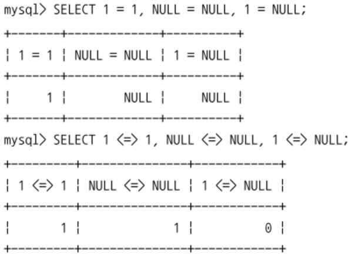
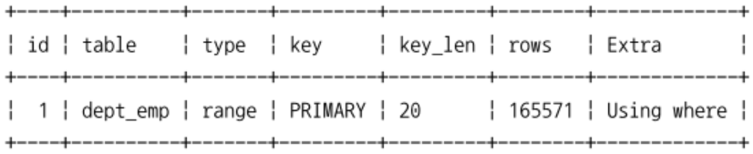
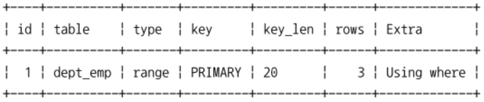
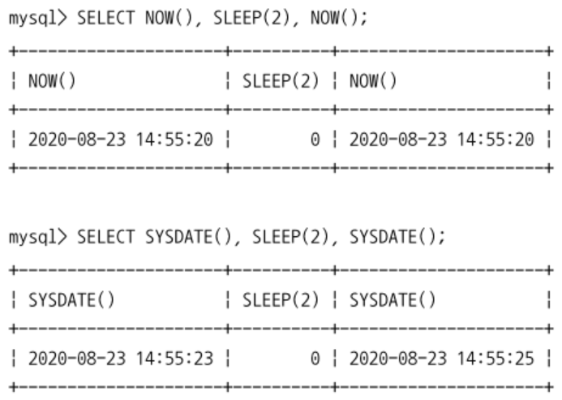
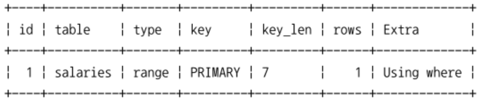
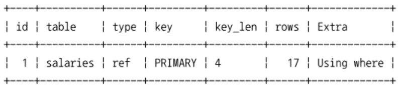
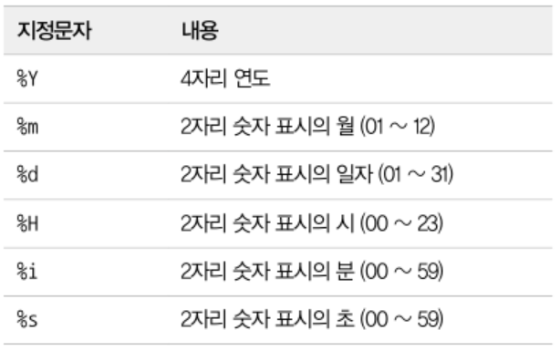
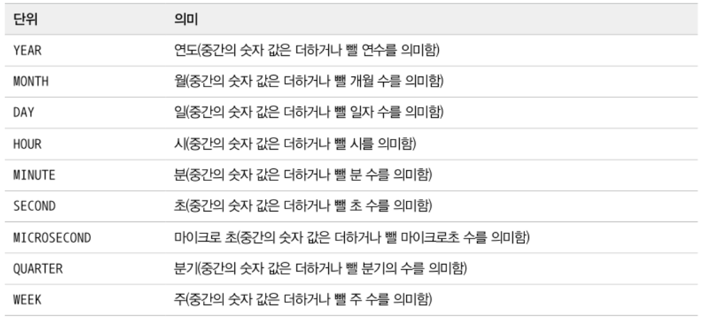

## 리터럴 표기법 문자열
### 문자열
- 문자열은 홑따옴표 `'`을 사용한다.
- MySQL에서는 쌍따옴표 `"`도 사용 가능하다.

```sql
  select * from departments where dept_no='d''001';
  select * from departments where dept_no='d"001';
  select * from departments where dept_no="d'001"; -- mysql에서만 사용가능
  select * from departments where dept_no="d""001"; -- mysql에서만 사용가능
  select * from departments where dept_no='d\'001';
  select * from departments where dept_no="d\"001";
```
- 테이블명이나 컬럼명을 키워드로 했다면 `으로 감싸서 사용한다.
- `sql_mode=ANSI_QUOTES` 설정하면 문자열 리터럴 표기에 `"`를 사용할 수 없음
- 테이블명이나 컬럼명의 충돌을 피하려면 `가 아닌 "를 사용해야 한다.

### 숫자
숫자 값을 상수로 사용할 때는 따옴표 없이 숫자만 입력해도 된다. (자동으로 타입 변환됨)
```sql
  select * from tab_test where number_column='10001';
  select * from tab_test where string_column=10001;
```

### 날짜
- 다른 DBMS에서 날짜 타입을 비교하거나 INSERT 하려면 DATE 타입으로 변환하는 코드가 필요
- MySQL은 정해진 형태의 포맷으로 표기하면 DATE나 DATETIME으로 변환해줌

```sql
  select * from dept_emp where from_date='2011-04-29';
  select * from dept_emp where from_date=STR_TO_DATE('2011-04-29', '%Y-%m-%d');
```

### 불리언
BOOL, BOOLEAN이라는 타입이 있지만 TINYINT 타입으로 통일된다.
- 1바이트 정수를 표현할 수 있음
- FALSE는 0으로, TRUE는 1로 표현한다. (나머지 정수는 그냥 정수 자체로 표현)

## MySQL 연산자
- 동등(Equal) 비교
  - `=` vs `<=>`
  
    
    - `<=>` 연산자는 `=` + NULL 비교 수행 (NULL-Safe 비교연산자)
- 부정(Not-Equal) 비교
  - `<>`, `!=`
- NOT 연산자
  - `!`
- AND(`&&`), OR(`||`) 연산자
- 나누기(`/`, `DIV`), 나머지(`%`, `MOD`) 연산자
- REGEXP 연산자
  - 문자열이 어떤 패턴을 만족하는지 확인한다.
    ```sql
      select 'abc' REGEXP '^[x-z]';
    ```
- LIKE 연산자
  - 어떤 상수 문자열이 있는지 확인한다.
    - `%`: 0 or 1개 이상의 모든 문자
    - `_`: 정확히 1개의 문자
    - ESCAPE 절을 사용하여 `%`, `_` 자체가 포함된 문자열을 검색할 수 있다.
      ```sql
        select 'a%' like 'a/%' escape '/';
      ```
  - REGEXP 연산자는 인덱스를 사용하지 못한다.
  - LIKE 연산자는 인덱스를 사용할 수 있다.
- BETWEEN 연산자
  ```sql
    select * from dept_emp where dept_no='d003' and emp_no=10001;
    select * from dept_emp where dept_no between 'd003' and 'd005' and emp_no=10001;
  ```
  - dept_emp 테이블의 PK는 (dept_no, emp_no)이므로 첫번쨰 쿼리를 인덱스를 이용할 수 있음
  - 두번째 쿼리는 범위를 읽어야 하는 연산자라 모든 인덱스의 범위를 검색해야 한다.
    - `emp_no=10001` 조건은 비교 범위를 줄이는 역할을 하지 못함

    과%20IN%20(오른쪽)의%20인덱스%20사용%20방법의%20차이.png)
    - between은 크다, 작다 연산을 하나로 묶은 것
      - 읽는 레코드에 비해 가져오는 데이터가 적음
    - in은 여러개의 = 연산을 하나로 묶은 것
      - 동등 비교를 여러번 수행하는 것과 같은 효과가 있어서 작업 범위를 줄임
    ```sql
      select *
      from dept_emp use index(primary)
      where dept_no between 'd003' and 'd005' and emp_no=10001;
    ```
    

    ```sql
      select *
      from dept_emp use index(primary)
      where dept_no in ('d003', 'd004', 'd005') and emp_no=10001;
    ```
    
- IN 연산자
  - 여러 개의 값에 대해 동등 비교 연산을 수행
  - 상수가 사용된 경우: `IN (?, ?, ?)`
    - MySQL 8.0 이전까지는 이 방식에 풀 테이블 스캔이 사용되었다.
    - MySQL 8.0 부터는 인덱스 레인지 스캔을 사용한다.
  - 서브쿼리가 사용된 경우: `IN (SELECT * FROM table)`
    - MySQL 8.0 이전까지는 최적화가 불안했음 (지금은 많이 안정화됨)

## MySQL 내장 함수
MySQL 함수 = MySQL에서 기본으로 제공하는 내장 함수 + 사용자가 직접 작성해서 추가하는 사용자 정의 함수

- NULL 값 비교 및 대체 (IFNULL, ISNULL)
  - IFNULL(값, 대체할 값)은 컬럼이나 값이 NULL인지 비교하고, NULL이면 다른 값으로 대체하는 용도로 사용
  - ISNULL(값)은 값이 NULL인지 비교하고, NULL이면 TRUE, 아니면 FALSE를 출력한다.
- 현재 시각 조회 (NOW, SYSDATE)

  
  - NOW()는 하나의 SQL에서 같은 값을 가짐
  - SYSDATE()는 하나의 SQL에서 호출되는 시점에 따라 값이 다름
    - sysdate가 사용된 sql은 레플리카 서버에서 안정적으로 복제되지 못한다.
    - sysdate와 비교되는 컬럼은 인덱스를 효율적으로 사용하지 못한다.
      ```sql
        explain
        select emp_no, salary, from_date, to_date
        from salaries
        where emp_no=10001 and from_date > now();
      ```
      
      ```sql
        explain
        select emp_no, salary, from_date, to_date
        from salaries
        where emp_no=10001 and from_date > sysdate();
      ```
      
      - 첫번째 쿼리는 emp_no, from_date 컬럼 모두 인덱스를 적절히 사용
      - 두번째 쿼리는 emp_no 컬럼만 인덱스 사용
        - sysdate는 호출할때마다 다른 값을 반환하므로 상수가 아님
        - 인덱스를 스캔할때도 매번 비교되는 레코드마다 함수를 실행해야 한다.
    - MySQL 서버의 설정파일에 `sysdate-is-now` 시스템 변수를 넣어서 활성화하면 now처럼 호출 시점에 관계없이 sql에서 같은 값을 가진다.
    - 일반적인 웹 서비스에는 sysdate를 사용할 이유가 없음
- 날짜와 시간의 포맷(DATE_FORMAT, STR_TO_DATE)

  
  ```sql
    select date_format(now(), '%Y-%m-%d %H:%i:%s') as current_dttm;
  ```
  - datetime 타입의 값을 원하는 형태의 문자열로 변환할때 사용
- 날짜와 시간의 연산(DATE_ADD, DATE_SUB)
  - 특정 날짜에서 시간을 더하거나 뺄때 사용
  - date_add로 더하거나 뺄 수 있으므로 sub는 잘 사용되지 않음
  ```sql
    select date_add(now(), interval 1 day) as tomorrow;
    select date_add(now(), interval -1 day) as yesterday;
  ```
  
- 타임스탬프 연산(UNIX_TIMESTAMP, FROM_UNIXTIME)
  - `UNIX_TIMESTAMP()`: '1970-01-01 00:00:00'부터 경과된 초의 수를 반환하는 함수
    ```sql
      select unix_timestamp('2020-08-23 15:06:45');
    ```
    - 인자로 사용한 시간의 타임스탬프를 반환한다.
    - 인자가 없으면 현재 날짜와 시간의 타임스탬프 값을 반환한다.
  - `FROM_UNIXTIME()`: 인자로 전달한 타임스탬프 값을 DATETIME으로 변환하는 함수
    ```sql
      select from_unixtime(unix_timestamp('2020-08-23 15:06:45'));
    ```
  - MySQL의 timestamp는 `1970-01-01 00:00:01 ~ 2038-01-09 03:14:07` 범위의 날짜 값만 가능하다. 위 두 함수도 해당 범위 날짜 내에서만 사용 가능
