## SELECT 절의 처리 순서
- SELECT 문장 = SQL 전체
- 절: 키워드(select, from, join, where, group by, having, order by, limit) + 표현식


.png)
- 첫 번째 테이블만 읽어서 정렬 수행 -> 나머지 테이블을 읽음
- 주로 group by 없이 order by만 사용된 쿼리에서 사용될 수 있는 순서

## WHERE절과 GROUP BY절, ORDER BY절의 인덱스 사용
### 인덱스를 사용하기 위한 기본 규칙
- 기본적으로 인덱스된 컬럼의 값 자체를 변환하지 않고 그대로 사용한다는 조건을 만족해야 함
  ```sql
    -- salary 값을 가공했기 때문에 인덱스를 사용할 수 없음
    select * from selaries where salary*10 > 150000;

    select * from selaries where salary > 150000/10;
  ```
  - 만약 복잡한 연산을 수행한다거나 MD5() 함수와 같은 해시 값을 만들어서 비교할 경우 미리 계산된 값을 저장하도록 MySQL의 가상 컬럼을 추가하고, 그 컬럼에 인덱스를 생성하거나 함수 기반의 인덱스를 사용하면 된다.
- 인덱스는 컬럼의 값을 아무런 변환 없이 B-Tree에 정렬해서 저장한다.
- where, group by, order by에서도 원본값을 검색하거나 정렬할 때만 b-tree에 정렬된 인덱스를 이용한다.
- where절에 사용되는 비교 조건에서 연산자 양쪽의 값들은 데이터 타입이 같아야 한다.
  ```sql
    create table tb_test (age varchar(10), index ix_age(age));
    insert into tb_test values('1'), ('2'), ('3'), ('4'), ('5'), ('6'), ('7');
    select * from tb_test where age=2;

    select * from tb_test where age='2';
  ```
  - MySQL 옵티마이저가 내부적으로 타입을 변환한 후 비교작업을 처리한다.
    - 인덱스 레인지 스캔이 아닌 인덱스 풀 스캔으로 처리됨

### WHERE절의 인덱스 사용

- 위쪽은 4개 컬럼이 순서대로 결합 인덱스로 생성되어 있음을 의미
- 아래쪽은 SQL의 where절에 존재하는 조건을 의미
- where절에 나열된 순서가 달라도 MySQL 옵티마이저가 인덱스를 사용할 수 있는 조건들을 뽑아서 최적화할 수 있다.

```sql
  alter table ... add index ix_col1234 (col_1 asc, col_2 desc, col_3 asc, col_4 asc);
```
- MySQL 8.0 이전까지는 하나의 인덱스를 구성하는 각 컬럼의 정렬 순서가 혼합되어 사용할 수 없었다.
- MySQL 8.0 부터는 인덱스를 구성하는 컬럼별로 정렬 기준을 혼합해서 생성할 수 있게 되었다.

### GROUP BY절의 인덱스 사용
- group by절의 각 컬럼은 비교연산자를 가지지 않으므로 작업 범위 결정 조건이나 체크 조건과 같이 구분해서 생각할 필요 없음
- group by절에 명시된 컬럼의 순서가 인덱스를 구성하는 컬럼의 순서와 같으면 인덱스를 이용할 수 있다.


- group by절에 명시된 컬럼이 인덱스 컬럼의 순서와 같아야 한다.
- 인덱스를 구성하는 컬럼 중에서 뒤쪽에 있는 컬럼은 group by절에 명시되지 않아도 인덱스를 사용할 수 있지만 앞쪽의 컬럼은 group by절에 명시되지 않으면 인덱스를 사용할 수 없다.
- where 조건절과는 달리 group by절에 명시된 컬럼이 하나라도 인덱스에 없으면 group by절은 전혀 인덱스를 사용하지 못한다.

```sql
  group by col_2, col_1
  group by col_1, col_3, col_2
  group by col_1, col_3
  group by col_1, col_2, col_3, col_4, col_5
```
- 1, 2는 순서가 일치하지 않음
- 3은 col_2가 명시되지 않음
- 4는 col_5가 인덱스에 존재하지 않음

```sql
  where col_1='1' group by col_2, col_3
  where col_1='1' and col_2='2' group by col_3, col_4
  where col_1='1' and col_2='2' and col_3='3' group by col_4
```
- group by에 명시되지 않은 앞쪽의 컬럼이 where절에 명시되었다면 인덱스를 사용할 수 있다.

### ORDER BY절의 인덱스 사용
- group by의 조건 + 정렬되는 각 컬럼의 오름차순 or 내림차순 옵션이 인덱스와 같거나 정반대인 경우에만 사용할 수 있다.


```sql
  order by col_2, col_3
  order by col_1, col_3, col_2
  order by col_1, col_2 desc, col_3
  order by col_1, col_3
  order by col_1, col_2, col_3, col_4, col_5
```
- 1은 col_1이 명시되지 않음
- 2는 순서가 일치하지 않음
- 3은 col_2의 정렬 순서가 다름
- 4는 col_2가 명시되지 않음
- 5는 col_5가 인덱스에 존재하지 않음

### WHERE 조건과 ORDER BY(GROUP BY)절의 인덱스 사용
- 하나의 sql 문장에서 where 조건은 A 인덱스, order by는 B 인덱스를 사용할 수는 없다.
- where + order by가 사용된 쿼리에서 인덱스를 이용하는 방법
  - where, order by 동시에 같은 인덱스 이용
    - where에 사용된 컬럼 + order by에 사용된 컬럼이 모두 하나의 인덱스에 연속해서 포함되어 있을 때 가능
    - 아래 두가지 방법보다 훨씬 빠른 성능
  - where만 인덱스 이용
    - order by절은 인덱스를 이용한 정렬이 불가능하며, 인덱스를 통해 검색된 결과 레코드를 별도의 정렬 처리과정을 거쳐 정렬을 수행한다.
    - where절의 조건에 일치하는 레코드 건수가 많지 않을 때 효율적인 방식
  - order by만 인덱스 이용
    - order by절의 순서대로 인덱스를 읽으면서 레코드 한건씩 where 조건에 일치하는지 비교하고, 일치하지 않으면 버림
    - 아주 많은 레코드를 조회해서 정렬해야 할 때 사용함
- where에 사용된 컬럼 + order by에 사용된 컬럼이 순서대로 빠짐없이 인덱스 컬럼의 왼쪽부터 일치해야 한다.
  - where과 order by에 같은 컬럼이 사용되는 것은 문제되지 않음


- where + order by가 결합된 두 가지 패턴의 쿼리
- order by절에 컬럼이 사용되고 있다면 where절에 동등비교 이외의 연산자로 비교해도 된다.

```sql
  select * from tb_test where col_1 > 10 order by col_1, col_2, col_3;
  select * from tb_test where col_1 > 10 order by col_2, col_3;
```
- 1번 쿼리는 인덱스로 사용할 컬럼을 순서대로 모두 명시했으므로 정상적으로 인덱스 사용 가능
- 2번 쿼리는 col_1을 범위조건으로 검색되었고, order by에는 명시되지 않아서 정렬할 때는 인덱스를 사용할 수 없다.

### GROUP BY절과 ORDER BY절의 인덱스 사용
- group by, order by가 동시에 사용된 쿼리에서 동시에 하나의 인덱스를 사용하려면 group by에 명시된 컬럼과 order by에 명시된 컬럼의 순서와 내용이 모두 같아야 한다.
  - 어느 한쪽이라도 인덱스를 이용할 수 없다면 둘 다 인덱스를 이용할 수 없다.

```sql
  group by col_1, col_2 order by col_2
  group by col_1, col_2 order by col_1, col_3
```
- MySQL 5.7 까지는 group by는 group by 컬럼에 대한 정렬까지 함께 수행하는 것이 기본 작동 방식이었다.
- MySQL 8.0 부터는 group by절이 컬럼의 정렬까지는 보장하지 않는 형태로 바뀜
  - 그루핑과 정렬 모두 수행하려면 group by, order by절을 모두 명시해야 한다.

### WHERE 조건과 ORDER BY절, GROUP BY절의 인덱스 사용

- where, group by, order by가 모두 포함된 쿼리가 인덱스를 사용하는지 판단하는 방법
  1. where절이 인덱스를 사용할 수 있는지
  2. group by절이 인덱스를 사용할 수 있는지
  3. group by절과 order by절이 동시에 인덱스를 사용할 수 있는지

## WHERE 절의 비교 조건 사용 시 주의사항
### NULL 비교
- MySQL은 NULL이 포함된 레코드도 인덱스로 관리된다.
- 쿼리에서 NULL 비교를 하려면 `is null` `<=>` 연산자를 사용해야 한다.
  ```sql
    select null=null;
    select null<=>null;
    select case when null=null then 1 else 0 end;
    select case when null is null then 1 else 0 end;
  ```
- 쿼리의 NULL 비교가 인덱스를 사용하는 방법
  ```sql
    select * from titles where to_date is null;
  ```
  
  - `isnull()` 함수를 사용
    ```sql
      select * from titles where to_date is null;
      select * from titles where isnull(to_date);
      select * from titles where isnull(to_date)=1;
      select * from titles where isnull(to_date)=true;
    ```
    - 1, 2번 쿼리는 인덱스 레인지 스캔을 사용할 수 있음
    - 3, 4번 쿼리는 인덱스나 테이블을 풀 스캔하는 방식으로 처리됨

### 문자열이나 숫자 비교
- 문자열이나 숫자 컬럼을 비교할 때는 반드시 그 타입에 맞는 상숫값을 사용하는 것을 권장

```sql
  select * from employees where emp_no=10001;
  select * from employees where first_name='Smith';
  select * from employees where emp_no='10001';
  select * from employees where first_name=10001;
```
- 1, 2번 쿼리는 컬럼과 상수 타입이 동일하므로 인덱스를 적절하게 이용할 수 있다.
- 3번 쿼리는 emp_no 컬럼이 숫자타입이기 때문에 상수를 숫자로 변환해서 비교하므로 성능 저하는 없음
- 4번 쿼리는 first_name 컬럼을 숫자로 변환해서 비교하기 때문에 인덱스를 이용하지 못함

### 날짜 비교
> DATE: 날짜만 저장<br/>
> DATETIME, TIMESTAMP: 날짜와 시간을 함께 저장

#### DATE 또는 DATETIME과 문자열 비교
- 문자열을 DATE/DATETIME으로 변환하여 비교한다. (MySQL 내부적으로 수행)
  ```sql
    select count(*)
    from employees
    where hire_date>str_to_date('2011-07-23', '%Y-%m-%d');

    select count(*)
    from employees
    where hire_date>'2011-07-23';
  ```
  - 두 쿼리가 동일하게 처리됨 (성능 차이도 없음)

  ```sql
    select count(*)
    from employees
    where date_format(hire_date, '%Y-%m-%d')>'2011-07-23';
  ```
  - hire_date 컬럼의 타입을 강제로 변경하기 때문에 인덱스를 효율적으로 사용하지 못함
  - 가능하다면 상수쪽 타입을 변경하는 형태로 사용하는 것이 좋음

#### DATE와 DATETIME의 비교
- datetime과 date를 그대로 비교한다면 MySQL 서버가 date 타입의 값을 datetime으로 변환한 후 비교한다.
  - `2023-11-07` -> `2023-11-07 00:00:00`으로 변환
- datetime, date 간의 타입변환은 인덱스 사용여부에 영향을 미치지 않음
  - 성능보다는 쿼리의 결과에 주의해서 사용

#### DATETIME과 TIMESTAMP의 비교
```sql
  select count(*)
  from employees
  where hire_date<'2011-07-23 11:10:12';

  select count(*)
  from employees
  where hire_date>unix_timestamp('1986-01-01 00:00:00');

  show warnings;
```

- `unix_timestamp()` 함수의 결과는 MySQL 내부적으로 숫자 값이므로 2번 쿼리로는 원하는 값을 얻을 수 없다.
- 비교값으로 사용되는 상수값을 타입에 맞게 변환하도록 한다.

#### Short-Circuit Evaluation
```
  boolean in_transaction;

  if (in_transaction && has_modified()) {
    commit();
  }
```
- `in_transaction=false`이면 `has_modified()` 함수를 실행하지 않아도 됨
- `Short-Circuit Evaluation`: 여러개의 표현식이 and, or 연산자로 연결될 경우 선행 표현식의 결과에 따라 후행 표현식을 평가할지 결정하는 최적화

```sql
  -- 2844047
  select count(*) from salaries;

  -- 2442943
  select count(*) from salaries
  where convert_tz(from_date, '+00:00', '+09:00')>'1991-01-01';

  -- 0
  select count(*) from salaries
  where to_date<'1985-01-01';

  -- 0.73sec
  select count(*) from salaries
  where convert_tz(from_date, '+00:00', '+09:00')>'1991-01-01'
    and to_date<'1985-01-01';

  -- 0.52sec
  select count(*) from salaries
  where to_date<'1985-01-01'
    and convert_tz(from_date, '+00:00', '+09:00')>'1991-01-01';
```
- 조건의 순서만 바꿔줘도 성능이 달라짐
  - `to_date<'1985-01-01'` 조건이 이미 0건 조회이므로 다른 조건을 볼 필요가 없음
- where 조건 중에서 인덱스를 사용할 수 있는 조건이 있다면 인덱스를 우선으로 사용한다.
  - 이후 인덱스를 사용하는 조건 이외의 조건들을 순서대로 평가한다.

```sql
  select *
  from employees e
  where e.first_name='Matt'
    and exists (select 1 from salaries s
                where s.emp_no=e.emp_no and s.to_date>'1995-01-01'
                group by s.salary having count(*)>1)
    and e.last_name='Aamodt';
```


```sql
  select *
  from employees e
  where e.first_name='Matt'
    and e.last_name='Aamodt'
    and exists (select 1 from salaries s
                where s.emp_no=e.emp_no and s.to_date>'1995-01-01'
                group by s.salary having count(*)>1);
```


### DISTINCT
- 특정 컬럼의 유니크한 값을 조회하기 위해 사용
  - 남용하는 것은 성능적인 문제도 있지만 원하는 쿼리가 나오지 않을 수 있음

### LIMIT n
```sql
  select *
  from employees
  where emp_no between 10001 and 10010
  order by first_name
  limit 0, 5;
```
1. employees 테이블에서 where절의 검색 조건에 일치하는 레코드를 전부 읽어 온다.
2. 1에서 읽어온 레코드를 first_name 컬럼 기준으로 정렬한다.
3. 정렬된 결과에서 상위 5개를 가져온다.

- where 조건이 아니므로 쿼리의 마지막에 실행된다.
- limit에서 필요한 레코드 건수만 준비되면 즉시 쿼리를 종료한다.
  - 모든 레코드가 정렬되지 않아도 limit 갯수만큼만 정렬되면 작업을 멈춤

```sql
  select * from employees limit 0, 10;
  select * from employees group by first_name limit 0, 10;
  select distinct first_name from employees limit 0, 10;
  
  select *
  from employees
  where emp_no between 10001 and 11000
  order by first_name
  limit 0, 10;
```
- 1번 쿼리에서 풀 테이블 스캔을 실행하면서 limit 만큼의 레코드를 읽으면 읽기 작업을 멈춘다.
- 2번 쿼리는 group by 처리가 완료된 이후에 limit 처리가 가능하다.
  - 실질적으로 서버의 작업 내용을 크게 줄여주지는 못함
- 3번 쿼리는 풀 테이블 스캔 방식을 이용해서 employees 데이틀을 읽고, distinct로 중복을 제거한다. 유니크한 레코드가 limit만큼 구해지면 쿼리를 멈춘다.
- 4번 쿼리는 where 조건에 맞는 레코드를 찾은 후 order by로 정렬한다.
  - limit 만큼의 상위데이터만 정렬되면 작업을 멈춘다.

```sql
  select * from employees limit 10;
  select * from employees limit 20, 10;
```
- `limit 10`: 상위 10개 레코드를 가져옴
- `limit 20, 10`: 상위 21번째부터 10개 레코드를 가져옴

```sql
  select * from salaries order by salary limit 2000000, 10;
```
- 2000010건의 레코드를 읽어야함
- where 조건절로 읽어야 할 위치를 찾고 그 위치에서 limit만큼 읽는 쿼리를 사용하는 것이 좋음

### COUNT()
- 레코드 건수를 반환한다.
- 테이블이 가진 대략적인 레코드 건수를 조회하려면 count보다 `show table status` 명령으로 통계 정보를 참조하는 것도 좋음
  - `SHOW TABLE STATUS LIKE 'employees';`
  - 통계 정보의 레코드 건수는 실제 테이블의 레코드 건수와 많은 차이가 있을 수 있는데 `ANALYZE TABLE` 명령으로 통계 정보를 갱신하면 된다.
- order by절은 어떤 경우에도 필요없음
  - MySQL8.0 부터는 count 쿼리에 사용된 order by를 옵티마이저가 무시하도록 개선됨
- left join은 레코드 건수의 변화가 없거나 outer 테이블에서 별도의 체크를 하지 않아도 되는 경우에는 모두 제거하는 것이 성능상 좋음
- 인덱스를 제대로 사용하지 못할 경우 일반적인 select보다 훨씬 느릴 수 있다.
  - count 쿼리도 많은 부하를 일으키므로 주의
- count의 인자에 컬럼명이나 표현식이 쓰인다면 null이 아닌 레코드 건수만 반환한다.

### JOIN
#### JOIN의 순서와 인덱스
- 인덱스 레인지 스캔: 인덱스 탐색 + 인덱스 스캔
  - 인덱스 스캔은 부하가 작지만 탐색은 상대적으로 부하가 높음
- 조인 작업에서 드라이빙 테이블을 읽을 때는 인덱스 탐색 작업을 단 한번만 수행하고 이후에는 스캔만 하면 된다.
- 드리븐 테이블에서는 인덱스 탐색, 스캔 작업을 드라이빙 테이블에서 읽은 레코드 건수만큼 반복한다.

```sql
  select *
  from employees e, dept_emp de
  where e.emp_no=de.emp_no;
```
- 두 컬럼 모두 인덱스가 있는 경우
  - 어느 테이블을 드라이빙으로 선택하든 인덱스를 이용해서 드리븐 테이블의 검색 작업을 빠르게 처리할 수 있다.
- e.emp_no에만 인덱스가 있는 경우
  - dept_emp 테이블을 드라이빙 테이블로, employees 테이블을 드리븐 테이블로 선택한다.
- de.emp_no에만 인덱스가 있는 경우
  - employees 테이블을 드라이빙 테이블로, dept_emp 테이블을 드리븐 테이블로 선택한다.
- 둘다 인덱스가 없는 경우
  - 어느 테이블을 드라이빙으로 선택하든 드리븐 테이블의 풀 스캔이 발생한다.

#### JOIN 컬럼의 데이터 타입
- 조인 컬럼 간의 데이터 타입이 일치하지 않으면 인덱스를 효율적으로 이용할 수 없다.

```sql
  create table tb_test1 (user_id int, user_type int, primary key(user_id));
  create table tb_test2 (user_type char(1), type_desc varchar(10), primary key(user_type));

  select *
  from tb_test1 tb1, tb_test2 tb2
  where tb1.user_type=tb2.user_type;
```

- 두 테이블 모두 풀 테이블 스캔으로 접근한다.
- tb_test2 테이블의 user_type 컬럼을 char(1)에서 int로 변환해서 비교한다.
  - 인덱스에 변형이 필요해서 tb_test2 테이블의 인덱스를 제대로 사용할 수 없다.
- 문제가 될 수 있는 경우
  - char, int와 같이 데이터 타입 종류가 다른 경우
  - 같은 char라도 문자 집한이나 콜레이션이 다른 경우
  - 같은 int라도 부호의 존재 여부가 다른 경우
  ```sql
    create table tb_test1 (
      user_id int,
      user_type char(1) collate utf8mb4_general_ci,
      primary key(user_id)
    );

    create table tb_test2 (
      user_type char(1) collate latin1_general_ci,
      type_desc varchar(10),
      index ix_usertype (user_type)
    );

    select *
    from tb_test1 tb1, tb_test2 tb2
    where tb1.user_type=tb2.user_type;
  ```
  

#### OUTER JOIN의 성능과 주의사항
- INNER JOIN은 조인 대상 테이블에 모두 존재하는 레코드만 결과 집합으로 반환한다.
- 레코드를 갖지 않는 경우가 있다면 OUTER JOIN이 필요하겠지만 대부분 그런 경우는 없음
  - 테이블이 일관되지 않은 경우에만 OUTER JOIN이 필요하다.
- MySQL 옵티마이저는 outer로 조인되는 테이블을 드라이빙 테이블로 선택하지 못한다.
  - inner join으로 사용해도 되는 쿼리를 outer join으로 작성하면 옵티마이저가 조인 순서를 변경하면서 수행할 수 있는 최적화의 기회를 뺏기는 결과가 된다.
  - outer로 조인되는 테이블에 대한 조건을 where 절에 함께 명시하는 것
    ```sql
      select *
      from employees e
        left join dept_manager mgr on mgr.emp_no=e.emp_no
      where mgr.dept_no='d001';

      select *
      from employees e
        inner join dept_manager mgr on mgr.emp_no=e.emp_no
      where mgr.dept_no='d001';
    ```
    - 1번 쿼리처럼 mgr.dept_no 비교를 where절에 명시하면 2번 쿼리처럼 변환되어 실행된다.
    - left join의 on절로 옮기도록 한다.
    - 예외적으로 outer join으로 연결되는 테이블에의 컬럼에 대한 조건을 where절에 사용하는 경우가 있다. (ex. 안티 조인)
      ```sql
        select *
        from employees e
          left join dept_manager dm on dm.emp_nop=e.emp_no
        where dm.emp_no is null
        limit 10;
      ```
      - dm.emp_no 컬럼이 null인 레코드만 조회한다.

#### JOIN과 외래키(FOREIGN KEY)
- 외래키는 조인과 아무런 연관이 없다.
- 외래키를 생성하는 주목적은 데이터의 무결성을 보장하기 위해서다.
- 테이블 간의 조인을 수행하는 것은 전혀 무관한 컬럼을 조인 조건으로 사용해도 문법적으로는 문제 없음
  - db를 생성할 대 테이블 간의 관계를 외래키로 생성하지 않을 때가 많다.
  - 테이블 간의 조인을 사용하기 위해 외래키가 필요한 것은 아님

#### 지연된 조인(Delayed Join)
- 조인이 실행되기 이전에 group by나 order by를 처리하는 방식
- 주로 limit이 함께 사용된 쿼리에서 더 큰 효과를 얻을 수 있음

```sql
  select e.*
  from salaries s, employees e
  where e.emp_no=s.emp_no
    and s.emp_no between 10001 and 13000
  group by s.emp_no
  order by sum(s.salary) desc
  limit 10;
```

- employees 테이블을 드라이빙 테이블로 선택해서 `emp_no between 10001 and 13000` 조건을 만족하는 레코드를 읽고 조인한다.

```sql
  select e.*
  from 
    (select s.emp_no
    from salaries s
    where s.emp_no between 10001 and 13000
    group by s.emp_no
    order by sum(s.salary) desc
    limit 10) x, employees e
  where e.emp_no=x.emp_no;
```

- salaries 테이블의 모든 처리를 수행한 결과를 임시 테이블에 저장하고, employees 테이블과 조인한다.
- 임시 테이블에 저장할 데이터가 10건밖에 되지 않아서 메모리를 이용해 빠르게 처리된다.
  - 실행 계획상으로는 느린 것으로 보임
- outer join, inner join에 대해서 지연된 쿼리로 변경해서 사용할 수 있는 조건
  - outer join의 경우 드라이빙 테이블과 드리븐 테이블은 `1:1` or `M:1` 관계여야 한다.
  - inner join의 경우 드라이빙 테이블과 드리븐 테이블은 `1:1` or `M:1` 관계여야 하고, 드라이빙 테이블에 있는 레코드는 드리븐 테이블에 모두 존재해야 한다.

#### 래터럴 조인(Lateral Join)
- MySQL 8.0 이전까지는 그룹별로 몇 건씩만 가져오는 쿼리를 작성할 수 없었다.
- MySQL 8.0 부터는 래터럴 조인을 이용해서 특정 그룹별로 서브쿼리를 실행해서 그 결과와 조인하는 것이 가능해졌다.

```sql
  select *
  from employees e
    left join lateral (select *
                       from salaries s
                       where s.emp_no=e.emp_no
                       order by s.from_date desc limit 2) s2 on s2.emp_no=e.emp_no
  where e.first_name='Matt';
```
- from절에 사용된 서브쿼리에서 외부쿼리의 from절에 정의된 테이블의 컬럼을 참조할 수 있다.
  - lateral 키워드를 사용하지 않으면 `Unknown column` 에러가 발생한다.
- lateral 키워드를 가진 서브쿼리는 조인 순서상 후순위로 밀리고, 외부 쿼리의 결과 레코드 단위로 임시 테이블이 생성되기 때문에 필요한 경우에만 사용하도록 한다.

#### 실행 계획으로 인한 정렬 흐트러짐
- MySQL 8.0 이전까지는 네스티드 루프 방식의 조인만 가능했지만 8.0 이후에는 해시 조인 방식이 도입되었다.
- 쿼리 실행 계획에서 네스티드 루프 조인 대신 해시 조인이 사용되면 쿼리 결과의 레코드 정렬 순서가 달라진다.

```sql
  select e.emp_no, e.first_name, e.last_name, de.from_date
  from dept_emp de, employees e
  where de.from_date>'2001-10-01' and e.emp_no<10005;
```


- 네스티드 루프 방식으로 조인이 처리되면 드라이빙 테이블을 읽은 순서대로 결과가 조회되는 것이 일반적이다.
  - emp_no 값의 순서대로 조회되어야 하지만 이 쿼리는 emp_no 컬럼으로 정렬되어 있지 않고, emp_no가 반복적으로 순환되는 결과가 나온다.
- 실행 계획은 MySQL 옵티마이저에 의해 달라질 수 있기때문에 정렬된 결과가 필요한 경우 order by를 사용하는 것이 좋다.

### GROUP BY
#### WITH ROLLUP
```sql
  select dept_no, count(*)
  from dept_emp
  group by dept_no with rollup;
```

- 그룹별로 소계를 가져올 수 있다.
  - group by에 사용된 컬럼의 갯수에 따라 소계의 레벨이 달라짐
  - 소계 레코드의 컬럼 값은 소계를 제외한 데이터는 null로 표시됨

```sql
  select first_name, last_name, count(*)
  from employees
  group by first_name, last_name with rollup;
```

- first_name의 소계 레코드, 전체 총계 레코드 출력
  - 소계 레코드에는 다른 컬럼이 null로 채워짐

```sql
  select
    if (grouping(first_name), 'All first_name', first_name) as first_name,
    if (grouping(last_name), 'All last_name', last_name) as last_name,
    count(*)
  from employees
  group by first_name, last_name with rollup;
```

- 소계 레코드에 더이상 null로 나머지 컬럼이 채워지지 않고, 입력한 문자열로 표시된다.

#### 레코드를 컬럼으로 변환해서 조회
- 하나의 레코드를 여러 개의 컬럼으로 나누거나 변환하는 sql 문법은 없다.
- sum(), count() 같은 집합함수와 `case when ... end` 구문을 이용해서 레코드를 컬럼으로 변환하거나 하나의 컬럼을 조건으로 구분해서 2개 이상의 컬럼으로 변환하는 것은 가능하다.
- 레코드를 컬럼으로 변환
  ```sql
    -- 부서 번호와 부서별 사원 수를 그루핑
    select dept_no, count(*) as emp_count
    from dept_emp
    group by dept_no;
  ```
  ```sql
    select
      sum(case when dept_no='d001' then emp_count else 0 end) as count_d001,
      sum(case when dept_no='d002' then emp_count else 0 end) as count_d002,
      sum(case when dept_no='d003' then emp_count else 0 end) as count_d003,
      sum(case when dept_no='d004' then emp_count else 0 end) as count_d004,
      sum(case when dept_no='d005' then emp_count else 0 end) as count_d005,
      sum(emp_count) as count_total
    from (
      select dept_no, count(*) as emp_count from dept_emp group by dept_no
    ) tb_derived;
  ```
  
  - 9건의 레코드를 1 건의 레코드로 변환
    - 용도에 맞게 count, min, max, avg, sum 등의 집합함수 사용
  - 부서 번호가 쿼리의 일부로 사용되기 때문에 부서 번호의 변경에 따라 쿼리가 변경될 수 있음
- 하나의 컬럼을 여러 컬럼으로 분리
  ```sql
    select dept_no, count(*) as emp_count
    from dept_emp
    group by dept_no;
  ```
  ```sql
    select de.dept_no,
      sum(case when e.hire_date between '1980-01-01' and '1989-12-31' then 1 else 0 end) as cnt_1980,
      sum(case when e.hire_date between '1990-01-01' and '1999-12-31' then 1 else 0 end) as cnt_1990,
      sum(case when e.hire_date between '2000-01-01' and '2009-12-31' then 1 else 0 end) as cnt_2000,
      count(*) as cnt_total
    from dept_emp de, employees e
    where e.emp_no=de.emp_no
    group by de.dept_no;
  ```
  
  - 사원의 입사년도를 구분해서 연도별로 합계를 가져올 수 있음

### ORDER BY
- 검색된 레코드를 어떤 순서로 정렬할지 결정
- order by가 사용되지 않을 때의 정렬 기준
  - 인덱스를 사용한 select의 경우 인덱스에 정렬된 순서대로 레코드를 가져온다.
  - InnoDB에서는 항상 PK로 클러스터링되어 있기 때문에 풀 테이블 스캔의 경우 기본적으로 PK 순서대로 레코드를 가져온다.
  - select 쿼리가 임시 테이블을 거쳐서 처리되면 조회되는 레코드의 순서를 예측하기 어렵다.
- order by가 없는 쿼리에는 어떠한 정렬도 보장하지 않음
  - 인덱스를 사용한 쿼리라고 해도 정렬 필요 시 order by를 사용하는 것이 좋음
  - order by에서 인덱스를 사용하지 못하면 추가 정렬 작업이 수행되며, 실행계획에 Using filesort가 표시된다.
- 정렬 대상이 많은경우 여러 부분으로 나눠서 처리하는데, 정렬된 결과를 임시로 디스크나 메모리에 저장해둔다.
  ```sql
    show status like 'Sort_%';
  ```
  
  - `Sort_merge_passes`는 메모리의 버퍼와 디스크에 저장된 레코드를 몇 번이나 병합했는지 보여준다.
    - 값이 0보다 크다면 정렬해야 할 데이터가 정렬용 버퍼보다 커서 디스크를 이용했다는 것을 의미
  - `Sort_range`는 인덱스 레인지 스캔을 통해서 읽은 레코드를 정렬한 횟수
  - `Sort_scan`은 풀 테이블 스캔을 통해서 읽은 레코드를 정렬한 횟수
  - `Sort_rows`는 정렬을 수행했던 전체 레코드 건수와 누적된 값

#### ORDER BY 사용법 및 주의사항
- 여러 개의 컬럼으로 정렬을 수행할 수 있음
- 정렬 순서는 컬럼별로 다르게 명시 가능
- 정렬 대상을 컬럼명이나 표현식 말고도 컬럼의 순번을 명시할 수 있음
  ```sql
    -- 둘은 같은 쿼리
    select first_name, last_name from employees
    order by last_name;
    select first_name, last_name from employees
    order by 2;
  ```
  - `group by 2`: select되는 컬럼 중에서 2번째 컬럼을 기준으로 정렬
  - 순번이 컬럼의 갯수보다 크면 에러 발생
    - `Unknown column '3' in 'order clause'`
- order by 뒤에 문자열 상수를 사용하면 옵티마이저가 무시한다.

#### 여러 방향으로 동시 정렬
- MySQL 8.0 이전까지는 여러 개의 컬럼을 조합해서 정렬할 때 각 컬럼의 정렬 순서가 오름차순과 내림차순이 혼용되면 인덱스를 이용할 수 없다.
- MySQL 8.0부터는 오름차순, 내림차순의 혼용이 가능해졌다.
  ```sql
    alter table salaries add index ix_salary_fromdate (salary desc, from_date asc);
  ```

```sql
  select *
  from salaries
  order by salary desc limit 10;
```
```sql
  alter table salaries add index ix_salary_asc (salary asc);
  alter table salaries add index ix_salary_desc (salary desc);
```
- 내림차순으로만 조회하는 쿼리의 경우 위 인덱스 중 하나만 있어도 되는데 ix_salary_desc를 생성하는 것이 좋음

#### 함수나 표현식을 이용한 정렬
- MySQL 8.0 이전까지는 연산의 결과를 기준으로 정렬하기 위해 가상 컬럼을 추가하고, 인덱스를 생성하는 방법을 사용해야 했다.
- MySQL 8.0 부터는 함수 기반의 인덱스를 지원하기 시작했다.
  - 연산의 결괏값을 기준으로 정렬하는 작업이 인덱스를 사용하도록 튜닝하는 것이 가능해짐
  ```sql
    select *
    from salaries
    order by cos(salary);
  ```

### 서브쿼리
- 서브쿼리를 사용하면 단위 처리별로 쿼리를 독립적으로 작성할 수 있다.
- 조인처럼 여러 테이블을 섞어둔 형태가 아니라서 가독성이 높아짐
- MySQL 5.6 까지는 서브쿼리를 최적으로 실행하지 못할 때가 많았지만 8.0 부터는 많이 개선됨
- select, from, where절에 사용될 수 있음
  - 사용되는 위치에 따라 쿼리의 성능 영향도와 MySQL 서버의 최적화 방법은 완전히 달라짐

#### SELECT 절에 사용된 서브쿼리
- 내부적으로 임시 테이블을 만들거나 쿼리를 비효율적으로 실행되게 하지는 않음
- 항상 컬럼과 레코드가 하나인 결과를 반환해야 한다.
  - 값이 null이어도 상관없음

```sql
  select emp_no, (select dept_name from departments where dept_name='Sales1')
  from dept_emp
  limit 10;

  select emp_no, (select dept_name from departments)
  from dept_emp
  limit 10;

  select emp_no (select dept_no, dept_name from departments where dept_name='Sales1')
  from dept_emp
  limit 10;
```
- 1번 쿼리의 서브쿼리 결과는 항상 0건이라 해당 컬럼은 null로 채워진다.
- 2번 쿼리의 서브쿼리는 2건 이상의 레코드를 반환하므로 에러가 발생한다.
- 3번 쿼리의 서브쿼리는 2개 이상의 컬럼을 가져와서 에러가 발생한다.
- select절의 서브쿼리는 로우 서브쿼리를 사용할 수 없고, 스칼라 서브쿼리만 사용 가능
  - 스칼라 서브쿼리: 레코드의 컬럼이 각각 하나인 결과를 만들어내는 서브쿼리
  - 로우 서브쿼리: 스칼라 서브쿼리보다 레코드 건수가 많거나 컬럼 수가 많은 결과를 만들어내는 서브쿼리

```sql
  -- 0.78s
  select
    count(concat(e1.first_name,
      (select e2.first_name from employees e2 where e2.emp_no=e1.emp_no)))
  from employees e1;

  -- 0.65s
  select count(concat(e1.first_name, e2.first_name))
  from employees e1, employees e2
  where e1.emp_no=e2.emp_no;
```
- 조인을 사용한 쿼리가 서브쿼리보다 처리속도가 빠르므로 가능하면 조인을 사용하도록 한다.

```sql
  select e.emp_no, e.first_name, s2.salary, s2.from_date, s2.to_date
  from employees e
    inner join lateral (
      select * from salaries s
      where s.emp_no=e.emp_no
      order by s.from_date desc
      limit 1) s2 on s2.emp_no=e.emp_no
  where e.emo_no=499999;
```
- 동일한 서브쿼리를 여러번 사용되는 경우 래터럴 조인을 이용하면 테이블을 한번만 읽어서 처리할 수 있다.

#### FROM 절에 사용된 서브쿼리
- MySQL 5.7 이전까지는 from절의 서브쿼리의 결과를 항상 임시 테이블로 저장하고 필요할 때 다시 임시 테이블을 읽는 방식으로 처리했다. 그래서 가능하면 from절의 서브 외부 쿼리로 병합하는 형태로 쿼리 튜닝을 했다.
- MySQL 5.7 부터는 옵티마이저가 from절의 서브쿼리를 외부 쿼리로 병합하는 최적화를 수행하도록 개선되었다.

```sql
  explain select * from (select * from employees) y;
```

- from절의 모든 서브쿼리를 외부 쿼리로 병합할 수 있는 것은 아님
  - 집합 함수 사용 (sum(), min(), max(), count() 등)
  - distinct
  - group by or having
  - limit
  - union(union distinct) or union all
  - select 절에 서브쿼리가 사용된 경우
  - 사용자 변수 사용 (사용자 변수에 값이 할당되는 경우)
- from절의 서브쿼리가 위 기능을 사용하지 않는다면 서브쿼리의 정렬 조건을 외부 쿼리로 같이 병합한다.
- 외부 쿼리에서 group by나 distinct같은 기능이 사용되고 있다면 서브쿼리의 정렬 작업은 무의미하므로 서브쿼리의 order by절은 무시된다.

#### WHERE 절에 사용된 서브쿼리
- 동등 or 크다 작다 비교 (= subquery)
  - MySQL 5.5 이전까지는 서브쿼리 외부의 조건으로 쿼리를 실행하고, 최종적으로 서브쿼리를 체크 조건으로 사용했다.
    - 이 방식은 풀 테이블 스캔이 필요한 경우가 많아서 성능 문제가 있었음
  
  ```sql
    select *
    from dept_emp de
    where de.emp_no = (select e.emp_no
                       from employees e
                       where e.first_name='Georgi' and e.last_name='Facello' limit 1);
  ```
  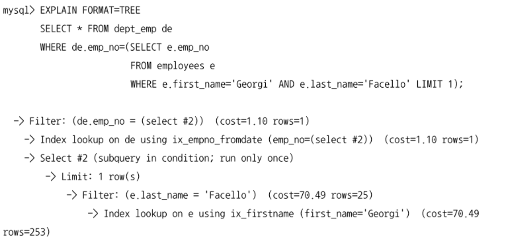
  - MySQL 5.5 이전까지는 dept_emp 테이블을 풀 스캔하면서 서브쿼리의 조건에 일치하는지 확인했다.
  - MySQL 5.5 부터는 서브쿼리를 먼저 실행한 후 상수로 변환한 후 나머지 쿼리를 처리한다.
  - employees 테이블의 ix_firstname 인덱스로 서브쿼리를 처리한 후, 결과를 이용해서 dept_emp 테이블의 ix_empno_fromdate 인덱스로 나머지 쿼리를 처리한다.
  - 단일 값 비교가 아닌 튜플 비교 방식이 사용되면 서브쿼리가 먼저 처리되어 상수화되긴 하지만 외부 쿼리는 인덱스를 사용하지 못하고 풀 테이블 스캔을 실행한다.
    ```sql
      explain
      select *
      from dept_emp de
      where (emp_no, from_date) = (
        select emp_no, from_date
        from salaries
        where emp_no=100001 limit 1);
    ```
    
- in 비교 (in subquery)
  - semi join: 테이블의 레코드가 다른 테이블의 레코드를 이용한 표현식과 일치하는지 체크하는 형태

  ```sql
    select *
    from employees e
    where e.emp_no in
      (select de.emp_no from dept_emp de where de.from_date='1995-01-01');
  ```
  - MySQL 5.5 까지는 세미 조인의 최적화가 매우 부족해서 대부분 풀 테이블 스캔을 했다.
  - MySQL 5.6 ~ 8.0 까지 세미 조인의 최적화가 많이 개선됨
  - MySQL 서버의 세미 조인 최적화는 쿼리 특성이나 조인 관계에 맞게 5개의 최적화 전략을 선택적으로 사용한다.
    - 테이블 풀-아웃 (Table Pull-out)
    - 퍼스트 매치 (Firstmatch)
    - 루스 스캔 (Loosescan)
    - 구체화 (Materialization)
    - 중복 제거 (Duplicated Weed-out)
- not in 비교 (not in subquery)
  - `in subquery`와 비슷한 형태지만 안티 세미 조인이라고 한다.
  - MySQL 옵티마이저는 안티 세미 조인 쿼리가 사용되면 2가지 방법으로 최적화를 수행한다.
    - NOT EXISTS
    - 구체화 (Materialization)
  - 두 가지 모두 성능 향상에 별로 도움은 되지 않으므로 쿼리가 최대한 다른 조건을 활용해서 데이터 검색 범위를 좁힐 수 있게 하는 것이 좋다.
  - where절에 단독으로 안티 세미 조인 조건만 있다면 풀 테이블 스캔을 피할 수 없으니 주의

### CTE (Common Table Expression)
- 이름을 가지는 임시테이블로서 SQL 문장 내에서 한 번 이상 사용될 수 있다.
- SQL 문장이 종료되면 자동으로 CTE 임시 테이블은 삭제된다.
- 재귀적 반복 실행 여부를 기준으로 Non-recursive / Recursive CTE로 구분
- MySQL 서버의 CTE는 재귀 여부에 관계없이 아래의 SQL문장에서 사용할 수 있다.
  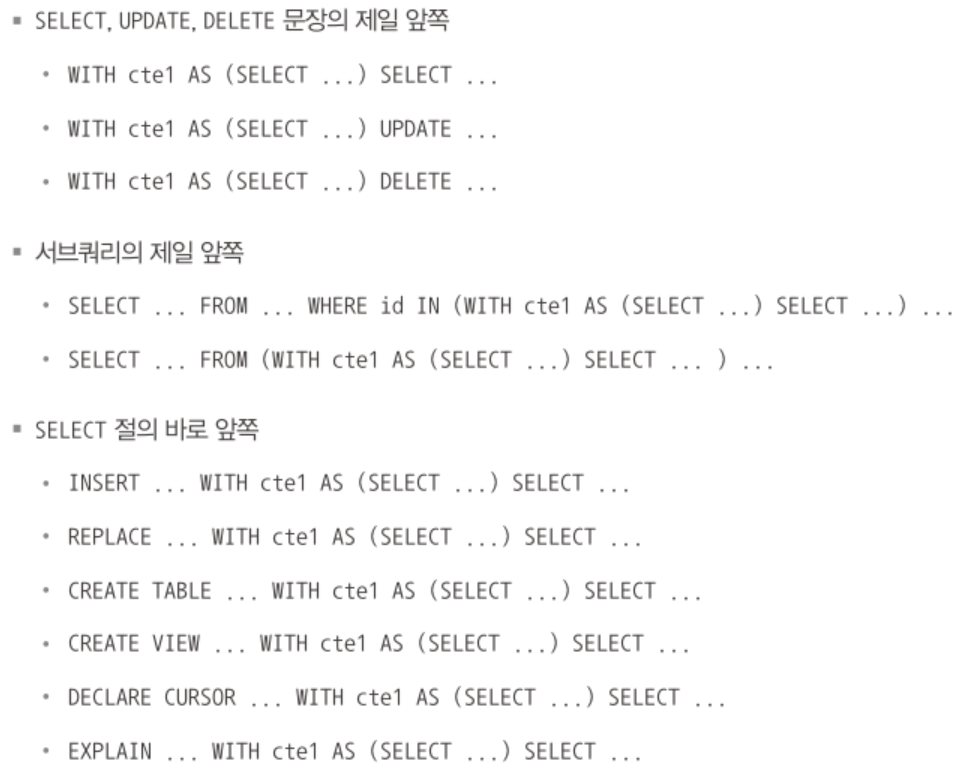

#### 비 재귀적 CTE (Non-Recursive CTE)
- WITH절을 이용해서 정의
  ```sql
    with cte1 as (select * from departments)
    select * from cte1;
  ```
  - cte1 임시 테이블은 한번만 사용되기 때문에 from절의 서브쿼리로 바꿔서 사용할 수 있음
    ```sql
      select *
      from (select * from departments) cte1;
    ```
    - 위 두 쿼리는 실행 계획까지 동일하다.
- 여러 개의 임시 테이블을 하나의 쿼리에서 사용할 수 있다.
  ```sql
    -- CTE를 이용한 쿼리
    explain
    with cte1 as (select emp_no, min(from_date) from salaries group by emp_no)
    select * from employees e
      inner join cte1 t1 on t1.emp_no=e.emp_no
      inner join cte1 t2 on t2.emp_no=e.emp_no;
  ```
  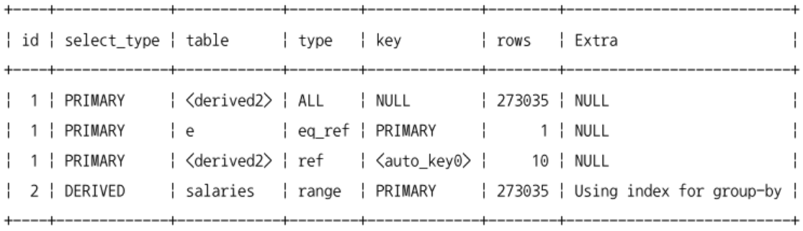

  ```sql
    -- FROM 절의 서브쿼리를 이용한 쿼리
    explain
    select * from employees e
      inner join (select emp_no, min(from_date) from salaries group by emp_no) t1
        on t1.emp_no=e.emp_no
      inner join (select emp_no, min(from_date) from salaries group by emp_no) t2
        on t2.emp_no=e.emp_no
  ```
  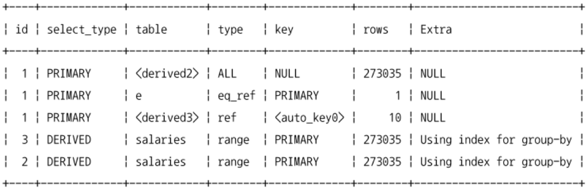
  - cte를 이용한 쿼리는 salaries 테이블을 1번 읽어서 cte1 임시테이블을 1번만 생성한다.
  - from절의 서브쿼리를 이용한 쿼리는 salaries 테이블을 2번 읽어서 cte1 임시테이블을 2번 생성한다.
- CTE로 생성된 임시테이블은 다른 CTE 쿼리에서 참조할 수 있다.
  ```sql
    with
      cte1 as (select emp_no, min(from_date) as salary_from_date
               from salaries
               where salary between 50000 and 51000
               group by emp_no),
      cte2 as (select de.emp_no, min(from_date) as dept_from_date
               from cte1
                inner join dept_emp de on de.emp_no=cte1.emp_no
               group by emp_no)
    select * from employees e
      inner join cte1 t1 on t1.emp_no=e.emp_no
      inner join cte2 t2 on t2.emp_no=e.emp_no;
  ```
  - cte2 테이블은 직전에 정의된 cte1 테이블을 이용함
  - 먼저 정의된 cte1에서는 cte2를 참조할 수 없음
- CTE를 재귀적으로 사용하지 않더라도 FROM 서브쿼리에 비해 장점 3가지
  - CTE 임시 테이블은 재사용 가능하므로 FROM 절의 서브쿼리보다 효율적이다.
  - CTE로 선언된 임시 테이블은 다른 CTE 쿼리에서 참조할 수 있다.
  - CTE는 임시 테이블의 생성 부분과 사용 부분의 코드를 분리할 수 있으므로 가독성이 높다.

#### 재귀적 CTE (Recursive CTE)
- MySQL 8.0부터 CTE를 이용한 재귀 쿼리가 가능해짐
  - 원백 프로젝트에서 MySQL 서버를 사용하기 어렵다고 했던 재귀 쿼리 기능

```sql
  with recursive cte (no) as (
    select 1
    union all
    select (no + 1) from cte where no < 5
  )
  select * from cte;
```
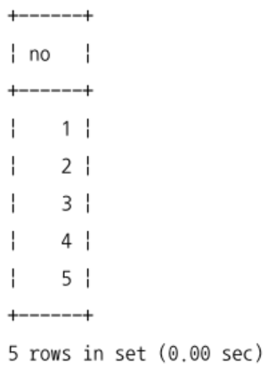
- 비 재귀적 CTE는 쿼리를 한번만 실행 -> 임시테이블로 저장
- 재귀적 CTE 쿼리 = 비재귀적 쿼리 파트 + 재귀적 파트
  - 둘을 union(union distinct) or union all로 연결하는 형태로 쿼리를 작성해야 한다.
  - 위 쿼리에서 union all 위쪽의 select 1은 비재귀적 파트, union all 아래 select 부분이 재귀적 파트에 해당
  - 비재귀적 파트는 처음 한번만 실행, 재귀적 파트는 쿼리 결과가 없을 때까지 반복 실행
- 위 쿼리가 작동하는 방법
  1. CTE 쿼리의 비 재귀적 파트의 쿼리를 실행
  2. 1의 결과를 이용해서 cte 임시 테이블 생성
  3. 1의 결과를 cte 임시 테이블에 저장
  4. 1의 결과를 입력으로 사용해서 CTE 쿼리의 재귀적 파트의 쿼리를 실행
  5. 4의 결과를 cte 임시 테이블에 저장
    - union or union distinct의 경우 중복 제거
  6. 이전 단계를 입력으로 사용해서 CTE 쿼리의 재귀적 파트의 쿼리를 실행
  7. 6의 결과가 없다면 CTE 쿼리를 종료
  8. 6의 결과를 cte 임시 테이블에 저장
  9. 6으로 돌아가서 반복 실행

  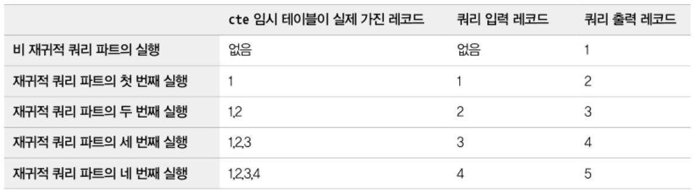
- 데이터의 오류나 쿼리 작성자의 실수로 쿼리가 무한 반복되는 경우도 있음
  - cte_max_recursion_depth 시스템 변수를 이용해서 최대 반복 실행 횟수를 제한할 수 있다.
  - 기본값은 1000, 가능하면 적절히 낮은 값으로 변경하고 필요한 경우에만 늘리는 방법을 권장
    ```sql
      set cte_max_recursion_depth=10;
    ```
    ```sql
      with recursive cte (no) as (
        select 1 as no
        union all
        select (no + 1) as no from cte where no < 1000
      )
      select /*+ set_var(cte_max_recursion_depth=10000) */ * from cte;
    ```

#### 재귀적 CTE (Recursive CTE) 활용
```sql
  create database test;
  use test;

  create table test.employees (
    id          int primary key not null,
    name        varchar(100) not null,
    manager_id  int null,
    index (manager_id),
    foreign key (manager_id) references employees (id)
  );

  insert into test.employees values
    (333, "Yasmina", NULL),
    (198, "John", 333),
    (692, "Tarek", 333),
    (29, "Pedro", 198),
    (4610, "Sarah", 29),
    (72, "Pierre", 29),
    (123, "Adil", 692);
```
```sql
  -- Adil의 상위 조직장을 찾는 쿼리
  with recursive
    managers as (
      select *, 1 as lv from employees where id=123
      union all
      select e.*, lv+1 from managers m
        inner join employees e on e.id=m.manager_id and m.manager_id is not null
    )
  select * from managers
  order by lv desc;
```
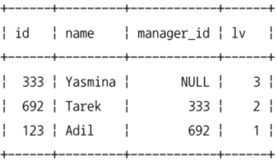
- cte 임시 테이블인 managers 테이블과 employees 테이블을 조인
- 조직의 레벨을 가져오기 위해 lv 컬럼 추가
- 상위 조직장 순서대로 정렬

```sql
  -- 조직의 최상위 조직장부터 상위 조직장들을 순서대로 나열하는 쿼리
  with recursive
    managers as (
      select *,
             cast(id as char(100)) as manager_path,
             1 as lv
      from employees where manager_id is null
      union all
      select e.*,
             concat(e.id, ' -> ', m.manager_path) as manager_path,
             lv+1
      from managers m
        inner join employees e on e.manager_id=m.id
    )
  select * from managers
  order by lv desc;
```
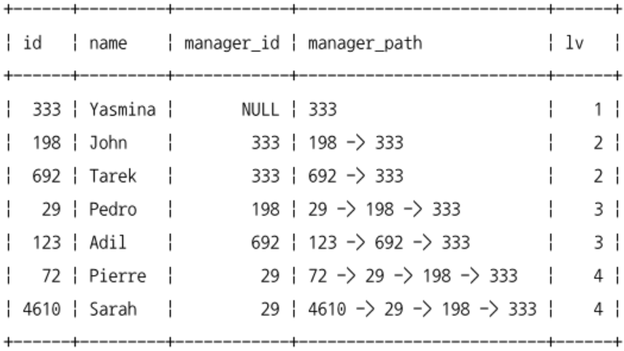

### 윈도우 함수 (Window Function)
- 조회하는 현재 레코드를 기준으로 연관된 레코드 집합의 연산을 수행
- 집계 함수: 주어진 그룹별로 하나의 레코드로 묶어서 출력
- 윈도우 함수: 조건에 일치하는 레코드 건수는 변하지 않고 그대로 유지

#### 쿼리 각 절의 실행 순서

- from, where, group by, having절에 의해 결정된 이후에 윈도우 함수가 실행
- 이후에 select, order by, limit절이 실행되어 최종 결과가 나옴
- 위 순서를 벗어나는 쿼리를 작성하려면 from절의 서브쿼리를 사용해야 한다.

```sql
  select emp_no, from_date, salary, avg(salary), over() as avg_salary
  from salaries
  where emp_no=10001
  limit 5;
```
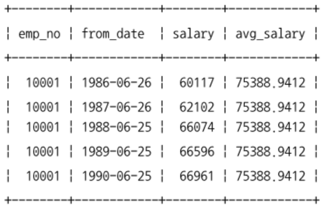

```sql
  select emp_no, from_date, salary, avg(salary), over() as avg_salary
  from (select * from salaries where emp_no=10001 limit 5) s2;
```
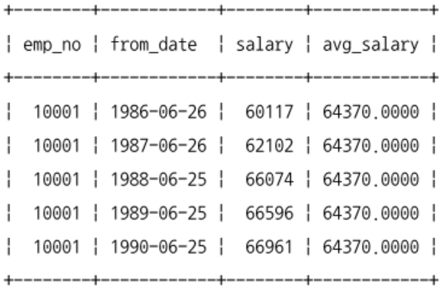
- 첫번째 쿼리는 조건에 맞는 레코드를 모두 가져온 다음 limit을 사용
  - 모든 레코드 17건의 평균이 출력됨
- 두번째 쿼리는 5건의 레코드를 미리 가져온 후 평균 계산

#### 윈도우 함수 기본 사용법
```sql
  aggregate_func() over(<partition> <order>) as window_func_column
```
- 집계 함수와는 달리 뒤에 over 절을 이용해서 연산 대상을 파티션하기 위한 옵션을 명시할 수 있다.
  - over절에 의해 만들어진 그룹을 파티션 or 윈도우라고 한다.

```sql
  -- 전체 레코드의 rank
  select e.*,
    rank() over(order by e.hire_date) as hire_date_rank
  from employees e;
```
```sql
  -- 부서별로 rank
  select de.dept_no, e.emp_no, e.first_name, e.hire_date,
    rank() over(partition by de.dept_no order by e.hire_date) as hire_date_rank
  from employees e
    inner join dept_emp de on de.emp_no=e.emp_no
  order by de.dept_no, e.hire_date;
```
- 소그룹 파티션이나 정렬이 필요하지 않은 경우 over()절을 사용하면 된다.
- 윈도우 함수의 각 파티션 안에서도 연산 대상 레코드별로 연산을 수행할 소그룹이 사용되며, 프레임이라고 함
  - 프레임은 레코드의 순서대로 현재 레코드 기준 앞뒤 몇 건을 연산 범위로 제한하는 역할을 한다.
  - 윈도우 함수에서 프레임을 명시적으로 지정하지 않아도 MySQL 서버는 상황에 맞게 프레임을 묵시적으로 선택한다.
  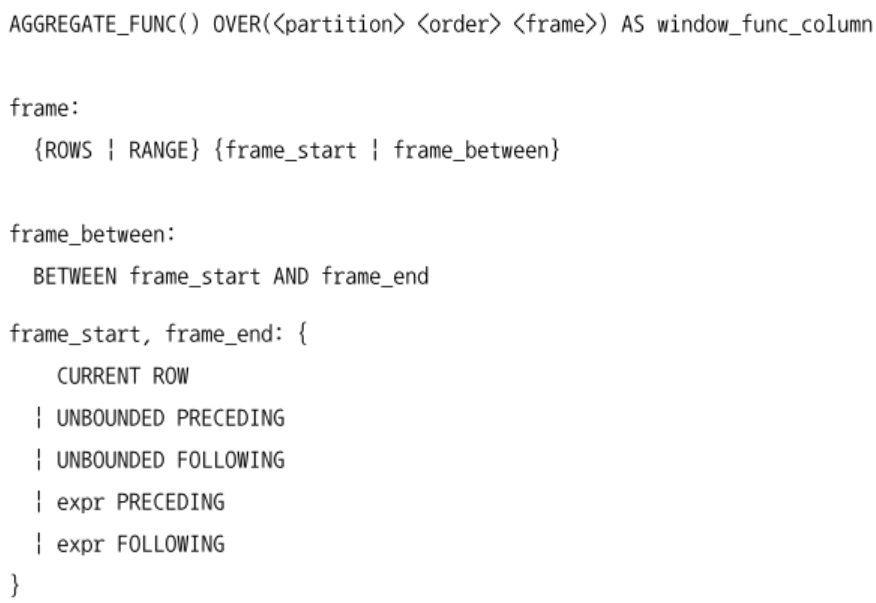
  - 프레임을 만드는 기준으로 rows와 range 중 하나를 선택한다.
    - rows: 레코드의 위치를 기준으로 프레임을 생성
    - range: order by절에 명시된 컬럼을 기준으로 값의 범위로 프레임 생성
  - 프레임의 시작과 끝을 의미하는 키워드들의 의미
    - current row: 현재 레코드
    - unbounded preceding: 파티션의 첫번째 레코드
    - unbounded following: 파티션의 마지막 레코드
    - expr preceding: 현재 레코드로부터 n번째 이전 레코드
    - expr following: 현재 레코드로부터 n번째 이후 레코드
  - 프레임이 rows로 구분되면 expr에는 레코드의 위치를 명시하고, range로 구분되면 expr에는 컬럼과 비교할 값이 설정되어야 한다.
    - 10 preceding: 현재 레코드로부터 10건 이전부터
    - interval 5 day preceding: 현재 레코드의 order by 컬럼값보다 5일 이전 레코드부터
    - 5 following: 현재 레코드로부터 5건 이후까지
    - interval '2:30' minute_second following: 현재 레코드의 order by 컬럼값보다 2분 30초 이후까지
  - frame절 예시
    - rows unbounded preceding: 파티션의 첫번째 레코드로부터 현재 레코드까지
    - rows between unbound preceding and current row: 파티션의 첫번째 레코드로부터 현재 레코드까지
    - rows between 1 preceding and 1 following: 파티션에서 현재 레코드를 기준으로 앞 레코드부터 뒤 레코드까지
    - range interval 5 day preceding: order by에 명시된 컬럼의 값이 5일 전인 레코드부터 현재 레코드까지
    - range between 1 dat preceing and 1 day following: order by에 명시된 컬럼의 값이 1일 전인 레코드부터 1일 이후인 레코드까지
- 프레임이 고정되어 있는 윈도우 함수
  - SQL 문장에서 프레임을 별도로 명시하더라도 아래 윈도우 함수에는 무시됨
  - 자동으로 프레임이 파티션의 전체 레코드로 설정됨
  - CUME_DIST()
  - DENSE_RANK()
  - LAG()
  - LEAD()
  - NTILE()
  - PERCENT_RANK()
  - RANK()
  - ROW_NUMBER()

#### 윈도우 함수
- MySQL 서버의 윈도우 함수는 집계 함수와 비 집계 함수를 모두 사용할 수 있다.
- 집계 함수는 over()절 없이 단독으로도 사용할 수 있다.
- 비 집계 함수는 반드시 over()절을 갖고 있어야하며 윈도우 함수로만 사용될 수 있다.

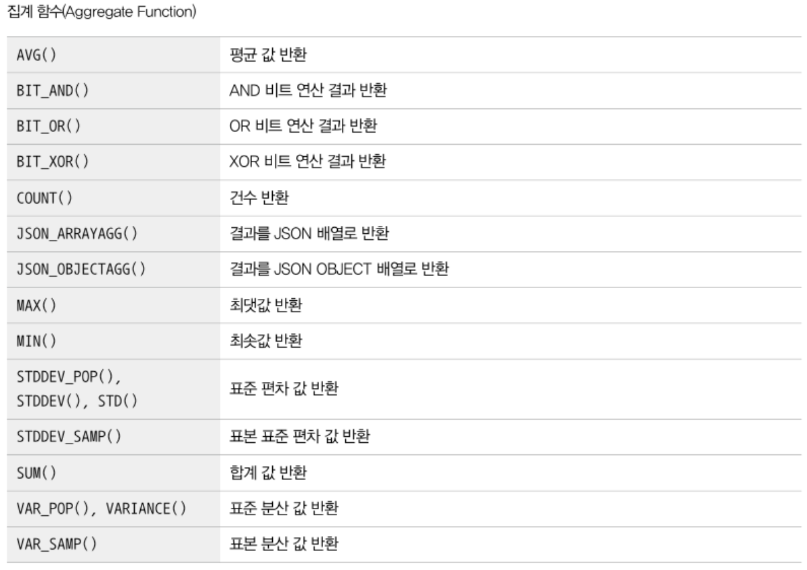


- DENSE_RANK()와 RANK(), ROW_NUMBER()
  - DENSE_RANK, RANK는 order by 기준으로 매겨진 순위를 반환
  - row_number는 각 레코드의 고유한 순번을 반환

  ```sql
    -- rank
    select de.dept_no, e.emp_no, e.first_name, e.hire_date,
      rank() over(partition by de.dept_no order by e.hire_date) as hire_date_rank
    from employees e
      inner join dept_emp de on de.emp_no=e.emp_no
    where de.dept_no='d001'
    order by de.dept_no, e.hire_date
    limit 20;
  ```
  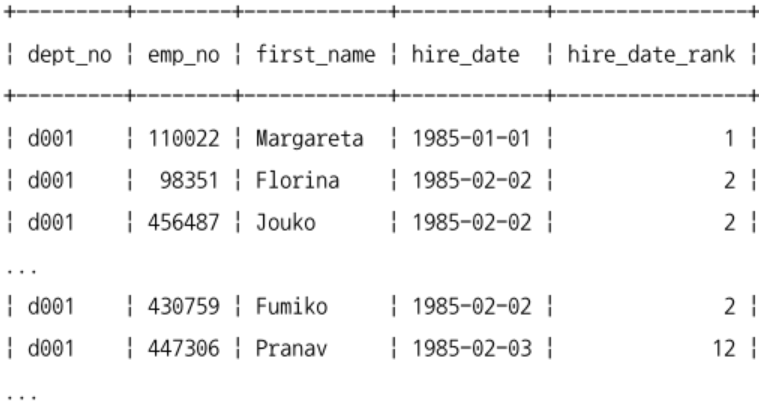
  ```sql
    -- dense_rank
    select de.dept_no, e.emp_no, e.first_name, e.hire_date,
      dense_rank() over(partition by de.dept_no order by e.hire_date) as hire_date_rank
    from employees e
      inner join dept_emp de on de.emp_no=e.emp_no
    where de.dept_no='d001'
    order by de.dept_no, e.hire_date
    limit 20;
  ```
  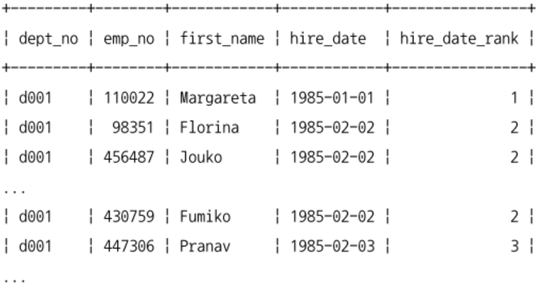
  ```sql
    -- row_number
    select de.dept_no, e.emp_no, e.first_name, e.hire_date,
      row_number() over(partition by de.dept_no order by e.hire_date) as hire_date_rank
    from employees e
      inner join dept_emp de on de.emp_no=e.emp_no
    where de.dept_no='d001'
    order by de.dept_no, e.hire_date
    limit 20;
  ```
  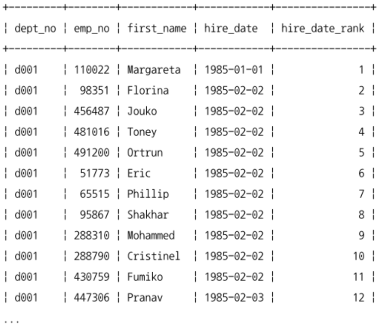
- LAG()와 LEAD()
  - LAG: 파티션 내에서 현재 레코드를 기준으로 n번째 이전 레코드를 반환
  - LEAD: 파티션 내에서 현재 레코드를 기준으로 n번째 이후 레코드를 반환
  - 1, 2번째 파라미터는 필수, 3번째 파라미터는 선택
  
  ```sql
    select from_date, salary,
      lag(salary, 5) over(order by from_date) as prior_5th_value,
      lead(salary, 5) over(order by from_date) as next_5th_value,
      lag(salary, 5, -1) over(order by from_date) as prior_5th_with_default,
      lead(salary, 5, -1) over(order by from_date) as next_5th_with_default
    from salaries
    where emp_no=10001;
  ```
  

#### 윈도우 함수와 성능
- MySQL 8.0부터 윈도우 함수가 도입되어 아직 인덱스를 이용한 최적화가 부족한 부분도 있음

```sql
  select max(from_date) over(partition by emp_no) as max_from_date
  from salaries;

  select max(from_date) from salaries group by emp_no;
```
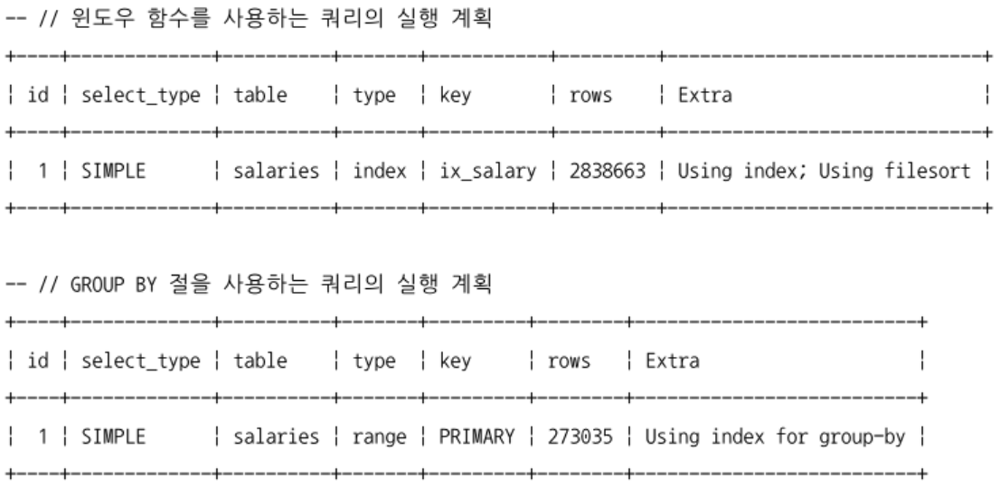
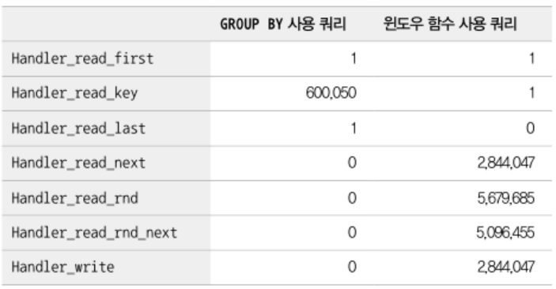
- 윈도우 함수를 사용한 쿼리는 인덱스 풀스캔, 레코드 정렬 작업
- group by절을 사용한 쿼리는 루스 인덱스 스캔
- 실제 두 쿼리가 연산에 사용한 레코드 건수도 많은 차이가 남
- 쿼리 요건에 따라 group by나 다른 기존 기능으로는 윈도우 함수를 대체할 수는 없겠지만 윈도우 함수에 너무 의존하지 않는 것이 좋음
  - 배치 프로그램이라면 윈도우 함수를 사용해도 무방
  - 온라인 트랜잭션 처리에서는 많은 레코드에 대해 윈도우 함수를 적용하는 것을 피해야함

### 잠금을 사용하는 SELECT
- InnoDB는 select할때 레코드에 아무런 잠금을 하지 않음 (잠금 없는 읽기, Non Locking Cosistent Read)
  - 칼럼 값을 변경하혀면 다른 트랜잭션이 그 값을 변경하지 못하게 해야 한다.
  - 레코드를 읽으면서 강제로 잠금을 걸어둠
    - `for share`: select 쿼리로 읽은 레코드에 대해서 읽기 잠금을 걸음
    - `for update`: select 쿼리가 읽은 레코드에 대해서 쓰기 잠금을 걸음
  ```sql
    select * from employees where emp_no=10001 for share;
    select * from employees where emp_no=10001 for update;
  ```
  - MySQL 8.0 이전에는 읽기 잠금을 위해 `lock in share mode`절을 사용
    - MySQL 8.0에도 지원을 하지만 가능하면 for share 사용을 권장
  - auto-commit이 비활성화된 상태 or begin 명령이나 start transaction 명령으로 트랜잭션이 시작된 상태에서만 잠금이 유지된다.
    - for share절은 select된 레코드에 대해 읽기 잠금을 설정하고 다른 세션에서 해당 레코드를 변경하지 못하게 한다.
    - for update절은 쓰기 잠금을 설정하고 다른 트랜잭션에서는 그 레코드를 변경하는것 뿐만 아니라 읽기도 수행할 수 없다.

#### for update / for share절을 가지지 않는 select 쿼리
- InnoDB를 사용하는 테이블은 잠금 없는 읽기가 지원되기 때문에 특정 레코드가 잠겨진 상태라고 해도 for update / for share를 가지지 않은 단순 select 쿼리는 아무런 대기 없이 실행된다.

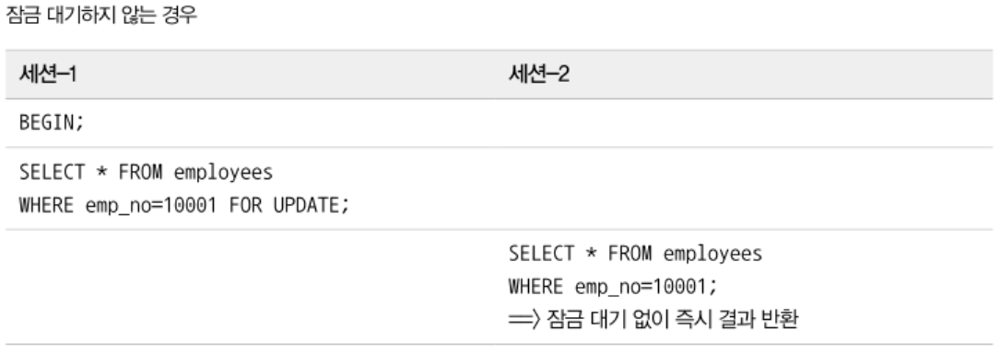
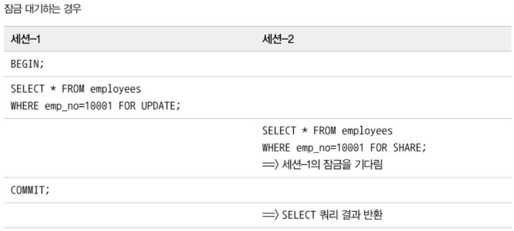

#### 잠금 테이블 선택
```sql
  select *
  from employees e
    inner join dept_emp de on de.emp_no=e.emp_no
    inner join departments d on d.dept_no=de.dept_no
  for update;
```
- employees, dept_emp, departments 테이블을 조인해서 읽으면서 for update 사용
  - innodb 스토리지 엔진은 3개 테이블에서 읽은 레코드에 대해 모두 잠금을 걸음
- 잠금을 employees에만 걸고싶다면
  - MySQL 8.0 이전에는 선택적으로 잠금을 걸 수 있는 옵션이 없었음
  - MySQL 8.0 부터는 잠금을 걸 테이블을 선택할 수 있도록 개선됨
    - `for update table` `for share e`

#### NOWAIT & SKIP LOCKED
- MySQL 8.0부터 추가된 기능
- 지금까지의 잠금은 누군가가 레코드를 잠그고 있으면 다른 트랜잭션은 해제될때까지 기다려야 했음
  - 일정 시간이 지나면 잠금 획득 실패 에러 메시지를 받을 수도 있음

```sql
  begin;
  select * from employees where emp_no=10001 for update;
  -- sql
  update employees set ... where emp_no=10001;
  commit;
```
- 먼저 실행된 트랜잭션이 emp_no=10001인 레코드에 변경 연산을 장시간 수행하고 있다면 위 쿼리는 앞 트랜잭션이 종료될때까지 기다리거나 innodb_lock_wait_timeout 시스템 변수에 설정된 시간동안 기다렸다가 에러메시지를 받는다. (default는 50초)
- NOWAIT
  ```sql
    select * from employees
    where emp_no=10001
    for update nowait;
  ```
  - 해당 레코드가 이미 잠겨진 상태라면 무시하고 에러를 반환 -> 응용 프로그램에서 다른 작업을 수행하거나 다시 트랜잭션을 시작하도록 구현해야할 때가 있음
  - select 쿼리의 마지막에 nowait 옵션을 사용
  - for update나 for share절이 없다면 nowait 사용의 의미가 없음
  - 해당 레코드에 대해 즉시 잠금을 획득했다면 nowait 옵션이 없을때와 동일
  - 다른 트랜잭션에 대해 잠겨진 상태라면 에러를 반환하고 쿼리는 즉시 종료
    ```sql
      ERROR 3572 (HY000): Statement aborted
        because lock(s) could not be cquired imediately and NOWAIT it set.
    ```
- SKIP LOCKED
  ```sql
    begin;
    select * from salaries where emp_no=10001 for update skip locked;
    -- sql
    update salaries set ... where emp_no=10001 and from_date='1986-06-26';
    commit;
  ```
  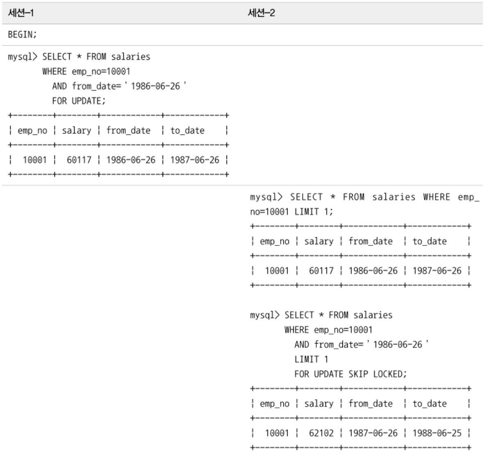
  - 레코드가 잠겨진 상태라면 에러 반환X, 잠긴 레코드는 무시, 잠금이 걸리지 않은 레코드만 가져옴
  - 세션 1에서 레코드를 잠근 상태에서
    - 세션 2에서 for update절 없이 그냥 실행했을 때 세션1과 동일한 레코드 반환
    - 세션 2에서 for update skip locked절 추가 시 잠긴 데이터는 무시하고 그 다음 레코드 반환
      - skip locked를 가진 select 구문은 확정적이지 않은 쿼리가 된다. (not-deterministic)
      - 확정적(deterministic)이라는 것은 시점에 관계없이 동일한 결과를 반환하는 것
- queue와 같은 기능을 MySQL 서버에서 구현할 대 유용
  - ex. 쿠폰 발금 기능
    - 하나의 쿠폰은 한 사용자만 사용 가능
    - 쿠폰의 갯수는 1000개 제한, 선착순으로 요청한 사용자에게 발급
  ```sql
    create table coupon (
      coupon_id bigint not null,
      owned_user_id bigint null default 0,
      coupon_code varchar(15) not null,
      ...
      primary key(coupon_id),
      index ix_owneduserid(owned_user_id);
    );
  ```
  ```sql
    begin;
    select * from coupon
    where owned_user_id=0 order by coupon_id asc limit 1 for update;
    -- sql
    update coupon set owned_user_id=? where coupon_id=?;
    commit;
  ```
  - 주인이 없는 쿠폰을 검색해서 하나를 가져옴
  - 해당 쿠폰을 가져가지 못하도록 for update절 사용
  - 동시에 1000명의 사용자가 쿠폰 요청 시 서버는 1000개의 트랜잭션을 실행
  - 최초 1개의 트랜잭션이 잠금 획득, 나머지 999개의 트랜잭션은 commit 될때까지 기다림
  - 트랜잭션 처리속도에 따라서 일정시간동안 잠금을 획득하지 못하고 에러를 반환
  - MySQL 8.0 이전까지는 문제 해결을 위해 redis나 memcached 같은 캐시 솔루션을 별도로 구축해서 해당 기능을 구현
  - MySQL 8.0 부터는 for update skip locked절 사용 -> 잠겨진 레코드를 스킵하는 시간만 지나면 트랜잭션을 실행할 수 있음

  
  
- NOWAIT, SKIP LOCKED절은 `SELECT ... FOR UPDATE` 구문에서만 사용 가능
  - UPDATE, DELETE절에는 사용 불가
  - 쿼리 자체를 비정확적으로 만들기 때문에 수정이나 삭제마다 db를 다른 상태로 만들게 됨
