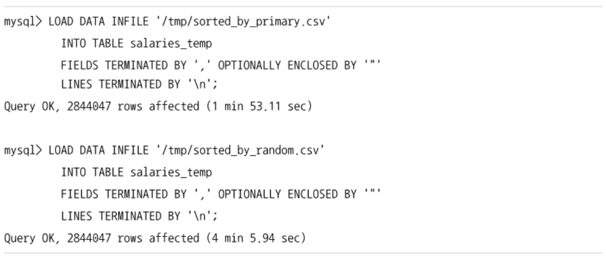

## 고급 옵션
### INSERT IGNORE
- 저장하는 레코드의 PK나 유니크 인덱스 컬럼의 값이 이미 테이블에 존재하는 경우, 저장하는 레코드의 컬럼이 테이블의 컬럼과 호환되지 않는 경우 모두 무시하고 다음 레코드를 처리하게 함
- 여러 레코드를 하나의 insert문장으로 처리할 때 유용

```sql
  insert ignore into salaries (emp_no, salary, from_date, to_date) values
  (10001, 60117, '1986-06-26', '1987-06-26'),
  (10001, 60117, '1986-06-26', '1987-06-26'),
  (10001, 60117, '1986-06-26', '1987-06-26'),
  (10001, 60117, '1986-06-26', '1987-06-26'),
  (10001, 60117, '1986-06-26', '1987-06-26');
```
- 일반적인 insert문은 중복 레코드로 인해 에러발생, ignore 사용 시 에러를 경고 수준의 메시지로 바꾸고 나머지 레코드의 insert를 진행
- insert하는 테이블이 PK, 유니크 키 인덱스를 동시에 갖고있는 경우 하나라도 중복되면 ignore됨
- 데이터 타입이 일치하지 않는 경우 컬럼의 기본값으로 insert하도록 만들 수 있음

```sql
  -- not null 컬럼의 경우 기본 값을 저장
  insert ignore into salaries values (null, null, null, null);
```

### INSERT ... ON DUPLICATE KEY UPDATE
- PK나 유니크 인덱스의 중복이 발생하면 UPDATE 문장의 역할을 수행한다.
  - 기존 레코드를 삭제하지 않고 기존 레코드를 UPDATE한다.
  - REPLACE 문장과 비슷하지만 REPLACE는 DELETE, INSERT의 조합으로 작동함
- 일별로 집계되는 값을 관리할 때 편리하게 사용 가능

```sql
  create table daily_statistic (
    target_date date not null,
    stat_name varchar(10) not null,
    stat_value bigint not null default 0,
    primary key(target_date, stat_name)
  );

  insert into daily_statistic (target_date, stat_name, stat_value)
    values (date(now()), 'visit', 1)
    on duplicate key update stat_value=stat_value+1;
```
- 레코드가 존재한다면 on duplicate key update절 이하의 내용이 실행됨

```sql
  insert into daily_statistic
    select date(visited_at), 'visit', count(*)
    from access_log
    group by date(visited_at)
    on duplicate key update stat_value=stat_value + values(stat_value);
```
- on duplicate key update절에는 count(*)를 사용할 수 없음 -> values 함수를 사용
  - stat_value 컬럼에 insert하려고 했던 값을 다시 가져올 수 있음
  - MySQL 8.0.20 이후 버전에는 values() 함수가 지원되지 않음 (Deprecated)
    ```sql
      insert into daily_statistic
        select target_date, stat_name, stat_value
        from (
          select date(visited_at) target_date, 'visit' stat_name, count(*) stat_value
          from access_log
          group by date(visited_at)
        ) stat
        on duplicate key update
          daily_statistic.stat_value=daily_statistic.stat_value+stat.stat_value;
    ```
    - insert ... select 형태의 문법이 아니라면 insert되는 레코드에 별칭을 부여해서 참조하는 문법 사용 가능
      ```sql
        insert into daily_statistic (target_date, stat_name, stat_value)
          values ('2020-09-01', 'visit', 1),
                 ('2020-09-02', 'visit', 1)
            as new
          on duplicate key update
            daily_statistic.stat_value=daily_statistic.stat.value+new.stat_value;
      ```

## LOAD DATA 명령 주의 사항
- 일반적인 RDBMS에서 데이터를 빠르게 적재할 수 있는 방법으로 자주 소개됨
- MySQL 서버의 load data 명령도 내부적으로 MySQL 엔진과 스토리지 엔진의 호출 횟수를 최소화하고 스토리지 엔진이 직접 데이터를 적재하기 때문에 일반적인 insert 명령과 비교했을 때 빠름
- 단점
  - 단일 스레드로 실행
  - 단일 트랜잭션으로 실행
- 데이터가 매우 커서 실행 시간이 아주 길어진다면 다른 온라인 트랜잭션 쿼리들의 성능이 영향을 받을 수 있음
- 테이블에 레코드가 insert 될수록 인덱스도 커짐
- load data 문장은 단일 스레드로 실행되기 때문에 시간이 지날수록 속도가 느려짐

## 성능을 위한 테이블 구조
- insert 문장의 성능은 쿼리 문장 자체보다는 테이블 구조에 의해 많이 결정됨

### 대량 INSERT 성능
- 하나의 insert 문장으로 많은 레코드를 insert한다면 insert될 레코드들을 pk 기준으로 미리 정렬해서 insert 문장을 구성하는 것이 성능에 도움될 수 있음
- ex. 데이터를 csv로 덤프받아서 테이블에 적재할 경우
  - sorted_by_primary.csv: PK값으로 정렬해서 덤프된 csv
  - sorted_by_random.csv: 아무런 정렬 없이 덤프된 csv


- load data 문장이 레코드를 insert할 때마다 innodb 스토리지 엔진은 pk를 검색해서 레코드가 저장될 위치를 찾아야 한다.
- 정렬이 되지 않았다면 innodb 스토리지 엔진이 pk의 b-tree에서 랜덤한 위치의 페이지를 메모리로 읽어와야하기 때문에 더 느림
- PK로 정렬이 되어있다면 다음 insert할 레코드의 pk는 항상 이전 레코드보다 크기 때문에 마지막 페이지에만 적재하면 됨

### PK 선정
- PK는 insert 성능을 결정하는 가장 중요한 부분
- insert되는 레코드가 pk 기준으로 정렬되어있지 않으면 insert할 때마다 저장할 위치를 찾아야 함
- innodb 스토리지 엔진을 사용하는 테이블의 PK는 클러스터링 키인데, 세컨더리 인덱스를 이용하는 쿼리보다 PK를 이용하는 쿼리의 성능이 훨씬 빠름
  - PK는 단순히 insert 성능만을 위해 설계해서는 안됨
  - PK의 선정은 insert, select 성능의 대립되는 두 가지 요소 중에서 하나를 선택해야 함
- 대부분 온라인 트랜잭션 처리를 위한 테이블은 쓰기보다 읽기 쿼리의 비율이 압도적으로 높음
- select가 많지 없고, insert가 많은 테이블
  - PK를 단조 증가/감소하는 패턴의 값으로 선택하는 것이 좋음 (ex. 로그)
  - 인덱스의 갯수를 최소화하는 것이 좋음
- insert가 많지 않고, select가 많은 테이블
  - 쿼리에 맞게 필요한 인덱스들을 추가해도 시스템 전반적인 영향이 적음

### Auto-increment 컬럼
- select 보다는 insert에 최적화된 테이블을 생성하기 위해서는 다음 두 가지 요소를 갖춰서 테이블을 준비한다.
  - 단조 증가/감소되는 값으로 PK 선정
  - 세컨더리 인덱스 최소화
- InnoDB 스토리지 엔진을 사용하는 테이블은 자동으로 PK로 클러스터링된다.

```sql
  create table access_log (
    id bigint not null auto_increment,
    ip_address int unsigned,
    uri varchar(200),
    ...
    visited_at datetime,
    primary key(id)
  );
```
- auto_increment를 PK로 해서 테이블을 생성하는 것은 MySQL 서버에서 가장 빠른 insert를 보장하는 방법이다.
  - 세컨더리 인덱스가 하나도 없으면 더 좋음
- MySQL 서버에서는 자동 증가 값의 채번을 위해서는 잠금이 필요한데 이를 auto-inc 잠금이라고 함
  - 잠금을 사용하는 방식을 변경할 수 있도록 innodb_autoinc_lock_mode 시스템 변수를 제공한다.
  - `innodb_autoinc_lock_mode=0`
    - 항상 auto-inc 잠금을 걸고 한 번에 1씩만 증가된 값을 가져옴
    - 이전 버전과의 호환성 및 서능 비교 테스트 용도로만 사용, 서비스용 MySQL 서버에서는 사용할 필요 없음
  - `innodb_autoinc_lock_mode=1`
    - 단순히 insert하는 쿼리에서는 auto-inc 잠금을 사용하지 않고 mutex를 이용해서 더 가볍고 빠르게 처리한다.
  - `innodb_autoinc_lock_mode=2`
    - load data나 bulk insert를 포함한 insert 계열의 문장을 실행할 때 더 이상 auto-inc 잠금을 사용하지 않음
    - 자동 증가 값을 적당히 미리 할당받아서 처리할 수 있어서 가장 빠른 방식
  - MySQL 5.7까지는 기본값이 1, MySQL 8.0부터는 기본값이 2로 변경
