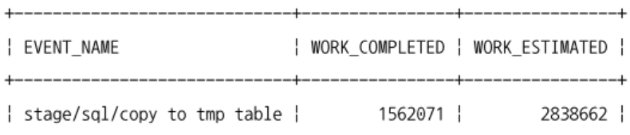
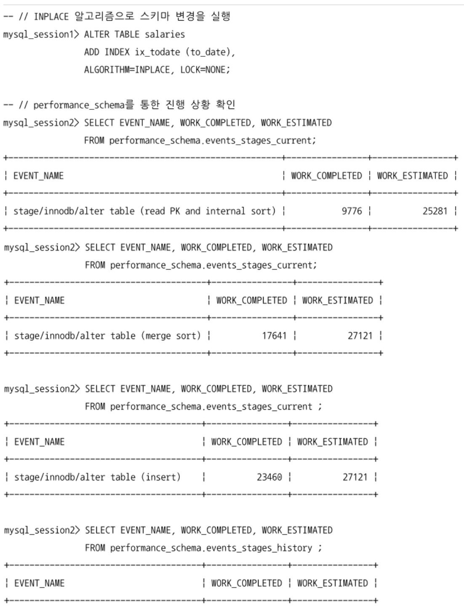
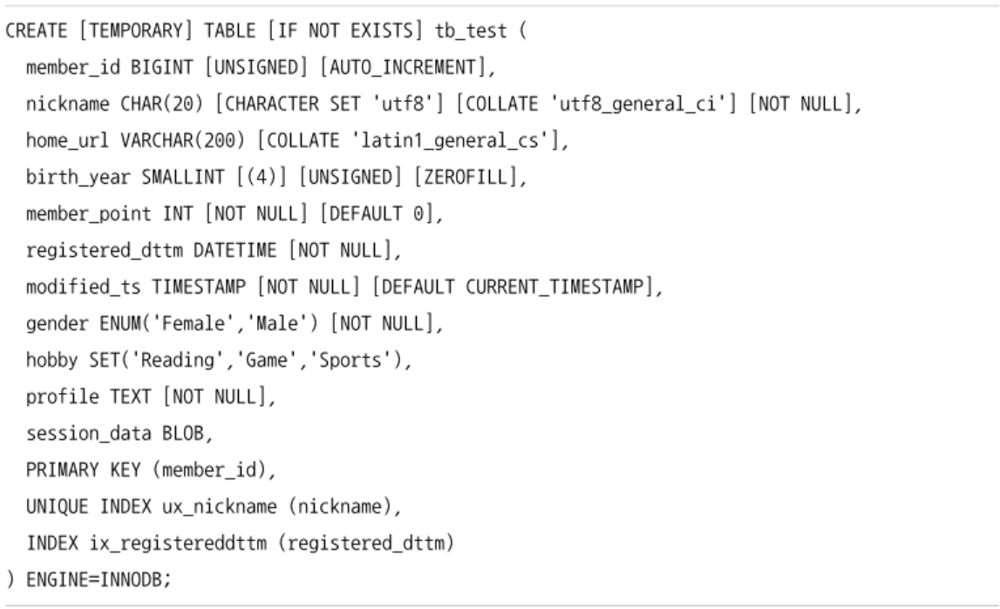
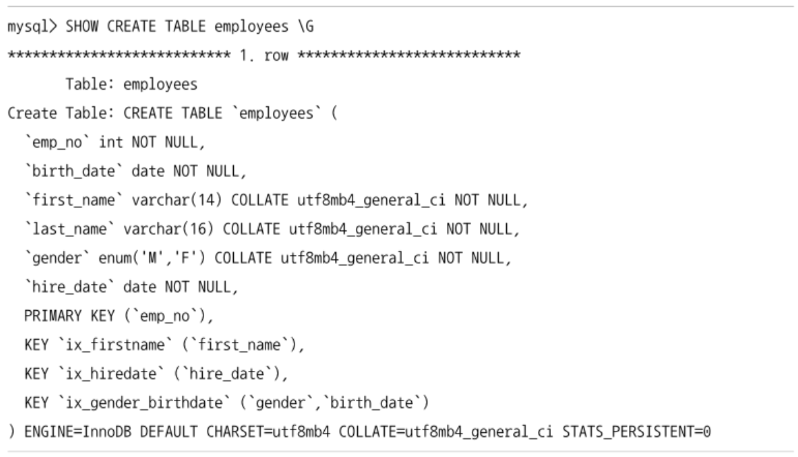
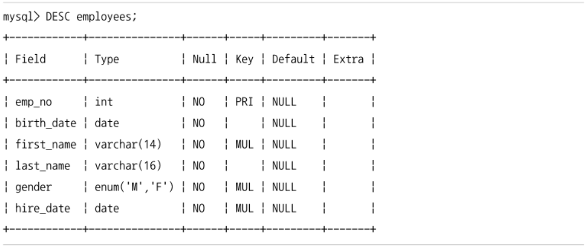
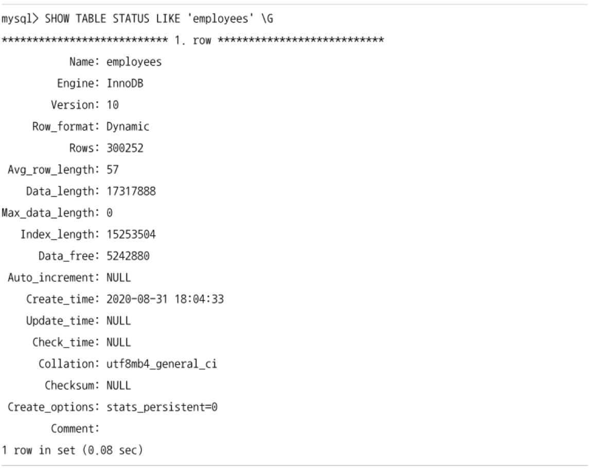
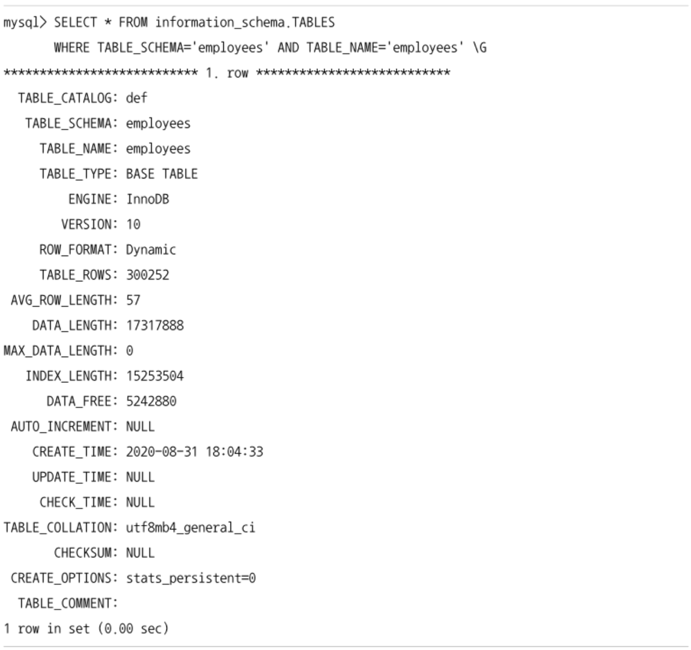
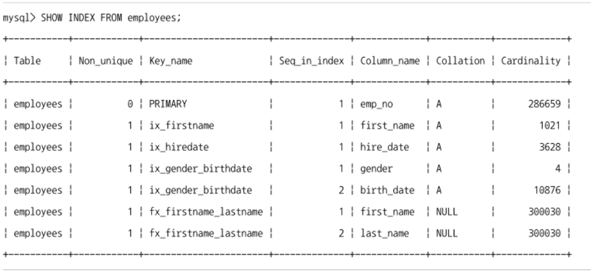
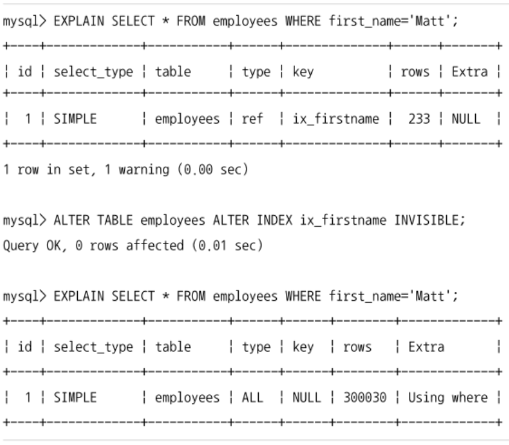
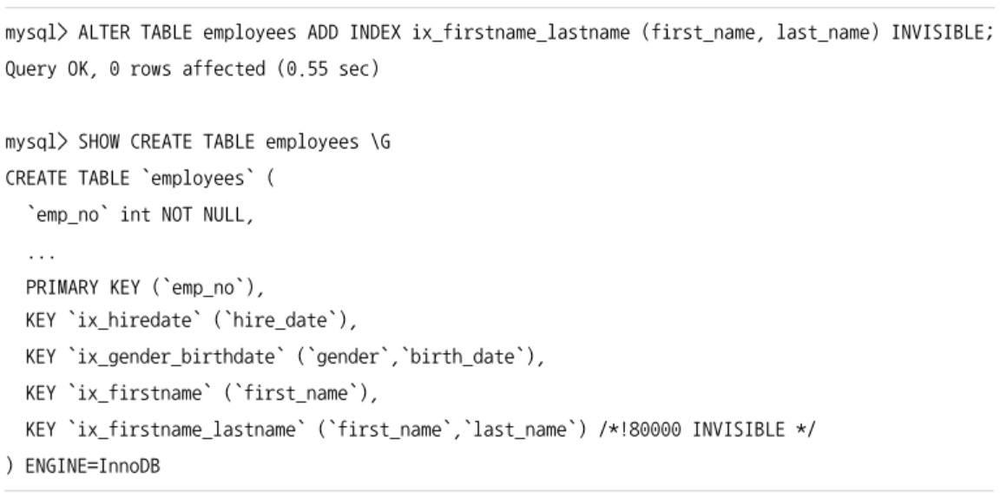

## 온라인 DDL
- MySQL 5.5 이전까지는 MySQL 서버에서 테이블의 구조를 변경하는 동안에는 다른 커넥션에서 DML을 실행할 수가 없었다.
  - 문제 해결을 위해 Percona에서 개발한 pt-online-schema-change 도구를 사용함
  - MySQL 5.5 버전도 온라인 DDL 성능, 안정성 등의 이유로 pt-online-schema-change 사용
- MySQL 8.0 부터는 대부분의 스키마 변경 작업은 MySQL 서버에 내장된 온라인 DDL 기능으로 처리가 가능해짐
  - pt-online-schema-change는 이제 거의 사용되지 않음

### 온라인 DDL 알고리즘
- 온라인 DDL은 스키마를 변경하는 작업도중에도 다른 커넥션에서 해당 테이블의 데이터를 변경/조회 작업을 가능하게 함
- ALGORITHM / LOCK 옵션을 이용해서 어떤 모드로 스키마 변경을 실행할지 결정할 수 있다.
- MySQL 서버는 old_alter_table 시스템 변수를 이용해서 alter table 명령이 온라인 ddl로 작동할지, 예전 방식 (테이블의 읽기/쓰기를 막고 스키마를 변경)으로 처리할지 결정
  - 기본 값은 OFF으로 자동으로 온라인 DDL이 활성화된다.
- ALTER TABLE 명령 실행 시 아래 순서로 스키마 변경에 적합한 알고리즘을 찾는다.
  1. ALGORITHM=INSTANT로 스키마 변경이 가능한지 확인 후 가능하다면 선택
  2. ALGORITHM=INPLACE로 스키마 변경이 가능한지 확인 후 가능하다면 선택
  3. ALGORITHM=COPY 알고리즘선택
- 스키마 변경 알고리즘의 우선순위가 낮을수록 MySQL 서버는 스키마 변경을 위해서 더 많은 잠금과 작업을 필요로 함 -> 서버의 부하도 많이 발생
  - INSTANT
    - 테이블의 데이터는 전혀 변경하지 않고, 메타데이터만 변경하고 작업 완료
    - 레코드의 수와 무관하게 작업 시간 매우 짧음
    - 스키마 변경도중 테이블의 읽기/쓰기는 대기하지만 변경 시간이 짧으므로 다른 커넥션에 영향 크게 없음
  - INPLACE
    - 임시 테이블로 데이터를 복사하지 않고 스키마 변경을 실행
    - 내부적으로 테이블의 리빌드를 실행할 수 있음
      - 레코드의 복사 작업은 없지만 테이블의 크기에 따라 많은 시간 소요
    - 스키마 변경도중에도 테이블의 읽기/쓰기 가능
      - 최초 시작/종료 시점에는 테이블의 읽기/쓰기가 불가능하지만 매우 짧은 시간이므로 다른 커넥션의 영향은 높지 않음
  - COPY
    - 변경된 스키마를 적용한 임시 테이블을 생성하고, 테이블의 레코드를 임시 테이블로 모두 복사한 후 임시 테이블을 RENAME해서 스키마 변경 완료
    - 테이블 읽기만 가능, 쓰기는 불가능
- 온라인 DDL은 알고리즘과 함께 잠금 수준도 명시 가능
  - algorithm, lock 옵션이 명시되지 않으면 MySQL 서버가 적절한 수준의 알고리즘과 잠금 수준을 선택한다.

  ```sql
    alter table salaries change to_date end_date date not null,
      algorithm=inplace, lock=none;
  ```
- INSTANT, COPY 알고리즘을 사용하는 경우 LOCK은 다음 3가지 중 하나를 명시
  - NONE: 아무런 잠금을 걸지 않음
  - SHARED: 읽기 잠금을 걸고 스키마 변경을 실행하기 때문에 스키마 변경 중 읽기는 가능, 쓰기는 불가
  - EXCLUSIVE: 쓰기 잠금을 걸고 스키마 변경을 실행하기 때문에 테이블의 읽기/쓰기 불가능
- INPLACE 알고리즘을 사용하는 경우 대부분의 잠금은 NONE이지만 가끔 SHARED 수준까지 설정해야 할 수 있음

### 온라인 처리 가능한 스키마 변경
- MySQL 서버의 모든 스키마 변경 작업이 온라인으로 가능한 것이 아니기 때문에 필요한 스키마 변경 작업의 형태가 온라인으로 처리될 수 있는지, 테이블의 읽고 쓰기가 대기하게 되는지 확인한 후 실행하는 것이 좋음
- MySQL 8.0.21 버전의 지원 사항
  [!img](./img/인덱스변경.png)
  [!img](./img/컬럼%20변경.png)
  [!img](./img/가상%20컬럼%20변경.png)
  [!img](./img/외래키%20변경.png)
  [!img](./img/테이블%20변경.png)
  [!img](./img/테이블%20스페이스%20변경.png)
  [!img](./img/파티션%20변경.png)
- ALTER TABLE 문장에 LOCK, ALGORITHM절을 명시해서 온라인 스키마 변경의 처리 알고리즘을 강제할 수 있음
  ```sql
    alter table employees drop primary key, algorithm=instant;
    alter table employees drop primary key, algorithm=inplace, lock=none;
    alter table employees drop primary key, algorithm=copy, lock=shared;
    alter table employees add primary key(emp_no), algorithm=inplace, lock=none;
  ```
  - 아래 순서로 algorithm, lock 옵션을 시도하면서 해당 알고리즘이 지원되는지 확인
    1. algorithm=instant 옵션으로 스키마 변경 시도
    2. 실패하면 algorithm=inplace, lock=none 옵션으로 스키마 변경 시도
    3. 실패하면 algorithm=inplace, lock=shared 옵션으로 스키마 변경 시도
    4. 실패하면 algorithm=copy, lock=shared 옵션으로 스키마 변경 시도
    5. 실패하면 algorithm=copy, lock=exclusive 옵션으로 스키마 변경 시도

### INPLACE 알고리즘
- 임시 테이블로 레코드를 복사하지는 않더라도 내부적으로 테이블의 모든 레코드를 리빌드해야 하는 경우가 많다.
  - 이럴 경우 MySQL 서버에서 진행되는 과정
    1. INPLACE 스키마 변경이 지원되는 스토리지 엔진의 테이블인지 확인
    2. INPLACE 스키마 변경 준비
      - 스키마 변경에 대한 정보를 준비해서 온라인 DDL 작업동안 변경되는 데이터를 추적할 준비
    3. 테이블 스키마 변경 및 새로운 DML 로깅
      - 실제 스키마 변경을 수행
      - 작업이 수행되는 동안은 다른 커넥션의 DML작업이 대기하지 않음
    4. 로그 적용
      - 온라인 DDL 작업동안 수집된 DML 로그를 테이블에 적용
    5. INPLACE 스키마 변경 완료 (COMMIT)
  - 2, 4 단계에서는 잠깐동안의 배타적 잠금이 필요, 다른 커넥션의 DML들은 대기
  - 3 단계에서는 다른 커넥션의 DML 작업이 대기 없이 즉시 처리됨

### 온라인 DDL의 실패 케이스
- 온라인 DDL이 INSTANT 알고리즘을 사용하는 경우 거의 시작과 동시에 작업이 완료되기 때문에 작업도중 실패할 가능성이 거의 없음
- INPLACE 알고리즘으로 실행되는 경우 내부적으로 테이블 리빌드 과정과 최종 로그 적용 과정이 필요해서 실패할 가능성이 상대적으로 높음
  - 몇 시간 동안 실행되던 온라인 DDL이 실패하면 상당한 자원과 시간 낭비
- 최대한 온라인 DDL이 실패할 가능성을 낮추는 것이 좋음
  - ALTER TABLE 명령이 장시간 실행되고 동시에 다른 커넥션에서 DML이 많이 실행되는 경우 or 온라인 변경 로그의 공간이 부족한 경우 온라인 스키마 변경 작업은 실패
  - ALTER TABLE 명령이 실행되는 동안 이전 버전의 테이블 구조에서는 문제가 안되지만 변경 이후의 테이블 구조에는 적합하지 않은 레코드가 INSERT되거나 UPDATE되었다면 마지막 과정에서 실패
  - 스키마 변경을 위해서 필요한 잠금 수준보다 낮은 잠금 옵션이 사용된 경우
  - 온라인 스키마 변경은 LOCK=NONE 으로 실행되더라도 변경 작업의 처음과 마지막 과정에서 잠금이 필요한데 획득하지 못하여 타임아웃이 발생하여 실패
  - 온라인으로 인덱스를 생성하는 작업의 경우 정렬을 위해 tmpdir 시스템 변수에 설정된 디스크 임시 디렉터리의 공간이 부족한 경우 실패

### 온라인 DDL 진행 상황 모니터링
- 온라인 DDL을 포함한 모든 ALTER TABLE 명령은 MySQL 서버의 performance_schema를 통해 진행 상황을 모니터링할 수 있다.
- performance_schema 옵션이 활성화되어야 함
  - MySQL 서버의 performance_schema 시스템 변수가 가장 먼저 ON으로 활성화되어야 함

```sql
  -- 시스템 변수 활성화 (MySQL 서버 재시작 필요)
  set global performance_schema=on;

  -- 'stage/innodb/alter%' instrument 활성화
  update performance_schema.setup_instruments
    set enabled='YES', timed='YES'
  where name like 'stage/innodb/alter%';

  -- '%stage%' consumer 활성화
  update performance_schema.setup_consumers
    set enabled='YES'
  where name like '%stage%';
```
- 스키마 변경 작업의 진행 상황은 performance_schema.events_stages_surrent 테이블을 통해 확인할 수 있는데, 실행 중인 스키마 변경 종류에 따라 기록되는 내용이 조금씩 달라진다.
- 온라인 DDL이 아닌 전통적인 COPY 알고리즘으로 스키마 변경이 진행되는 경우
  ```sql
    alter table salaries drop primary key, algorithm=copy, lock=shared;
    select event_name, work_completed, work_estimated
    from performance_schema.events_stages_current;
  ```
  
- 스키마 변경 작업이 온라인 DDL로 실행되는 경우 다양한 상태를 보여줌
  - 온라인 DDL이 단계별로 event_name 컬럼의 값을 달리해서 보여주기 때문


- work_estimated, work_completed 컬럼의 값을 비교해보면 alter table의 진행 상황을 예측할 수 있음
  - work_estimated 값은 예측치라서 alter table이 진행되면서 조금씩 변경될 수 있음

## 데이터베이스 변경
- MySQL에서 하나의 인스턴스는 1개 이상의 DB를 가질 수 있다.
- 다른 RDBMS에서는 스키마와 DB를 구문해서 관리, MySQL 서버에서는 스키마와 DB는 동격의 개념이다.
  - MySQL 서버에서는 굳이 스키마를 명시적으로 사용하지는 않음

### 데이터베이스 생성
```sql
  create database [if not exists] employees;
  create database [if not exists] employees character set utf8mb4;
  create database [if not exists] employees character set utf8mb4 collate utf8mb4_general_ci;
```
- 1번은 기본 문자집합/콜레이션으로 DB를 생성한다.
  - MySQL 서버의 character_set_server 시스템 변수에 정의된 문자 집합을 사용
- 2, 3번은 별도의 문자 집합과 콜레이션이 지정된 DB를 생성한다.
- 이미 동일 이름의 DB가 있다면 위 DDL은 에러 -> `IF NOT EXISTS` 키워드 사용하면 DB가 없는 경우에만 생성, 있다면 무시

### 데이터베이스 목록
```sql
  show databases;
  show databases like '%emp%';
```
- 접속된 MySQL 서버가 갖고있는 DB 목록을 나열함
  - 권한이 있는 DB의 목록만 표시
- 2번은 emp라는 문자열을 포함한 DB 목록만 표시한다.

### 데이터베이스 선택
```sql
  use employees;
```
- DB를 선택하는 명령
- 별도로 DB를 명시하지 않고 테이블이나 프로시저의 이름만 명시하면 MySQL 서버는 현재 커넥션의 기본 DB에서 주어진 테이블이나 프로시저를 검색한다.
- use를 사용하지 않고 다른 DB의 테이블이나 프로시저를 사용하려면 앞에 DB 이름을 명시해야 한다.
  ```sql
    select * from employees.departments;
  ```

### 데이터베이스 속성 변경
```sql
  alter database employees character set=euckr;
  alter database employees character set=euckr collate=euckr_korean_ci;
```
- DB를 생성할때 지정했었던 문자 집합이나 콜레이션을 변경한다.

### 데이터베이스 삭제
```sql
  drop database [if exists] employees;
```
- DB를 삭제한다.
- DB가 없다면 에러발생 -> `IF EXISTS` 키워드 사용하면 DB가 있는 경우에만 삭제, 아니면 무시

## 테이블 스페이스 변경
- MySQL 서버에는 전통적으로 테이블별로 전용의 테이블스페이스를 사용했다.
- InnoDB 스토리지 엔진의 시스템 테이블 스페이스만 제너럴 테이블스페이스를 사용했다.
  - 제너럴 테이블스페이스는 여러 테이블의 데이터를 한꺼번에 저장하는 테이블스페이스를 의미
- MySQL 8.0 부터 MySQL 서버에도 사용자 테이블을 제너럴 테이블스페이스로 저장하는 기능이 추가되고 테이블스페이스를 관리하는 DDL 명령들이 추가됨
  - MySQL 8.0에서도 제너럴 테이블스페이스는 여러가지 제약사항을 가짐
    - 파티션 테이블은 제너럴 테이블스페이스를 사용하지 못함
    - 복제 소스와 레플리카 서버가 동일 호스트에서 실행되는 경우 ADD DATAFILE 문장은 사용 불가
    - 테이블 암호화(TDE)는 테이블스페이스 단위로 설정됨
    - 테이블 압축 가능 여부는 테이블스페이스의 블록 사이즈와 InnoDB 페이지 사이즈에 의해 결정됨
    - 특정 테이블을 삭제해도 디스크 공간이 운영체제로 반납되지 않음
  - MySQL 8.0에서 사용자 테이블이 제너럴 테이블스페이스를 이용할 수 있게 개선된 이유 (장점)
    - 제너럴 테이블스페이스를 사용하면 파일 핸들러를 최소화함
    - 테이블스페이스 관리에 필요한 메모리 공간을 최소화함
  - 이 장점들은 테이블의 갯수가 매우 많은 경우에 유용함
  - innodb_file_per_table 시스템 변수로 테이블이 개별 테이블스페이스를 사용할지, 제너럴 테이블스페이스를 사용할지 제어할 수 있음
    - MySQL 8.0에서의 기본값은 ON이므로 테이블은 자동으로 개별 테이블스페이스를 사용한다.

## 테이블 변경
### 테이블 생성

- `temporary` 키워드를 사용하면 해당 데이터베이스 커넥션에만 사용가능한 임시 테이블을 생성한다.
- `if not exists` 옵션을 사용하면 같은 이름의 테이블이 있으면 무시한다.
- 마지막에 `engine` 키워드를 추가해서 사용할 스토리지 엔진을 결정한다.
  - MySQL 8.0 버전은 default로 InnoDB를 사용한다.
- 컬럼은 `컬럼명 + 컬럼타입 + [타입별 옵션] + [NULL 여부] + [기본값]` 순서로 명시한다.
  - 모든 컬럼은 공통적으로 컬럼의 초깃값을 설정하는 default절과 컬럼이 null을 가질 수 있는지 여부를 설정하기 위해 null or not null 제약을 명시할 수 있다.
  - 문자열 타입은 타입 뒤에 반드시 컬럼에 최대한 저장할 수 있는 문자 수를 명시해야 한다.
    - CHARACTER SET 절은 컬럼에 저장되는 문자열 값이 어떤 문자 집합을 사용할지 결정
    - COLLATE으로 문자열 비교나 정렬 규칙을 나타내기 위한 콜레이션을 설정할 수 있음
  - 숫자 타입은 값을 표시할 때 보여줄 길이를 지정한다.
    - unsigned / signed를 명시할 수 있음
    - zerofill 키워드도 선택적으로 가질 수 있음
      - 숫자 값의 왼쪽에 `0`을 패딩할지 결정
  - MySQL 5.5 버전까지는 date, datetime 타입은 기본 값을 명시할 수 없었지만 MySQL 5.6 부터 date, datetime, timestamp 모두 현재 시간으로 업데이트되도록 기본값을 명시할 수 있음
  - enum, set 타입은 타입의 이름 뒤에 컬럼이 가질 수 있는 값을 괄호로 정의해야 한다.

### 테이블 구조 조회
- `show create table`, `desc` 명령으로 MySQL에서 테이블의 구조를 확인한다.
  - `show create table` 명령을 사용하면 create table 문장을 표시한다.
    
    - 최초 테이블을 생성할 때 실행한 내용은 아님
    - MySQL 서버가 메타정보를 읽어서 create table 문장으로 재작성해줌
    - 컬럼의 목록, 인덱스, 외래키 정보를 동시에 보여주기 때문에 sql을 튜닝하거나 테이블의 구조를 확인할 때 주로 사용함
  - `desc` 명령은 `describe`의 약어 형태
    
    - 테이블의 컬럼 정보를 보기 편한 표 형태로 표시한다.
    - 인덱스 컬럼의 순서나 외래키, 테이블 자체의 속성은 보여주지 않아서 테이블의 전체적인 구조를 한 번에 확인하기는 어려움

### 테이블 구조 변경
> `ALTER TABLE` 명령을 사용한다.

- 테이블 자체의 속성을 변경할 수 있음
- 인덱스의 추가/삭제, 컬럼의 추가/삭제가 가능
- 테이블 자체 옵션, 컬럼, 인덱스 등 거의 대부분의 스키마를 변경하는 작업에 사용됨

```sql
  alter table employees
    convert to character set utf8mb4 collate utf8mb4_general_ci,
    algorithm=inplace, lock=none;
  
  alter table employees engine=InnoDB,
  algorithm=inplace, lock=none;
```
- 1번은 테이블의 기본 문자 집합, 콜레이션 변경
  - 기존의 데이터에도 적용됨
- 2번은 테이블의 스토리지 엔진 변경
  - 내부적인 테이블의 저장소를 변경하기 떄문에 항상 테이블의 모든 레코드를 복사하는 작업이 필요함
  - 동일한 엔진으로 변경하더라고 레코드를 복사하는 작업이 실행되므로 주의

### 테이블 명 변경
> `RENAME TABLE` 명령을 사용함

- 테이블의 이름을 변경할 수 있음
- 다른 데이터베이스로 테이블을 이동할 때도 사용할 수 있음

```sql
  rename table table1 to table2;
  rename table db1.table1 to db2.table2;
```
- 1번은 단순히 테이블 이름만 변경하므로 매우 빠르게 처리됨
- 2번은 데이터베이스를 변경하는 경우에는 메타정보 뿐만 아니라 테이블이 저장된 파일까지 다른 디렉토리로 이동해야 한다.
  - db1, db2가 서로 다른 파티션에 있다면 데이터 파일을 먼저 복사하고 복사가 완료되면 원본 파티션의 파일을 삭제하는 형태로 처리함
  - db1, db2가 서로 다른 운영체제의 파일 시스템을 사용하고 있다면 데이터 파일의 복사 작업이 필요하기 때문에 데이터 파일의 크기에 따라 시간소요가 커짐

#### 일정 주기로 테이블 교체가 필요한 경우
```sql
  -- 새로운 테이블 및 데이터 생성
  create table batch_new (...);
  insert into batch_new select ...;

  -- 기존 테이블과 교체
  rename table barch to batch_old;
  rename table barch_new to batch;
```
- 마지막의 기존/신규 테이블을 교체하는 과정에서 일시적으로 batch 테이블이 없어지는 시점이 발생함
  - 2개의 rename table 명령이 얼마나 간격을 두고 실행되느냐에 해당 시간이 길어질 수 있음
  - 이 시간동안 응용 프로그램이 batch 테이블을 찾지 못해서 에러를 발생시킨다.
  - 여러 테이블의 rename 명령을 하나로 묶으면 MySQL 서버에서 rename table 명령에 명시된 모든 테이블에 대해 잠금을 걸고 작업을 실행한다.
    ```sql
      rename table batch to batch_old,
                   batch_new to batch;
    ```
    - 응용 프로그램이 접근하면 batch 테이블에 잠금이 걸려있어서 대기
    - 작업이 완료되면 batch 테이블의 잠금이 해제되어 읽기를 실행할 수 있게 됨

### 테이블 상태 조회
- MySQL의 모든 테이블은 만들어진 시간, 대략의 레코드 건수, 데이터 파일의 크기 등의 정보를 갖고 있다.
- 데이터 파일의 버전이나 레코드 포맷 등 중요한 정보도 포함되어 있음
- `show table status` 명령을 사용해서 조회함


- 어떤 스토리지 엔진을 사용하는지, 어떤 데이터 파일 포맷을 사용하는지 조회할 수 있음
- 레코드의 건수나 평균 크기는 MySQL 서버가 예측하고 있는 값이므로 테이블이 너무 작거나 크면 오차가 커질 수 있음


- select 쿼리를 이용해서도 조회할 수 있음
- information_schema 데이터베이스에는 MySQL 서버가 가진 스키마들에 대한 메타 정보를 가진 딕셔너리 테이블이 관리된다.

### 테이블 구조 복사
> `show create table` 명령을 이용해서 테이블의 생성 DDL을 조회한 후에 조금 변경해서 만들 수 있음

- `create table ... as select ... limit 0` 명령으로 테이블을 생성할 수도 있음
  - 이 명령은 인덱스는 생성되지 않음
- `create table ... like` 명령을 사용해서 구조가 같은 테이블을 생성할 수 있음
  ```sql
    create table temp_employees like employees;
    insert into temp_employees select * from employees;
  ```
  - `insert - select` 명령을 실행해서 데이터까지 복사 가능

### 테이블 삭제
```sql
  drop table [ if exists ] table1;
```
- MySQL 8.0 버전은 특정 테이블을 삭제하는 작업이 다른 테이블의 DML이나 쿼리를 직접 방해하지는 않는다.
- 용량이 큰 테이블을 삭제하는 작업은 부하가 큰 작업에 속함
  - MySQL 서버는 해당 테이블에서 사용되던 데이터 파일을 삭제해야 함
  - 해당 파일의 크기가 매우 크고 디스크에 분산 저장되어 있다면 많은 디스크 읽기/쓰기 작업이 필요함
  - 이로 인해 다른 커넥션의 쿼리 처리 성능이 떨어질 수 있음
    - 테이블이 크다면 서비스 도중에 삭제 작업은 하지 않는것이 좋음
- InnoDB 스토리지 엔진의 어댑티브 해시 인덱스
  - 어댑티브 해시 인덱스는 InnoDB 버퍼 풀의 각 페이지가 가진 레코드에 대해 해시 인덱스 기능을 제공한다.
  - 어댑티브 해시 인덱스가 활성화되어 있으면 테이블이 삭제될때 어댑티브 해시 인덱스 정보도 모두 삭제해야 한다.
  - 어댑티브 해시 인덱스가 해당 테이블에 대한 정보를 많이 갖고 있다면 이 작업으로 인해 MySQL 서버의 부하가 높아지고 간접적으로 다른 쿼리 처리에 영향을 미칠 수 있음
  - 자주 사용되는 테이블에 대해서만 해시인덱스를 빌드하기 때문에 자주 사용하지 않는 테이블이라면 크게 문제 없음

## 컬럼 변경
### 컬럼 추가
- MySQL 8.0 버전에서 컬럼 추가는 대부분 inplace 알고리즘을 사용하는 온라인 DDL으로 처리가 가능하다.
- 컬럼을 테이블의 제일 마지막 컬럼으로 추가하는 경우 instant 알고리즘으로 즉시 추가된다.

```sql
  alter table employees add column emp_telno varchar(20),
    algorithm=instant;
  
  alter table employees add column emp_telno varchar(20) after emp_no,
    algorithm=inplace, lock=none;
```
- 1번은 테이블의 마지막에 컬럼을 추가하므로 instant 알고리즘으로 즉시 추가가 가능함
- 2번은 기존 컬럼 중간에 추가하기 때문에 테이블의 리빌드가 필요함
  - instant 알고리즘으로는 처리 불가능 -> inplace 알고리즘으로 처리해야 함
  - 테이블이 큰 경우 가능하다면 테이블의 마지막에 컬럼을 추가하는 것이 좋음

### 컬럼 삭제
```sql
  alter table employees drop column emp_telno,
    algorithm=inplace, lock=none;
```
- 컬럼 삭제는 항상 테이블의 리빌드가 필요함
  - instant 알고리즘 사용 불가능, inplace 알고리즘으로만 삭제 가능

### 컬럼 이름 및 컬럼 타입 변경
```sql
  -- 컬럼의 이름 변경
  alter table salaries change to_date end_date date not null,
    algorithm=inplace, lock=none;
  
  -- int 컬럼을 varchar 타입으로 변경
  alter table salaries modify salary varchar(20),
    algorithm=copy, lock=shared;
  
  -- varchar 타입의 길이 확장
  alter table employees modify last_name varchar(30) not null,
    algorithm=inplace, lock=none;
  
  -- varchar 타입의 길이 축소
  alter table employees modify last_name varchar(10) not null,
    algorithm=copy, lock=shared;
```
- 1번 DDL은 컬럼의 이름만 변경
  - inplace 알고리즘을 사용하지만 데이터 리빌드 작업은 필요없음
  - instant 알고리즘과 같이 빠르게 처리됨
- 2번 DDL은 int 타입의 컬럼을 varchar 타입으로 변경
  - 타입 변경 시 copy 알고리즘이 필요
  - 온라인 DDL이 실행돼도 스키마 변경 도중에 테이블의 쓰기 작업은 불가능
- 3번 DDL은 varchar 타입의 길이를 30으로 변경 (확장)
  - 현재 길이와 확장하는 길이의 관계에 따라 테이블의 리빌드가 필요할 수도, 아닐수도 있음
  - varchar(10) -> varchar(20) 변경 작업은 둘다 255바이트 이하이므로 테이블 리빌드가 필요없음
  - utf8mb4 문자 셋을 사용하고, varchar(10) -> varchar(64)로 변경하는 경우 컬럼값의 길이를 변경해야 하므로 테이블의 레코드 전체를 리빌드해야 함
    - varchar(64)는 최대 256바이트를 사용함
    - 컬럼값의 길이를 1바이트 -> 2바이트로 변경
- 4번 DDL은 varchar 타입의 길이를 10으로 변경 (축소)
  - 다른 타입으로 변경되는 경우와 같이 copy 알고리즘을 사용해야 함
  - 스키마를 변경하는 도중 해당 테이블의 변경은 허용되지 않으므로 lock은 shared로 사용돼야 함

## 인덱스 변경
- MySQL 8.0버전에서 대부분의 인덱스 변경 작업이 온라인 DDL로 처리 가능하도록 개선됨

### 인덱스 추가
> `alter table add index` 문장을 사용

```sql
  alter table employees add primary key (emp_no),
    algorithm=inplace, lock=none;
    
  alter table employees add unique index (emp_no),
    algorithm=inplace, lock=none;

  alter table employees add index ix_lastname (last_name),
    algorithm=inplace, lock=none;

  alter table employees add fulltext index fx_firstname (first_name, last_name),
    algorithm=inplace, lock=shared;

  alter table employees add spatial index fx_loc (last_location),
    algorithm=inplace, lock=shared;
```
- 전문/공간 검색을 위한 인덱스는 inplace 알고리즘으로 인덱스 생성이 가능하지만 shared 잠금이 필요함
- 나머지 b-tree 자료구조를 사용하는 인덱스의 추가는 PK라고 해도 inplace 알고리즘에 잠금 없이 온라인으로 인덱스 생성이 가능하다.

### 인덱스 조회
> `show indexes` or `show create table` 명령으로 확인할 수 있음



- `show indexes` 명령은 테이블의 인덱스만 표시하고 컬럼별로 한줄씩 표시된다.
- `show create table` 명령은 테이블의 생성 구문을 그대로 보여준다.

### 인덱스 이름 변경
- MySQL 5.7 버전부터 인덱스의 이름을 변경할 수 있게됨

```sql
  alter table salaries rename index ix_salary to ix_salary2,
    algorithm=inplace, lock=none;
```
- inplace 알고리즘을 사용하지만 실제 테이블 리빌드를 필요로 하지 않음
- 응용 프로그램에서 해당 인덱스의 이름을 사용중이라고 해도 짧은 시간에 인덱스를 교체할 수 있게 되었음

```sql
  -- 새로운 인덱스 index_new 생성
  alter table employees
    add index index_new (first_name, last_name),
    algorithm=inplace, lock=none;
  
  -- 기존 인덱스 ix_firstname을 삭제하고, 동시에 새로운 인덱스의 이름을 ix_firstname으로 변경
  alter table employees
    drop index ix_firstname,
    rename index index_new to ix_firstname,
    algorithm=inplace, lock=none;
```

### 인덱스 가시성 변경
- MySQL 서버에서 인덱스를 삭제하는 작업은 `alter table drop index` 명령으로 즉시 완료됨
  - 한 번 삭제된 인덱스를 새로 생성하는 것은 많은 시간이 걸릴 수 있음
  - 사용되지 않을줄 알고 삭제했다가 실제로 해당 인덱스를 사용한다면?
    - 최악의 경우 응용 프로그램의 서비스를 멈추고 인덱스를 다시 생성해야 함
    - 데이터베이스 서버의 인덱스는 한 번 생성되면 거의 삭제하지 못하는 경우가 많음
- MySQL 8.0부터 인덱스의 가시성을 제어할 수 있는 기능 도입
  - 인덱스의 가시성: MySQL 서버가 쿼리 실행할 때 해당 인덱스를 사용할 수 있게 할지 말지 결정하는 것

```sql
  alter table employees alter index ix_firstname invisible;
```
- 응용 프로그램의 쿼리에서 특정 인덱스가 사용되지 못하게 하는 DDL 문장
- 인덱스가 invisible 상태로 변경되면 MySQL 옵티마이저는 invisible 상태의 인덱스는 없는 것으로 간주하고 실행 계획을 수립함


```sql
  alter table employees alter index ix_firstname visible;
```
- invisible 상태의 인덱스를 다시 사용할 수 있도록 visible 옵션을 명시할 수 있음
- 최초 인덱스 생성 시에도 가시성을 설정할 수 있다.
  
- 비슷한 컬럼으로 구성된 인덱스가 많아지면 MySQL 옵티마이저가 다른 인덱스를 선택할 가능성이 있음
  - 인덱스를 처음 생성할 때 invisible으로 생성하고, 적절히 부하가 낮은 시점을 골라서 인덱스를 visible로 변경하면 됨
- MySQL 서버의 optimizer_switch 시스템 변수에 use_unvisible_indexes 옵션이 ON으로 설정된 경우 MySQL 옵티마이저는 쿼리가 invisible 상태의 인덱스도 사용할 수 있게 한다.
  - 기본값으로는 OFF로 되어있음

### 인덱스 삭제
> `alter table ... drop index ...` 명령으로 삭제할 수 있음

- MySQL 서버의 인덱스 삭제는 일반적으로 매우 빠르게 처리됨
- 세컨더리 인덱스 삭제 작업은 inplace 알고리즘을 사용하지만 실제 테이블 리빌드를 필요로 하지는 않음
- PK의 삭제 작업은 모든 세컨더리 인덱스의 리프 노드에 저장된 PK 값을 삭제해야 하므로 임시 테이블로 레코드를 복사해서 테이블을 재구축해야 한다.

```sql
  alter table employees drop primary key, algorithm=copy, lock=shared;
  alter table employees drop index ux_empno, algorithm=inplace, lock=none;
  alter table employees drop index fx_loc, algorithm=inplace, lock=none;
```
- PK 삭제는 copy 알고리즘을 사용해야 함
- PK 삭제 도중 레코드 쓰기는 불가능한 shared모드의 잠금이 필요함
