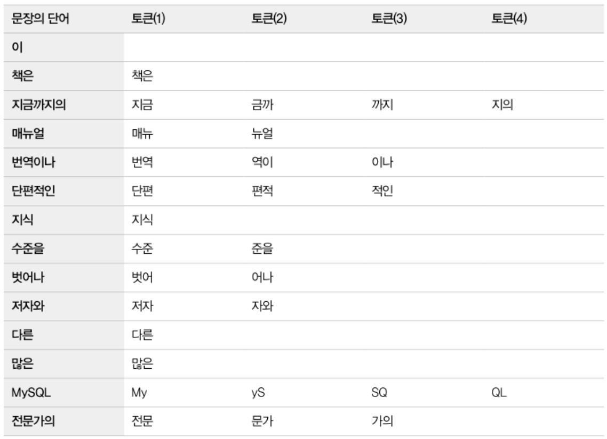
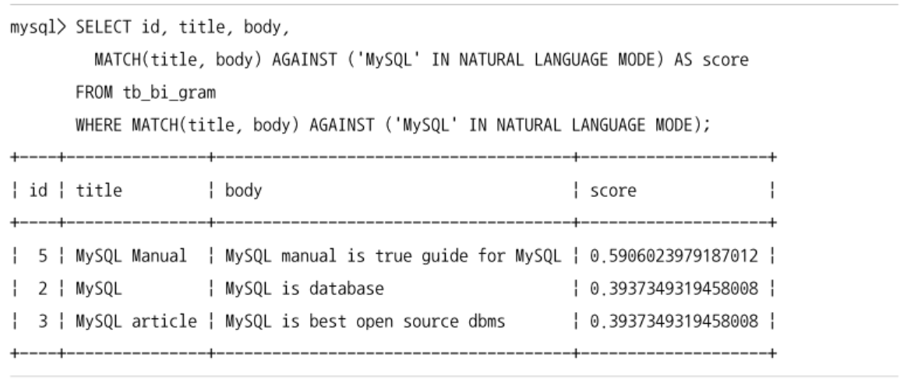
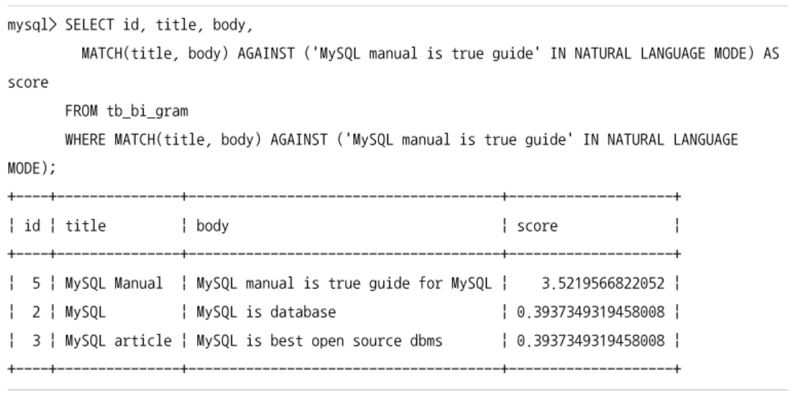
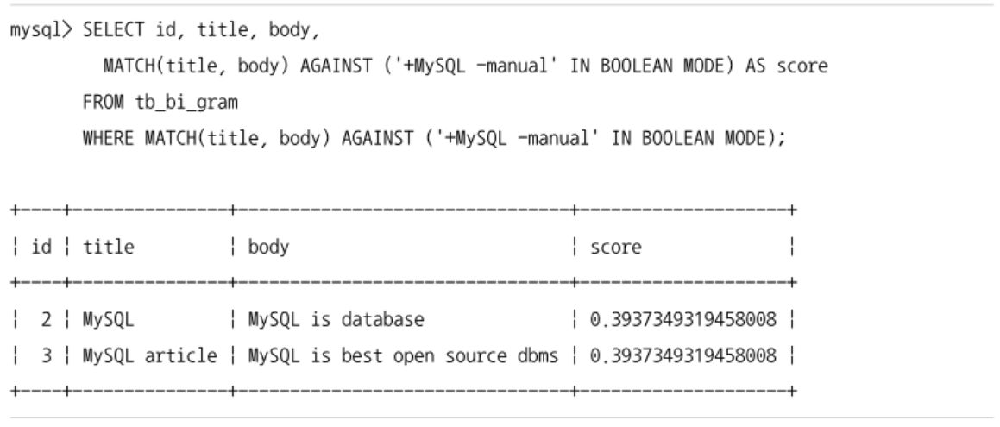
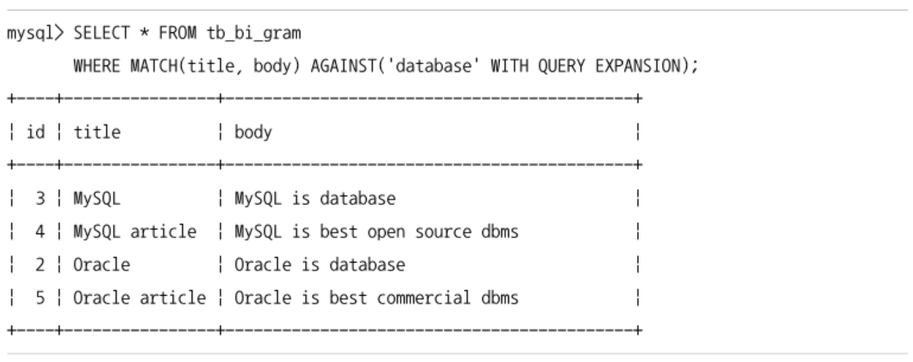

# 전문 검색
- 용량이 큰 문서를 단어 수준으로 잘게 쪼개어 문서 검색을 하게 해주는 기능
- 예전에는 일부 스토리지 엔진을 사용하는 테이블만 전문 검색 기능을 활용할 수 있었다.
- MySQL 8.0에서는 InnoDB 스토리지 엔진에서도 사용할 수 있도록 개선됨

## 전문 검색 인덱스의 생성과 검색
- MySQL 서버에서는 2가지 알고리즘을 이용해서 인덱싱할 토큰을 분리한다.
	- 형태소 분석
	- n-gram 파서
- 형태소 분석은 문장의 공백과 같은 띄어쓰기 단위로 단어를 분리하고, 각 단어의 조사를 제거해서 명사 or 어근을 찾아서 인덱싱하는 알고리즘
	- MySQL 서버에서는 형태소 분석이나 어근 분석 기능은 구현되어 있지 않음
- n-gram은 문장 자체에 대한 이해 없이 공백과 같은 띄어쓰기 단위로 단어를 분리하고, 그 단어를 단순히 주어진 길이로 쪼개서 인덱싱하는 알고리즘

### n-gram
- n-gram에서 n은 1 ~ 10 사이의 숫자 값
	- ngram_token_size 시스템 변수로 변경할 수 있음
	- default는 2
	- `n == 1`이면 uni-Gram, `n == 2`이면 bi-gram, `n == 3`이면 tri-gram
	- 3보다 큰 값은 설정값에 따라 검색어의 길이 제약이 생기기 때문에 `bi-gram`, `tri-gram`이 일반적으로 많이 사용됨
- `bi-gram`, `tri-gram` 테스트는 각각 ngram_token_size를 변경해서 MySQL 서버를 재시작한 후 테스트해야 한다.
- 테이블의 전문 검색 인덱스를 생성할 때 `with parser ngram` 옵션을 추가해야 n-gram 파서를 사용해서 토큰을 생성할 수 있다.
	- 아니면 MySQL 서버는 기본 파서를 사용해서 전문 인덱스를 생성한다.

```sql
	-- my.cnf 설정 파일에 ngram_token_size=2 or 3; 추가한 후 재시작

	-- 테스트 테이블과 데이터 준비
	create table tb_bi_gram (
		id bigint not null auto_increment,
		title varchar(100),
		body text,
		primary key(id),
		fulltext index fx_msg(title, body) with parser ngram
	);

	insert into tb_bi_gram values (null, 'Real MySQL', 'body');

	select count(*) from tb_gi_gram
		where match(title, body) against ('text' in boolean mode);
```
- 검색어의 길이가 ngram_token_size보다 작은 경우는 검색 불가능
- 검색어의 길이가 ngram_token_size보다 크거나 같은 경우는 검색 가능
- ngram_token_size 시스템 변수는 응용프로그램에서 검색하고자 하는 검색어의 길이에 맞게 설정해야 한다.
- 검색어가 단어의 시작, 중간, 끝 부분이어도 n-gram이 검색할 수 있다.
	
	- ngram_token_size보다 길이가 작은 단어는 모두 버려진다.
- n-gram 파서는 전문 검색 인덱스 생성때만 사용되는 것이 아니라 쿼리의 전문 검색에서도 사용된다.
	```sql
		select count(*) from tb_bi_gram
		where match(title, body) against ('단편적인' in boolean mode);
	```
- 이미 2글자씩 잘라낸 토큰을 인덱스에 저장한 상태에서 4글자의 검색어를 이용해서 결과를 찾으려면?
	- 이전 방식과 동일하게 검색어를 시스템 변수에 맞게 토큰으로 만들고, 토큰들을 전문 검색 인덱스를 이용해서 동등 비교 조건으로 검색한다.

## 전문 검색 쿼리 모드
- 종류
  - 자연어 검색모드
  - 불리언 검색모드
- 전문 검색 쿼리에서 검색모드를 지정하지 않으면 자연어 검색 모드가 사용된다.
- MySQL 서버는 자연어 검색모드와 함께 사용할 수 있는 검색어 확장 기능도 지원

### 자연어 검색 (NATURAL LANGUAGE MODE)

- MySQL 서버의 자연어 검색은 검색어에 제시된 단어들을 많이 가지고 있는 순서대로 정렬해서 결과를 반환한다.


- 문장을 그대로 검색어에 사용하는 형태를 `Please Search`라고 명명함
- MySQL 서버는 검색어를 구분자로 단어를 분리하고 다시 n-gram 파서로 토큰을 생성한 후 각 토큰에 대해 일치하는 단어의 갯수를 확인해서 일치율을 계산한다.
  - 검색어가 단일 단어 or 문장일때 `,`, `.` 같은 문장 기호는 무시된다.

### 불리언 검색
- 자연어 검색은 단순히 검색어에 포함된 단어들이 존재하는 결과만 가져온다.
- 불리언 검색은 쿼리에 사용되는 검색어의 존재 여부에 대해 논리적 연산이 가능하다.


- `MySQL`은 포함, `manual`은 포함 x
  - `+` 표시를 가진 단어는 전문 검색 인덱스 컬럼에 존재해야함
  - `-` 표시를 가진 단어는 전문 검색 인덱스 컬럼에 존재하지 않아야함
- 쌍따옴표가 포함된 문자열
  - `MySQL man`이라는 구문을 가진 레코드 검색
  - MySQL 단위 뒤에 man이라는 단어가 나오면 일치하는 것으로 판단

```sql
	select id, title, body,
		match(title, body) against ('MySQL doc' in boolean mode) as score
  from tb_gi_gram
  where match(title, body) against ('MySQL doc' in boolean mode);
```
- `+` `-` 연산자를 사용하지 않을 경우 검색어에 포함된 단어 중 하나라도 있으면 일치하는 것으로 판단함
- 와일드카드 문자를 이용해서 패턴 검색을 적용할 수 있음
  ```sql
    select id, title, body,
		  match(title, body) against ('sour*' in boolean mode) as score
    from tb_gi_gram
    where match(title, body) against ('sour*' in boolean mode);
  ```
  - n-gram 전문 검색 인덱스는 단어의 일부만 검색하는 기능을 지원하기 때문에 굳이 와일드카드 문자를 이용할 필요는 없음

### 검색어 확장(QUERY EXPANSION)
- 사용자가 쿼리에 사용한 검색어로 검색된 결과에서 공통으로 발견되는 단어들을 모아서 다시 한번 더 검색을 수행하는 방식


- database라는 키워드가 들어간 게시물을 검색
- 추가로 dbms 이름도 검색하려면?
  - 검색어 확장 기능이 없다면 전문 검색 쿼리를 여러번 실행해야함
  - MySQL 서버의 검색어 확장기능은 사용자의 검색어를 이용해서 전문 검색을 실행한다.
    - 검색어와 연관있어 보이는 단어들을 뽑아서 다시 전문 검색 쿼리를 실행한다.

## 전문 검색 인덱스 디버깅
- 예전 MySQL 버전에서는 MyISAM 스토리지 엔진만 전문 검색 인덱스를 사용할 수 있었음
- 최근 버전에서는 InnoDB 스토리지 엔진도 사용 가능
  - 불용어나 토큰 파서 등의 기능을 제어하는 시스템 변수가 다양해짐
- MySQL 서버에서는 전문 검색 쿼리 오류의 원인을 쉽게 찾을 수 있도록 디버깅 기능을 제공함
  ```sql
    set global innodb_ft_aux_table = 'test/tb_gi_gram';
  ```
  - innodb_ft_aux_table 시스템 변수에 전문 검색 인덱스를 가진 테이블이 설정되면 MySQL 서버는 information_schema DB의 테이블을 통해 전문 검색 인덱스가 어떻게 저장/관리 되는지 볼 수 있게 해줌
