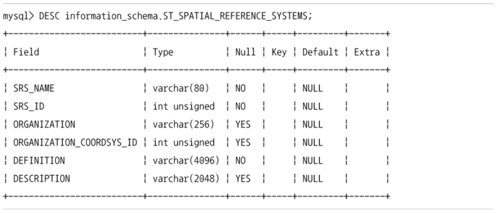
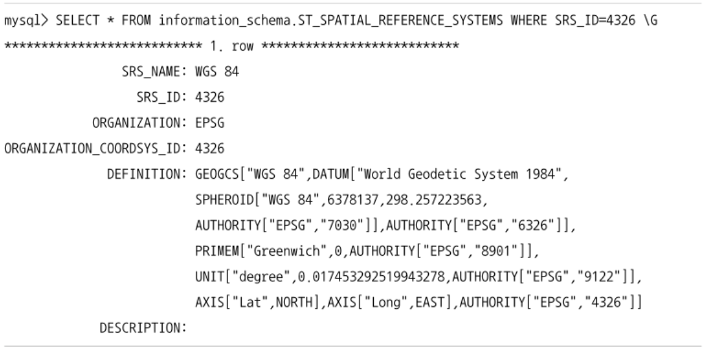
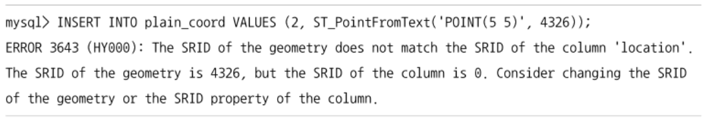
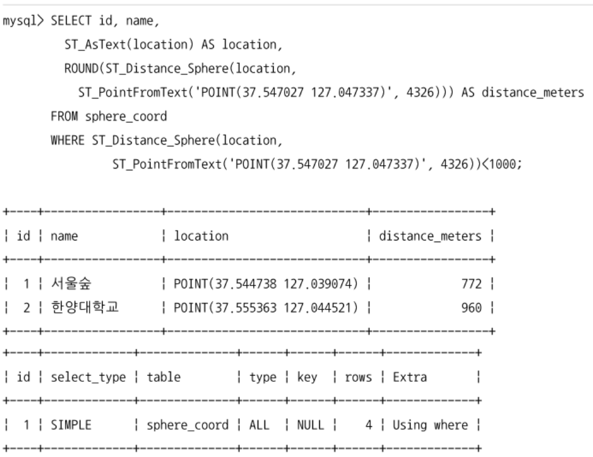
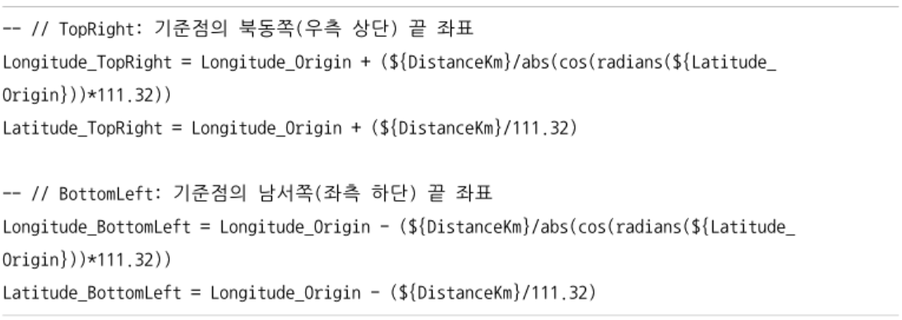
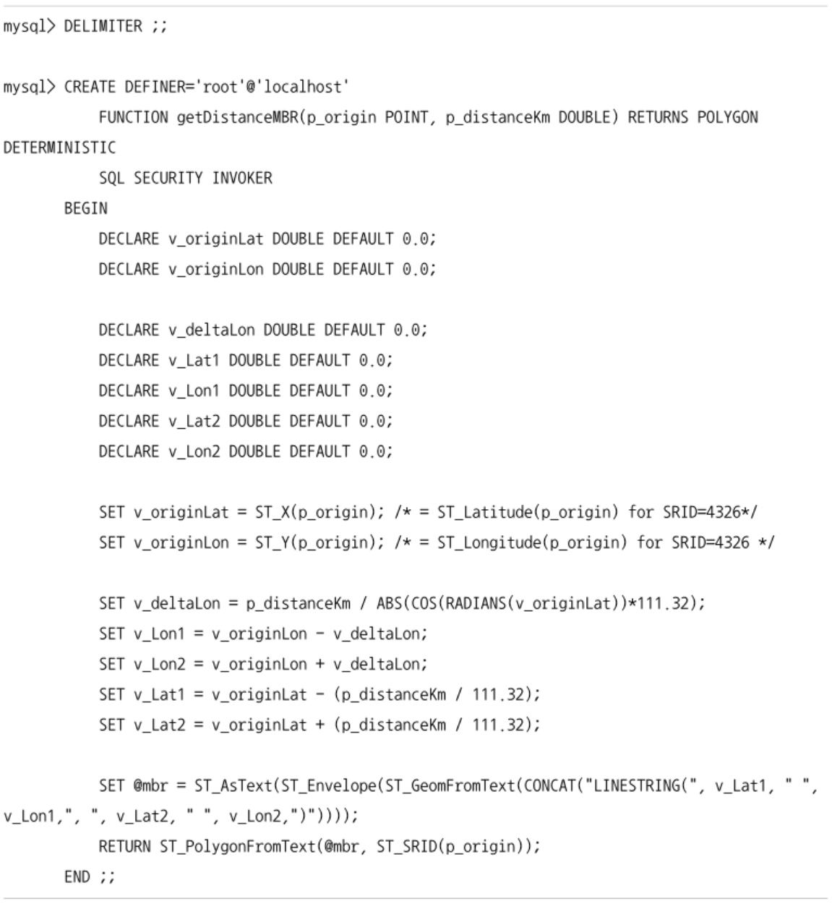
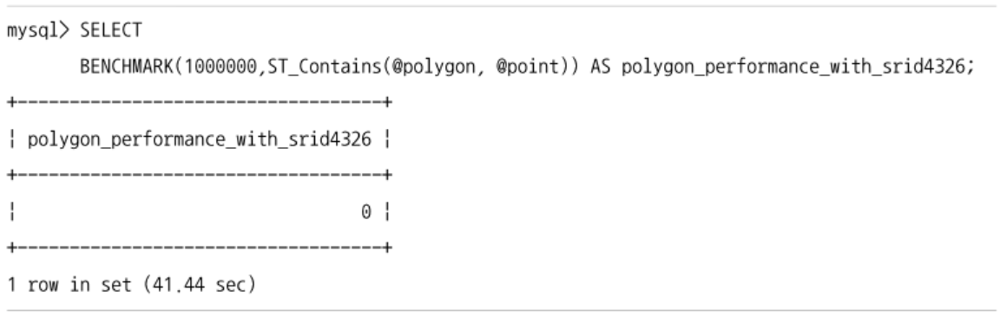
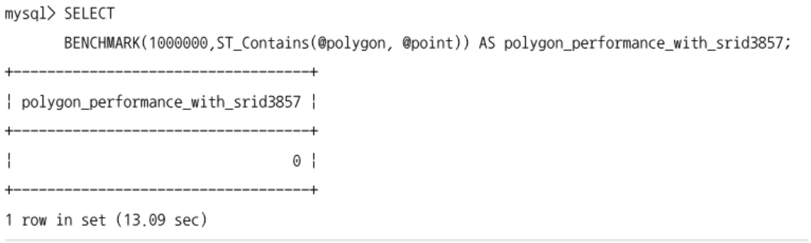
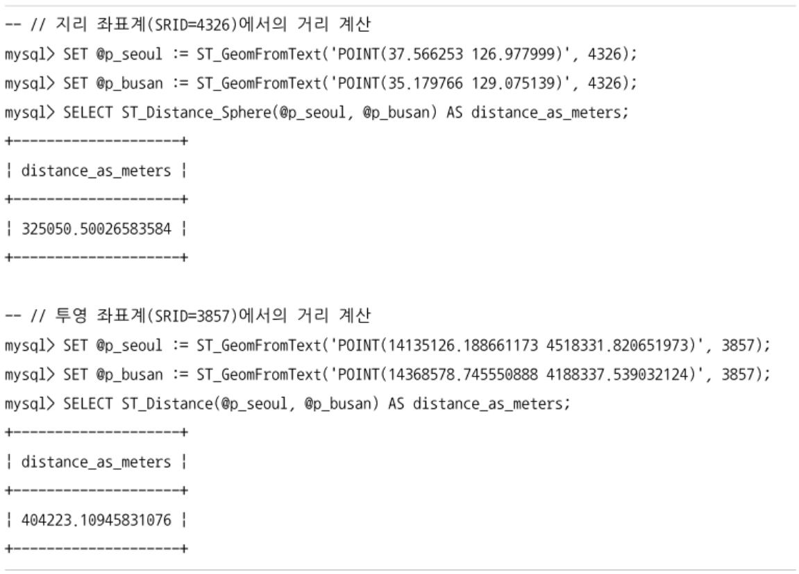

## SRS (Spatial Reference System)
- SRS는 GCS, PCS로 구분된다.
  - SRS: 좌표계 / GCS: 지리 좌표계 / PCS: 투영 좌표계
- MySQL 서버에서 지원하는 SRS에 대한 정보는 information_schema DB의 `ST_SPATIAL_REFERENCE_SYSTEMS` 테이블을 통해 확인할 수 있다.
  
  - SRS_ID: 해당 좌표계를 지칭하는 고유 번호
  - DEFINITION: 해당 좌표계가 어떤 좌표계인지에 대한 정의


- 지리 좌표계 (GCS)
- AXIS: 레코드에 두번 표시
  - POINT(위도 경도) 순으로 명시해야 함
  - ST_X(): 위도 값을 반환
  - ST_Y(): 경도 값을 반환


- 웹 페이지에서 지도를 보여주기 위해 사용되는 투영 좌표계 (PCS)
- `AXIS["X", EAST], AXIS["Y", NORTH]` => POINT(경도 위도) 순으로 명시해야 함
- MySQL 8.0부터 SRID의 지원이 추가됨
  - 지금까지 별도로 SRID를 지정하지 않았던 데이터는 모두 `SRID=0`인 평면 좌표계로 인식될 것
  - 공간데이터 정의 시에 별도로 SRID를 지정하지 않으면 SRID는 0으로 자동인식됨

```sql
  -- 평면 좌표계를 사용하는 공간 데이터
  select st_distance(ST_PointFromText('POINT(0 0)', 0),
                     ST_PointFromText('POINT(1 1)', 0)) as distance;

  -- 웹 기반 지도 좌표계를 사용하는 공간 데이터
  select st_distance(ST_PointFromText('POINT(0 0)', 3857),
                     ST_PointFromText('POINT(1 1)', 3857)) as distance;

  -- WGS 84 지리 좌표계를 사용하는 공간 데이터
  select st_distance(ST_PointFromText('POINT(0 0)', 4326),
                     ST_PointFromText('POINT(1 1)', 4326)) as distance;
```
- ST_PointFromText: MySQL 서버의 공간 데이터를 생성하는 함수
  - param1: 점의 위치
  - param2: param1에 명시된 점이 사용하는 SRS의 SRID 값
- 1: SRID가 0이므로 결과는 단순 좌표 계산 값
- 2: 지구 구체에 대한 고려 없이 평면에서의 거리를 계산하므로 결과는 1과 동일
- 3: 지리 좌표계를 사용하므로 지구 구체 기반이라 다른 계산 값이 나옴
- 공간 데이터 자체가 SRS에 대한 정보를 가지게 되면 MySQL 서버에서 제공되는 공간 함수들을 이용해서 필요한 값을 즉시 계산할 수 있음
  - SRID가 없거나 0인 경우에는 MySQL 서버의 공간 함수들이 데이터의 SRID를 알 수 없기 때문에 기대하는 값이 나오지 않을 수 있음

## 투영 좌표계와 평면 좌표계
- 투영 좌표계: 지구 구체 전체/일부를 평면으로 투영해서 표현한 좌표계
  - `SRID = 0`인 좌표계는 평면 좌표계라고 한다.
    - 단위를 가지지 않고, (X, Y)축의 제한이 없어서 무한 평면 좌표계라고도 함
    - `SRID = 3857`인 투영 좌표계와 단위, 최대, 최솟값을 제외하면 거의 차이가 없음


- MySQL 서버에서 SRID를 지정하지 않으면 기본값인 0을 가진다.
- 평면 좌표계와 투영 좌표계에서 거리 계산은 피타고라스 공식에 의해 거리가 계산된다.
  - 지구 구체에 대한 고려는 없음
- 투영 좌표계의 두 점 간의 거리는 투영 좌표계의 단위에 따라 결정된다.
  - ex. `SRID = 3857`에서 계산된 거리는 meter 값이다.

```sql
  -- 평면 좌표계 사용
  create table plain_coord (
    id int not null auto_increment,
    location point srid 0,
    primary key(id)
  );

  -- 투영 좌표계 사용
  create table projection_coord (
    id int not null auto_increment,
    location point srid 3857,
    primary key(id)
  );
```
- 각 테이블을 생성하면서 srid를 지정하여 평면/투영 좌표계를 사용하는 공간 데이터라는 것을 명시적으로 선언
- srid가 정의된 컬럼에 srid이 다른 공간 데이터를 저장하려고 하면 `SRID가 일치하지 않는다`는 에러가 발생한다.
  
- 테이블을 생성할 때 srid를 명시하지 않았다면 해당 컬럼은 모든 srid를 저장할 수 있다.
  - 하나의 컬럼에 저장된 데이터의 srid가 제각각이라면 MySQL 서버는 인덱스를 이용한 빠른 검색을 수행할 수 없게 된다.
  - varchar 타입의 컬럼에 여러 콜레이션을 섞어서 저장한 것과 같은 결과를 만들 것이다.


- `ST_AsWKB()` 함수의 결괏값이 WKB(Well Known Binary) 포맷의 공간 데이터
- MySQL 서버의 내부 이진 포맷이나 WKB 포맷으로 출력된 데이터는 눈으로 식별하기 어려움
  - `ST_AsText()` 함수를 이용해서 이진 데이터를 WKT 포맷으로 변환해서 보여줌
- 특정 공간 데이터가 어떤 SRID를 사용하는지는 `ST_SRID()` 함수를 이용하여 확인한다.
  ```sql
    select ST_SRID(ST_PointFromText('POINT(5 5)', 0));
    select ST_SRID(ST_PointFromText('POINT(14133793.435554 4494917.464846)', 3857));
  ```
  - 평면/투영 좌표계에서는 단순 피타고리스 정리에 의한 결과가 보인다.
  - 계산된 거리 값은 지구 구체상의 실제 거리와는 오차가 있다.
  - 지구상의 두 점 간의 거리를 계산하기 위해서는 `ST_Distance_Sphere()` 함수를 사용한다.
    - `SRID=4326`과 같은 지리 좌표에만 사용할 수 있어서 평면/투영 좌표계를 사용하는 좌표 간의 거리 계산에는 사용할 수 없다.

## 지리 좌표계
### 지리 좌표계 데이터 관리
```sql
  create table sphere_coord (
    id int not null auto_increment,
    name varchar(20),
    location point not null srid 4326, -- WGS 좌표계
    primary key(id),
    spatial index sx_location(location)
  );
```
- 공간 인덱스를 생성하는 컬럼은 not null이어야 한다.
- 좌표계에서 두 점의 거리는 `ST_Distance_Sphere()` 함수를 이용한다.


- MySQL 서버는 인덱스를 이용한 반경 검색 기능이 없음
  - 다른 RDBMS는 가능함
- ST_Distance_Sphere() 함수의 결과를 상수와 비교하는 형태는 인덱스를 사용할 수 없음
  - 차선책으로 MBR을 이용한 ST_Within() 함수를 이용
  - 2개의 공간 데이터를 파라미터로 읽음
    - 공간데이터1이 공간데이터2에 포함되는지를 체크
- 1km 반경 내의 위치 검색 쿼리를 MBR을 이용해서 작성
  - `WGS 84` 공간 좌표계의 위치의 단위는 각도이기 때문에 검색 기준 위치로부터 상하좌우 1km 떨어진 지점의 위치를 계산하기 위해서는 1km의 거리가 각도로는 얼마인지 계산해야함
  - 지구는 구면체이므로 위도에 따라 경도 $1^\circ$에 해당하는 거리가 달라진다.

  
  
  - 위 계산식을 이용해서 1km 반경의 원을 감싸는 MBR Polygon 객체를 반환하는 함수
  - getDistanceMBR() 함수는 p_origin 위치로부터 p_distanceKm 반경의 원을 감싸는 직사각형 Polygon 객체를 반환한다.
  - 반환되는 polygon 객체의 srid는 p_origin srid를 받는다.


을%20기준으로%20반경%201km의%20MBR.png)
- 쿼리에서 나온 결과를 이으면 위 사진처럼 사각형이 생성됨
- 실제 반경 검색을 실행하는 쿼리는 MySQL 서버의 공간 함수인 `ST_Contains()` or `ST_Within()` 함수를 이용한다.
  ```sql
    select id, name
    from sphere_coord
    where ST_Contains(
      getDistanceMBR(ST_PointFromText('POINT(37.547027 127.047337)', 4326), 1), location);

    select id, name
    from sphere_coord
    where ST_Within(location,
      getDistanceMBR(ST_PointFromText('POINT(37.547027 127.047337)', 4326), 1));
  ```
  
  - 사각형의 모서리 부분은 1km를 넘어서는 부분이 포함됨 -> 두 도형의 교집합을 제외한 부분은 쿼리 결과에서 제거되어야 함
    - 1km 반경을 둘러싸는 MBR을 사각형이 아닌 8각형, 16각형으로 생성하면 더 효율적으로 작동할 것
    - 인덱스를 통해 검색된 결과에 대해 다시 한번 거리 계산 조건을 적용할 수 있음
      ```sql
        select id, name
        from sphere_coord
        where ST_Within(location,
          getDistanceMBR(ST_PointFromText('POINT(37.547027 127.047337)', 4326), 1))
          and ST_Distance_Sphere(location, ST_PointFromText('POINT(37.547027 127.047337)', 4326)) <= 1000;
      ```
      - 이미 공간 인덱스를 통해서 많이 걸러진 소량의 결과에 대해 ST_Distance_Sphere() 함수를 실행하기 때문에 쿼리의 성능이 크게 떨어지지는 않음

### 지리 좌표계 주의 사항
- MySQL 8.0에서 지리 좌표계나 SRS 관리 기능이 처음 도입
- MySQL 서버를 이용해서 지리 좌표계를 활용하려면 기능의 정확성이나 성능에 대해 주의할 필요가 있음

#### 정확성 주의 사항
- 지리 좌표계에서 `ST_Contains()` 함수가 정확하지 않은 결과를 반환하기도 함
  ```sql
    -- 지리 좌표계인 SRID=4326으로 ST_Contains() 함수 기능 테스트
    set @SRID := 4326 /* WGS84 */;

    -- 경도는 서울과 비슷, 위도는 북극에 가까운 지점의 point 생성
    set @point := ST_GeomFromText('POINT(84.50249779176816 126.96600537699246)', @SRID);

    -- 경기도 부근의 작은 영역으로 polygon 객체 생성
    set @polygon := ST_GeomFromText('POLYGON({...})', @SRID);
  ```
  
  ```sql
    -- 북극의 특정 지점이 위 폴리곤에 포함되는지 확인, true 리턴
    select ST_Contains(@polygon, @point) as within_polygon;
  ```
  - 북극에 가까운 지점이 경기도의 특정 지역에 포함되는 것으로 결과를 반환함
    - MySQL 8.0.25 버전에도 해결되지 않음 (MySQL 버그 사이트에 등록되어 있음)
    - 거리비교 조건을 추가하면 회피 가능
    - ST_Contains 함수를 이용해서 공간 인덱스를 활용한 검색을 실행한 후 검색된 결과를 다시 ST_Distance_Sphere() 함수로 걸러내어 결과 데이터의 정확도를 높임

#### 성능 주의 사항
- 지리 좌표계의 경우 일반적으로 SRID=4326인 좌표계를 많이 사용한다.
  - ST_Contains() 함수 등으로 포함 관계를 비교하는 경우 투영 좌표계 보다는 느린 성능을 보임

```sql
  set @SRID := 4326;
  set @polygon := ST_GeomFromText('POLYGON((...))', @SRID);
  set @point := ST_GeomFromText('POINT(...)', @SRID);
```

- BENCHMARK 함수를 이용해서 SRID=4326으로 설정된 point, polygon 객체 간의 포함 관계를 비교하는 ST_Contains 함수를 100만번 실행

```sql
  set @SRID := 3857;
  set @polygon := ST_GeomFromText('POLYGON((...))', @SRID);
  set @point := ST_GeomFromText('POINT(...)', @SRID);
```

- BENCHMARK 함수를 이용해서 SRID=3857으로 설정된 point, polygon 객체 간의 포함 관계를 비교하는 ST_Contains 함수를 100만번 실행

#### 좌표계 변환
- 모바일 장치로부터 수신받는 GPS 좌표는 WCS 84, SRID 4326인 지리 좌표계로 표현
- SRID 3857은 WGS 84 좌표를 평면으로 투영한 좌표 시스템이기 때문에 SRID 4326, 3857 간의 상호 변환이 가능하다.
  - MySQL 서버는 ST_Transform() 함수를 이용해 변환할 수 있지만 SRID 3857에 대한 변환을 지원하지는 않는다.
  - SRID 3857은 평면으로 투영된 좌표계이기 때문에 거리 계산 시 실제 구면체에서의 거리와는 상당한 오차를 보인다.

  
  - 실제 거리는 SRID 4326의 결과에 가까움
- SRID 3857을 4326으로 변환하거나 구면체 기반의 거리 계산이 필요할 수 있음
  - 변환 함수들을 이용
