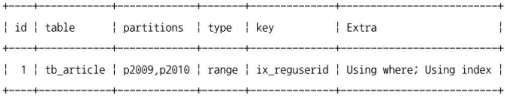
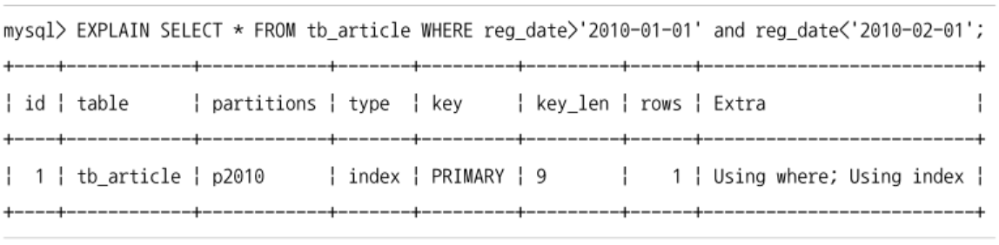

## 파티션을 사용하는 이유
- 테이블의 데이터가 많아진다고 무조건 파티션을 적용하는 것이 효율적인것은 아님
- 하나의 테이블이 너무 커서 인덱스의 크기가 물리적인 메모리보다 훨씬 큰 경우
- 데이터 특성상 주기적인 삭제 작업이 필요한 경우

### 단일 INSERT와 단일 또는 범위 SELECT의 빠른 처리
- update, delete 쿼리를 위해서도 인덱스는 필요
  - 위 쿼리를 처리하기 위해 대상 레코드를 검색 -> 인덱스 사용
- 인덱스가 커질수록 작업이 느려짐
  - 인덱스의 크기가 물리적으로 MySQL에서 사용 가능한 메모리 공간보다 크다면? 더 느려짐


- 파티션하지 않고 하나의 큰 테이블로 사용하면 인덱스도 커지고 메모리 공간도 많이 필요해짐
- 파티션은 데이터와 인덱스를 조각화해서 물리적 메모리를 효율적으로 사용할 수 있게 만들어줌

### 데이터의 물리적인 저장소를 분리
- 데이터/인덱스 파일이 커진다면 백업이나 관리 작업이 어려워진다.
  - 데이터를 파일 단위로 관리하는 MySQL에서 더 큰 문제가 될 수 있음
  - 파티션을 통해 파일의 크기를 조절하거나 파티션별 파일들이 저장될 위치나 디스크를 구분해서 지정해 해결하는 것도 가능
  - MySQL에서는 테이블의 파티션 단위로 인덱스를 생성하거나 다른 인덱스를 가지는 형태는 지원하지 않는다.

### 이력 데이터의 효율적인 관리
- 거의 모든 애플리케이션이 로그를 가짐
  - 단기간에 대량으로 누적됨과 동시에 일정 기간이 지나면 쓸모 없어짐
  - 시간이 지나면 별도로 아카이빙하거나 백업한 후 삭제해버리는 것이 일반적임
- 로그 테이블에서 불필요해진 데이터를 백업/삭제하는 작업은 고부하의 작업에 속함
  - 로그 테이블을 파티션 테이블로 관리하여 해결

  
  - 대량의 데이터가 저장된 로그 테이블을 기간 단위로 삭제한다면 MySQL 서버에 전체적으로 미치는 부하뿐만 아니라 로그 테이블 자체의 동시성에도 영향을 미칠 수 있음

## MySQL 파티션의 내부 처리
```sql
  create table tb_article (
    article_id int not null,
    reg_date datetime not null,
    ...
    primary key(article_id, reg_date)
  ) partition by range ( year(reg_date) ) (
    partition p2009 values less than (2010),
    partition p2010 values less than (2011),
    partition p2011 values less than (2012),
    partition p9999 values less than maxvalue
  );
```
- reg_date에서 연도 부분은 파티션의 키로서 해당 레코드가 어느 파티션에 저장될지 결정한다.

### 파티션 테이블의 레코드 INSERT

- insert 쿼리가 실행되면 MySQL 서버는 insert되는 컬럼의 값 중에서 파티션 키인 reg_date 컬럼의 값을 이용해서 파티션 표현식을 평가하고, 결과를 이용해서 레코드가 저장될 적절한 파티션을 결정한다.
- 파티션이 결정되면 나머지 과정은 일반 테이블과 동일하게 처리된다.

### 파티션 테이블의 UPDATE

- 변경 대상 레코드가 어느 파티션에 저장되어 있는지 찾아야 한다.
- where 조건에 파티션 키 컬럼이 존재한다면 그 값을 이용해서 빠르게 레코드를 검색할 수 있다.
  - where 조건에 명시되지 않았다면 MySQL 서버는 모든 파티션을 검색해야 한다.
- 변경 작업은 update 쿼리가 어떤 컬럼의 값을 변경하느냐에 따라 차이가 생김
  - 파티션 키 이외의 컬럼만 변경될 때는 파티션이 적용되지 않은 일반 테이블처럼 값만 변경한다.
  - 파티션 키 컬럼이 변경될 때는 기존의 레코드가 저장된 파티션에서 해당 레코드를 삭제하고, 변경되는 파티션 키 컬럼의 표현식을 평가하고 새로운 파티션에 레코드를 저장한다.

### 파티션 테이블의 검색
- SQL이 수행되기 위해 파티션 테이블을 검색할 때 성능에 크게 영향을 미치는 조건
  - where 절의 조건으로 검색해야 할 파티션을 선택할 수 있는지
  - where 절의 조건이 인덱스를 효율적으로 사용할 수 있는지
- 파티션 선택 가능 + 인덱스 효율적 사용 가능
  - 쿼리가 가장 효율적으로 처리될 수 있음
  - 파티션의 갯수와 관계없이 검색을 위해 꼭 필요한 파티션의 인덱스만 레인지 스캔한다.
- 파티션 선택 불가 + 인덱스 효율적 사용 가능
  - 테이블의 모든 파티션을 대상으로 검색한다.
  - 각 파티션에 대해서는 인덱스 레인지 스캔을 사용할 수 있어서 테이블에 존재하는 모든 파티션의 갯수만큼 인덱스 레인지 스캔을 수행해서 검색한다.
  - 하나의 테이블에 파티션의 갯수가 많아질수록 느려짐
- 파티션 선택 가능 + 인덱스 효율적 사용 불가
  - 파티션 갯수와 관계없이 필요한 파티션만 읽으면 된다.
  - 인덱스는 사용할 수 없기 때문에 대상 파티션에 대해 풀 테이블 스캔을 한다.
    - 파티션의 레코드 건수가 많을수록 느려짐
- 파티션 선택 불가 + 인덱스 효율적 사용 불가
  - 테이블의 모든 파티션을 검색한다.
  - 각 파티션에 대해서도 풀 테이블 스캔을 수행한다.
  - 그냥 느림

### 파티션 테이블의 인덱스 스캔과 정렬
- MySQL의 파티션 테이블에서 인덱스는 모두 로컬 인덱스에 해당
  - 모든 인덱스는 파티션 단위로 생성
  - 파티션과 관계없이 테이블 전체 단위로 글로벌하게 하나의 통합된 인덱스는 지원하지 않음


- 연도별로 파티션되고, reg_userid로 인덱스가 만들어짐
- 파티션되지 않은 테이블은 인덱스를 순서대로 읽어서 정렬된 결과를 얻을 수 있음
- 파티션된 테이블에서는 그렇지 않음

```sql
  select *
  from tb_article
  where reg_userid between 'brew' and 'toto'
    and reg_date between '2009-01-01' and '2010-12-31'
  order by reg_userid;
```

- Extra 컬럼에 `Using filesort`가 표시되지 않음
- 여러 파티션에 대해 인덱스 스캔을 수행할 때 각 파티션으로부터 조건에 일치하는 레코드를 정렬된 순서대로 읽으면서 우선순위 큐에 임시로 저장한다.
- 우선순위 큐에서 다시 필요한 순서대로 데이터를 가져간다.
- 파티션 테이블에서 인덱스 스캔을 통해 레코드를 읽을 때는 별도의 정렬 작업을 수행하지 않는다.
  - 결과를 바로 반환하는 것이 아니고 내부적으로 큐 처리가 한번 필요함 (그림 13.6의 머지&소트 부분)

### 파티션 프루닝
- 옵티마이저에 의해 3개의 파티션 옵션 중 2개만 읽어도 된다고 판단되면 불필요한 파티션에는 접근하지 않는다.
  - 최적화 단계에서 필요한 파티션만 골라내고 불필요한 것들은 실행 계획에서 배제하는 것을 파티션 프루닝이라고 함
  - 옵티마이저가 어떤 파티션만 접근하는지 알 수 있음
    
    - explain 명령 결과의 partitions 컬럼 확인
    - 명시된 파티션을 제외하면 모두 프루닝 됨
