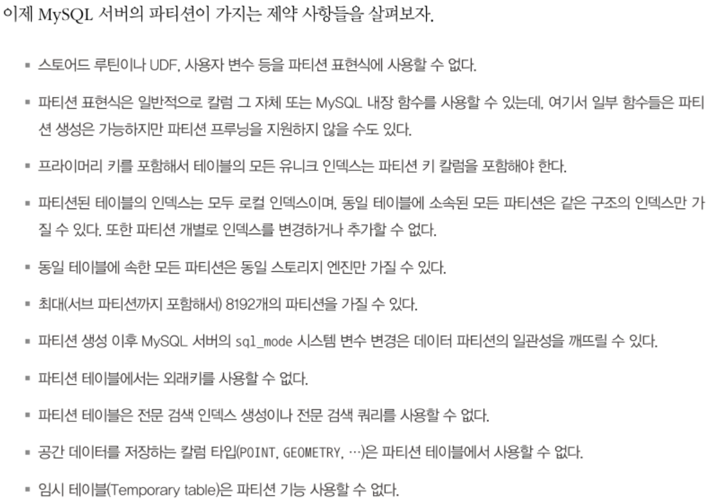

## 파티션의 제약 사항
```sql
  create table tb_article (
    article_id int not null auto_increment,
    reg_date datetime not null,
    ...
    primary key(article_id, reg_date)
  ) partition by range ( year(reg_date) ) (
    partition p2009 values less than (2010),
    partition p2010 values less than (2011),
    partition p2011 values less than (2012),
    partition p9999 values less than maxvalue
  )
```
- `partition by range`: 테이블이 레인지 파티션을 사용한다는 의미
- MySQL 서버의 파티션이 가지는 제약 사항들
  
- 파티션 표현식에는 기본적인 산술 연산자인 `+` `-` 를 사용할 수 있으며 MySQL 내장 함수도 사용 가능
  
  - 위 내장함수가 모두 파티션 프루닝 기능을 제공하지는 않음
  - 파티션 테이블을 처음 설계할 때는 파티션 프루닝 기능이 정상적으로 작동하는지 확인한 후 응용 프로그램에 적용하는 것을 권장함

## 파티션 사용 시 주의사항
- 파티션의 목적이 작업의 범위를 좁히는 것인데, 유니크 인덱스는 중복 레코드에 대한 체크 작업이 필요해서 범위가 좁혀지지 않음
- MySQL의 파티션은 일반 테이블과 같이 별도의 파일로 관리된다.
  - MySQL 서버가 조작할 수 있는 파일의 갯수와 연관된 제약도 있음

### 파티션과 유니크 키 (PK 포함)
```sql
  -- 잘못된 테이블 파티션을 생성하는 방법들
  create table tb_partition (
    fd1 int not null,
    fd2 int not null,
    fd3 int not null,
    unique key (fd1, fd2)
  ) partition by hash (fd3)
    partitions 4;

  create table tb_partition (
    fd1 int not null,
    fd2 int not null,
    fd3 int not null,
    unique key (fd1),
    unique key (fd2),
  ) partition by hash (fd1 + fd2)
    partitions 4;

  create table tb_partition (
    fd1 int not null,
    fd2 int not null,
    fd3 int not null,
    primary key (fd1),
    unique key (fd2, fd3)
  ) partition by hash (fd1 + fd2)
    partitions 4;
```
- 테이블에 유니크 인덱스가 있으면 파티션 키는 모든 유니크 인덱스의 일부 or 모든 컬럼을 포함해야 한다.
- 1번 쿼리는 유니크 키와 파티션 키가 전혀 연관이 없음
- 2번 쿼리는 fd1 or fd2만으로 파티션 결정이 되지 않음
- 3번 쿼리는 fd1만으로 파티션 결정이 되지 않고, fd2, fd3으로도 파티션 위치를 결정할 수 없음

```sql
  -- 파티션 키로 사용할 수 있는 예시
  create table tb_partition (
    fd1 int not null,
    fd2 int not null,
    fd3 int not null,
    unique key (fd1, fd2, fd3)
  ) partition by hash (fd1)
    partitions 4;

  create table tb_partition (
    fd1 int not null,
    fd2 int not null,
    fd3 int not null,
    unique key (fd1, fd2)
  ) partition by hash (fd1 + fd2)
    partitions 4;

  create table tb_partition (
    fd1 int not null,
    fd2 int not null,
    fd3 int not null,
    unique key (fd1, fd2, fd3),
    unique key (fd3)
  ) partition by hash (fd3)
    partitions 4;
```

### 파티션과 open_files_limit 시스템 변수 설정
- MySQL에서 테이블을 파일 단위로 관리하기 때문에 MySQL 서버에서 동시에 오픈된 파일의 갯수가 상당히 많아질 수 있음
- `open_files_limit` 시스템 변수에 동시에 오픈할 수 있는 적절한 파일의 갯수를 설정할 수 있음
  - 파티션되지 않은 일반 테이블은 테이블당 2 ~ 3개 수준이지만 파티션 테이블에서는 `파티션 갯수 * (2 ~ 3)`개가 된다.
  - 파티션을 많이 사용하는 경우에는 적절히 높은 값으로 설정할 필요가 있음
