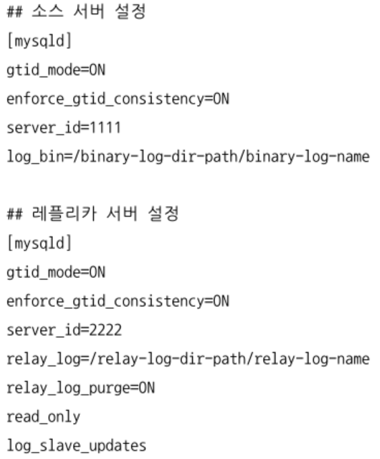
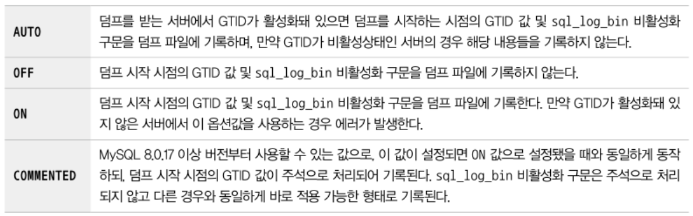
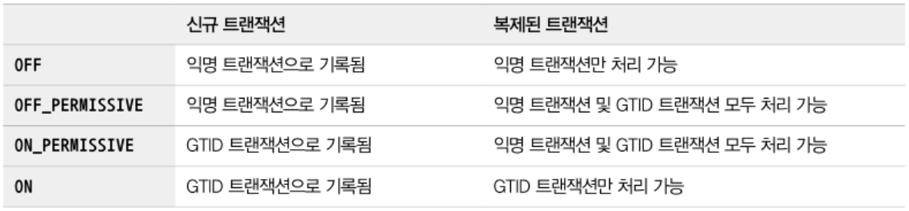

## 바이너리 로그 파일 위치 기반 복제
- 레플리카 서버에서 소스 서버의 바이너리 로그 파일명과 파일 내에서의 위치로 개별 바이너리 로그 이벤트를 식별해서 복제가 진행되는 형태
- 소스 서버에서 발생한 이벤트들을 식별하고 추적해서 복제를 일시적으로 중단/재개가 가능
- MySQL 서버들이 모두 고유한 `server_id` 값을 갖고 있어야 함
  - 이를 활용하여 특정 서버의 이벤트를 구분할 수 있음

### 바이너리 로그 파일 위치 기반의 복제 구축
- 각 서버에 데이터가 이미 존재하는지 여부와 복제를 어떻게 활용할 것인지 등에 따라 복제 설정 과정 및 구축 방법이 달라짐

#### 설정 준비
- 소스 서버의 바이너리 로그가 활성화되어 있어야함
  - MySQL 8.0 에서는 기본적으로 활성화되어 있음
  - 서버 시작 시 데이터 디렉토리 밑에 `binlog` 파일이 자동으로 생성됨
- 복제 구성원이 되는 각 MySQL 서버가 고유한 server_id를 가져야함
  - 기본적으로 1로 설정되는데 서버마다 고유한 값으로 설정하는 것이 좋음
- 바이너리 로그가 정상적으로 기록되고 있는지 확인 가능
  ```sql
    show master status;
  ```
- 레플리카 서버도 고유한 server_id만 설정해도 됨
  - 복제를 위해 생성되는 릴레이 로그 파일이 자동으로 생성됨
  - 릴레이 로그에 기록된 이벤트는 레플리카 서버에 적용되면 필요없어지고, 삭제됨
    - `relay_log_purge` 시스템 변수를 OFF로 설정하면 유지시킬수 있지만 서버의 디스크 공간이 충분한지 모니터링 해야함

#### 복제 계정 준비
- 소스 서버에 접속하기 위한 DB 계정이 필요함
  - 레플리카 서버가 사용할 계정을 복제용 계정이라고 함
    - 기존의 계정에 복제 관련 권한을 추가로 부여해도 되지만 계정을 생성해서 사용하는 것이 좋음
    - 복제를 시작하기 전에 소스 서버에 준비되어 있어야함

```sql
  create user 'repl_user'@'%' identified by 'repl_user_password';
  grant replication slave on *.* to 'repl_user'@'%';
```

#### 데이터 복사
- 데이터가 크지 않다면 MySQL 엔터프라이즈 백업이나 mysqldump 등과 같은 툴을 이용해서 소스 서버에서 데이터를 받아서 복사하면 됨
- mysqldump 사용 시 `--single-transaction` `--master-data` 옵션을 사용해야 함
  - `--single-transaction`: 하나의 트랙잭션으로 일관된 데이터를 덤프받기 위함
  - `--master-data`: 덤프 시작 시점의 소스 서버의 바이너리 로그파일명과 위치 정보를 포함하는 복제설정구문이 덤프 파일 헤더에 기록될 수 있게함

```sql
  mysqldump -uroot -p --single-transaction --mastar-data=2 \
  --opt --routines --triggers --hex-blob --all-databases > source_data.sql
```
- 덤프가 완료된 파일을 레플리카 서버로 옮겨서 데이터 적재를 진행

```sql
  -- MySQL 서버에 직접 접속해서 데이터 적재 명령 실행
  source /tmp/master_data.sql

  -- MySQL 서버에 로그인하지 않고 데이터 적재 명령을 실행
  -- 둘 중 하나 선택
  mysql -uroot -p < /tmp/source_data.sql
  cat /tmp/source_data.sql | mysql -uroot -p
```

#### 복제 시작
- 소스/레플리카 서버 간 복제 설정
  - `change replication source to` `change master`
    - 백업 받은 파일의 헤더 부분에서 관련된 명령어 참조 가능
  - 소스 서버의 호스트명, 포트, 복제용 사용자 계정, 비밀번호 등을 추가해서 준비

```sql
  -- MySQL 8.0.23 이상
  change replication source to
    source_host='source_server_host',
    source_port=3306,
    source_user='repl_user',
    source_password='repl_user_password',
    source_log_file='binary-log.000002',
    source_log_pos=2708,
    get_source_public_key=1;

  -- MySQL 8.0.23 미만
  change master to
    master_host='source_server_host',
    master_port=3306,
    master_user='repl_user',
    master_password='repl_user_password',
    master_log_file='binary-log.000002',
    master_log_pos=2708,
    get_master_public_key=1;
```
- 위 명령을 실행하면 `show replica status` or `show slave status` 명령을 실행하면 복제 관련 정보를 레플리카 서버에서 확인할 수 있다.

### 바이너리 로그 파일 위치 기반의 복제에서 트랜잭션 건너뛰기
- 소스 서버에서 넘어온 트랜잭션이 실행되지 못하고 에러가 발생할 경우 복제가 멈춤
  - 대부분은 사용자의 실수로 인해 발생 (ex. 중복 키 에러)
  - 수동으로 복구가 불가능할 정도의 문제라면 레플리카 서버의 데이터를 모두 버리고 처음부터 다시 레플리카 서버를 구축한 뒤 복제를 다시 구성해야 함
  - 경우에 따라 레플리카 서버에서 문제되는 소스 서버의 트랜잭션을 무시하고 넘어가도록 처리해도 될 수 있음
    - sql_slave_skip_counter 시스템 변수를 이용해서 문제되는 트랜잭션을 건너뛸 수 있음
    - `sql_slave_skip_counter=1` 이면 DML 쿼리 문장을 가진 이벤트 1개가 아닌 현재 이벤트를 포함한 이벤트 그룹을 무시함

## 글로벌 트랜잭션 아이디(GTID) 기반 복제
- MySQL 5.5 까지는 복제를 설정할 때 바이너리 로그 파일 위치 기반 복제 방식만 가능했음
  - 각각의 이벤트들이 바이너리 로그 파일명과 파일 내 위치 값의 조합으로 식별되는 것
  - 복제에 투입된 서버마다 동일한 이벤트에 대해 서로 다른 식별 값을 가짐
- MySQL 5.6 부터 GTID도입
  - 복제에 참여한 전체 MySQL 서버에서 고유하도록 각 이벤트에 부여된 식별 값을 글로벌 트랜잭션 아이디라고 함
  - 이를 기반으로 복제가 진행되는 형태가 GTID

### GTID의 필요성
- 바이너리 로그 파일 위치 기반 복제 방식의 문제점
  - 소스 서버에 장애가 발생하여 비정상적으로 종료되었을때
    - 레플리카 서버 중 하나를 소스 서버로 승격하고 소스 서버로 연결되어있던 클라이언트 커넥션을 교체
    - 이 때 복제가 모두 끊어지고, 다른 레플리카 서버는 동기화되지 않음, 새로 승격된 소스 서버로 트래픽이 몰림
      - 소스 서버에 릴레이 로그가 남아있다면 복구가 가능하긴 함
      - 릴레이 로그는 불필요한 시점에 자동으로 삭제되어 제한적인 방법
- GTID로 복제가 되는 상황
  - 소스 서버와 레플리카 서버B를 완전히 동기화, 서버C는 GTID 까지만 동기화한 상태
  - 소스 서버에서 장애가 발생하면 서버B를 서버C의 소스서버가 되도록 서버C에서 명령을 실행
    ```sql
      change replication source to source_host='B', source_port=3306;
    ```
    - 서버B의 바이너리 로그 파일명이 무엇인지, 어느 위치부터 이벤트를 가져와야 하는지 입력할 필요는 없음
    - 서버C에서 서버B로 복제를 다시 연결할 때 서버C의 동기화 상태의 이후의 바이너리 로그 이벤트를 가져와서 동기화하면 됨

### 글로벌 트랜잭션 아이디
- 바이너리 로그 파일에 기록된 이벤드들을 바이너리 로그 파일명과 파일 내의 위치로 식별하는 것은 물리적인 방식
- GTID
  - 논리적인 의미로서 물리적인 파일의 이름이나 위치와는 상관없이 생성됨
  - 서버에서 커밋된 각 트랜잭션과 연결된 고유 식별자로, 서버가 속한 복제 토폴리지 내 모든 서버에서 고유함
  - 바이너리 로그에 기록된 트랜잭션에 한해서만 할당됨
    - select 쿼리나 sql_log_bin 설정이 비활성화되어 있는 상태에서 발생한 트랜잭션은 바이너리에 기록되지 않음 -> GTID가 할당되지 않음

```
  GTID = [source_id]:[transaction_id]
```
- source_id: 트랜잭션이 발생한 소스 서버를 식별하는 값, MySQL 서버의 server_uuid 시스템 변수 값을 사용
  - MySQL 서버 시작 시 데이터 디렉토리에 auto.cnf 파일 내 server_uuid 값 확인 가능
- transaction_id: 서버에서 커밋된 트랜잭션 순서대로 부여되는 값, 1부터 1씩 단조 증가하는 형태

```sql
  select * from mysql.gtid_executed;

  show global variables 'gtid_executed';
```
- 현재 사용되고 있는 GTID 값을 확인하는 방법
  - gtid_executed 테이블 조회
  - gtid_executed 시스템 변수 확인

### 글로벌 트랜잭션 아이디 기반의 복제 구축
- MySQL 서버에서 GTID를 활성화하는 것과 GTID 기반의 복제를 사용하는 것은 별개
  - GTID 활성화는 GTID 복제를 위한 하나의 조건
  - MySQL 서버의 재시작 없이 GTID를 활성화해서 GTID 기반의 복제를 적용할 수 있음
  - GTID가 활성화되어 있더라도 다른 방법으로 복제할 수도 있음

#### 설정 준비
- GTID 기반의 복제를 위해 복제에 참여하는 모든 MySQL 서버들이 GTID가 활성화되어 있어야함
- 각 서버의 server_id 및 server_uuid가 복제 그룹 내에서 고유해야 함


- `gtid_mode=ON` `enforce_gtid_consistency=ON` 를 함께 명시해야함

#### 복제 계정 준비
```sql
  create user 'repl_user'@'%' identified by 'repl_user_password';
  grant replication slave on *.* to 'repl_user'@'%';
```
- 복제에서 사용할 계정을 준비

#### 데이터 복사
> mysqldump를 사용하는 방식

```sql
  mysqldump -uroot -p --single-transaction --master-data=2 --set-gtid-purged=ON \
  --opt --routines --triggers --hex-blob --all-databases > source_data.sql
```
- 소스 서버에서 mysqldump로 데이터를 덤프받아 레플리카 서버를 구축할 경우 덤프가 시작된 시점의 소스 서버 GTID 값을 레플리카 서버에서 시스템 변수에 설정해야 복제를 시작할 수 있음
  - `gtid_executed`: MySQL 서버에서 실행되어 바이너리 로그 파일에 기록된 모든 트랜잭션들의 GTID 셋
  - `gtid_purged`: 현재 MySQL 서버의 바이너리 로그 파일에 존재하지 않는 모든 트랜잭션들의 GTID 셋
  - MySQL을 처음 구동시키면 두 값은 비어있는데 사용자가 `gtid_purged`에 값을 설정하면 `gtid_executed`에도 자동으로 동일한 값이 설정됨
- `--set-gtid-purged` 옵션이 활성화되면 덤프가 시작된 시점의 GTID가 덤프 파일에 기록됨
  
  - default는 `AUTO`

#### 복제 시작
> 레플리카 서버의 초기 데이터가 모두 준비됨
> 레플리카 서버에 복구된 데이터는 소스 서버에서 백업을 실행했던 과거 시점의 데이터

- 레플리카 서버는 소스 서버에서 백업 시점부터 지금까지 변경된 데이터와 이후 변경될 데이터를 실시간으로 가져와서 적용함

```sql
  -- MySQL 8.0.23 이상
  change replication source to
    source_host='source_server_host',
    source_port=3306,
    source_user='repl_user',
    source_password='repl_user_password',
    source_auto_position=1,
    get_source_public_key=1;

  -- MySQL 8.0.23 미만
  change master to
    master_host='source_server_host',
    master_port=3306,
    master_user='repl_user',
    master_password='repl_user_password',
    master_auto_position=1,
    get_master_public_key=1;
```
- 바이너리 로그 파일 위치 기반 복제와 차이
  - source_log_file, source_log_pos -> source_auto_position 옵션 변경
  - 레플리카 서버는 자신의 gtid_executed 값을 참조해 해당 시점부터 소스 서버와 복제를 연결해서 데이터를 동기화함

### 글로벌 트랜잭션 아이디 기반 복제에서 트랜잭션 건너뛰기
- 바이너리 로그 위치 기반 복제
  - sql_slave_skip_counter 시스템 변수를 이용해서 해당 이벤트 그룹만 건너뛰게해서 복제가 정상적으로 재개되도록 함
  - GTID를 사용하는 복제는 해당 변수를 사용할 수 없음
- GTID 기반 복제
  - 레플리카 서버에서 수동으로 빈 트랜잭션을 생성해서 GTID 값을 만들어야 함

### Non-GTID 기반 복제에서 GTID 기반 복제로 온라인 변경
- MySQL 8.0에서는 서비스가 현재 동작하고 있는 상태에서 MySQL 서버의 GTID 사용 여부를 온라인으로 전환할 수 있는 기능을 제공함
  - 이를 활용하여 `바이너리 로그 위치 기반의 복제`와 `GTID 기반의 복제`를 스위칭할 수 있음
  - MySQL 5.7.6 이전까지는 MySQL 서버를 재시작해야 GTID 모드 전환이 가능했음
- GTID 모드를 전환할 때 사용하는 변수
  - `enforce_gtid_consistency`: GTID 기반의 복제에서 소스 서버와 레플리카 서버 간의 데이터 일관성을 해칠 수 있는 쿼리들이 MySQL 서버에서 실행되는 것을 허용할지 제어하는 시스템 변수
    
    - GTID를 사용하는 복제에서 안전하지 않은 쿼리 패턴
      - 트랜잭션을 지원하는 테이블과 지원하지 않는 테이블을 함께 변경하는 쿼리 or 트랜잭션
      - create table ... select ... 구문
      - 트랜잭션 내에서 create temporary table 구문 사용
    - 위 패턴들의 공통점은 복제 적용 시 단일 트랜잭션으로 처리되지 않을 수 있음
    - GTID가 활성화된 경우 ON으로 설정해야 함
  - `gtid_mode`
    
    - 바이너리 로그에 트랜잭션들이 GTID 기반으로 로깅될 수 있는지, 트랜잭션 유형별로 MySQL 서버에서의 처리 가능 여부를 제어함
      - 익명 트랜잭션: GTID가 부여되지 않은 트랜잭션, 바이너리 로그 파일명과 위치로 식별됨
      - GTID 트랜잭션: GTID가 부여된 트랜잭션


#### GTID 모드 변경 과정
> Non-GTID 기반 복제 -> GTID 기반 복제 변경
> MySQL 5.7.6 이상의 버전 사용

- 각 서버에서 `enforce_gtid_consistency` 시스템 변수 값을 `WARN` 으로 변경
  ```sql
    set global enforce_gtid_consistency = WARN;
  ```
  - 설정 변경 이후 일정 시간동안 모니터링해서 에러 로그에 경고성 로그가 출력되는지 확인
    - 관련 로그가 없다면 다음 단계 진행
  - GTID 사용 시 일관성을 해치는 트랜잭션을 감지해서 에러 로그에 경고 메시지를 남김
- 각 서버에서 `enforce_gtid_consistency` 시스템 변수 값을 `ON`으로 변경
  ```sql
    set global enforce_gtid_consistency = ON;
  ```
  - GTID를 사용했을 때 안전하게 처리될 수 있는 쿼리들만 실행할 수 있게됨
- 각 서버에서 `gtid_mode` 시스템 변수 값을 `OFF_PERMISSIVE`로 변경
  ```sql
    set global gtid_mode = OFF_PERMISSIVE;
  ```
  - 소스 서버에서 신규 트랜잭션은 여전히 바이너리 로그에 익명 트랜잭션으로 기록됨
  - 레플리카 서버에서 복제 시 익명 트랜잭션과 GTID 트랜잭션 둘 다 처리할 수 있게됨
- 각 서버에서 `gtid_mode` 시스템 변수 값을 `ON_PERMISSIVE`로 변경
  ```sql
    set global gtid_mode = ON_PERMISSIVE;
  ```
  - 소스 서버에서 신규 트랜잭션이 GTID 트랜잭션으로 기록됨
  - 레플리카 서버에서 복제 시 익명 트랜잭션과 GTID 트랜잭션 둘 다 처리할 수 있음
- 잔여 익명 트랜잭션 확인
  ```sql
    show global status like 'Ongoing_anonymous_transaction_count';
  ```
  - 복제 토폴리지에 속하는 모든 서버에서 잔여 익명 트랜잭션이 남아있는지 확인
  - 값이 0으로 한번이라도 보여졌다면 다음 단계 진행
- 각 서버에서 `gtid_mode` 시스템 변수 값을 `ON`으로 변경
  ```sql
    set global gtid_mode = ON;
  ```
  - 복제 시 익명 트랜잭션은 더이상 처리할 수 없음
  - 이 작업 전에 백업이 수행되는 서버에서 FLUSH LOGS 명령을 실행하여 명시적으로 다시 백업을 받아두는 것이 좋음
- my.cnf 파일 변경
  ```
    [mysqld]
    gtid_mode=ON
    enforce_gtid_consistency=ON
  ```
  - 서버를 재시작하더라도 설정이 유지되도록 설정 추가
- GTID 기반 복제를 사용하도록 복제 설정을 변경
  ```sql
    stop replica;
    change replication source to source_auto_position=1;
    start replica;
  ```
  - 익명 트랜잭션은 더이상 생성되지 않으므로 GTID 기반 복제로 변경됨

-> GTID를 비활성화하는 작업은 위 작업을 역순으로 진행하면 됨
