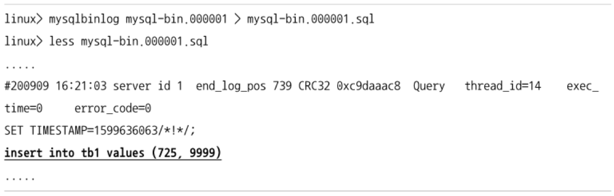

## Statement 기반 바이너리 로그 포맷
- 이벤트를 발생시킨 SQL문을 바이너리 로그에 기록하는 방식


- 장점
  - 여러개의 데이터를 수정하는 쿼리 -> 하나의 SQL문만 저장 -> 바이너리 로그 파일의 용량이 작아짐
    - 백업이나 복제 시 좀더 빠르게 처리할 수 있음
  - SQL문을 쉽게 확인할 수 있음
- 단점
  - 비확정적으로 처리될 수 있는 쿼리는 소스-레플리카 서버 간 데이터가 달라질 수 있음
    - delete/update 쿼리에서 order by 절 없이 limit 사용
    - select ... from update 및 select ... from share 쿼리에서 nowait or skip locked 옵션 사용
    - load_file(), uuid(), uuid_short(), user(), found_rows(), rand(), version() 등과 같은 함수 사용
    - 동일한 파라미터 값을 입력하더라도 결괏값이 달라질 수 있는 사용자 정의 함수나 스토어드 프로시저를 사용하는 쿼리
  - row 포맷으로 복제될 때보다 데이터에 더 많은 락을 걸 경우
    - insert into ... select 구문
    - 풀 테이블 스캔을 유발하는 update 쿼리
    - 불필요하게 많은 데이터에 오랜 시간동안 락을 걸게됨
      - row 포맷을 사용한다면 레플리카 서버에서 변경된 데이터 자체가 넘어가서 적용되므로 락을 더 적게 점유하고 처리 속도도 상대적으로 빠름
- 제한사항
  - 트랜잭션 격리 수준이 `repeatable-read` 이상이어야 함
    - 이하 방식에서는 하나의 트랜잭션 내에서도 쿼리가 실행될때마다 데이터 스냅숏이 달라질 수 있음 -> 소스, 레플리카 서버의 데이터가 일치하지 않을 수 있음

## Row 기반 바이너리 로그 포맷
- MySQL 5.1 부터 도입
  - MySQL 5.7.7 부터 바이너리 로그의 기본 포맷으로 지정
- MySQL 서버에서 데이터 변경이 발생했을 때 변경된 값 자체가 바이너리 로그에 기록되는 방식
- 소스, 레플리카 서버의 데이터를 일관되게 하는 가장 안전한 방식
  - uuid(), user() 등과 같은 비확정적 함수를 사용했다고 해도 함수의 결괏값이 저장되기 때문에 안전하게 복제가 가능함
- Statement 포맷보다 락이 최소화되어 처리됨
- 쿼리가 많은 데이터를 변경한 경우 변경된 데이터가 전부 기록되므로 로그 파일의 크기가 단시간에 매우 커질 수 있음
- 모든 격리 수준에서 사용 가능
- DDL문은 전부 Statement 포맷 형태로 기록됨
  - 사용자 계정 생성 & 권한 부여 및 회수
  - 테이블, 뷰, 트리거 생성

## Mixed 포맷
- MySQL 서버의 binlog_format 시스템 변수를 mixed로 지정
- 기본적으로는 Statement 포맷을 사용, 실행된 쿼리와 스토리지 엔진에 따라 Row 포맷으로 전환
- 대부분의 쿼리는 Statement 포맷으로 기록됨
  - 비확정적으로 처리될 수 있는 쿼리는 Row 포맷으로 기록됨


- InnoDB는 둘다 지원함

## Row 포맷의 용량 최적화
- 바이너리 로그 파일의 용량이 Statement 포맷보다 커질 수 있음

### 바이너리 로그 Row 이미지
- 쿼리로 인해 변경된 데이터들이 전부 로그에 저장되므로 Statement 포맷보다 더 많은 저장 공간과 네트워크 트래픽을 유발할 가능성이 있음
- Row 포맷의 바이너리 로그 파일 용량을 최소화하기 위해 `binlog_row_image` 시스템 변수 제공
  - 바이너리 로그에 변경 전/후 레코드가 함께 저장됨
  - `binlog_row_image` 시스템 변수는 각 변경 전후 레코드들에 대해 테이블의 어떤 컬럼들을 기록할지 결정함
    - full
      - 변경이 발생한 레코드의 모든 컬럼들의 값을 바이너리 로그에 기록하는 방식
      - insert: 저장된 레코드의 컬럼들만 기록
      - update: 변경 전/후 레코드의 컬럼들 모두 기록
      - delete: 삭제 전 레코드의 컬럼들만 기록
    - minimal
      
      - 꼭 필요한 컬럼들의 값만 바이너리 로그에 기록
      - PKE: 테이블의 PK or PK 역할을 하는 컬럼 조합
        - PK가 있는 테이블은 PK가 PKE로 취급
        - PK가 없는 테이블은 not null로 정의된 유니크 인덱스 > 레코드의 모든 컬럼 조합이 PKE
    - noblob
      - full과 동일하게 작동
      - 레코드의 blob, text 컬럼에 대해 변경이 발생하지 않은 경우 해당 컬럼들은 로그 파일에 기록하지 않음

### 바이너리 로그 트랜잭션 압축
- MySQL 8.0.20 버전에서 Row 포맷으로 기록되는 트랜잭션에 대해 트랜잭션에서 변경한 데이터를 압축해서 바이너리 로그에 기록할 수 있는 기능이 도입
  - Row 포맷 사용 시 DML 쿼리의 양이 많아진다면 바이너리 로그 파일의 크기가 커질 수밖에 없음
  - 디스크 공간 및 네트워크 대역폭 사용량 절약을 위해 바이너리 로그 보관 주기를 더 짧게 설정함
  - 위 기능을 활용하여 바이너리 로그 보관 주기를 유지하면서 이전보다 디스크 공간을 절약할 수 있게 되었고, 복제로 인해 소비되는 네트워크 대역폭 사용량도 줄일 수 있게 되었음


- 압축 기능이 활성화되어 있으면 트랜잭션에서 변경한 데이터들을 zstd 알고리즘을 사용해서 압축 -> `Transaction_payload_event` 라는 하나의 이벤트로 바이너리 로그에 기록
  - 압축된 데이터는 레플리카 서버로 복제될 때도 압축된 상태를 유지, 레플리케이션 I/O 스레드도 압축된 상태 그대로 릴레이 로그에 기록
  - 소스 서버에서 압축 기능을 사용했다면 레플리카 서버도 바이너리 로그 압축을 지원하는 MySQL 8.0.20 버전 이상을 사용해야 함
- `binlog_transaction_compression` 시스템 변수로 압축 기능을 활성화할 수 있음
- `binlog_transaction_compression_level_zstd` 시스템 변수로 zstd 알고리즘 레벨을 설정
- 모든 경우에 대해 압축이 적용되지는 않음
  - GTID 설정 관련 이벤트
  - 그룹 복제에서 발생한 view change 이벤트 or 소스 서버에서 레플리카 서버에 살아있음을 알리는 heartbeat와 같은 제어 이벤트
  - 복제 실패 및 소스, 레플리카 서버 간 데이터 불일치를 발생시킬 수 있는 incident 타입의 이벤트
  - 트랜잭션을 지원하지 않는 스토리지 엔진에 대한 이벤트 및 이를 포함하는 트랜잭션 이벤트
  - Statement 포맷으로 기록되는 트랜잭션 이벤트
- 압축된 트랜잭션 데이터는 개별 이벤트들의 내용이 어떤 것인지 실제로 확인이 필요할 때 압축이 해제됨
  - 레플리카 서버에서 레플리케이션 SQL 스레드에 의해 복제된 트랜잭션이 적용될 때
  - mysqlbinlog를 사용해 트랜잭션을 재실행할 때
  - `show binlog events` or `show relaylog events` 구문이 사용될 때
- `performance` 스키마를 통해 압축된 트랜잭션들의 통계 정보와 압축 성능을 확인할 수 있음
  - `binary_log_transaction_compression_stats` 테이블에 관련 정보가 저장됨
  - 통계 정보들은 MySQL 서버가 시작되면 자동으로 수집됨
    - truncate 구문을 사용해서 MySQL 서버가 구동 중인 상태에서 데이터를 초기화할 수 있음
  - update문을 활용하여 압축 및 압축 해제에 소요된 시간도 확인 가능
    ```sql
      update performance_schema.setup_instruments
      set enabled='yes', timed='yes'
      where name in ('stage/sql/Compressing transaction changes,', 'stage/sql/Decompressing transaction changes.');
    ```
    - 압축을 적용시키기 전에 설정을 변경해야 확인 가능


- 압축을 적용한 후 약 50% 정도로 바이너리 로그 파일의 크기가 줄어들었음


- 압축 레벨이 달라도 바이너리 로그 크기는 별 차이 없음 (기본값 사용)


- 압축 기능 사용 시 압축 처리로 인해 MySQL 내부적으로 오버헤드가 존재하며, CPU와 메모리 등의 서버 자원을 더 소모할 수 있음
- 250만건의 데이터를 저장할 때 CPU 사용률 차이는 크지 않지만 소요 시간 차이가 큼
- 현재 MySQL 서버의 리소스 사용률 현황과 쿼리 응답 속도 등을 파악하여 압축 기능 사용 여부를 결정하는 것이 좋음
