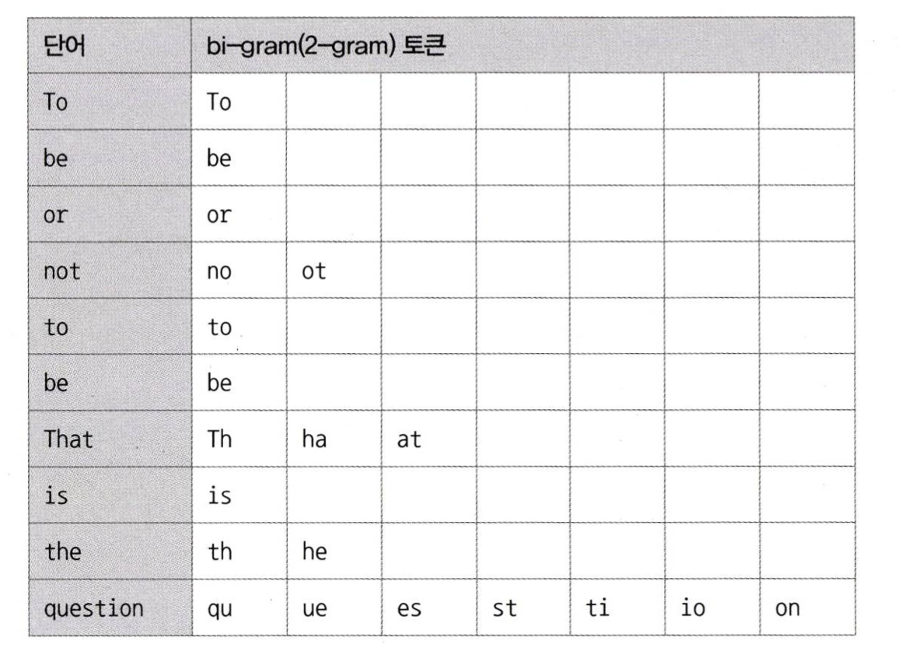

[8.5 전문 검색 인덱스](#85-전문-검색-인덱스)
- [8.5.1.1 어근 분석 알고리즘](#8511-어근-분석-알고리즘)
- [8.5.1.2 n-gram 알고리즘](#8512-n-gram-알고리즘)
- [8.5.1.3 불용어 변경 및 삭제](#8513-불용어-변경-및-삭제)
    - [전문 검색 인덱스의 불용어 처리 무시](#전문-검색-인덱스의-불용어-처리-무시)
    - [사용자 정의 불용어 사용](#사용자-정의-불용어-사용)
- [8.5.2 전문 검색 인덱스의 가용성](#852-전문-검색-인덱스의-가용성)

# 8.5 전문 검색 인덱스
- Full Text 검색에는 InnoDB나 MyISAM 스토리지 엔진에서 제공하는 일반적인 용도의 B-Tree 인덱스를 사용할 수 없다.
- 문서 전체에 대한 분석과 검색을 위한 인덱싱 알고리즘을 전문 검색 인덱스라고 한다.

## 8.5.1.1 어근 분석 알고리즘
- MySQL 서버의 전문 검색 인덱스는 두 가지 과정을 거쳐서 색인 작업이 수행된다.
    - 불용어 (Stop Word) 처리
        - 검색에서 별 가치없는 단어를 모두 필터링해서 제거하는 작업
        - 갯수가 많지 않아서 코드에 상수로 정의해서 사용하는 경우가 많음
    - 어근 분석 (Stemming)
        - 검색어로 선정된 단어의 뿌리인 원형을 찾는 작업
        - 오픈소스 형태소 분석 라이브러리인 $MeCab^4$을 플러그인 형태로 사용할 수 있게 지원한다.

## 8.5.1.2 n-gram 알고리즘
- 단순히 키워드를 검색해내기 위한 인덱싱 알고리즘
- 본문을 무조건 몇 글자씩 잘라서 인덱싱하는 방법
- 형태소 분석보다 알고리즘이 단순하고 국가별 언어에 대한 이해와 준비 작업이 필요없다.
- 만들어진 인덱스의 크기는 상당히 큰 편이다.
- n-gram에서 n은 인덱싱할 키워드의 최소 글자 수를 의미
    - 2-gram 방식이 많이 사용된다.
    - `ex) To be or not to be. That is the question`
        
        - MySQL 서버는 생성된 토큰에 대해 불용어를 걸러내는 작업을 수행한다.
        - 이 때 불용어와 동일하거나 포함하는 경우 버린다.

## 8.5.1.3 불용어 변경 및 삭제
- 위 예시에서 `ti` `at` `ha` 같은 토큰들은 `a` `i`가 불용어로 등록되었기 때문에 버려졌다.
- 실제로 불용어 처리는 사용자를 더 혼란스럽게 하는 기능일 수 있다.
- MySQL 서버에 내장된 불용어 대신 사용자가 직접 불용어를 등록하는 방법을 권장

### 전문 검색 인덱스의 불용어 처리 무시
1. 스토리지 엔진에 관계없이 MySQL 서버의 모든 전문 검색 인덱스에 대해 불용어를 완전히 제거하는 것
    - MySQL 서버의 설정파일 (my.cnf)의 `ft_stopword_file` 시스템 변수에 빈 문자열을 설정한다.
    - 설정을 변경하면 MySQL 서버를 재시작해야 변경사항이 반영된다.

2. InnoDB 스토리지 엔진을 사용하는 테이블의 전문 검색 인덱스에 대해서만 불용어 처리를 무시한다.
    - `innodb_ft_enable_stopword` 시스템 변수를 `OFF`로 설정한다.
    - 위 변수는 동적인 시스템 변수이므로 MySQL 서버가 실행중인 상태에서도 변경할 수 있다.

### 사용자 정의 불용어 사용
1. 불용어 목록을 파일로 저장하고, MySQL 서버 설정 파일에서 파일의 경로를 `ft_stopword_file`에 등록한다.
    - `ft_stopword_file='/data/my_custom_stopword.txt'`

2. 불용어의 목록을 테이블로 저장한다.
- InnoDB 스토리지 엔진을 사용하는 테이블의 전문 검색 엔진에서만 사용할 수 있다.
- `innodb_ft_server_stopword_table` 시스템 변수에 불용어 테이블을 설정한다.
    - `SET GLOBAL innodb_ft_server_stopword_table='mydb/my_stopword'`
- 불용어 목록을 변경한 이후 전문 검색 인덱스가 생성되어야만 변경된 불용어가 적용된다.

## 8.5.2 전문 검색 인덱스의 가용성
- 전문 검색 인덱스를 사용하려면 두 가지 조건을 갖춰야 한다.
    - 쿼리 문장이 전문 검색을 위한 문법 (`MATCH (...) AGAINST (...)`)을 사용
    - 테이블이 전문 검색 대상 컬럼에 대해서 전문 인덱스 보유
- `SELECT * FROM tb_test WHERE doc_body LIKE '%애플%';`
    - 위 쿼리로도 원하는 검색 결과를 얻을 수 있다.
    - 하지만 풀 테이블 스캔으로 쿼리를 처리한다.
- `SELECT * FROM tb_test WHERE MATCH(doc_body) AGAINST('애플' IN BOOLEAN MODE);`
    - `MATCH(...) AGAINST(...)` 구문으로 검색 쿼리를 작성해야 한다.
    - 전문 검색 인덱스를 구성하는 컬럼들은 MATCH 절의 괄호 안에 모두 명시되어야 한다.
