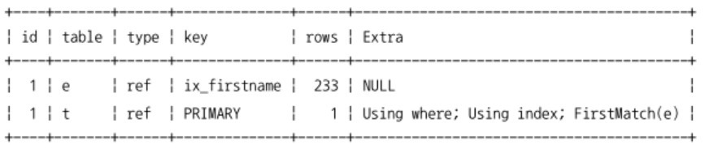
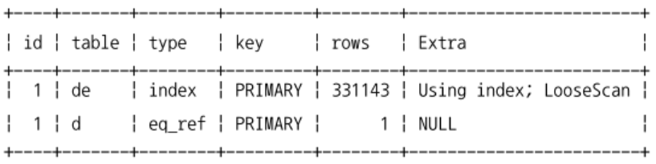
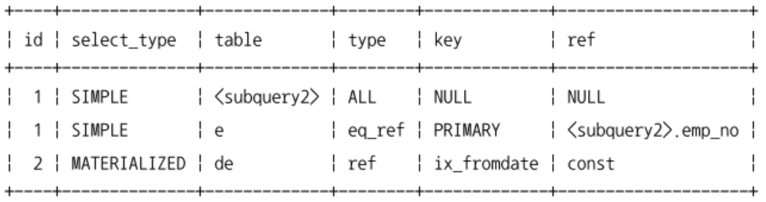
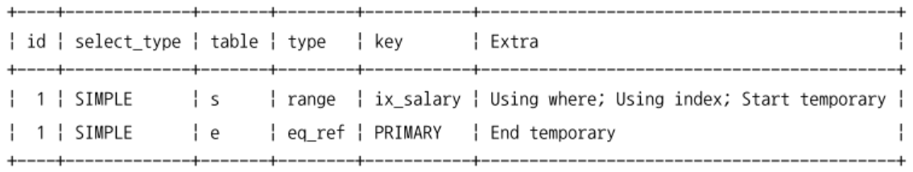
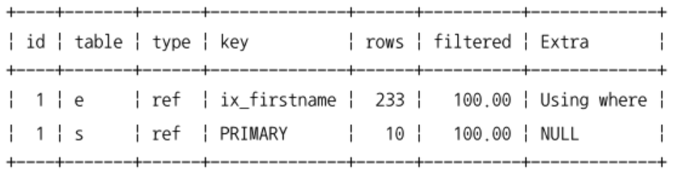
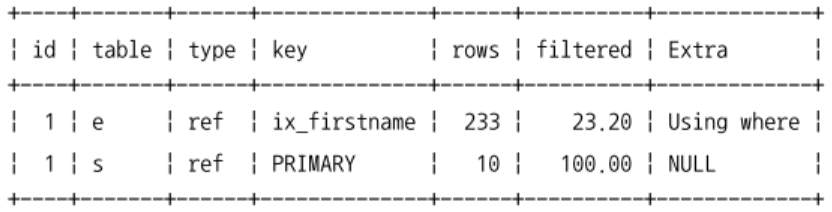
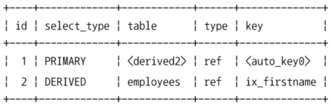
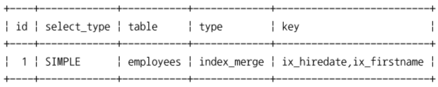
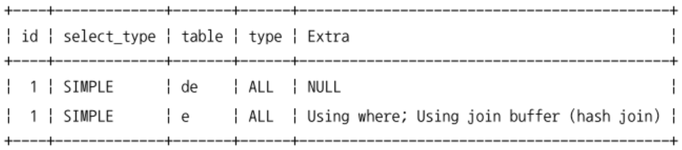
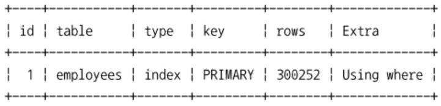

[9.3.1 옵티마이저 스위치 옵션](#931-옵티마이저-스위치-옵션)
- [9.3.1.1 MRR과 배치 키 액세스 (mrr & batched_key_access)](#9311-mrr과-배치-키-액세스-mrr--batched_key_access)
- [9.3.1.2 블록 네스티드 루프 조인 (block_nested_loop)](#9312-블록-네스티드-루프-조인-block_nested_loop)
  - [네스티드 루프 vs 블록 네스티드 루프](#네스티드-루프-vs-블록-네스티드-루프)
- [9.3.1.3 인덱스 컨디션 푸시다운 (index_condition_pushdown)](#9313-인덱스-컨디션-푸시다운-index_condition_pushdown)
- [9.3.1.4 인덱스 확장 (use_index_extensions)](#9314-인덱스-확장-use_index_extensions)
- [9.3.1.5 인덱스 머지 (index_merge)](#9315-인덱스-머지-index_merge)
- [9.3.1.6 인덱스 머지 - 교집합 (index_merge_intersection)](#9316-인덱스-머지---교집합-index_merge_intersection)
- [9.3.1.7 인덱스 머지 - 합집합 (index_merge_union)](#9317-인덱스-머지---합집합-index_merge_union)
- [9.3.1.8 인덱스 머지 - 정렬 후 합집합 (index_merge_sort_union)](#9318-인덱스-머지---정렬-후-합집합-index_merge_sort_union)
- [9.3.1.9 세미 조인 (semijoin)](#9319-세미-조인-semijoin)
- [9.3.1.10 테이블 풀-아웃 (Table Pull-out)](#93110-테이블-풀-아웃-table-pull-out)
- [9.3.1.11 퍼스트 매치 (firstmatch)](#93111-퍼스트-매치-firstmatch)
- [9.3.1.12 루스 스캔 (loosescan)](#93112-루스-스캔-loosescan)
- [9.3.1.13 구체화 (Materialization)](#93113-구체화-materialization)
- [9.3.1.14 중복 제거 (Duplicated Weed-out)](#93114-중복-제거-duplicated-weed-out)
- [9.3.1.15 컨디션 팬아웃 (condition_fanout_filter)](#93115-컨디션-팬아웃-condition_fanout_filter)
- [9.3.1.16 파생 테이블 머지 (derived_merge)](#93116-파생-테이블-머지-derived_merge)
- [9.3.1.17 인비저블 인덱스 (use_invisible_indexes)](#93117-인비저블-인덱스-use_invisible_indexes)
- [9.3.1.18 스킵 스캔 (skip_scan)](#93118-스킵-스캔-skip_scan)
- [9.3.1.19 해시 조인(hash_join)](#93119-해시-조인hash_join)
- [9.3.1.20 인덱스 정렬 선호 (prefer_ordering_index)](#93120-인덱스-정렬-선호-prefer_ordering_index)

[9.3.2 조인 최적화 알고리즘](#932-조인-최적화-알고리즘)
- [9.3.2.1 Exhaustive 검색 알고리즘](#9321-exhaustive-검색-알고리즘)
- [9.3.2.2 Greedy 검색 알고리즘](#9322-greedy-검색-알고리즘)

# 9.3.1 옵티마이저 스위치 옵션
- optimizer_switch 시스템 변수로 제어
- 글로벌, 세션별 모두 설정할 수 있어서 MySQL 서버 전체적으로 또는 현재 커넥션에 대해 설정할 수 있음

## 9.3.1.1 MRR과 배치 키 액세스 (mrr & batched_key_access)
- MRR: Multi-Range Read
- MySQL 서버에서 지금까지 지원하던 조인 방식은 드라이빙 테이블의 레코드를 한 건 읽어서 드리븐 테이블의 일치하는 레코드를 찾아서 조인 수행 - Nested Loop Join
- 조인 처리는 MySQL 엔진이 처리하지만 실제 레코드를 검색하고 읽는 부분은 스토리지 엔진이 담당
  - 드라이빙 테이블의 레코드 건별로 드리븐 테이블의 레코드를 찾으면 레코드를 찾고 읽는 스토리지 엔진에서는 아무런 최적화를 수행할 수 없음
  - 위 단점을 보완하기 위해 MySQL 서버는 조인 대상 테이블 중 하나로부터 레코드를 읽어서 조인 버퍼에 버퍼링한다.
  - 조인 버퍼에 리코드가 가득 차면 MySQL 엔진은 버퍼링된 레코드를 스토리지 엔진으로 한 번에 요청한다.
  - 이렇게 함으로써 스토리지 엔진은 읽어야 할 레코드들을 데이터 페이지에 정렬된 순서로 접근해서 디스크의 데이터 페이지 읽기를 최소화할 수 있다.
- MRR을 응용해서 실행되는 조인 방식을 BKA (Batched Key Access) 조인이라고 한다.
  - 부가적인 정렬 작업이 필요한 단점이 있어 기본적으로 BKA 조인 최적화는 비활성화 되어있다.

## 9.3.1.2 블록 네스티드 루프 조인 (block_nested_loop)
- 조인의 연결 조건이 되는 컬럼에 모두 인덱스가 있는 경우 사용되는 조인 방식
- ```sql
    EXPLAIN
      SELECT *
      FROM employees e
        INNER JOIN salaries s ON s.emp_no=e.emp_no
          AND s.from_date<=NOW()
          AND s.to_date>=NOW()
      WHERE e.first_name='Amor';
  ```
  ```cpp
    for (row1 IN employees) {
      for (row2 IN salaries) {
        if (condition_matched) return (row1, row2);
      }
    }
  ```
  - 중첩된 반복 명령을 사용하는 것처럼 작동한다고 해서 네스티드 루프 조인이라고 한다.
  - 레코드를 읽어서 다른 버퍼 공간에 저장하지 않고, 즉시 드리븐 테이블의 레코드를 찾아서 반환한다.
- 조인은 드라이빙 테이블에서 일치하는 레코드의 건수만큼 드리븐 테이블을 검색하면서 처리한다.
  - 드라이빙 테이블은 한 번에 읽고, 드리븐 테이블은 여러 번 읽는다.
  - 드리븐 테이블의 조인 조건이 인덱스를 이용할 수 없다면 드리븐 테이블에서 연결되는 레코드를 찾기 위해 풀 테이블 스캔을 N번 해야한다. -> 쿼리가 상당히 느려짐
  - 옵티마이저는 최대한 드리븐 테이블의 검색이 인덱스를 사용할 수 있게 실행 계획을 수립한다.
  - 어떤 방식으로도 드리븐 테이블의 풀 테이블 스캔이나 인덱스 풀 스캔을 피할 수 없다면 옵티마이저는 드라이빙 테이블에서 읽은 레코드를 메모리에 캐시한 후 드리븐 테이블과 이 메모리 캐시를 조인하는 형태로 처리한다.
    - 여기서 사용되는 메모리의 캐시를 조인 버퍼라고 함
      - `join_buffer_size` 시스템 변수로 크기 제한
      - 조인이 완료되면 조인 버퍼는 바로 해제된다.
  - ```sql
      SELECT *
      FROM dept_emp de, employees e
      WHERE de.from_date>'1995-01-01' AND e.emp_no<109004;
    ```
    
    1. dept_emp 테이블의 ix_fromdate 인덱스를 이용해서 `from_date>'1995-01-01'` 조건을 만족하는 레코드를 검색한다.
    2. 조인에 필요한 나머지 컬럼을 모두 dept_emp 테이블로부터 읽어서 조인 버퍼에 저장한다.
    3. employees 테이블의 PK를 이용해서 `emp_no<109004` 조건을 만족하는 레코드를 검색한다.
    4. 3에서 검색된 결과에 2에서 캐시된 조인 버퍼의 레코드를 결합해서 반환한다.
    - 쿼리의 실행 계획상으로 dept_emp 테이블이 드라이빙 테이블, employees 테이블이 드리븐 테이블이 된다.
    - 실제 드라이빙 테이블의 결과는 조인 버퍼에 담아두고, 드리븐 테이블을 먼저 읽고 조인 버퍼에서 일치하는 레코드를 찾는 방식으로 처리된다.
    - 일반적으로 조인이 수행된 후 가져오는 결과는 드라이빙 테이블의 순서에 의해 결정되지만 조인 버퍼가 사용되는 조인에서는 결과의 정렬 순서가 흐트러질 수 있다.

### 네스티드 루프 vs 블록 네스티드 루프
- 조인 버퍼가 사용되는지 여부와 조인에서 드라이빙 테이블과 드리븐 테이블이 어떤 순서로 조인되는지
- `Block`이라는 단어가 사용되면 조인용으로 별도의 버퍼가 사용되었음을 의미
  - Extra에 `Using Join buffer` 메시지 표시

## 9.3.1.3 인덱스 컨디션 푸시다운 (index_condition_pushdown)
- MySQL 5.6 버전부터 도입된 기능
- ```sql
    ALTER TABLE employees ADD INDEX ix_lastname_firstname (last_name, first_name);

    SET optimizer_switch='index_condition_pushdown=off';
    SHOW VARIABLES LIKE 'optimizer_switch'
  ```
  ```sql
    SELECT * FROM employees WHERE last_name='Action' AND first_name LIKE '%sal';
  ```
  - `last_name='Action'` 조건은 `ix_lastname_firstname` 인덱스를 레인지 스캔으로 사용할 수 있다.
  - `first_name LIKE '%sal'` 조건은 인덱스 레인지 스캔을 사용할 수 없다.
    - 위 쿼리로는 인덱스의 특정 범위만 조회할 수 있는 조건이고, first_name LIKE '%sal' 조건은 데이터를 모두 읽은 후 하나씩 비교해야 한다.
  - 실행 계획의 Extra에는 `Using where` 메시지가 표시
    - `first_name LIKE '%sal'` 조건이 해당
  - 인덱스를 비교하는 작업은 실제 InnoDB 스토리지 엔진이 수행, 테이블의 레코드에서 first_name을 비교하는 작업은 MySQL 엔진이 수행
    - MySQL 5.5 까지는 인덱스를 범위 제한 조건으로 사용하지 못하는 조건을 MySQL -> InnODB 스토리지 엔진으로 전달하지 않았음 -> 불필요한 테이블 읽기가 수행되었음
    - MySQL 5.6 부터는 인덱스에 포함된 컬럼의 조건이 있다면 모두 스토리지 엔진으로 전달할 수 있게 핸들러 API가 개선되었음 -> 필요한 테이블 읽기만 수행함
  - `SET optimizer_switch='index_condition_pushdown=on';`으로 변경 후 실행 계획 확인
    - Extra에 `Using index condition` 메시지가 표시된다.

## 9.3.1.4 인덱스 확장 (use_index_extensions)
- InnoDB 스토리지 엔진을 사용하는 테이블에서 세컨더리 인덱스에 자동으로 추가된 PK를 활용할 수 있게 할지 결정하는 옵티마이저 옵션
- InnoDB 스토리지 엔진은 PK를 클러스터링 키로 생성하여 모든 세컨더리 인덱스를 리프 노드에 PK 값을 가진다.
- ```sql
    CREATE TABLE dept_emp (
      emp_no INT NOT NULL,
      dept_no CHAR(4) NOT NULL,
      from_date DATE NOT NULL,
      to_date DATE NOT NULL,
      PRIMARY KEY (dept_no, emp_no),
      KEY ix_fromdate (from_date)
    ) ENGINE=InnoDB;
  ```
  - ix_fromdate 인덱스는 (from_date, dept_no, emp_no) 조합으로 인덱스를 생성한 것과 흡사하게 작동할 수 있다.
  - MySQL 서버가 업그레이드되면서 옵티마이저는 ix_fromdate 인덱스의 마지막에 PK 컬럼이 숨어있다는 것을 인지하고 실행 계획을 수립하도록 개선되었다.
  - ```sql
      -- key_len: 쿼리가 인덱스를 구성하는 컬럼 중에서 어느 부분까지 사용했는지 바이트 수로 표시
      EXPLAIN SELECT COUNT(*) FROM dept_emp WHERE from_date='1987-07-25' AND dept_no='d001';
      -- 19 바이트 표시, (from_date, dept_emp) 컬럼 사용

      EXPLAIN SELECT COUNT(*) FROM dept_emp WHERE from_date='1987-07-25';
      -- 3 바이트 표시, (from_date) 컬럼 사용
    ```
  - PK가 세컨더리 인덱스에 포함되어 있어서 ORDER BY 정렬 작업도 인덱스를 활용해서 처리한다.
    - ```sql
        EXPLAIN SELECT * FROM dept_emp WHERE from_date='1987-07-25 ORDER BY dept_no';
        -- Extra에 `Using Filesort`가 표시되지 않음 -> 별도의 정렬 작업 없이 인덱스 순서대로 레코드를 읽음
      ```

## 9.3.1.5 인덱스 머지 (index_merge)
- 인덱스를 이용한 쿼리 실행 시 대부분의 옵티마이저는 테이블별로 하나의 인덱스만 사용하도록 실행 계획을 수립한다.
- 인덱스 머지 실행 계획을 사용하면 하나의 테이블에 대해 2개 이상의 인덱스를 이용해서 쿼리를 커리한다.
  - 쿼리에 사용된 각각의 조건이 서로 다른 인덱스를 사용할 수 있고, 그 조건을 만족하는 레코드 건수가 많을 것으로 예상될 때 MySQL 서버는 인덱스 머지 실행 계획을 선택한다.
- 3개의 세부 실행 계획
  - index_merge_intersection
  - index_merge_sort_union
  - index_merge_union

## 9.3.1.6 인덱스 머지 - 교집합 (index_merge_intersection)
```sql
  EXPLAIN SELECT *
  FROM employees
  WHERE first_name='Georgi' AND emp_no BETWEEN 10000 AND 20000;

  -- 두 조건을 모두 만족하는 레코드: 14
  -- first_name='Georgi' 조건을 만족하는 레코드: 253
  -- emp_no BETWEEN 10000 AND 20000 조건을 만족하는 레코드: 10000
```
- Extra에 `Using intersect` 표시
- first_name, emp_no 컬럼 모두 각각의 인덱스를 갖고 있다.
- 어떤 조건을 사용하더라도 인덱스를 사용할 수 있다. -> 옵티마이저는 두 인덱스를 모두 사용해서 쿼리를 처리하기로 결정
- 인덱스를 각각 검색해서 그 결과의 교집합에 해당하는 레코드들만 반환한다.
- 인덱스 머지 실행 계획이 아니었다면
  - `first_name='Georgi'` 조건만 인덱스를 사용했다면 일치하는 레코드를 검색한 다음, 데이터 페이지에서 레코드를 찾고 emp_no 컬럼의 조건에 일치하는 레코드들만 반환하는 형태로 처리
    - 253개의 데이터 페이지 읽기를 해서 14건만 반환
  - `emp_no BETWEEN 10000 AND 20000` 조건만 인덱스를 사용했다면 PK를 이용해서 레코드를 검색한 다음 first_name 조건에 일치하는 레코드들만 반환하는 형태로 처리
    - 10000개의 데이터 페이지를 읽고 14건만 반환
  - 두 작업 모두 비효율이 매우 큰 상황에서 옵티마이저는 각 인덱스를 검색한 두 결과의 교집합만 찾아서 반환한다.
- ```sql
    -- MySQL 서버 전체적으로 index_merge_intersection 최적화 비활성화
    SET GLOBAL optimizer_switch='index_merge_intersection=off'

    -- 현재 커넥션에 대해 index_merge_intersection 최적화 비활성화
    SET SESSION optimizer_switch='index_merge_intersection=off'

    -- 현재 쿼리에서만 index_merge_intersection 최적화 비활성화
    EXPLAIN
    SELECT SET_VAR(optimizer_switch='index_merge_intersection=off')
    FROM employees
    WHERE first_name='Georgi' AND emp_no BETWEEN 10000 AND 20000;
  ```

## 9.3.1.7 인덱스 머지 - 합집합 (index_merge_union)
```sql
  SELECT *
  FROM employees
  WHERE first_name='Matt' OR hire_date='1987-03-31';
```
- Extra에 `Using union` 표시
- WHERE절에 사용된 2개 이상의 조건이 각각의 인덱스를 사용하되 `OR` 연산자로 연결된 경우에 사용되는 최적화
- first_name, hire_date 컬럼 모두 인덱스를 사용할 수 있다.
- 인덱스를 각각 검색해서 나온 결과에서 중복을 제거하기 위해 정렬 작업을 하지 않는다.
  - ```sql
      SELECT * FROM employees WHERE first_name='Matt';
      SELECT * FROM employees WHERE hire_date='1987-03-31';
    ```
  - 우선 두 검색 결과는 PK 기준으로 정렬되어 있다.
  - 두 검색 결과에서 하나씩 가져와서 우선순위 큐를 이용해서 중복을 제거한다.

## 9.3.1.8 인덱스 머지 - 정렬 후 합집합 (index_merge_sort_union)
```sql
  EXPLAIN
  SELECT *
  FROM employees
  WHERE first_name='Matt'
    OR hire_date BETWEEN '1987-03-01' AND '1987-03-31';
```
```sql
  SELECT * FROM employees WHERE first_name='Matt';
  SELECT * FROM employees WHERE hire_date BETWEEN '1987-03-01' AND '1987-03-31';
```
- Extra에 `Using sort_union` 표시
- 두 결과 집합의 중복을 제거하기 위해 정렬이 필요한 경우 MySQL 서버는 인덱스 머지 최적화의 `Sort union` 알고리즘을 사용한다.
- 첫 번째 쿼리는 emp_no로 정렬되지만 두 번째 쿼리 결과는 emp_no 컬럼으로 정렬되지 않는다.
  - 우선순위 큐 사용이 불가능해서 중복제거를 위해 각 집합을 emp_no로 정렬한 다음 중복 제거를 수행한다.

## 9.3.1.9 세미 조인 (semijoin)
```sql
  SELECT *
  FROM employees e
  WHERE e.emp_no IN
    (SELECT de.emp_no FROM dept_emp de WHERE de.from_date='1995-01-01');
```
- 실제 조인을 수행하지는 않고, 다른 테이블에서 조건에 일치하는 레코드가 있는지만 체크하는 형태의 쿼리
- MySQL 5.7 서버는 전통적으로 세미 조인 형태의 쿼리를 최적화하는 부분이 취약했다.
  - 세미 조인 최적화 기능이 없었을 때는 employees 테이블을 풀 스캔하면서 한 건씩 서브쿼리 조건에 일치하는지 비교했다.
  - MySQL 8.0 버전은 `SET SESSION optimizer_switch='semijoin=off'` 명령으로 이 방식을 확인할 수 있다.
    - 테스트가 완료되면 `SET optimizer_switch='default'` 명령으로 기본 값으로 되돌리자.
- 세미 조인 vs 안티 세미 조인
  - `= (sub query)`, `IN (sub query)` 형태의 세미 조인 쿼리에 대한 최적화
    - 세미 조인 최적화
      - MySQL 8.0 버전부터는 세미 조인 쿼리의 성능을 개선하기 위한 최적화 전략
      - Table Pull-out
      - Duplicate Weed-out
      - First Match
      - Loose Scan
      - Materialization
    - IN-to-EXISTS 최적화
    - MATERIALIZATION 최적화
  - `<> (sub query)`, `NOT IN (sub query)` 형태의 안티 세미 조인 쿼리에 대한 최적화
    - IN-to-EXIST 최적화
    - MATERIALIZATION 최적화

## 9.3.1.10 테이블 풀-아웃 (Table Pull-out)
- 세미 조인의 서브쿼리에 사용된 테이블을 아우터 쿼리로 가져와서 쿼리를 조인 쿼리로 재작성하는 형태의 최적화
- 서브쿼리 최적화가 도입되기 이전에 수동으로 쿼리를 튜닝하던 대표적인 방법
- ```sql
    EXPLAIN
    SELECT * FROM employees e
    WHERE e.emp_no IN (SELECT de.emp_no FROM dept_emp de WHERE de.dept_no='d009');
  ```
  - id 컬럼의 값이 같게 나옴 -> 두 테이블이 서브쿼리 형태가 아닌 조인으로 처리되었음
  - Extra에 메시지가 표시되지 않는다.
    - 실행 계획에서 해당 테이블을의 id 컬럼 값이 같은지 확인한다.
    - 더 정확한 방법으로는 SHOW WARNINGS 명령으로 MySQL 옵티마이저가 재작성한 쿼리를 살펴보는 것
- Table pullout 최적화는 모든 형태의 서브쿼리에서 사용될 수 있는건 아님
  - Table pullout 최적화는 세미 조인 서브쿼리에서만 사용 가능하다.
  - Table pullout 최적화는 서브쿼리 부분이 UNIQUE 인덱스나 PK 룩업으로 결과가 1건인 경우에만 사용 가능하다.
  - Table pullout이 적용된다고 해도 기존 쿼리에서 가능했던 최적화 방법이 사용 불가능한 것은 아니므로 MySQL에서는 가능하다면 Table pullout 최적화를 최대한 적용한다.
  - Table pullout 최적화는 서브쿼리의 테이블을 아우터 쿼리로 가져와서 조인으로 풀어쓰는 최적화를 수행하는데, 만약 서브쿼리의 모든 테이블이 아우터 쿼리로 끄집어낼 수 있다면 서브쿼리 자체는 없어진다.
  - MySQL에서는 `최대한 서브쿼리를 조인으로 풀어서 사용해라`라는 튜닝 가이드가 많은데, Table pullout 최적화는 이를 그대로 실행한 것이다. 이제부터는 조인으로 풀어서 사용할 필요가 없다.

## 9.3.1.11 퍼스트 매치 (firstmatch)
- IN (subquery) 형태의 세미 조인을 EXIST (subquery) 형태로 튜닝한 것과 비슷한 방법으로 실행된다.
  ```sql
    EXPLAIN
      SELECT *
      FROM employees e
      WHERE e.first_name='Matt'
        AND e.emp_no IN (
          SELECT t.emp_no
          FROM titles t
          WHERE t.from_date BETWEEN '1995-01-01' AND '1995-01-30'
        );
  ```
  
  
  - Extra에 `FirstMatch(e)` 메시지 표시
    - employees 테이블의 레코드에 대해 titles 테이블에 일치하는 레코드 1건만 찾으면 더이상의 titles 테이블 검색을 하지 않는다. -> EXISTS와 동일하게 처리된 것
  - id 컬럼의 값이 모두 1로 표시
    - titles 테이블이 서브쿼리 패턴으로 실행되지 않고, 조인으로 처리되었다는 것을 알 수 있다.
- MySQL 5.5의 IN-to-EXISTS 변환에 비해 FirstMatch 최적화 전략의 장점
  - 가끔은 여러 테이블이 조인되는 경우 원래 쿼리에는 없던 동등 조건을 옵티마이저가 자동으로 추가하는 형태의 최적화가 실행되기도 한다.
  - 서브쿼리의 모든 테이블에 대해 FirstMatch 최적화를 수행할지, 일부 테이블에 대해서만 수행할지 선택이 가능해졌다.
- FirstMatch 최적화의 제한사항과 특성
  - 서브쿼리에서 하나의 레코드만 검색되면 더이상의 검색을 멈추는 단축 실행 경로라서 서브쿼리가 참조하는 모든 아우터 테이블이 먼저 조회된 후에 실행된다.
  - 실행 계획의 Extra에 `FirstMatch(table-N)` 문구가 표시된다.
  - 상관 서브쿼리 (Correlated subquery)에서도 사용될 수 있다.
  - GROUP BY나 집합 함수가 사용된 서브쿼리의 최적화에는 사용될 수 없다.
- optimizer_switch 시스템 변수에서 semijoin 옵션과 firstmatch 옵션이 모두 ON으로 활성화된 경우에만 사용할 수 있다.
- firstmatch 최적화만 비활성화하려면 semijoin 옵티마이저 옵션은 ON으로 하되, firstmatch 옵티마이저 옵션만 OFF로 비활성화하면 된다.

## 9.3.1.12 루스 스캔 (loosescan)
- 인덱스를 사용하는 GROUP BY 최적화 방법에서 살펴본 `Using index for group-by`의 루스 인덱스 스캔과 비슷한 읽기 방식을 사용한다.
  ```sql
    EXPLAIN
      SELECT *
      FROM departments d WHERE d.dept_no IN (
        SELECT de.dept_no FROM dept_emp de
      );
    -- departments 테이블의 레코드: 9건
    -- dept_emp 테이블의 레코드: 약 33만건
    -- dept_emp 테이블 내 (dept_no + emp_no) 컬럼의 조합으로 PK 인덱스가 만들어져 있음
  ```
  
  
  - dept_emp 테이블의 PK를 루스 인덱스 스캔으로 유니크한 dept_no만 읽으면 효율적으로 서브쿼리 부분을 실행할 수 있다.
  - 루스 인덱스 스캔의 `Using index for group-by`도 위 그림의 방식과 동일하게 작동한다.
  - Extra에 `LooseScan` 문구가 표시된다.
  - id 컬럼이 동일하게 1이다. -> MySQL 내부적으로 조인처럼 처리되었음
- LooseScan 최적화는 loose index scan으로 서브쿼리 테이블을 읽고, 아우터 테이블을 드리븐으로 사용해서 조인을 수행한다.
  - 서브쿼리 부분이 루스 인덱스 스캔을 사용할 수 있는 조건이 갖춰져야 사용할 수 있다.
    ```sql
      -- 루스 인덱스 스캔 최적화는 아래 형태의 서브쿼리들에서 사용할 수 있다.
      SELECT ... FROM ... WHERE expr IN (SELECT keypart1 FROM tab WHERE ...)
      SELECT ... FROM ... WHERE expr IN (SELECT keypart2 FROM tab WHERE keypart1='상수' ...)
    ```
- 옵티마이저가 LooseScan 최적화를 사용하지 못하게 비활성화하려면 `SET optimizer_switch='loosescan=off'` 로 설정한다.

## 9.3.1.13 구체화 (Materialization)
- 세미 조인에 사용된 서브쿼리를 통째로 구체화해서 쿼리를 최적화한다.
- 구체화: 내부 임시 테이블을 생성한다는 것을 의미
  ```sql
    EXPLAIN
      SELECT *
      FROM employees e
      WHERE e.emp_no IN
        (SELECT de.emp_no FROM dept_emo de
        WHERE de.from_date='1995-01-01');
  ```
  
  - employees 테이블에 대한 조건이 서브쿼리 이외에는 아무것도 없으므로 employees 테이블을 풀 스캔해야 할 것이다.
  - 위 형태의 세미 조인은 FirstMatch 최적화가 성능향상에 별로 도움이 되지 않는다.
  - select_type에 `MATERIALIZED` 표시
  - 위 쿼리에서 사용된 테이블은 2개지만 3개 라인이 출력된 것 -> 임시 테이블이 생성되었음을 유추
    - dept_emp 테이블을 읽는 서브쿼리가 먼저 실행되어 `subquery2` 임시 테이블이 생성됨
    - `subquery2` `employees` 테이블을 조인해서 결과를 반환
- 서브쿼리 내 `GROUP BY` 절이 있어도 사용할 수 있다.
- Materialization 최적화를 사용하기 위한 제한 사항과 특성
  - IN (subquery)에서 서브쿼리는 상관 서브쿼리 (Correlated subquery)가 아니어야 한다.
  - 서브쿼리는 GROUP BY나 집합 함수들이 사용돼도 구체화를 사용할 수 있다.
  - 구체화가 사용된 경우에는 내부 임시 테이블이 사용된다.
- Materialization 최적화는 optimizer_switch 시스템 변수에서 semijoin 옵션과 materizalization 옵션이 모두 ON으로 활성화되어야 사용된다.
  - MySQL 8.0 버전에서는 기본적으로 둘다 활성화되어 있다.
  - Materialization 최적화만 비활성화하려면 materialization 옵션만 OFF로 비활성화 하면 된다.

## 9.3.1.14 중복 제거 (Duplicated Weed-out)
- 세미 조인 서브쿼리를 일반적인 INNER JOIN 쿼리로 바꿔서 실행하고, 마지막에 중복된 레코드를 제거하는 방법으로 처리되는 최적화 알고리즘
  ```sql
    EXPLAIN
      SELECT *
      FROM employees e
      WHERE e.emp_no IN (SELECT s.emp_no FROM salaries s WHERE s.salary>150000);

    -- 원본 쿼리를 INNER JOIN + GROUP BY 절로 바꿔서 실행하는 것과 동일한 작업으로 쿼리를 처리한다.

    SELECT e.*
    FROM employees e, salaries s
    WHERE e.emp_no=s.emp_no AND s.salary>150000
    GROUP BY e.emp_no;
  ```
  
  1. salaries 테이블의 ix_salary 인덱스를 스캔해서 salary가 150000보다 큰 사원을 검색해 employees 테이블 조인을 실행
  2. 조인된 결과를 임시 테이블에 저장
  3. 임시 테이블에 저장된 결과에서 emp_no 기준으로 중복 제거
  4. 중복을 제거하고 남은 레코드를 최종적으로 반환
  
  
    - `Duplicate Weedout` 문구가 별도로 표시되진 않음
    - Extra 컬럼에 `Start temporary`, `End temporary` 문주가 표시된다.
      - 위의 1, 2번은 반복적으로 실행되는 과정
      - 반복 과정이 시작되는 테이블의 실행 계획에는 `Start temporary`가 표시
      - 반복 과정이 끝나는 테이블의 실행 계획에는 `End temporary`가 표시
- Duplicate Weedout 최적화의 장점 및 제약 사항
  - 서브쿼리가 상관 서브쿼리라고 해도 사용할 수 있다.
  - 서브쿼리가 GROUP BY나 집합 함수가 사용된 경우에는 사용될 수 없다.
  - Duplicate Weedout은 서브쿼리의 테이블을 조인으로 처리하기 때문에 최적화할 수 있는 방법이 많다.

## 9.3.1.15 컨디션 팬아웃 (condition_fanout_filter)
- 조인을 실행할 때 테이블의 순서는 쿼리의 성능에 매우 큰 영향을 미친다.
  - MySQL 옵티마이저는 여러 테이블이 조인되는 경우 가능하다면 일치하는 레코드 건수가 적은 순서대로 조인을 실행한다.
```sql
    EXPLAIN
      SELECT *
      FROM employees e
        INNER JOIN salaries s IN s.emp_no=e.emp_no
      WHERE e.first_name='Matt'
        AND e.hire_date BETWEEN '1985-11-21' AND '1986-11-21';
```
  - `SET optimizer_switch='condition_fanout_filter=off'`으로 비활성화한 상태
    
    1. employees 테이블에서 ix_firstname 인덱스를 이용해서 first_name='Matt' 조건에 일치하는 233건의 레코드를 검색한다.
    2. 검색된 233건의 레코드 중에서 hire_date가 '1985-11-21' ~ '1986-11-21'인 레코드만 걸러내는데, 실행 계획에서는 filtered 컬럼의 값이 100인 것은 옵티마이저가 233건 모두 hire_date 컬럼의 조건을 만족할 것으로 예측
    3. employees 테이블을 읽은 결과 233건에 대해 salaries 테이블의 PK를 이용해 salaries 테이블의 레코드를 읽는다. 이때 MySQL 옵티마이저는 employees 테이블의 레코드 한 건당 salaries 테이블의 레코드 10건이 일치할 것으로 예측
  - `SET optimizer_switch='condition_fanout_filter=on'`으로 활성화한 상태
    
    - rows 값은 233건으로 동일하지만 filtered 값은 23.2%로 변경되었다.
      - MySQL 옵티마이저는 인덱스를 사용할 수 있는 first_name 컬럼 조건 이외의 나머지 조건에 대해서도 고려했음을 의미
    - MySQL 8.0버전에서는 아래 조건을 만족하는 컬럼의 조건들을 만족하는 레코드의 비율을 계산할 수 있다.
      - WHERE 조건절에 사용된 컬럼에 대해 인덱스가 있는 경우
      - WHERE 조건절에 사용된 컬럼에 대해 히스토그램이 존재하는 경우
- MySQL 옵티마이저가 실행 계획을 수립할 때 테이블이나 인덱스의 통계 정보만 사용하는 것이 아니라 아래 순서대로 사용 가능한 방식을 선택한다.
  1. 레인지 옵티마이저 (Range optimizer)를 이용한 예측
  2. 히스토그램을 이용한 예측
  3. 인덱스 통계를 이용한 예측
  4. 추측에 기반한 예측 (Guesstimates)
- condition_fanout_filter 최적화 기능 활성화 시 MySQL 옵티마이저는 더 정교한 계산을 거쳐서 실행 계획을 수립한다.
  - 더 많은 시간과 컴퓨팅 자원을 사용하게 된다.
  - MySQL 서버가 처리하는 쿼리의 빈도가 매우 높다면 실행 계획 수립에 추가되는 오버헤드가 더 크게 보일 수 있으므로 가능하면 업그레이드를 실행하기 전에 성능 테스트를 진행하는 것이 좋다.

## 9.3.1.16 파생 테이블 머지 (derived_merge)
```sql
  EXPLAIN
    SELECT *
    FROM (
      SELECT * FROM employees WHERE first_name='Matt'
    ) derived_table
    WHERE derived_table.hire_date='1986-04-03';
```

- FROM 절에 사용된 서브쿼리를 파생 테이블이라고 한다.
- 위 실행계획은 MySQL 서버가 내부적으로 임시 테이블을 생성하고, FROM 절에 있는 서브쿼리 결과를 임시 테이블로 insert한 후 다시 임시 테이블을 읽는다. -> 레코드를 복사하고 읽는 오버헤드가 추가된다.
  - 내부적으로 생성된 임시 테이블은 처음에는 메모리에 생성 -> 임시 테이블에 저장되는 레코드 건수가 많아지면 디스크로 다시 기록되어야 한다.
    - 임시 테이블의 크기가 작다면 성능에 큰 영향을 미치지는 않겠지만, 레코드가 많아진다면 오버헤드로 인해 쿼리 성능이 많이 저하됨
    - MySQL 8.0부터 메모리에 생성되는 임시 테이블을 위해 TempTable 스토리지 엔진 도입, 디스크 임시 테이블에 대해 InnoDB 스토리지 엔진을 사용하도록 개선됨
- MySQL 5.7버전부터는 파생 테이블로 만들어지는 서브쿼리를 외부 쿼리와 병합해서 서브쿼리 부분을 제거하는 최적화가 도입
  - derived_merge 최적화 옵션은 임시 테이블 최적화를 활성화할지 여부를 결정
  
    - 임시 테이블이 외부 쿼리로 병합된 경우의 실행계획
    - 서브쿼리 부분이 외부 쿼리로 병합되어 select_type 값이 DERIVED인 라인이 없어짐
- 아래 경우에는 서브쿼리는 외부 쿼리로 수동으로 병합해서 작성하는 것이 쿼리 성능 향상에 도움됨
  - SUM(), MIN(), MAX() 같은 집계 함수와 윈도우 함수 (Window Function)가 사용된 서브 쿼리
  - DISTINCT가 사용된 서브쿼리
  - GROUP BY / HAVING이 사용된 서브쿼리
  - LIMIT이 사용된 서브 쿼리
  - UNION / UNION ALL을 포함하는 서브쿼리
  - SELECT 절에 사용된 서브쿼리
  - 값이 변경되는 사용자 변수가 사용된 서브쿼리

## 9.3.1.17 인비저블 인덱스 (use_invisible_indexes)
- MySQL 8.0 이전까지는 인덱스가 존재하면 항상 옵티마이저가 실행 계획을 수립할 때 해당 인덱스를 검토하고 사용했다.
- MySQL 8.0 버전부터 인덱스의 가용 상태를 제어할 수 있는 기능이 추가되었다.
  - 인덱스를 삭제하지 않고, 해당 인덱스를 사용하지 못하게 제어하는 기능을 제공한다.
  - `ALTER TABLE ... ALTER INDEX ... [VISIBLE | INVISIBLE] 명령으로 인덱스의 가용 상태를 변경할 수 있다.
    ```sql
      -- 옵티마이저가 ix_hiredate 인덱스를 사용하지 못하게 변경
      ALTER TABLE employees ALTER INDEX ix_hiredate INVISIBLE;

      -- 옵티마이저가 ix_hiredate 인덱스를 사용할 수 있게 변경
      ALTER TABLE employees ALTER INDEX ix_hitedate VISIBLE;
    ```
- use_invisible_indexes 옵티마이저 옵션을 이용하면 INVISIBLE로 설정된 인덱스라 하더라도 옵티아미저가 사용하게 제어할 수 있다.
  - 기본값은 off로 설정되어 있어서 INVISIBLE 상태의 인덱스는 옵티마이저가 사용할 수 없다.
  - `SET optimizer_switch='use_invisible_indexes=on'` 설정으로 옵티마이저가 INVISIBLE 상태의 인덱스도 사용할 수 있도록 변경할 수 있다.

## 9.3.1.18 스킵 스캔 (skip_scan)
- 인덱스의 핵심은 값이 정렬되어 있음 -> 인덱스를 구성하는 컬럼의 순서가 매우 중요하다.
- ex) (A, B, C) 컬럼으로 구성된 인덱스
  - WHERE 절에 A, B 컬럼에 대한 조건이 있다면 A, B 컬럼까지 인덱스 활용
  - WHERE 절에 A 컬럼에 대한 조건만 있다면 A 컬럼까지만 인덱스 활용
  - WHERE 절에 B, C 컬럼에 대한 조건이 있다면 인덱스를 활용할 수 없음
  - 인덱스 스킵 스캔은 제한적이지만 인덱스의 이런 제약 사항을 뛰어넘는 최적화 기법
```sql
    ALTER TABLE employees
    ADD INDEX ix_gender_birthdate (gender, birth_date);

    -- ix_gender_birthdate 인덱스를 사용하지 못하는 쿼리
    SELECT * FROM employees WHERE birth_date>='1965-02-01';

    -- ix_gender_birthdate 인덱스를 사용할 수 있는 쿼리
    SELECT * FROM employees WHERE gender='M' AND birth_date>='1965-02-01';
```
  - 두 번째 쿼리는 인덱스를 효율적으로 사용할 수 있지만 첫 번째 쿼리는 인덱스를 사용할 수 없었다. (MySQL 8.0 이전까지 해당)
  - MySQL 8.0부터는 인덱스 스킵 스캔 최적화가 도입되었다.
    - 인덱스의 선행 컬럼이 조건절에 사용되지 않더라도 후행 컬럼의 조건만으로도 인덱스를 이용한 쿼리 성능 개선이 가능하다.
    - 첫 번째 쿼리의 경우, 테이블에 존재하는 모든 gender 값을 가져와서 두 번째 쿼리처럼 gender 값이 있는 것처럼 쿼리를 최적화한다.
      - 선행 컬럼이 매우 다양한 값을 가지는 경우에는 이 방법이 비효율적일 수 있다.
      - MySQL 8.0 옵티마이저는 인덱스의 선행 컬럼이 소수의 유니크한 값을 가질때만 인덱스 스킵 스캔 최적화를 사용한다.
- 옵티마이저의 인덱스 스킵 스캔 최적화 기능의 활성화 여부 제어
  ```sql
    -- 현재 세션에서 인덱스 스캡 스캔 최적화를 활성화
    SET optimizer_switch='skip_scan=on';

    -- 현재 세션에서 인덱스 스캡 스캔 최적화를 비활성화
    SET optimizer_switch='skip_scan=off';

    -- 특정 테이블에 대해 인덱스 스킵 스캔을 사용하도록 힌트를 사용
    SELECT /*+ SKIP_SCAN(employees)*/ COUNT(*)
    FROM employees
    WHERE birth_date>='1965-02-01';

    -- 특정 테이블과 인덱스에 대해 인덱스 스킵 스캔을 사용하도록 힌트를 사용
    SELECT /*+ SKIP_SCAN(employees ix_gender_birthdate)*/ COUNT(*)
    FROM employees
    WHERE birth_date>='1965-02-01';

    -- 특정 테이블에 대해 인덱스 스킵 스캔을 사용하지 않도록 힌트를 사용
    SELECT /*+ NO_SKIP_SCAN(employees)*/ COUNT(*)
    FROM employees
    WHERE birth_date>='1965-02-01';
  ```

## 9.3.1.19 해시 조인(hash_join)
- MySQL 8.0.18버전부터 지원되기 시작
  
  - 해시 조인은 첫 번째 레코드를 찾는데 시간이 많이 걸리지만 최종 레코드를 찾기까지 시간이 많이 걸리지 않는다.
    - 최고 스루풋 (Best Throughtput) 전략에 적합
  - 네스티드 루프 조인은 첫 번째 레코드를 찾는건 빠르지만 마지막 레코드를 찾기까지 시간이 많이 걸린다.
    - 최고 응답 속도 (Best Response-time) 전략에 적합
  - 일반적인 웹 서비스는 온라인 트랜잭션 서비스이기 때문에 응답 속도가 더 중요하다.
  - 분석과 같은 서비스는 사용자의 응답 시간보다는 전체적으로 처리 소요 시간이 중요하기 때문에 전체 스루풋이 더 중요하다.
- MySQL 서버는 주로 조인 조건의 컬럼이 인덱스가 없다거나 조인 대상 테이블 중 일부의 레코드 건수가 매우 적은 경우 등에 대해서만 해시 조인 알고리즘을 사용하도록 설계되어 있다.
  - MySQL 서버의 해시 조인 최적화는 네스티드 루프 조인이 사용되기에 적합하지 않은 경우를 위한 차선책으로 생각하는 것이 좋다.
- MySQL 8.0.17까지는 해시 조인이 없었기 때문에 조인 조건이 좋지 않은 경우 블록 네스티드 루프 조인을 사용했다.
  - 쿼리의 조인 조건이 인덱스를 활용할 수 없는 경우에만 사용되는 최적화 방법 수준으로 사용되었다.
- MySQL 8.0.18 ~ 8.0.19 버전은 동등 조인을 위해 해시 조인이 사용되었지만 안티 조인이나 새미 조인을 위해서는 블록 네스티드 루프 조인이 사용되었다.
- MySQL 8.0.20 버전부터는 블록 네스티드 루프 조인은 더이상 사용되지 않고, 네스티드 루프 조인을 사용할 수 없는 경우 항상 해시 조인이 사용하도록 변경되었다.

```sql
  EXPLAIN
    SELECT *
    FROM employees e IGNORE INDEX(PRIMARY, ix_hiredate)
      INNER JOIN dept_emp de IGNORE INDEX(ix_empno_fromdate, ix_fromdate)
        ON de.emp_no=e.emp_no AND de.from_date=e.hire_date;
```
  
  - Extra에 `hash join` 메시지 표시
    - MySQL 옵티마이저가 해시 조인으로 쿼리를 처리하였음
  - IGNORE INDEX 힌트로 네스티드 루프 조인이 사용되지 못하게 함
  - 옵티마이저는 적절한 인덱스가 없어서 해시 조인 사용
- 빌드 단계 VS 프로브 단계로 나뉘어 처리된다.
  - 빌드 단계
    - 조인 대상 테이블 중에서 레코드 건수가 적어서 해시 테이블로 만들기에 용이한 테이블을 골라서 메모리에 해시 테이블을 생성하는 작업을 수행
    - 해시 테이블을 만들 때 사용되는 원본 테이블을 빌드 테이블이라고 함
  - 프로브 단계
    - 나머지 테이블의 레코드를 읽어서 해시 테이블의 일치 레모드를 찾는 과정을 의미
    - 나머지 테이블을 프로브 테이블이라고 함
  - `EXPLAIN FORMAT=TREE` or `EXPLAIN ANALYZE` 명령으로 구분
    ```sql
      EXPLAIN FORMAT=TREE
        SELECT *
        FROM employees e IGNORE INDEX(PRIMARY, ix_hiredate)
          INNER JOIN dept_emp de IGNORE INDEX(ix_empno_fromdate, ix_fromdate)
            ON de.emp_no=e.emp_no AND de.from_date=e.hire_date
    ```
    - 메모리에서 모두 처리 가능한 경우
      .png)
      - 실행 계획의 가장 아래에 있는 dept_emp 테이블이 빌드 테이블로 선정됨
      - MySQL 옵티마이저는 해시 조인을 위해 빌드 테이블인 dept_emp 테이블의 레코드를 읽어서 메모리에 해시 테이블 생성
      - 프로브 테이블로 선택된 employees 테이블을 스캔해서 메모리에 생성된 해시 테이블에서 레코드를 찾아서 결과를 사용자에게 반환
      - 해시 테이블을 메모리에 저장할 때 `join_buffer_size` 시스템 변수로 크기를 제어할 수 있는 조인 버퍼를 사용
    - 해시 테이블이 메모리보다 큰 경우
      .png)
      1. MySQL 서버는 dept_emp 테이블을 읽으면서 메모리의 해시 테이블을 준비하다가 메모리 크기를 넘으면 dept_emp 테이블의 나머지 레코드를 디스크에 청크로 구분해서 저장한다.
      2. MySQL 서버는 employees 테이블의 emp_no 값을 이용해서 메모리의 해시 테이블을 검색해서 1차 조인 결과를 생성한다.
      3. 동시에 employees 테이블에서 읽은 레코드를 디스크에 청크로 구분해서 저장한다.
      
      .png)
      1. 1차 조인이 완료되면 MySQL 서버는 디스크에 저장된 `빌드 테이블 청크`에서 첫 번째 청크를 읽어서 다시 메모리 해시 테이블을 구축한다.
      2. `프로브 테이블 청크`에서 첫 번째 청크를 읽으면서 새로 구축된 메모리 해시 테이블과 조인을 수행해서 2차 결과를 가져온다.
      - 디스크에 저장된 청크 갯수만큼 이 과정을 반복처리해서 완성된 조인 결과를 만든다.

## 9.3.1.20 인덱스 정렬 선호 (prefer_ordering_index)
- `ORDER BY` or `GROUP BY`를 인덱스를 사용해서 처리 가능한 경우 쿼리의 실행 계획에서 이 인덱스의 가중치를 높이 설정해서 실행된다.
```sql
  EXPLAIN
    SELECT *
    FROM employees
    WHERE hire_date BETWEEN '1985-01-01' AND '1985-02-01'
    ORDER BY emp_no;
```

- 이 쿼리는 대표적으로 2가지 실행 계획을 선택할 수 있다.
  1. ix_hiredate 인덱스를 이용해 `WHERE hire_date BETWEEN '1985-01-01' AND '1985-02-01'` 조건에 일치하는 레코드를 찾고, emp_no로 정렬해서 결과 반환
  2. employees 테이블의 PK가 emp_no 이므로 PK를 정순으로 읽으면서 hire_date 컬럼의 조건에 일치하는지 비교 후 결과 반환
  - 일반적으로 hire_date 컬럼의 조건에 부합되는 레코드 건수가 많지 않다면 1번이 효율적이다.
  - 레코드 건수가 많음에도 옵티마이저가 1번을 선택하는 경우가 있다.
    - MySQL 8.0.20까지는 다른 실행 계획을 사용하도록 특정 인덱스를 사용하게 못하게 힌트를 사용했다.
    - MySQL 8.0.21부터는 옵티마이저가 ORDER BY를 위한 인덱스에 너무 가중치를 부여하지 않도록 `prefer_ordering_index` 옵티마이저 옵션이 추가되었다.
      기본값은 `ON`, 옵티마이저가 자주 실수한다면 `SET SESSION optimizer_switch='prefer_ordering_index=OFF'`로 비활성화 가능

# 9.3.2 조인 최적화 알고리즘
## 9.3.2.1 Exhaustive 검색 알고리즘

- MySQL 5.0과 그 이전에 사용되던 조인 최적화 기법
- FROM절에 명시된 모든 테이블의 조합에 대해 실행 계획의 비용을 계산해서 최적의 조합 1개를 찾는 방법
  - 20개의 테이블이라면 가능한 조인 조합이 20!개

## 9.3.2.2 Greedy 검색 알고리즘

- Exhaustive 검색 알고리즘의 시간 소모적인 문제점을 해결하기 위해 MySQL 5.0부터 도입된 조인 최적화 기법
1. 전체 N개 테이블 중에서 `optimizer_search_depth` 시스템 변수에 정의된 갯수의 테이블로 가능한 조인 조합을 생성
2. 1에서 생성된 조인 조합 중에서 최소 비용의 실행 계획 하나를 선정
3. 2에서 선정된 실행 계획의 첫 번째 테이블을 부분 실행 계획의 첫 번째 테이블로 선정
  - 그림에는 실행 계획 완료 대상으로 표시
4. (3에서 선택된 테이블을 제외) 전체 N - 1개의 테이블 중에서 `optimizer_search_depth` 시스템 변수에 정의된 갯수의 테이블로 가능한 조인 조합을 생성
5. 4에서 생성된 조인 조합들을 하나씩 3에서 생성된 부분 실행 계획에 대입해 실행 비용을 계산
6. 5의 비용 계산 결과, 최적의 실행 계획에서 두 번째 테이블을 3에서 생성된 부분 실행 계획의 두 번째 테이블로 선정
7. 남은 테이블이 모두 없어질 때까지 4 ~ 6 과정을 반복 실행하면서 부분 계획 실행에 테이블의 조인 순서를 기록
8. 최종적으로 부분 실행 계획이 테이블의 조인 순서로 결정됨
- 조인 최적화를 위한 `optimizer_search_depth` `optimizer_prune_level` 시스템 변수 사용
  - `optimizer_search_depth`
    - 기본값은 62
    - 조인에 사용된 테이블 갯수가 설정된 값보다 크면 설정된 값만큼의 테이블은 Exhaustive 검색이 사용되고, 나머지는 Greedy 검색이 사용된다.
    - 조인에 사용된 테이블 갯수가 설정된 값보다 작으면 Exhaustive 검색만 사용된다.
    - `optimizer_prune_level` 값이 0이면 쿼리의 성능에 심각한 영향을 미칠 수 있으니 4 ~ 5정도가 적당함
    - `optimizer_prune_level` 값이 1이면 쿼리의 성능에 크게 영향을 미치지 않는다.
      - 되도록이면 `optimizer_prune_level` 값을 1로 설정한다.
  - `optimizer_prune_level`
    - 기본값은 1
    - MySQL 5.0부터 추가되었고, Heuristic 검색이 작동하는 방식을 제어
    - Heuristic 검색의 핵심적인 내용은 다양한 조인 순서의 비용을 계산하는 도중 이미 계산했던 조인 순서의 비용보다 큰 경우에는 언제든지 중간에 포기할 수 있다.
    - Heuristic 조인 최적화는 조인 대상 테이블의 갯수가 적더라도 많은 성능 차이를 내기 때문에 되도록이면 0으로 설정하지 말자.
      - 값이 1이면 옵티마이저는 조인 순서 최적화에 경험 기반의 Heuristic 알고리즘을 사용한다.
      - 값이 0이면 Heuristic 알고리즘을 사용하지 않는다.
