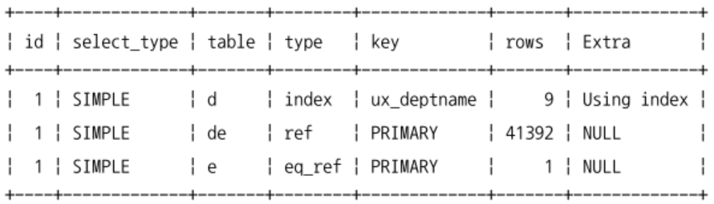
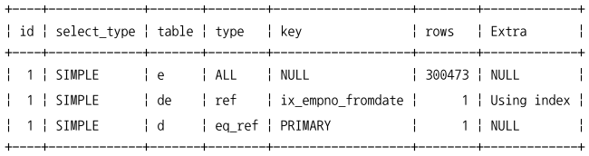

[9.4.1 인덱스 힌트](#941-인덱스-힌트)
- [9.4.1.1 STRAIGHT_JOIN](#9411-straight_join)
- [9.4.1.2 USE INDEX / FORCE INDEX / IGNORE INDEX](#9412-use-index--force-index--ignore-index)
- [9.4.1.3 SQL_CALC_FOUND_ROWS](#9413-sql_calc_found_rows)

# 9.4.1 인덱스 힌트
> ex. `STRAIGHT_JOIN` `USE INDEX`

- MySQL 옵티마이저 힌트가 도입되기 전에 사용되던 기능들이다.
- SQL 문법에 맞게 사용해야 하기 때문에 ANSI-SQL 표준 문법을 준수하지 못하게 되는 단점이 있다.
- SELECT UPDATE 명령에서만 사용할 수 있다.
- MySQL 5.6부터 추가되기 시작한 옵티마이저 힌트들은 모두 MySQL 서버를 제외한 다른 DBMS에서 주석으로 해석하기 때문에 ANSI-SQL 표준을 준수한다고 할 수 있다.
- 가능하다면 인덱스힌트 < 옵티마이저 힌트를 사용할 것을 추천

## 9.4.1.1 STRAIGHT_JOIN
- SELECT, UPDATE, DELETE 쿼리에서 여러 개의 테이블이 조인되는 경우 조인 순서를 고정하는 역할
- 옵티마이저가 각 테이블의 통계 정보와 쿼리의 조건을 기반으로 가장 최적이라고 판단되는 순서로 조인한다.
```sql
  EXPLAIN
    SELECT *
    FROM employees e, dept_emp de, departments d
    WHERE e.emp_no=de.emp_no AND d.dept_no=de.dept_no;
```

- 쿼리의 순서를 변경하기 위해 STRAIGHT_JOIN 힌트를 사용한다.
  ```sql
    SELECT STRAIGHT_JOIN
      e.first_name, e.last_name, d.dept_name
    FROM employees e, dept_emp de, departments d
    WHERE e.emp_no=de.emp_no
      AND d.dept_no=de.dept_no;

    SELECT /*! STRAIGHT_JOIN */
      e.first_name, e.last_name, d.dept_name
    FROM employees e, dept_emp de, departments d
    WHERE e.emp_no=de.emp_no
      AND d.dept_no=de.dept_no;
    
    -- 힌트 표기법만 다른, 같은 쿼리
  ```
  
  - 옵티마이저가 FROM 절에 명시된 테이블 순서대로 조인을 수행하도록 유도한다.
- 조인 순서를 조정해야할 때
  - `임시 테이블과 일반 테이블의 조인`
    - 일반적으로 임시 테이블을 드라이빙 테이블로 선정하는 것이 좋다.
    - 일반 테이블의 조인 컬럼에 인덱스가 없다면 레코드 건수가 적은 테이블을 먼저 읽도록 한다.
  - `임시 테이블끼리 조인`
    - 임시 테이블은 항상 인덱스가 없기 때문에 크기가 작은 테이블을 드라이빙 테이블로 선택한다.
  - `일반 테이블끼리 조인`
    - 양쪽 테이블에 인덱스가 모두 있/없는 경우: 레코드 건수가 적은 테이블을 드라이빙으로 선택한다.
    - 한쪽 테이블에만 인덱스가 있는 경우: 인덱스가 없는 테이블을 드라이빙으로 선택한다.
  - 레코드 건수가 적은 테이블: WHERE 조건까지 모두 포함한 결과 레코드로 계산한다.
- STRAIGHT_JOIN과 비슷한 역할을 하는 옵티마이저 힌트
  - JOIN_FIXED_ORDER
  - JOIN_ORDER
  - JOIN_PREFIX
  - JOIN_SUFFIX

## 9.4.1.2 USE INDEX / FORCE INDEX / IGNORE INDEX
- STRAIGHT_JOIN 힌트와는 다르게 사용하려는 인덱스를 가지는 테이블 뒤에 힌트를 명시한다.
- 3 ~ 4개 이상의 컬럼을 포함하는 인덱스가 여러개 존재할 때 옵티마이저의 실수가 가끔 있음 -> 강제로 특정 인덱스를 사용하도록 힌트를 추가한다.
- 인덱스 힌트 종류
  - USE INDEX
    - 옵티마이저에게 특정 테이블의 인덱스를 사용하도록 권장하는 힌트
    - 항상 그 인덱스를 사용하는건 아님
  - FORCE INDEX
    - USE INDEX보다 영향이 더 강한 힌트
    - USE INDEX만으로도 충분
  - IGNORE INDEX
    - 특정 인덱스를 사용하지 못하게 하는 힌트
    - 옵티마이저가 풀 테이블 스캔을 사용하도록 유도할 수도 있음
- 힌트에 용도를 명시할 수도 있다.
  - USE INDEX FOR JOIN
    - 테이블 간의 조인뿐만 아니라 레코드를 검색하기 위한 용도
  - USE INDEX FOR ORDER BY
    - 명시된 인덱스를 ORDER BY 용도로만 사용할 수 있게 제한
  - USE INDEX FOR GROUP BY
    - 명시된 인덱스를 GROUP BY 용도로만 사용할 수 있게 제한
- 인덱스 사용법이나 좋은 실행 계획이 어떤 것인지 판단하기 힘든 상황이면 힌트를 사용하는 건 피하는 것이 좋다.

## 9.4.1.3 SQL_CALC_FOUND_ROWS
- LIMIT 사용 시 조건을 만족하는 레코드가 LIMIT만큼의 레코드를 찾으면 검색을 멈춘다.
- SQL_CALC_FOUND_ROWS 힌트를 추가하면 레코드 끝까지 검색한다.
  - 최종적으로는 LIMIT만큼의 레코드를 반환한다.
- FOUND_ROWS() 함수를 이용해서 몇 건의 레코드를 찾았는지 알 수 있다.
- SELECT 쿼리가 UNION으로 연결된 경우에는 SQL_CALC_FOUND_ROWS 힌트를 사용해도 FOUND_ROWS() 함수로 정확한 레코드 건수를 가져올 수 없다.
- 인덱스나 쿼리의 튜닝이 제대로 되었다면 이 방법을 사용하지 않는 것을 추천
