[9.4.1 인덱스 힌트](#941-인덱스-힌트)
- [9.4.1.1 STRAIGHT_JOIN](#9411-straight_join)
- [9.4.1.2 USE INDEX / FORCE INDEX / IGNORE INDEX](#9412-use-index--force-index--ignore-index)
- [9.4.1.3 SQL_CALC_FOUND_ROWS](#9413-sql_calc_found_rows)

[9.4.2 옵티마이저 힌트](#942-옵티마이저-힌트)
- [9.4.2.1 옵티마이저 힌트 종류](#9421-옵티마이저-힌트-종류)
- [9.4.2.2 MAX_EXECUTION_TIME](#9422-max_execution_time)
- [9.4.2.3 SET_VAR](#9423-set_var)
- [9.4.2.4 SEMIJOIN & NO_SEMIJOIN](#9424-semijoin--no_semijoin)
- [9.4.2.5 SUBQUERY](#9425-subquery)
- [9.4.2.6 BNL & NO_BNL & HASHJOIN & NO_HASHJOIN](#9426-bnl--no_bnl--hashjoin--no_hashjoin)
- [9.4.2.7 JOIN_FIXED_ORDER & JOIN_ORDER & JOIN_PREFIX & JOIN_SUFFIX](#9427-join_fixed_order--join_order--join_prefix--join_suffix)
- [9.4.2.8 MERGE & NO_MERGE](#9428-merge--no_merge)
- [9.4.2.9 INDEX_MERGE & NO_INDEX_MERGE](#9429-index_merge--no_index_merge)
- [9.4.2.10 NO_ICP](#94210-no_icp)
- [9.4.2.11 SKIP_SCAN & NO_SKIP_SCAN](#94211-skip_scan--no_skip_scan)
- [9.4.2.12 INDEX & NO_INDEX](#94212-index--no_index)

# 9.4.1 인덱스 힌트
> ex. `STRAIGHT_JOIN` `USE INDEX`

- MySQL 옵티마이저 힌트가 도입되기 전에 사용되던 기능들이다.
- SQL 문법에 맞게 사용해야 하기 때문에 ANSI-SQL 표준 문법을 준수하지 못하게 되는 단점이 있다.
- SELECT UPDATE 명령에서만 사용할 수 있다.
- MySQL 5.6부터 추가되기 시작한 옵티마이저 힌트들은 모두 MySQL 서버를 제외한 다른 DBMS에서 주석으로 해석하기 때문에 ANSI-SQL 표준을 준수한다고 할 수 있다.
- 가능하다면 인덱스힌트 < 옵티마이저 힌트를 사용할 것을 추천

## 9.4.1.1 STRAIGHT_JOIN
- SELECT, UPDATE, DELETE 쿼리에서 여러 개의 테이블이 조인되는 경우 조인 순서를 고정하는 역할
- 옵티마이저가 각 테이블의 통계 정보와 쿼리의 조건을 기반으로 가장 최적이라고 판단되는 순서로 조인한다.
```sql
  EXPLAIN
    SELECT *
    FROM employees e, dept_emp de, departments d
    WHERE e.emp_no=de.emp_no AND d.dept_no=de.dept_no;
```

- 쿼리의 순서를 변경하기 위해 STRAIGHT_JOIN 힌트를 사용한다.
  ```sql
    SELECT STRAIGHT_JOIN
      e.first_name, e.last_name, d.dept_name
    FROM employees e, dept_emp de, departments d
    WHERE e.emp_no=de.emp_no
      AND d.dept_no=de.dept_no;

    SELECT /*! STRAIGHT_JOIN */
      e.first_name, e.last_name, d.dept_name
    FROM employees e, dept_emp de, departments d
    WHERE e.emp_no=de.emp_no
      AND d.dept_no=de.dept_no;
    
    -- 힌트 표기법만 다른, 같은 쿼리
  ```
  
  - 옵티마이저가 FROM 절에 명시된 테이블 순서대로 조인을 수행하도록 유도한다.
- 조인 순서를 조정해야할 때
  - `임시 테이블과 일반 테이블의 조인`
    - 일반적으로 임시 테이블을 드라이빙 테이블로 선정하는 것이 좋다.
    - 일반 테이블의 조인 컬럼에 인덱스가 없다면 레코드 건수가 적은 테이블을 먼저 읽도록 한다.
  - `임시 테이블끼리 조인`
    - 임시 테이블은 항상 인덱스가 없기 때문에 크기가 작은 테이블을 드라이빙 테이블로 선택한다.
  - `일반 테이블끼리 조인`
    - 양쪽 테이블에 인덱스가 모두 있/없는 경우: 레코드 건수가 적은 테이블을 드라이빙으로 선택한다.
    - 한쪽 테이블에만 인덱스가 있는 경우: 인덱스가 없는 테이블을 드라이빙으로 선택한다.
  - 레코드 건수가 적은 테이블: WHERE 조건까지 모두 포함한 결과 레코드로 계산한다.
- STRAIGHT_JOIN과 비슷한 역할을 하는 옵티마이저 힌트
  - JOIN_FIXED_ORDER
  - JOIN_ORDER
  - JOIN_PREFIX
  - JOIN_SUFFIX

## 9.4.1.2 USE INDEX / FORCE INDEX / IGNORE INDEX
- STRAIGHT_JOIN 힌트와는 다르게 사용하려는 인덱스를 가지는 테이블 뒤에 힌트를 명시한다.
- 3 ~ 4개 이상의 컬럼을 포함하는 인덱스가 여러개 존재할 때 옵티마이저의 실수가 가끔 있음 -> 강제로 특정 인덱스를 사용하도록 힌트를 추가한다.
- 인덱스 힌트 종류
  - USE INDEX
    - 옵티마이저에게 특정 테이블의 인덱스를 사용하도록 권장하는 힌트
    - 항상 그 인덱스를 사용하는건 아님
  - FORCE INDEX
    - USE INDEX보다 영향이 더 강한 힌트
    - USE INDEX만으로도 충분
  - IGNORE INDEX
    - 특정 인덱스를 사용하지 못하게 하는 힌트
    - 옵티마이저가 풀 테이블 스캔을 사용하도록 유도할 수도 있음
- 힌트에 용도를 명시할 수도 있다.
  - USE INDEX FOR JOIN
    - 테이블 간의 조인뿐만 아니라 레코드를 검색하기 위한 용도
  - USE INDEX FOR ORDER BY
    - 명시된 인덱스를 ORDER BY 용도로만 사용할 수 있게 제한
  - USE INDEX FOR GROUP BY
    - 명시된 인덱스를 GROUP BY 용도로만 사용할 수 있게 제한
- 인덱스 사용법이나 좋은 실행 계획이 어떤 것인지 판단하기 힘든 상황이면 힌트를 사용하는 건 피하는 것이 좋다.

## 9.4.1.3 SQL_CALC_FOUND_ROWS
- LIMIT 사용 시 조건을 만족하는 레코드가 LIMIT만큼의 레코드를 찾으면 검색을 멈춘다.
- SQL_CALC_FOUND_ROWS 힌트를 추가하면 레코드 끝까지 검색한다.
  - 최종적으로는 LIMIT만큼의 레코드를 반환한다.
- FOUND_ROWS() 함수를 이용해서 몇 건의 레코드를 찾았는지 알 수 있다.
- SELECT 쿼리가 UNION으로 연결된 경우에는 SQL_CALC_FOUND_ROWS 힌트를 사용해도 FOUND_ROWS() 함수로 정확한 레코드 건수를 가져올 수 없다.
- 인덱스나 쿼리의 튜닝이 제대로 되었다면 이 방법을 사용하지 않는 것을 추천

# 9.4.2 옵티마이저 힌트
## 9.4.2.1 옵티마이저 힌트 종류
- 구분
  - 인덱스: 특정 인덱스의 이름을 사용할 수 있는 옵티마이저 힌트
  - 테이블: 특정 테이블의 이름을 사용할 수 있는 옵티마이저 힌트
  - 쿼리 블록: 특정 쿼리 블록에 사용할 수 있는 옵티마이저 힌트로서, 특정 쿼리 블록의 이름을 명시하는 것이 아니라 힌트가 명시된 쿼리 블록에 대해서만 영향을 미치는 옵티마이저 힌트
  - 글로벌 (쿼리 전체): 전체 쿼리에 대해서 영향을 미치는 힌트
- 모든 인덱스 수준의 힌트는 반드시 테이블명이 선행되어야 한다.
  ```sql
    EXPLAIN
      SELECT /*+ INDEX(employees ix_firstname) */ *
      FROM employees
      WHERE first_name='Matt';
    
    EXPLAIN
      SELECT /*+ NO_INDEX(employees ix_firstname) */ *
      FROM employees
      WHERE first_name='Matt';
  ```
- 옵티마이저 힌트가 문법에 맞지 않게 사용된 경우 경고 메시지가 표시된다.
  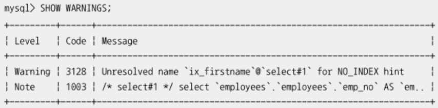
- SELECT 키워드로 시작하는 서브쿼리 영역을 쿼리 블록이라고 한다.
  - 옵티마이저 힌트를 쿼리 내부, 외부에서 모두 사용할 수 있다.
    - 외부에서 사용하려면 `QB_NAME()` 힌트를 이용해서 해당 쿼리블록에 이름을 부여해야 한다.
      ```sql
        EXPLAIN
          SELECT /*+ JOIN_ORDER(e, s@subq1) */
            COUNT(*)
          FROM employees e
          WHERE e.first_name='Matt'
            AND e.emp_no IN (
              SELECT /*+ QB_NAME(subq1) */ s.emp_no
              FROM salaries s
              WHERE s.salary BETWEEN 50000 AND 50500
            );
      ```
      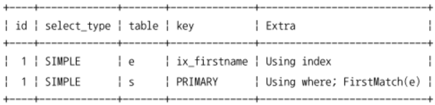

## 9.4.2.2 MAX_EXECUTION_TIME
- 쿼리의 최대 실행 시간을 설정하는 힌트
  - 밀리초 단위로 설정, 초과 시 쿼리 실패
- 옵티마이저 힌트 중 유일하게 쿼리의 실행 계획에 영향을 미치지 않는다.
```sql
  SELECT /*+ MAX_EXECUTION_TIME(100) */ *
  FROM employees
  ORDER BY last_name LIMIT 1;

  -- ERROR 3024 (HY000): Query execution was interrupted, maximum statement execution time exceeded
```

## 9.4.2.3 SET_VAR
- MySQL 서버의 시스템 변수들도 쿼리의 실행 계획에 영향을 미친다.
  - 조인 버퍼의 크기를 설정하는 `join_buffer_size`
    - 조인 버퍼의 공간이 충분하면 조인 버퍼를 활용할 수 있음
  - 옵티마이저 힌트로 부족한 경우 `optimizer_switch` 시스템 변수를 제어해야 할 수도 있다.
```sql
  EXPLAIN
    SELECT /*+ SET_VAR(optimizer_switch='index_merge_intersection=off') */ *
    FROM employees
    WHERE first_name='Georgi' AND emp_no BETWEEN 10000 AND 20000;
```

## 9.4.2.4 SEMIJOIN & NO_SEMIJOIN
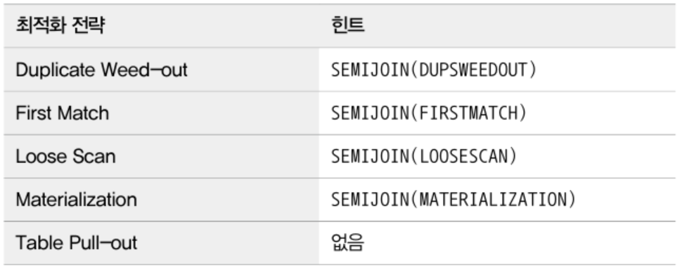
- Table Pull-out 최적화 전략은 별도로 힌트를 사용할 수 없다.
  - 그 전략을 사용할 수 있다면 항상 더 나은 성능을 보장하기 때문
- 다른 최적화 전략들은 상황에 따라 더 나은 성능을 낼 수 있기 때문에 NO_SEMIJOIN 힌트도 제공된다.
```sql
  EXPLAIN
    SELECT *
    FROM departments d
    WHERE d.dept_no IN
      (SELECT /*+ SEMIJOIN(MATERIALIZATION) */ de.dept_no FROM dept_emp de);
```
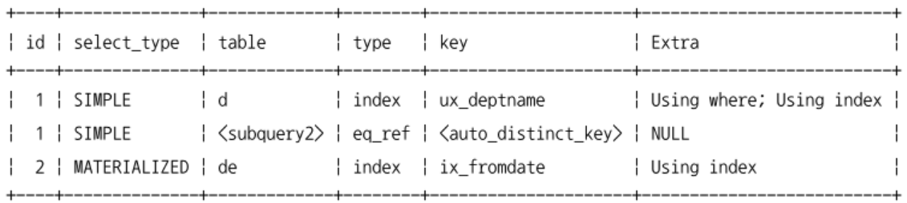
- 세미 조인 최적화 힌트는 서브쿼리에 명시한다.
- 서브쿼리에 쿼리블록의 이름을 정의하고, 실제 세미 조인 힌트는 외부 쿼리블록에 명시하는 방법도 있다.
  ```sql
    EXPLAIN
      SELECT /*+ SEMIJOIN(@subq1 MATERIALIZATION) */ *
      FROM departments d
      WHERE d.dept_no IN
        (SELECT /*+ QB_NAME(subq1) */ dept_no FROM dept_emp de);
  ```
- 특정 세미 조인 최적화 전략을 사용하지 않게 하려면 NO_SEMIJOIN 힌트를 명시한다.
  ```sql
    SELECT *
    FROM departments d
    WHERE d.dept_no IN
      (SELECT /*+ NO_SEMIJOIN(DUPSWEEDOUT, FIRSTMATCH) */ de.dept_no FROM dept_emp de);
  ```

## 9.4.2.5 SUBQUERY
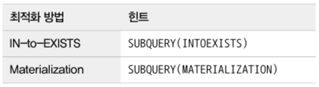
- 세미조인 최적화가 사용되지 못할 때 사용하는 최적화 방법
- 주로 IN(subquery) 형태의 쿼리에 사용될 수 있지만 안티 세미 조인의 최적화에는 사용될 수 없다.
- 서브쿼리에 힌트를 사용하거나 서브쿼리에 쿼리블록 이름을 지정해서 외부 쿼리블록에서 최적화 방법을 명시한다.
  - 세미조인 최적화 힌트와 비슷한 형태

## 9.4.2.6 BNL & NO_BNL & HASHJOIN & NO_HASHJOIN
- MySQL 8.0.19 버전까지는 블록 네스티드 루프 조인 알고리즘 사용
- MySQL 8.0.20 버전부터는 해시 조인 알고리즘이 블록 네스티드 루프 조인까지 대체하도록 개선되었다.
  - 블록 네스티드 루프 조인은 사용되지 않는다.
  - BNL & NO_BNL 힌트는 해시 조인을 사용하도록 유도하는 힌트로 변경되었다.
  - HASHJOIN & NO_HASHJOIN 힌트는 MySQL 8.0.18 버전에서만 유효하고, 이후 버전에서는 효력이 없다.
  - MySQL 8.0.20 이후에는 BNL & NO_BNL만 사용한다.
```sql
  EXPLAIN
    SELECT /*+ BNL(e, de) */ *
    FROM employees e
    INNER JOIN dept_emp de ON de.emp_no=e.emp_no;
```

## 9.4.2.7 JOIN_FIXED_ORDER & JOIN_ORDER & JOIN_PREFIX & JOIN_SUFFIX
- STRAIGHT_JOIN 힌트의 문제
  - 쿼리의 FROM 절에 사용된 테이블의 순서를 조인 순서에 맞게 변경해야 한다.
  - 한 번 사용되면 FROM 절에 명시된 모든 테이블의 조인 순서가 결정되기 때문에 일부는 조인 순서를 강제하고 나머지는 옵티마이저에게 순서를 결정하게 맡기는 것이 불가능했다.
- 종류
  - JOIN_FIXED_ORDER: STRAIGHT_JOIN 힌트와 동일하게 FROM 절의 테이블 순서대로 조인 실행
  - JOIN_ORDER: 힌트에 명시된 테이블의 순서대로 조인을 실행
  - JOIN_PREFIX: 조인에서 드라이빙 테이블만 강제
  - JOIN_SUFFIX: 조인에서 드리븐 테이블만 강제
```sql
  -- FROM 절에 나열된 테이블의 순서대로 조인 실행
  SELECT /*+ JOIN_FIXED_ORDER() */ *
  FROM employees e
    INNER JOIN dept_emp de ON de.emp_no=e.emp_no
    INNER JOIN departments d ON d.dept_no=de.dept_no;
  
  -- 일부 테이블에 대해서만 조인 순서를 나열
  SELECT /*+ JOIN_ORDER(d, de) */ *
  FROM employees e
    INNER JOIN dept_emp de ON de.emp_no=e.emp_no
    INNER JOIN departments d ON d.dept_no=de.dept_no;
  
  -- 조인의 드라이빙 테이블에 대해서만 조인 순서를 나열
  SELECT /*+ JOIN_PREFIX(e, de) */ *
  FROM employees e
    INNER JOIN dept_emp de ON de.emp_no=e.emp_no
    INNER JOIN departments d ON d.dept_no=de.dept_no;

  -- 조인의 드리븐 테이블에 대해서만 조인 순서를 나열
  SELECT /*+ JOIN_SUFFIX(de, e) */ *
  FROM employees e
    INNER JOIN dept_emp de ON de.emp_no=e.emp_no
    INNER JOIN departments d ON d.dept_no=de.dept_no;
```

## 9.4.2.8 MERGE & NO_MERGE
- 예전 버전의 MySQL 서버는 FROM 절에 사용된 서브쿼리를 항상 내부 임시 테이블로 생성했다.
  - 불필요한 자원 소모를 유발한다.
  - MySQL 5.7, 8.0 버전에서는 가능하면 임시 테이블을 사용하지 않도록 FROM 절의 서브쿼리를 외부 쿼리와 병합하는 최적화를 도입했다.
```sql
  EXPLAIN
    SELECT /*+ MERGE(sub) */ *
    FROM (
      SELECT *
      FROM employees
      WHERE first_name='Matt'
    ) sub LIMIT 10;
```
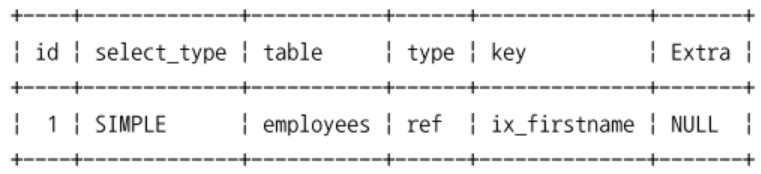
```sql
  EXPLAIN
      SELECT /*+ MERGE(sub) */ *
      FROM (
        SELECT *
        FROM employees
        WHERE first_name='Matt'
      ) sub LIMIT 10;
```
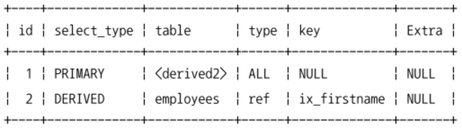

## 9.4.2.9 INDEX_MERGE & NO_INDEX_MERGE
- INDEX_MERGE: 하나의 테이블에 대해 여러 개의 인덱스를 동시에 사용하는 것
```sql
  EXPLAIN
    SELECT *
    FROM employees
    WHERE first_name='Georgi' AND emp_no BETWEEN 10000 AND 20000;
```
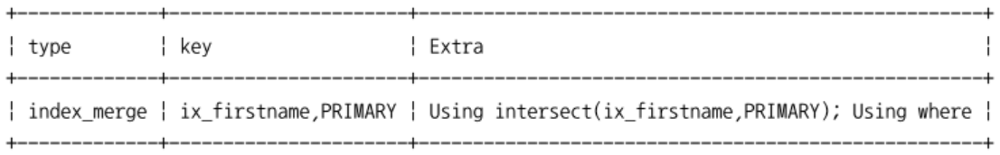
```sql
  EXPLAIN
    SELECT /*+ NO_INDEX_MERGE(employees PRIMARY) */ *
    FROM employees
    WHERE first_name='Georgi' AND emp_no BETWEEN 10000 AND 20000;
```
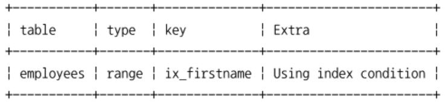

## 9.4.2.10 NO_ICP
- 인덱스 컨디션 푸시다운 (ICP, Index Condition Pushdown) 최적화는 사용 가능하다면 항상 성능 향상에 도움이 된다.
  - MySQL 옵티마이저는 ICP를 사용하는 방향으로 실행 계획을 수립한다.
  - ICP 힌트는 제공되지 않는다.
- ICP로 인해 여러 실행 계획의 비용 계산이 잘못된다면 결과적으로 잘못된 실행 계획을 수립할 수도 있다.
  - ICP를 비활성화해서 조금 더 유연하고 정확하게 실행 계획을 선택하게 한다.
```sql
  -- ICP 테스트를 위한 임시 인덱스 생성
  ALTER TABLE employees ADD INDEX ix_lastname_firstname (last_name, first_name);
```
```sql
  -- Extra 컬럼의 "Using index condition" 문구를 보면 기본적으로 MySQL 옵티마이저는 ICP 최적화를 선택하는 것을 알 수 있음
  EXPLAIN
    SELECT *
    FROM employees
    WHERE last_name='Action' AND first_name LIKE '%sal';
```
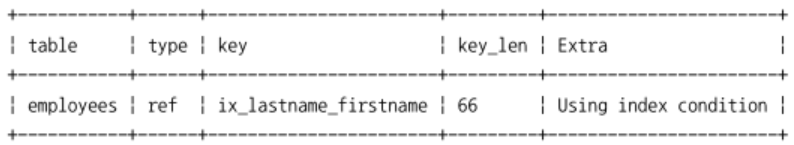
```sql
  -- NO_ICP 힌트를 이용해서 ICP 비활성화
  EXPLAIN
    SELECT /*+ NO_ICP(employees ix_lastname_firstname) */ *
    FROM employees
    WHERE last_name='Action' AND first_name LIKE '%sal';
```
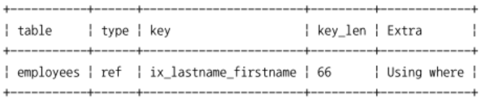

## 9.4.2.11 SKIP_SCAN & NO_SKIP_SCAN
- 인덱스 스킵 스캔은 인덱스의 선행 컬럼에 대한 조건이 없어도 옵티마이저가 해당 인덱스를 사용할 수 있게 한다.
- MySQL 옵티마이저가 유니크한 값의 갯수를 제대로 분석하지 못하거나 잘못된 경로로 인해 비효율적인 인덱스 스킵 스캔을 선택하면 NO_SKIP_SCAN 힌트를 사용한다.
```sql
  -- 인덱스 스킵 스캔 테스트를 위한 임시 인덱스 생성
  ALTER TABLE employees ADD INDEX ix_gender_birthdate (gender, birth_date);
```
```sql
  EXPLAIN
    SELECT gender, birth_date
    FROM employees
    WHERE birth_date>='1965-02-01';
```
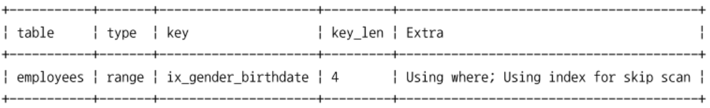
```sql
  EXPLAIN
    SELECT /*+ NO_SKIP_SCAN(employees ix_gender_birthdate) */ gender, birth_date
    FROM employees
    WHERE birth_date>='1965-02-01';
```
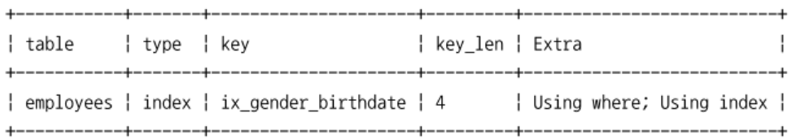

## 9.4.2.12 INDEX & NO_INDEX
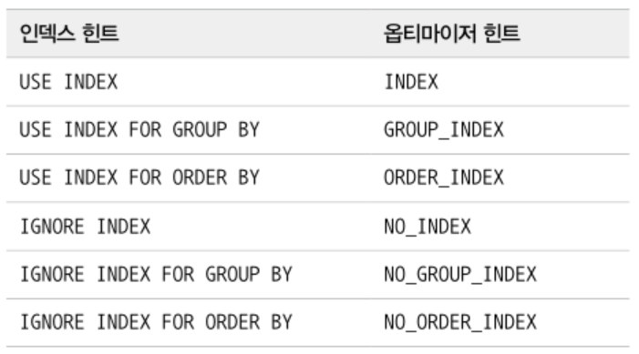
- 예전 MySQL 서버에서 사용되던 인덱스 힌트를 대체하는 용도로 제공된다.
- 테이블명과 인덱스 이름을 함께 명시한다.
```sql
  -- 인덱스 힌트 사용
  EXPLAIN
    SELECT *
    FROM employees USE INDEX(ix_firstname)
    WHERE first_name='Matt';
  
  -- 옵티마이저 힌트 사용
  EXPLAIN
    SELECT /*+ INDEX(employees ix_firstname) */ *
    FROM employees USE INDEX(ix_firstname)
    WHERE first_name='Matt';
```
